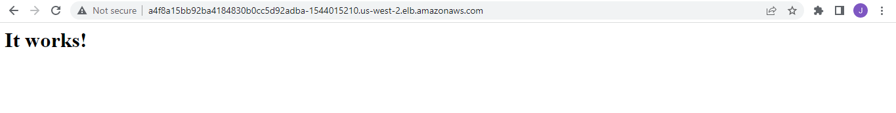
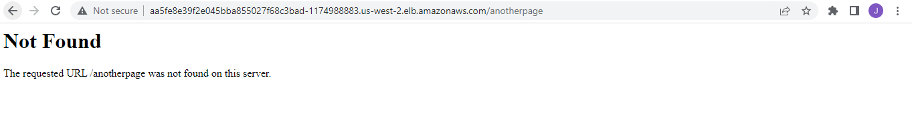
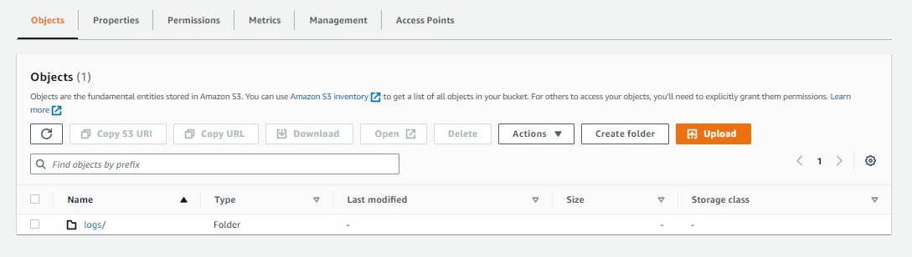
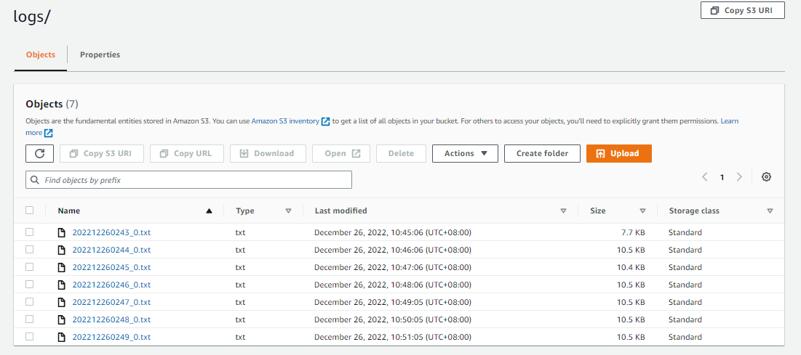

# Lab 25: Logging


Before we begin, make sure you've setup the following pre-requisites

- [Basic Understanding of Kubernetes](../README.md#kubernetes)
- [AWS account](../pages/01-Pre-requisites/labs-optional-tools/README.md#create-an-aws-account)
- [AWS IAM Requirements](../pages/01-Pre-requisites/labs-optional-tools/01-AWS-IAM-requirements.md)
- [AWS CLI, kubectl, and eksctl](../pages/01-Pre-requisites/labs-kubernetes-pre-requisites/README.md#install-cli-tools) 

Here's a breakdown of the sections for this lab.


- [Introduction](#introduction)
- [Launch a Simple EKS Cluster](#launch-a-simple-eks-cluster)
- [Container Logging](#container-logging)
- [Web server pod](#web-server-pod)
- [Using a Logging Agent and a Sidecar Pattern](#using-a-logging-agent-and-a-sidecar-pattern)
- [Cleanup](#cleanup)
- [Resources](#resources)


## Introduction

In this lab, we'll learn how observablity is an essential consideration in deploying production-ready applications. There are two pillars of observability:
- Logging
- Monitoring 

We'll be using using the  built-in logging mechanisms of Kubernetes, as well as external logging systems. We'll stream the Pod logs to S3 using Fluentd.

## Launch a Simple EKS Cluster

Before we start, let's first verify if we're using the correct IAM user's access keys. This should be the user we created from the **pre-requisites** section above.

```bash
$ aws sts get-caller-identity 
```
```bash
{
    "UserId": "AIDxxxxxxxxxxxxxx",
    "Account": "1234567890",
    "Arn": "arn:aws:iam::1234567890:user/k8s-admin"
} 
```

For the cluster, we can reuse the **eksops.yml** file from the other labs.

<details><summary> eksops.yml </summary>
 
```bash
apiVersion: eksctl.io/v1alpha5
# apiVersion: client.authentication.k8s.io/v1beta1
kind: ClusterConfig

metadata:
    version: "1.23"
    name: eksops
    region: ap-southeast-1 
nodeGroups:
    -   name: ng-dover
        instanceType: t3.large
        minSize: 1
        maxSize: 5
        desiredCapacity: 3
        ssh: 
            publicKeyName: "k8s-kp"
```
 
</details>

Launch the cluster.

```bash
time eksctl create cluster -f eksops.yml 
```

Check the nodes.

```bash
kubectl get nodes 
```

Save the cluster, region, and AWS account ID in a variable. We'll be using these in a lot of the commands later.

```bash
MYREGION=ap-southeast-1
MYCLUSTER=eksops 
MYAWSID=$(aws sts get-caller-identity | python3 -c "import sys,json; print (json.load(sys.stdin)['Account'])")
```

## Container Logging 

We'll start with the basic logging that's built-in to Kubernetes. Kubernetes will capture anything written to standard output and standard error as a log message. 

There are also logs which are not written to standard output. These log files can be retrieved by issuing commands by running a shell in the container.

Let's use [pod-logs.yml](./pod-logs.yml) to create the namespace logs and a multi-container Pod that runs a server and a client that sends requests to the server. The server listens to connections and writes some text to standard output while the client connects to it through the specified port.

```bash
kubectl apply -f pod-logs.yml 
```

We can check the logs:


```bash
$ kubectl logs -f pod-logs -n logs
Defaulted container "server" out of: server, client
listening on [::]:8888 ...
connect to [::ffff:192.168.23.130]:8888 from [::ffff:10.0.0.11]:56148 ([::ffff:10.0.0.11]:56148)
connect to [::ffff:127.0.0.1]:8888 from [::ffff:127.0.0.1]:42743 ([::ffff:127.0.0.1]:42743)
connect to [::ffff:192.168.23.130]:8888 from [::ffff:10.0.0.11]:56166 ([::ffff:10.0.0.11]:56166)
connect to [::ffff:127.0.0.1]:8888 from [::ffff:127.0.0.1]:39501 ([::ffff:127.0.0.1]:39501)
connect to [::ffff:127.0.0.1]:8888 from [::ffff:127.0.0.1]:43795 ([::ffff:127.0.0.1]:43795) 
```

After an initial listening message, connection messages for each client request are displayed. The arguments to the kubectl logs command are the pod followed by the specific container. If a Pod only has one container, the last argument can be omitted.

We can sort the logs to display the most recent log and timestamp.

```bash
$ kubectl logs -f --tail=1 --timestamps pod-logs client -n logs

2022-12-25T10:52:09.643740477Z Received request
2022-12-25T10:52:14.645968743Z Received request
2022-12-25T10:52:19.648778824Z Received request
```

## Web server pod 

Let's use [pod-webserver.yml](./pod-webserver.yml) to create a Pod that runs an Apache Web Server.

```bash
apiVersion: v1
kind: Pod
metadata:
  name: webserver-logs
  namespace: logs
  labels:
    test: logs
spec:
  containers:
  - name: server
    image: httpd:2.4.38-alpine
    ports:
    - containerPort: 80
    readinessProbe:
      httpGet:
        path: /
        port: 80 
```

Run the manifest.

```bash
kubectl apply -f pod-webserver.yml 
```

We'll then allow access to it via a load balancer by using the **expose** command using the container port.

```bash
kubectl expose pod webserver-logs --type=LoadBalancer -n logs
```

Verify that the Pod and Service is created.

```bash
$ kubectl get pods -n logs

NAME             READY   STATUS    RESTARTS   AGE
pod-logs         2/2     Running   0          6m28s
webserver-logs   1/1     Running   0          3m20s 
```
```bash
$ kubectl get svc -n logs

NAME             TYPE           CLUSTER-IP    EXTERNAL-IP                                                               PORT(S)        AGE
webserver-logs   LoadBalancer   10.98.69.82   a4f8a15bb92ba4184830b0cc5d92adba-1544015210.us-west-2.elb.amazonaws.com   80:32634/TCP   3m44s
```

Copy the DNS address in the **External-IP** column and navigate to these address another browser tab. Note that the page may not immediately load since the loadbalancer wil need to complete its health checks before it starts serving traffic to the pods, so you may need to wait a few minutes.

  

Try to append "/anotherpage" at the end of the URL and press enter. This will cause a "Not Found" error message to appear.

  

We can also appear the same request error appear as "404" in the application logs.

```bash
$ kubectl logs -f webserver-logs --tail=1

10.0.0.11 - - [26/Dec/2022:02:00:00 +0000] "GET / HTTP/1.1" 200 45
10.0.0.11 - - [26/Dec/2022:02:00:10 +0000] "GET / HTTP/1.1" 200 45
192.168.203.128 - - [26/Dec/2022:02:00:19 +0000] "GET /anotherpage HTTP/1.1" 404 209 
```

The httpd container directs access logs and errors to standard output and standard error, instead of the files as would be the case for non-containerized installations. When working with legacy applications that are containerized, they may use files for logging rather than standard output and standard error.

Since this is an HTTPd web server, we can also access the configuration file that it uses by using the **exec** command to run shell commands onto the application running inside the "webserver-logs" Pod.

```bash
$ kubectl exec -it webserver-logs -- tail -10 conf/httpd.conf
#
# Note: The following must must be present to support
#       starting without SSL on platforms with no /dev/random equivalent
#       but a statically compiled-in mod_ssl.
#
<IfModule ssl_module>
SSLRandomSeed startup builtin
SSLRandomSeed connect builtin
</IfModule>
```

Similarly, we can copy files from the container to the host where the container is running using the **cp** command. Let's copy the http.conf onto the /tmp directory in the host.

```bash
$ kubectl cp webserver-logs:conf/httpd.conf /tmp/httpd.conf
$ ls -la /tmp | grep http
-rw-rw-r--  1 ubuntu ubuntu 20673 Dec 26 02:07 httpd.conf
```

We can also do the other way around. We can copy files in the local file system to a container using the same **cp** command. Let's create the file first in the local file system and make sure it doesn't exist in the container.

```bash
$ cat > /tmp/from-host.txt
This is created on the host, and then copied onto the container 
```
```bash
$ kubectl exec webserver-logs -- ls -la /tmp
total 8
drwxrwxrwt    1 root     root          4096 Mar  7  2019 .
drwxr-xr-x    1 root     root          4096 Dec 26 01:55 .. 
```

Copy the file to the container.

```bash
kubectl cp /tmp/from-host.txt webserver-logs:/tmp/copied.txt 
```

Now verify that the file exists in the container.

```bash
$ kubectl exec webserver-logs -- ls -la /tmp
total 12
drwxrwxrwt    1 root     root          4096 Dec 26 02:12 .
drwxr-xr-x    1 root     root          4096 Dec 26 01:55 ..
-rw-rw-r--    1 1000     1000            64 Dec 26 02:12 copied.txt 
```
```bash
$ kubectl exec webserver-logs -- cat /tmp/copied.txt
This is created on the host, and then copied onto the container  
```

## Using a Logging Agent and a Sidecar Pattern

In the context of logging, a sidecar container is a logging agent that extends the primary container in the Pod. This logging agent streams logs from the primary container to a central location that aggregates logs. Both containers must mount a volume at the path of the log files to allow the sidecar access to the log files.

To achieve all of ths, we will use a data collector called **Fluentd** along with an S3 plugin to stream logs in the primary container to an S3 Bucket. 

Start with creating an S3 bucket in the AWS Management Console. More detail on how to create an S3 bucket can be found in the [AWS Documentation.](https://docs.aws.amazon.com/AmazonS3/latest/userguide/create-bucket-overview.html)

Make sure you can retrieve the bucket details from the CLI.

```bash
aws s3api list-buckets
```

Save the bucket name in a variable.

```bash
s3_bucket=$(aws s3api list-buckets --query "Buckets[].Name" --output table | grep logs | tr -d \|) 
```

We'll use the **[fluentd-configmap.yml](./fluentd-configmap.yml)** to store the fluentd configuration file. Using ConfigMaps allows reusing the images for different use-cases. Our primary container will stream the logs to two log files tagged as *count.format1* and *count.format2* and both as configured in the /var/log directory. All these logs will then be streamed to the S3 logs bucket, as defined in the _match_ section.

```bash
apiVersion: v1
kind: ConfigMap
metadata:
  name: fluentd-config
data:
  fluent.conf: |
    # First log source (tailing a file at /var/log/1.log)
    <source>
      @type tail
      format none
      path /var/log/1.log
      pos_file /var/log/1.log.pos
      tag count.format1
    </source>

    # Second log source (tailing a file at /var/log/2.log)
    <source>
      @type tail
      format none
      path /var/log/2.log
      pos_file /var/log/2.log.pos
      tag count.format2
    </source>

    # S3 output configuration (Store files every minute in the bucket's logs/ folder)
    <match **>
      @type s3

      s3_bucket $s3_bucket
      s3_region us-west-2
      path logs/
      buffer_path /var/log/
      store_as text
      time_slice_format %Y%m%d%H%M
      time_slice_wait 1m
      
      <instance_profile_credentials>
      </instance_profile_credentials>
    </match> 
```

Next, we'll use **[fluentd.yml](./fluentd.yml)** to create the the logging agent sidecar container. 

- The count container writes the date and a counter variable ($i) in two different log formats to two different log files in the /var/log directory every second. 

- The /var/log directory is mounted as a Volume in both the primary count container and the count-agent sidecar so both containers can access the logs. 

- The sidecar mounts the ConfigMap to access the fluentd configuration file. 

```bash
apiVersion: v1
kind: Pod
metadata:
  name: counter
spec:
  containers:

  - name: count
    image: busybox
    command: ["/bin/sh", "-c"]
    args:
    - >
      i=0;
      while true;
      do
        # Write two log files along with the date and a counter
        # every second
        echo "$i: $(date)" >> /var/log/1.log;
        echo "$(date) INFO $i" >> /var/log/2.log;
        i=$((i+1));
        sleep 1;
      done
    # Mount the log directory /var/log using a volume
    volumeMounts:
    - name: varlog
      mountPath: /var/log

  - name: count-agent
    image: lrakai/fluentd-s3:latest
    env:
    - name: FLUENTD_ARGS
      value: -c /fluentd/etc/fluent.conf
    # Mount the log directory /var/log using a volume
    # and the config file
    volumeMounts:
    - name: varlog
      mountPath: /var/log
    - name: config-volume
      mountPath: /fluentd/etc
  
  # Use host network to allow sidecar access to IAM instance profile credentials
  hostNetwork: true
  # Declare volumes for log directory and ConfigMap
  volumes:
  - name: varlog
    emptyDir: {}
  - name: config-volume
    configMap:
      name: fluentd-config 
```

Run both manifests.

```bash
kubectl apply -f fluentd-configmap.yml 
kubectl apply -f fluentd.yml 
```

Navigate to the S3 Bucket in the AWS Management Console. We should see a **logs** folder inside. This folder will contain the logs streamed from the sidecar every minute. Note that the logs may not be streamed to the bucket in real-time so we may need to wait for a few minutes for the logs to appear.

  

We should see the log files inside the **logs** folder. 

  

Select one of the file and click **Copy S3 URI** and go back to the terminal. Copy the log file onto the host by using the **aws s3 cp** command. Make sure to specify the "." at the end of the S3 URI.

```bash
aws s3 cp \
s3://cloudacademylabs-k8slogs-1hgwadqpdidlh/logs/202212260243_0.txt .
```

Read the log file. 

```bash
$ tail -10 202212260243_0.txt 
2022-12-26T02:43:55+00:00       count.format2   {"message":"Mon Dec 26 02:43:54 UTC 2022 INFO 46"}
2022-12-26T02:43:55+00:00       count.format1   {"message":"46: Mon Dec 26 02:43:54 UTC 2022"}
2022-12-26T02:43:56+00:00       count.format2   {"message":"Mon Dec 26 02:43:55 UTC 2022 INFO 47"}
2022-12-26T02:43:56+00:00       count.format1   {"message":"47: Mon Dec 26 02:43:55 UTC 2022"}
2022-12-26T02:43:57+00:00       count.format2   {"message":"Mon Dec 26 02:43:56 UTC 2022 INFO 48"}
2022-12-26T02:43:57+00:00       count.format1   {"message":"48: Mon Dec 26 02:43:56 UTC 2022"}
2022-12-26T02:43:58+00:00       count.format2   {"message":"Mon Dec 26 02:43:57 UTC 2022 INFO 49"}
2022-12-26T02:43:58+00:00       count.format1   {"message":"49: Mon Dec 26 02:43:57 UTC 2022"}
2022-12-26T02:43:59+00:00       count.format1   {"message":"50: Mon Dec 26 02:43:58 UTC 2022"}
2022-12-26T02:43:59+00:00       count.format2   {"message":"Mon Dec 26 02:43:58 UTC 2022 INFO 50"} 
```


## Cleanup 

Before we officially close this lab, make sure to destroy all resources to prevent incurring additional costs.

```bash
$ time eksctl delete cluster -f eksops.yml
```

Note that when you delete your cluster, make sure to double-check the AWS Console and ensure that the Cloudformation stacks (which we created by eksctl) are dropped cleanly.

## Resources

- [Kubernetes Observability: Logging](https://cloudacademy.com/lab/kubernetes-observability-logging/connecting-kubernetes-cluster/?context_id=888&context_resource=lp)