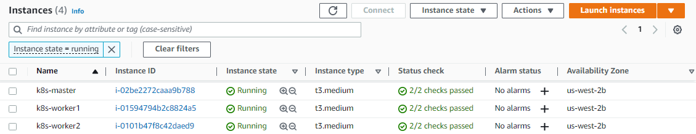

# Lab 27: Securing Kubernetes Clusters using Authentication and Authorization


Before we begin, make sure you've setup the following pre-requisites

- [Basic Understanding of Kubernetes](../README.md#kubernetes)
- [AWS account](../pages/01-Pre-requisites/labs-optional-tools/README.md#create-an-aws-account)
- [AWS IAM Requirements](../pages/01-Pre-requisites/labs-optional-tools/01-AWS-IAM-requirements.md)
- [AWS CLI, kubectl, and eksctl](../pages/01-Pre-requisites/labs-kubernetes-pre-requisites/README.md#install-cli-tools) 

Here's a breakdown of the sections for this lab.

- [Introduction](#introduction)
- [Lab Environment](#lab-environment)
- [Create the Private key, CSR, and CSR Kubernetes resource](#create-the-private-key-csr-and-csr-kubernetes-resource)
- [Approve the CSR](#approve-the-csr)
- [Extract the certificate](#extract-the-certificate)
- [Create User Credentials](#create-user-credentials)
- [Create a New Context](#create-a-new-context)
- [Create the ClusterRole](#create-the-clusterrole)
- [Create the Rolebinding](#create-the-rolebinding)
- [Verify](#verify)
- [Cleanup](#cleanup)
- [Resources](#resources)


## Introduction

In this lab, we will practice defense in depth by covering the facets to security in Kubernetes including authentication, and authorization. 

**Scenario**: 

We have a new Kubernetes User, **Andy** that is a member of the **network admin** group. Create the pre-requisite resources such as the CSR and request for the Kubernetes admin to approve the CSR.

**Steps**:

1. The requesting user can perform the following actions:

    - Create a private key
    - Create a certificate signing request (CSR)
    - Create the CSR Kubernetes resource

2. After the above requirements are satisfied, use Kubernetes to sign the request.

3. When signing the request, the Kubernetes admin can either deny it (default action) or approve it if it meets the following:

    - The subject of the CSR controls the private key used to sign the CSR. 
    Prevents impersonation attacks.
    - The subject of the CSR is authorized to act in the requested context.         
        Prevents undesired subjects from participating in the cluster.

4. Once CSR is approved,the next step is to extract the certificate from the CSR resource object and save it to a **.crt** file. 

5. Create the kubectl credentials for the new user and add it to the kubeconfig file.

6. Create a new **network admin** context using the new user.

7. Create a **network-admin** cluster-role.

8. Bind users in the network-admin group to the network-admin cluster role

10. Switch to the **network=admin** context and verify that it's able to list network policies.

**Note**: 

The process of creating a private key and CSR, then signing the CSR in Kubernetes to generate a certificate can also be used to create certificates for cluster components and resources. All nodes include the cluster's certificate authority bundle so the signed certificates can be used to establish trust in Kubernetes clusters. For cluster components and resources, you would usually want to use the server auth extended key usage instead of client auth used for authenticating users.

## Lab Environment 

The environment used here is an empty Kubernetes cluster initialized with kubeadm and running on Ubuntu. The cluster is using a single control-plane node instance and two worker nodes that are deployed on AWS. To setup the environment, check out [Using Minikube to Create a Cluster.](https://kubernetes.io/docs/tutorials/kubernetes-basics/create-cluster/cluster-intro/)

  

To read more about security in Kubernetes, check out:

- [Kubernetes Security - Authentication and Authorization](../pages/04-Kubernetes/028-Kubernetes-Security-authentication-authorization.md) .

- [Kubernetes Security - Security Contexts](../pages/04-Kubernetes/028-Kubernetes-Security.md) 

## Create the Private key, CSR, and CSR Kubernetes resource

After connecting to the master node, run the command below to enable kubectl completions.

```bash
echo "source <(kubectl completion bash)" >> ~/.bashrc
source ~/.bashrc
```

Create the certificate directory first, then the private key for the new user **Andy**. Make sure to change the permissions of the key to read-and-write.

```bash
mkdir certs  
sudo openssl genrsa -out certs/andy.key 2048  
sudo chmod 666 certs/andy.key 
```

The command above can be performed either by:

- requesting user, or
- Kubernetes admin 

Note that the private key should be protected and kept safe as anyone who has access to it can impersonate the user who owns it.

Modify the OpenSSL configuration to allow the creation of a certificate signing request (CSR).

```bash
sudo sed -i 's%RANDFILE.*=.*$ENV::HOME/.rnd%#RANDFILE = $ENV::HOME/.rnd%' /etc/ssl/openssl.cnf 
```

Create the CSR for the new user.

```bash
openssl req -new \
-key certs/andy.key \
-out certs/andy.csr \
-subj "/CN=andy/O=network-admin" 
```

The command uses the private key "-key certs/andy.key" and the "-subj" option to describe the subject of the CSR. The "-out" option sets where to save the CSR.Kubernetes uses the following conventions with certificate subjects:

- Common names (/CN) are mapped to the name of users
- Organizations (/O) are mapped to the name of groups

We can include multiple organizations to include a user in multiple groups in Kubernetes. In the **certs/** directory, we can now see the CSR and the private key.

```bash
$ ls -la certs/

total 16
drwxrwxr-x 2 ubuntu ubuntu 4096 Jan  8 08:24 .
drwxr-xr-x 7 ubuntu ubuntu 4096 Jan  8 08:18 ..
-rw-rw-r-- 1 ubuntu ubuntu  915 Jan  8 08:24 andy.csr
-rw-rw-rw- 1 root   root   1675 Jan  8 08:18 andy.key 
```

Next, create a Kubernetes certificate signing request resource file.

```bash
# certs/andy-csr.yaml
apiVersion: certificates.yaml.io/v1
kind: CertificateSigningRequest
metadata:
  name: new-user-request
spec:
  signerName: kubernetes.io/kube-apiserver-client
  request: $(cat certs/andy.csr | base64 | tr -d '\n')
  usages:
  - digital signature
  - key encipherment
  - client auth
```

```bash
kubectl apply -f certs/andy-csr.yaml 
```

The Kubernetes CSR references the CSR created by OpenSSL with the request key. It must be base64 encoded and have newlines stripped out (tr -d '\n'). The usages can be any of the [x509 key usage](https://tools.ietf.org/html/rfc5280#section-4.2.1.3) or [extended key usage values](https://tools.ietf.org/html/rfc5280#section-4.2.1.12). For a certificate to authenticate users, the above usages are all that is required. 

Although Kubernetes does not persist user objects, and assumes user management is performed externally, it is possible to sign CSRs using Kubernetes as long as it is properly configured. In particular, the Kubernetes Controller Manager provides the implementation for signing, and must be configured with the following options pointing to the desired certificate authority key:

```bash
--cluster-signing-cert-file 
--cluster-signing-key-file 
```

We can confirm the options are set by searching the controller manager pod resource file with:

```bash
$ sudo grep cluster-signing /etc/kubernetes/manifests/kube-controller-manager.yaml 

    - --cluster-signing-cert-file=/etc/kubernetes/pki/ca.crt
    - --cluster-signing-key-file=/etc/kubernetes/pki/ca.key
```

Get the list of CSRs. We can se that the **new-user-request** is in *Pending* status and the **Requestor** is *kubernetes-admin*. The default user for running kubectl on the control plane is **kubernetes-admin**, which is automatically configured during cluster creation.

```bash
$ kubectl get csr

NAME               AGE    SIGNERNAME                                    REQUESTOR                 REQUESTEDDURATION   CONDITION
csr-nm9k9          12m    kubernetes.io/kube-apiserver-client-kubelet   system:bootstrap:lv9h5t   <none>              Approved,Issued
new-user-request   111s   kubernetes.io/kube-apiserver-client           kubernetes-admin          <none>              Pending
```

## Approve the CSR 

The Kubernetes admin is the one that approves the CSR.

```bash
kubectl certificate approve new-user-request
```

As a recall, the Kubernetes admin can approve the CSR if:

- The subject of the CSR controls the private key used to sign the CSR. 
- The subject of the CSR is authorized to act in the requested context.

Checking the CSR again, we can see that the **new-user-request** now has an **Approved** status.

```bash
$ kubectl get csr

NAME               AGE     SIGNERNAME                                    REQUESTOR                 REQUESTEDDURATION   CONDITION
csr-nm9k9          20m     kubernetes.io/kube-apiserver-client-kubelet   system:bootstrap:lv9h5t   <none>              Approved,Issued
new-user-request   9m30s   kubernetes.io/kube-apiserver-client           kubernetes-admin          <none>              Approved,Issued 
```

## Extract the certificate

Extract the certificate from the CSR resource object and save it to a **.crt** file.

```bash
kubectl get csr new-user-request -o jsonpath='{.status.certificate}' \
  | base64 --decode > certs/andy.crt
```

Print the certificate in text form:

```bash
$ openssl x509 -noout -text -in certs/andy.crt

Certificate:
    Data:
        Version: 3 (0x2)
        Serial Number:
            e3:99:ef:d4:da:13:30:64:5f:4a:63:50:55:af:df:7d
        Signature Algorithm: sha256WithRSAEncryption
        Issuer: CN = kubernetes
        Validity
            Not Before: Jan  8 10:00:01 2023 GMT
            Not After : Jan  8 10:00:01 2024 GMT
        Subject: O = network-admin, CN = andy
        Subject Public Key Info:
            Public Key Algorithm: rsaEncryption
                RSA Public-Key: (2048 bit)
                Modulus:
                    00:cd:ef:a7:ea:ac:1e:ff:b6:08:01:9c:24:b1:dd:
                    92:26:3f:13:64:27:78:21:2a:59:bc:ae:8b:db:5a:
                    e6:e5:ac:89:6b:b1:e0:72:bb:c3:88:a9:da:d1:4d:
                    ab:69:b8:93:b5:75:77:fd:c7:fb:78:d4:41:cc:19:
                    44:d1:a8:cc:73:00:2d:59:01:b4:63:5b:68:80:56:
                    1b:06:88:4a:00:9a:15:a0:a5:d8:26:2d:7a:80:30:
                    97:fe:27:e1:23:3a:85:66:1a:12:69:16:c6:b6:76:
                    41:ba:dd:4d:fc:4b:c0:f5:f1:b8:a2:c0:ad:61:17:
                    8f:85:65:cc:0e:cf:6e:e4:0a:8b:17:47:bb:c7:c5:
                    dd:c2:8a:9d:b6:2f:16:c9:16:d7:53:45:73:90:2d:
                    6b:df:9b:80:48:08:42:87:52:d8:0e:39:69:e0:d8:
                    b1:e1:a0:02:b5:b9:d5:c8:a9:c0:12:47:53:8f:07:
                    5f:d4:ad:8c:2d:72:82:1e:9f:4e:d4:7a:12:37:11:
                    f7:79:69:09:13:cc:97:40:a5:16:92:c4:52:bb:4d:
                    cc:32:72:ea:45:76:67:77:f5:ee:67:84:87:65:ea:
                    38:18:da:be:1f:c8:be:81:cf:4a:26:46:90:f5:c7:
                    d8:7a:68:44:60:37:48:df:72:50:80:03:94:80:e6:
                    35:df
                Exponent: 65537 (0x10001)
        X509v3 extensions:
            X509v3 Key Usage: critical
                Digital Signature, Key Encipherment
            X509v3 Extended Key Usage: 
                TLS Web Client Authentication
            X509v3 Basic Constraints: critical
                CA:FALSE
            X509v3 Authority Key Identifier: 
                keyid:14:F2:0C:15:D8:50:C5:95:DE:54:8B:4F:FA:14:F3:C0:F2:84:6D:38

    Signature Algorithm: sha256WithRSAEncryption
         82:3b:e5:34:f6:df:d6:0b:56:ca:47:c9:ba:9c:19:7f:f9:6e:
         e5:8f:c6:31:fb:16:b3:75:8e:b0:f0:e1:9d:46:51:d6:70:eb:
         4e:f2:a2:cf:6c:b1:26:e6:4a:bd:9f:6b:09:bd:66:87:ec:29:
         68:73:12:d5:85:38:f3:24:cf:2a:d0:28:67:60:97:a4:0f:db:
         0d:ba:76:0e:32:e6:8b:72:c0:90:0e:66:7c:8e:51:95:7c:90:
         6d:7d:86:cd:ac:1f:b0:bc:90:61:f0:cf:db:4e:f8:47:17:66:
         99:aa:77:8b:66:b6:ad:32:3b:35:49:0b:97:c2:2e:2f:71:64:
         60:3e:56:84:5a:95:97:e7:93:fc:f6:80:95:16:fe:92:cf:04:
         fd:87:c9:aa:73:89:3c:d8:3e:3c:a0:90:12:67:1b:90:d5:ac:
         b7:5f:c8:bb:df:e3:f7:49:05:34:14:d3:4a:3a:d6:51:3a:11:
         c8:5f:db:32:e8:65:d4:89:71:8a:f5:91:6c:63:9c:53:b2:c5:
         19:b1:69:db:89:6c:35:ac:80:63:04:a4:1e:1e:d2:6e:3f:f1:
         cb:3a:26:10:ae:70:9f:0a:f6:a1:2d:5c:7e:fa:70:e8:d1:7c:
         75:d1:aa:1f:14:a9:22:51:f9:1a:97:bc:8b:22:d6:17:cc:bd:
         04:fb:d2:cc 
```

Since the certificate is now signed, we can now delete the CSR files.

```bash
$ ls -la certs/

total 24
drwxrwxr-x 2 ubuntu ubuntu 4096 Jan  8 10:08 .
drwxr-xr-x 7 ubuntu ubuntu 4096 Jan  8 09:52 ..
-rw-rw-r-- 1 ubuntu ubuntu 1459 Jan  8 09:53 andy-csr.yaml
-rw-rw-r-- 1 ubuntu ubuntu 1139 Jan  8 10:08 andy.crt
-rw-rw-r-- 1 ubuntu ubuntu  915 Jan  8 09:53 andy.csr
-rw-rw-rw- 1 root   root   1675 Jan  8 09:52 andy.key 
```
```bash
rm -rf certs/andy.csr certs/andy-csr.yaml 
```

## Create User Credentials 

Create the kubectl credentials for the new user. The requesting user must have a copy of the approved certificate to perform this.

```bash
kubectl config set-credentials andy \
  --client-certificate=certs/andy.crt \
  --client-key=certs/andy.key \
  --embed-certs
```

This will add the user credentials to the kubeconfig file in ~/.kube/config.

For certificate credentials, we can add **--embed-certs** to embed the certificates into the configuration file to make the kubeconfig file more portable but must be updated when certificates are rotated.

OpenID Connect authentication can be configured adding:

```bash
--auth-provider 
```


## Create a New Context

Create a new network admin context using the new user.

```bash
kubectl config set-context network-admin \
--cluster=kubernetes \
--user=andy
```

The --cluster option refers to a target cluster defined in the kubeconfig file, which in this case is aliased as *kubernetes*.

Use the network-admin context. We can verify that we're using the correct contexts by running the **get-contexts** command. The current context used should have an '*'.

```bash
kubectl config use-context network-admin 
```
```bash
$ kubectl config get-contexts

CURRENT   NAME                          CLUSTER      AUTHINFO           NAMESPACE
          kubernetes-admin@kubernetes   kubernetes   kubernetes-admin   
*         network-admin                 kubernetes   andy 
```

The new user has not been added to any non-default roles in the cluster, and is only authorized to perform a minimal number of actions. The new user is also not authorized to perform any network admin operations yet.

The kubernetes-admin user is in an admin role and is allowed to perform any action.

Since we've switch to the new context using the user **Andy**, we should get an error when we try to list the network policies in the default namespace.

```bash
$ kubectl get networkpolicy

Error from server (Forbidden): networkpolicies.networking.yaml.io is forbidden: 
User "andy" cannot list resource "networkpolicies" in API group "networking.yaml.io" in the namespace "default"
```

## Create the ClusterRole

We'll use role-based access control (RBAC)  to control access to Kubernetes resources. Before we proceed, return to the admin context.

```bash
kubectl config use-context kubernetes-admin@kubernetes 
```

Create a cluster role resource file for network administration.

```bash
# network-admin-role.yaml
apiVersion: rbac.authorization.k8s.io/v1
kind: ClusterRole
metadata:
  name: network-admin
rules:
- apiGroups:
  - networking.k8s.io
  resources:
  - networkpolicies
  verbs:
  - '*'
- apiGroups:
  - extensions
  resources:
  - networkpolicies
  verbs:
  - '*'
```
```bash
kubectl apply -f network-admin-role.yaml 
```

## Create the Rolebinding 

Bind users in the network-admin group to the network-admin cluster role.

```bash
kubectl create clusterrolebinding network-admin \
--clusterrole=network-admin \
--group=network-admin 
```

## Verify

Switch to the **network=admin** context and verify that it's able to list network policies.

```bash
kubectl config use-context network-admin 
```

With the permissions granted to the network-admin group, we should now be able to get the network policies in the default namespace.

```bash
$ kubectl get networkpolicy

NAME            POD-SELECTOR   AGE
deny-metadata   <none>         151d 
```


## Cleanup 

The resources can be deleted by simply running a **delete** command on the *manifest* directory where the YAML files are located.

```bash
kubectl delete -f manifest 
```

We can also simply [delete the EC2 instances in the AWS Management Console](https://aws.amazon.com/premiumsupport/knowledge-center/delete-terminate-ec2/).


## Resources

- [Securing Kubernetes Clusters using Authentication and Authorization](https://cloudacademy.com/lab/securing-kubernetes-cluster-using-authorization-authentication/?context_resource=lp&context_id=888)