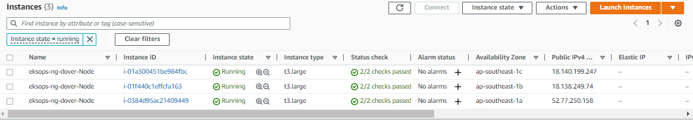

# Lab 58: Deploy a Stateful Application using EFS

Pre-requisites:

- [Basic Understanding of Kubernetes](../README.md#kubernetes)
- [AWS account](../pages/01-Pre-requisites/labs-optional-tools/README.md#create-an-aws-account)
- [AWS IAM Requirements](../pages/01-Pre-requisites/labs-optional-tools/01-AWS-IAM-requirements.md)
- [AWS CLI, kubectl, and eksct installed](../pages/01-Pre-requisites/labs-kubernetes-pre-requisites/README.md#install-cli-tools) 

Here's a breakdown of sections for this lab.


## Introduction

This lab discusses how to deploy a stateful application using EFS. 
The steps are similar with the previous [lab](../Lab57_EKS_Deploy_a_Stateful_App_using_EBS/README.md) but instead of a EBS CS driver, we will using an EFS driver.

We'll be using **ap-southeast-1** region (Singapore).

## The Application Architecture 

Our sample application will be composed of two layers:

- **Web layer**: Wordpress application 
- **Data layer**: MySQL database 

Both tiers will have their own storage to store the media content:

- **Frontend resources:**

  - an internet-facing Amazon Elastic LoadBalancer (ELB) to expose our application to the web
  - the Wordpress application running on Pods

- **Backend resources:**

  - a MySQL database running on Pods 
  - a MySQL service that connects the frontend to the database


## Launch a Simple EKS Cluster

Verify the correct IAM user's access keys. 
This should be the user created from the **pre-requisites** section above.

```bash
$ aws sts get-caller-identity 
```
```bash
{
    "UserId": "AIDxxxxxxxxxxxxxx",
    "Account": "1234567890",
    "Arn": "arn:aws:iam::1234567890:user/k8s-admin"
} 
```

For the cluster, we can reuse the [eksops.yml](./eksops.yml) file from the previous labs. Launch the cluster. Note that you must have generated an SSH key pair which can be used to SSH onto the nodes. The keypair I've used here is named "k8s-kp" and is specified in the manifest file.

```bash
time eksctl create cluster -f eksops.yml 
```

Check the nodes and pods.

```bash
kubectl get nodes 
```

Save the cluster, region, and AWS account ID in a variable. We'll be using these in a lot of the commands later.

```bash
MYREGION=ap-southeast-1
MYCLUSTER=eksops 
MYAWSID=$(aws sts get-caller-identity | python3 -c "import sys,json; print (json.load(sys.stdin)['Account'])")
```

## Setup the Kubernetes Dashboard   

The [previous lab](../Lab55_EKS_Kubernetes_Dashboard/README.md) explained the concept of Kubernetes Dashboard and the steps to set it up. Below is a script that sets up the dashboard in one go.

<details><summary> script-setup-kube-dashboard.sh </summary>
 
```bash
#!/bin/bash

MYREGION=ap-southeast-1
MYCLUSTER=eksops 
MYAWSID=$(aws sts get-caller-identity | python3 -c "import sys,json; print (json.load(sys.stdin)['Account'])")

#--------------------------------------------------------------------------------

## Deploy Kubernetes Dashboard

# Download the metrics server.
kubectl apply -f https://github.com/kubernetes-sigs/metrics-server/releases/download/v0.6.1/components.yaml

# Deploy the Kubernetes dashboard.
export KB_VER=v2.5.1
kubectl apply -f https://raw.githubusercontent.com/kubernetes/dashboard/$KB_VER/aio/deploy/recommended.yaml

# Create the service account that we'll use to authenticate to the Kubernetes dashboard.
cat <<EOF > kube-dashboard-admin-svc.yml
apiVersion: v1
kind: ServiceAccount
metadata:
  name: kb-admin-svc
  namespace: kube-system
---
apiVersion: rbac.authorization.k8s.io/v1
kind: ClusterRoleBinding
metadata:
  name: kb-admin-svc
  namespace: kube-system
roleRef:
  apiGroup: rbac.authorization.k8s.io
  kind: ClusterRole
  name: cluster-admin
subjects:
  - kind: ServiceAccount
    name: kb-admin-svc
    namespace: kube-system
EOF

# Apply the YAML file.
kubectl apply -f kube-dashboard-admin-svc.yml

# Get the bearer token of the service account that we just created and save it to a file.
kubectl -n kube-system describe secret $(kubectl -n kube-system get secret | grep kb-admin-svc | awk '{print $1}') > kube-dashboard-token.txt

# Run this command to access Dashboard from your local workstation.
kubectl proxy &

echo "-------------------------------------------------"
# Print deployment
kubectl get deployment metrics-server -n kube-system
```
 
</details>

Make the script executable.

```bash
chmod +x script-setup-kube-dashboard.sh
```

Run the script.

```bash
./script-setup-kube-dashboard.sh
```

It should return the following output:

```bash
serviceaccount/metrics-server created
clusterrole.rbac.authorization.k8s.io/system:aggregated-metrics-reader created
clusterrole.rbac.authorization.k8s.io/system:metrics-server created
rolebinding.rbac.authorization.k8s.io/metrics-server-auth-reader created
clusterrolebinding.rbac.authorization.k8s.io/metrics-server:system:auth-delegator created
clusterrolebinding.rbac.authorization.k8s.io/system:metrics-server created
service/metrics-server created
deployment.apps/metrics-server created
apiservice.apiregistration.k8s.io/v1beta1.metrics.k8s.io created
namespace/kubernetes-dashboard created
serviceaccount/kubernetes-dashboard created
service/kubernetes-dashboard created
secret/kubernetes-dashboard-certs created
secret/kubernetes-dashboard-csrf created
secret/kubernetes-dashboard-key-holder created
configmap/kubernetes-dashboard-settings created
role.rbac.authorization.k8s.io/kubernetes-dashboard created
clusterrole.rbac.authorization.k8s.io/kubernetes-dashboard created
rolebinding.rbac.authorization.k8s.io/kubernetes-dashboard created
clusterrolebinding.rbac.authorization.k8s.io/kubernetes-dashboard created
deployment.apps/kubernetes-dashboard created
service/dashboard-metrics-scraper created
deployment.apps/dashboard-metrics-scraper created
serviceaccount/kb-admin-svc created
clusterrolebinding.rbac.authorization.k8s.io/kb-admin-svc created
-------------------------------------------------
Starting to serve on 127.0.0.1:8001
NAME             READY   UP-TO-DATE   AVAILABLE   AGE
metrics-server   1/1     1            1           7m37s 
```

The script should also create a file that contains the token of the service account we just created. Copy the token inside.

```bash
grep "token:" kube-dashboard-token.txt
```

Open a web browser and paste this URL. Enter the token that we just copied. We'll use thie dashboard later in the lab.

```bash
http://localhost:8001/api/v1/namespaces/kubernetes-dashboard/services/https:kubernetes-dashboard:/proxy/
```

Note that the token will expire after some time. Simply generate a new one in the terminal.

```bash
kubectl -n kube-system describe secret $(kubectl -n kube-system get secret | grep kb-admin-svc | awk '{print $1}') 
```


## Create the EFS Filesystem 

Start with creating the EFS Filesystem in the AWS Management Console. 
Since the console UI is changing from time to time, better to follow the [official AWS Documentation](https://docs.aws.amazon.com/efs/latest/ug/creating-using-create-fs.html) on how to create the EFS Filesystem. 


<p align=center>

</p>

We should see the "Success" message along with the filesystem created in the EFS main page. 

  

Click on the new filesystem and go to **Network** tab to see more details.

  


## Install EFS Utils on the Nodes 

We also need to install the EFS Utilities onto the nodes for the EFS Filesystem to be mounted to them. Get the IP address of the nodes first.

  

Then install the package.

```bash
ssh -i ~/.ssh/k8s-kp.pem ec2-user@18.140.199.247 "sudo yum install -y amazon-efs-utils" 
ssh -i ~/.ssh/k8s-kp.pem ec2-user@18.138.249.74 "sudo yum install -y amazon-efs-utils" 
ssh -i ~/.ssh/k8s-kp.pem ec2-user@52.77.250.158 "sudo yum install -y amazon-efs-utils" 
```

## Create Namespace 

We'll create a namespace to separate our workloads and isolate environments.
To get the namespaces that we currently have in our cluster:

```bash
$ kubectl get ns

NAME                   STATUS   AGE
default                Active   5h25m
kube-node-lease        Active   5h25m
kube-public            Active   5h25m
kube-system            Active   5h25m
kubernetes-dashboard   Active   7m
```

Create a new namespace and call it "lab-efs".

```bash
kubectl create ns lab-efs
```

Verify.

```bash
$ kubectl get ns -A

NAME                   STATUS   AGE
default                Active   5h25m
kube-node-lease        Active   5h25m
kube-public            Active   5h25m
kube-system            Active   5h25m
kubernetes-dashboard   Active   7m
lab-efs                Active   12s
```

## Create StorageClass


## Deploy MySQL


## Deploy Wordpress


## Cleanup

Before we officially close this lab, make sure to destroy all resources to prevent incurring additional costs.

```bash
$ time eksctl delete cluster -f  
```

Note that when you delete your cluster, make sure to double-check the AWS Console and ensure that the Cloudformation stacks (which we created by eksctl) are dropped cleanly.
