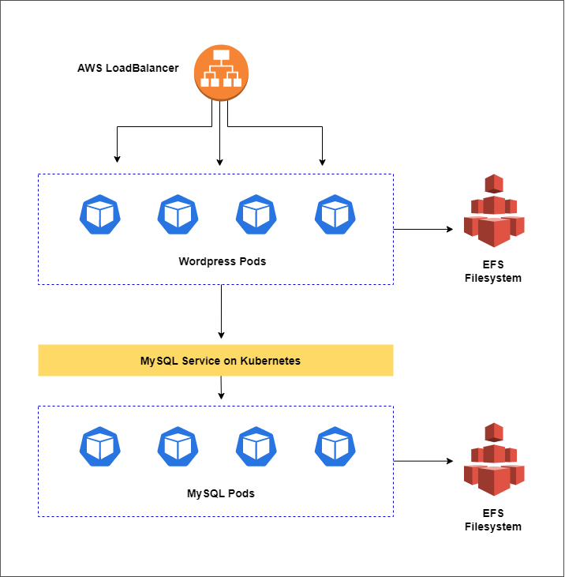
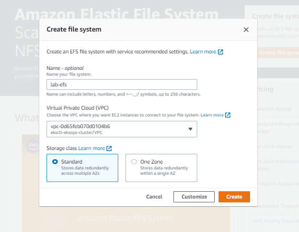
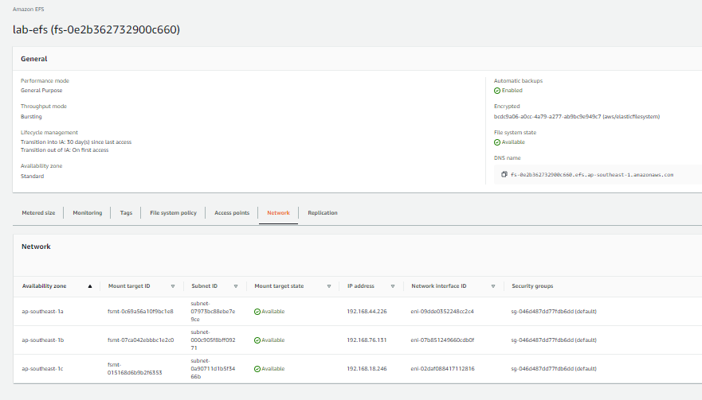
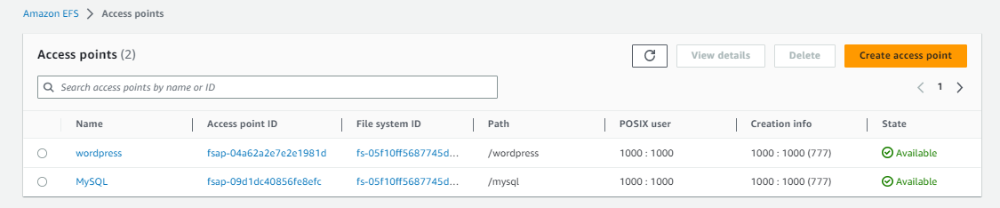

# Lab 58: Deploy a Stateful Application using EFS [Outdated]

> ⚠  **NOTE**
> The steps in this lab is possibly outdated. 
> Please refer to [Running WordPress on Amazon EKS with Amazon EFS Intelligent-tiering](https://aws.amazon.com/blogs/storage/running-wordpress-on-amazon-eks-with-amazon-efs-intelligent-tiering/)

----------------------------------------------

Pre-requisites:

- [Basic Understanding of Kubernetes](../README.md#kubernetes)
- [AWS account](../pages/01-Pre-requisites/labs-optional-tools/README.md#create-an-aws-account)
- [AWS IAM Requirements](../pages/01-Pre-requisites/labs-optional-tools/01-AWS-IAM-requirements.md)
- [AWS CLI, kubectl, and eksct installed](../pages/01-Pre-requisites/labs-kubernetes-pre-requisites/README.md#install-cli-tools) 

Sections:

- [Introduction](#introduction)
- [The Application Architecture](#the-application-architecture)
- [Launch a Simple EKS Cluster](#launch-a-simple-eks-cluster)
- [Setup the Kubernetes Dashboard](#setup-the-kubernetes-dashboard)
- [Install the Amazon EFS CSI driver](#install-the-amazon-efs-csi-driver)
    - [Create the IAM Policy and Role](#create-the-iam-policy-and-role)
    - [Install the EFS Driver](#install-the-efs-driver)
- [Create the EFS Filesystem](#create-the-efs-filesystem)
- [Create the Namespace](#create-the-namespace)
- [Create the StorageClass and PersistenVolumeClaims](#create-the-storageclass-and-persistenvolumeclaims)
- [Deploy MySQL and Wordpress](#deploy-mysql-and-wordpress)
- [Cleanup](#cleanup)
- [Resources](#resources)


## Introduction

This lab discusses how to deploy a stateful application using EFS. 
The steps are similar with the previous [lab](../Lab_057_EKS_Deploy_a_Stateful_App_using_EBS/README.md) but instead of a EBS CS driver, we will use an EFS driver.

We'll be using **ap-southeast-1** region (Singapore).

## The Application Architecture 

<p align=center>

</p>

Our sample application will be composed of two layers:

- **Web layer**: Wordpress application 
- **Data layer**: MySQL database 

Both tiers will have their own storage to store the media content:

- **Frontend resources:**

  - an internet-facing Amazon Elastic LoadBalancer (ELB) to expose our application to the web
  - the Wordpress application running on Pods

- **Backend resources:**

  - a MySQL database running on Pods 
  - a MySQL service that connects the frontend to the database

## Launch a Simple EKS Cluster

Verify the correct IAM user's access keys. 
This should be the user created from the **pre-requisites** section above.

```bash
$ aws sts get-caller-identity 
```
```bash
{
    "UserId": "AIDxxxxxxxxxxxxxx",
    "Account": "1234567890",
    "Arn": "arn:aws:iam::1234567890:user/k8s-admin"
} 
```

For the cluster, we can reuse the [eksops.yml](./manifests/eksops.yml) file from the previous labs. Launch the cluster. Note that you must have generated an SSH key pair which can be used to SSH onto the nodes. The keypair I've used here is named "k8s-kp" and is specified in the manifest file.

```bash
time eksctl create cluster -f eksops.yml 
```

Check the nodes and pods.

```bash
kubectl get nodes 
```

Save the cluster, region, and AWS account ID in a variable. We'll be using these in a lot of the commands later.

```bash
MYREGION=ap-southeast-1
MYCLUSTER=eksops 
MYAWSID=$(aws sts get-caller-identity | python3 -c "import sys,json; print (json.load(sys.stdin)['Account'])")
```

Verify in the AWS Management Console. We should be able to see the cluster and the nodegroup.

<!-- insert screenshot here -->

## Setup the Kubernetes Dashboard   

The [previous lab](../Lab_055_EKS_Kubernetes_Dashboard/README.md) explained the concept of Kubernetes Dashboard and the steps to set it up. We can use a script that sets up the dashboard in one go. Make the script executable.

```bash
chmod +x scripts/setup_kube_dashboard.sh
```

Run the script.

```bash
./scripts/setup_kube_dashboard.sh
```

It should return the following output:

```bash
serviceaccount/metrics-server created
clusterrole.rbac.authorization.k8s.io/system:aggregated-metrics-reader created
clusterrole.rbac.authorization.k8s.io/system:metrics-server created
rolebinding.rbac.authorization.k8s.io/metrics-server-auth-reader created
clusterrolebinding.rbac.authorization.k8s.io/metrics-server:system:auth-delegator created
clusterrolebinding.rbac.authorization.k8s.io/system:metrics-server created
service/metrics-server created
deployment.apps/metrics-server created
apiservice.apiregistration.k8s.io/v1beta1.metrics.k8s.io created
namespace/kubernetes-dashboard created
serviceaccount/kubernetes-dashboard created
service/kubernetes-dashboard created
secret/kubernetes-dashboard-certs created
secret/kubernetes-dashboard-csrf created
secret/kubernetes-dashboard-key-holder created
configmap/kubernetes-dashboard-settings created
role.rbac.authorization.k8s.io/kubernetes-dashboard created
clusterrole.rbac.authorization.k8s.io/kubernetes-dashboard created
rolebinding.rbac.authorization.k8s.io/kubernetes-dashboard created
clusterrolebinding.rbac.authorization.k8s.io/kubernetes-dashboard created
deployment.apps/kubernetes-dashboard created
service/dashboard-metrics-scraper created
deployment.apps/dashboard-metrics-scraper created
serviceaccount/kb-admin-svc created
clusterrolebinding.rbac.authorization.k8s.io/kb-admin-svc created
-------------------------------------------------
Starting to serve on 127.0.0.1:8001
NAME             READY   UP-TO-DATE   AVAILABLE   AGE
metrics-server   1/1     1            1           7m37s 
```

The script should also create a file that contains the token of the service account we just created. Copy the token inside.

```bash
grep "token:" kube-dashboard-token.txt
```

Open a web browser and paste this URL. Enter the token that we just copied. We'll use thie dashboard later in the lab.

```bash
http://localhost:8001/api/v1/namespaces/kubernetes-dashboard/services/https:kubernetes-dashboard:/proxy/
```

Note that the token will expire after some time. Simply generate a new one in the terminal.

```bash
kubectl -n kubernetes-dashboard describe secret $(kubectl -n kubernetes-dashboard get secret | grep kb-admin-svc | awk '{print $1}') 
```


## Install the Amazon EFS CSI driver

We'll follow the steps in the official AWS Documentation for [Amazon EFS CSI driver](https://docs.aws.amazon.com/eks/latest/userguide/efs-csi.html). Before anything else, check if your cluster already has an existing AWS Identity and Access Management (IAM) OpenID Connect (OIDC) provider.

```bash
aws eks describe-cluster --name $MYCLUSTER --query "cluster.identity.oidc.issuer" --output text
```

It should return an output like this:

```bash
https://oidc.eks.region-code.amazonaws.com/id/EXAMPLED539D4633E53DE1B71EXAMPLE
```

### Create the IAM Policy and Role 

Start with creating an IAM policy using the [iam-policy.json file](./iam_policies/iam-policy.json).

```bash
aws iam create-policy \
    --policy-name AmazonEKS_EFS_CSI_Driver_Policy \
    --policy-document file://iam_policies/iam-policy.json
```

Next, create the role using the [trust-policy.json](./iam_policies/trust-policy.json)

```bash
aws iam create-role \
  --role-name AmazonEKS_EFS_CSI_DriverRole \
  --assume-role-policy-document file://"iam_policies/trust-policy.json"  
```

Attach the policy to the role.

```bash
aws iam attach-role-policy \
  --policy-arn arn:aws:iam::$MYAWSID:policy/AmazonEKS_EFS_CSI_Driver_Policy \
  --role-name AmazonEKS_EFS_CSI_DriverRole
```

Finally, create the service account using [efs-service-account.yml file.](./manifests/efs-service-account.yml)

```bash
kubectl apply -f manifests/efs-service-account.yml
```

### Install the EFS Driver 

For this step, we'll use Helm v3. There are other methods available in the [documentation](https://docs.aws.amazon.com/eks/latest/userguide/efs-csi.html).

```bash
helm repo add aws-efs-csi-driver https://kubernetes-sigs.github.io/aws-efs-csi-driver/
helm repo update
```

Install a release of the driver using the Helm chart. Note that the command below uses a container image for the ap-southeast-1 region. For other regions, please refer to [Amazon container image registries.](https://docs.aws.amazon.com/eks/latest/userguide/add-ons-images.html)

```bash
helm upgrade -i aws-efs-csi-driver aws-efs-csi-driver/aws-efs-csi-driver \
    --namespace kube-system \
    --set image.repository=602401143452.dkr.ecr.ap-southeast-1.amazonaws.com/eks/aws-efs-csi-driver \
    --set controller.serviceAccount.create=false \
    --set controller.serviceAccount.name=efs-csi-controller-sa 
```

To verify, run:

```bash
kubectl get pod -n kube-system -l "app.kubernetes.io/name=aws-efs-csi-driver,app.kubernetes.io/instance=aws-efs-csi-driver" 
```

It should return:

```bash
NAME                                 READY   STATUS    RESTARTS   AGE
efs-csi-controller-57f6df8c6-4zjpv   3/3     Running   0          55s
efs-csi-controller-57f6df8c6-kz4t2   3/3     Running   0          65s
efs-csi-node-hrh6r                   3/3     Running   0          64s
efs-csi-node-z99x8                   3/3     Running   0          64s
efs-csi-node-zzfmq                   3/3     Running   0          64s 
```

## Create the EFS Filesystem 

Start with creating the EFS Filesystem in the AWS Management Console. 
Since the console UI is changing from time to time, better to follow the [official AWS Documentation](https://docs.aws.amazon.com/efs/latest/ug/creating-using-create-fs.html) on how to create the EFS Filesystem. 

<p align=center>

</p>

We should see the "Success" message along with the filesystem created in the EFS main page. 

  

Click on the new filesystem and go to **Network** tab to see more details.

  

Save the EFS Filesystem ID to a variable.

```bash
EFSID="fs-0be2ae829d8f1aec2" 
```

Next, create the access point by clicking the **Access Points** tab at the bottom.
In the next page, click **Create access point**. We'll create two access points:

Filesystem: Select the filesystem you just created
Name: Wordpress 
Root directory path: /wordpress 
Posix User ID: 1000
Posix Group ID: 1000
Root directory creation permissions User ID: 1000
Root directory creation permissions Group ID: 1000
Access point permissions: 777

Filesystem: Select the filesystem you just created
Name: MySQL 
Root directory path: /mysql  
Posix User ID: 1000
Posix Group ID: 1000
Root directory creation permissions User ID: 1000
Root directory creation permissions Group ID: 1000
Access point permissions: 

Both access points should be in the "Available" state. Take note of the Access Point ID of each.



## Create the Namespace 

Create a namespace to separate workloads and isolate environments using [namespace.yml](manifests/namespace.yml)

```bash
kubectl apply -f manifests/namespace.yml 
```

Verify.

```bash
$ kubectl get ns -A

NAME                   STATUS   AGE
default                Active   5h25m
kube-node-lease        Active   5h25m
kube-public            Active   5h25m
kube-system            Active   5h25m
kubernetes-dashboard   Active   7m
lab-efs                Active   12s
```

## Create the StorageClass and PersistenVolumeClaims

Create the StorageClass and PersistenVolumeClaims for both Wordpress and MySQL. Make sure to replace the **fileSystemId** and **fsapId**.

```bash
kubectl apply -f manifests/storageclass-pvc.yml 
```

To verify, run the command below. Note that both PVCs are in **Bound** state.

```bash
$ kubectl get pvc
NAME            STATUS   VOLUME                                     CAPACITY   ACCESS MODES   STORAGECLASS   AGE
pvc-mysql       Bound    pvc-fbf5035d-81cf-4c45-b90f-e2b2213eed9d   10Gi       RWX            efs-sc         62s
pvc-wordpress   Bound    pvc-515d6e26-1b9b-4722-ac41-66763166f428   10Gi       RWX            efs-sc         62s 
```


## Deploy MySQL and Wordpress

Before we proceed with deploying the Wordpress and MySQL applications, we'll create a **kustomization.yml** first which will allow us to use a secret password for the MySQL and Wordpress pods.

```bash
secretGenerator:
- name: mysql-pass
  literals:
  - password=WordPass
resources:  
  - deploy-mysql.yml 
  - deploy-wordpress.yml 
```

Deploy the Wordpress and MySQL.

```bash
kubectl apply -f manifests/deploy-mysql.yml 
kubectl apply -f manifests/deploy-wordpress.yml 
```

## Cleanup

Before we officially close this lab, make sure to destroy all resources to prevent incurring additional costs.

```bash
$ time eksctl delete cluster -f  
```

Note that when you delete your cluster, make sure to double-check the AWS Console and ensure that the Cloudformation stacks (which we created by eksctl) are dropped cleanly.

Make sure to delete the EFS Filesystem. If you created it through Terraform, run the command below.

```bash
cd manifests
terraform destroy -auto-approve 
```

## Resources 

- https://docs.aws.amazon.com/eks/latest/userguide/efs-csi.html
- https://aws.amazon.com/blogs/containers/introducing-efs-csi-dynamic-provisioning/