# All Things Docker and Kubernetes #

This repository will contain my notes and projects on containerization and orchestration that I'm working on in ~~2021~~ the present. 

<!-- <p align=center>
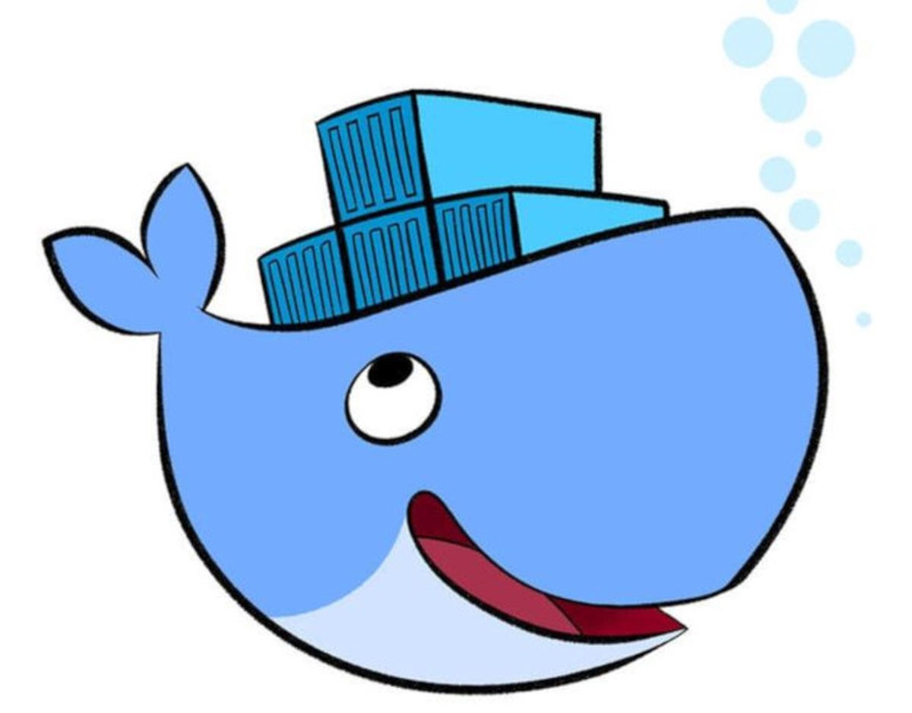
</p> -->
<p align=center>
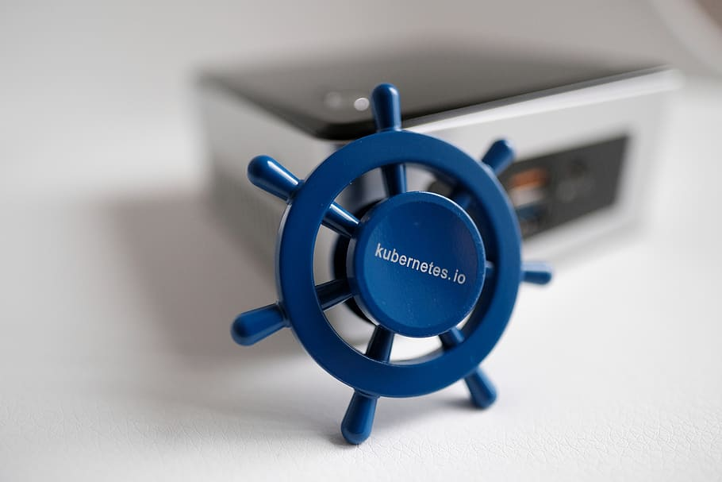
</p>

## How to Use this Repo

Simply go to your favorite terminal and clone this repository. You can also go through the **Docker** and **Kubernetes** sections below for a quick walkthrough.

```bash
git clone https://github.com/joseeden/All-Things-Docker-and-Kubernetes.git
```

## Pre-requisites

Here are some pre-requisites before we can perform the labs. 

- [For Docker Labs](pages/01-Pre-requisites/labs-docker-pre-requisites/README.md)

- [For Kubernetes Labs](pages/01-Pre-requisites/labs-kubernetes-pre-requisites/README.md)
 
- [Optional Tools](pages/01-Pre-requisites/labs-optional-tools/README.md)


## Docker Basics

Containers are where it all starts.

<!-- <details><summary> Read more.. </summary>
<br> -->

- [From VMs to Containers](pages/02-Docker-Basics/001-From-VMs-to-Containers.md) 

- [What is Docker?](pages/02-Docker-Basics/002-What-is-Docker.md)

- [The Docker Architecture](pages/02-Docker-Basics/003-The-Docker-Architecture.md)

- [Linux Kernel Features](pages/02-Docker-Basics/004-Linux-Kernel-Features.md) 

- [How Docker runs on Windows](pages/02-Docker-Basics/005-How-Docker-runs-on-Windows.md) 

- [Docker Objects](pages/02-Docker-Basics/006-Docker-Object.md) 

- [Tagging the Image](pages/02-Docker-Basics/007-Tagging-the-Image.md)

- [Pushing/Pulling an Image to/from a Container Registry](pages/02-Docker-Basics/008-Push-Pull-to-Dockerhub.md)

- [Docker Commands](pages/02-Docker-Basics/009-Docker-Commands.md) 

- [Attach and Detach Mode](pages/02-Docker-Basics/010-Attach-and-Detach.md) 

- [Inputs](pages/02-Docker-Basics/011-Inputs.md) 

- [Port Mapping](pages/02-Docker-Basics/012-Port-Mapping.md) 

- [Persisting Data](pages/02-Docker-Basics/013-Persisting-Data.md)

- [Logs](pages/02-Docker-Basics/014-Logs.md)

- [Environment Variables](pages/02-Docker-Basics/015-Environment-Variables.md) 

- [CMD and ENTRYPOINT](pages/02-Docker-Basics/016-CMD-and-Entrypoint.md) 

- [Docker Networking](pages/02-Docker-Basics/017-Docker-Networking.md) 

- [Docker Compose](pages/02-Docker-Basics/018-Docker-Compose.md) 

- [Docker Compose Commands](pages/02-Docker-Basics/019-Docker-Compose-Commands.md) 

- [Status Codes and Restart Policies](pages/02-Docker-Basics/020-Status-Codes-and-Restart-Policies.md) 

- [Docker Swarms](pages/02-Docker-Basics/021-Docker-Swarms.md) </summary>

- [Docker Security](pages/02-Docker-Basics/022-Docker-Security.md) 


<!-- </details> -->


## Cloud-Native

When you have containers, you have cloud-native applications. 

- [What is Cloud Native?](pages/03-Cloud-Native/001-What-is-Cloud-Native.md) 
 
- [Containers and being Cloud Native](pages/03-Cloud-Native/002-Containers-and-being-Cloud-Native.md) 

- [Cloud-Native Landscape](pages/03-Cloud-Native/003-Cloud-Native-Landscape.md) 

- [Business and Technical Considerations](pages/03-Cloud-Native/004-Business-and-Technical-Considerations.md) 

- [Design Considerations](pages/03-Cloud-Native/005-Design-Considerations.md) </summary>

- [Monoliths and Microservices](pages/03-Cloud-Native/006-Monoliths-and-Microservices.md) </summary>

- [Tradeoffs](pages/03-Cloud-Native/007-Tradeoffs.md) </summary>

- [Best Practices for Application Deployments](pages/03-Cloud-Native/008-Best-Practice-for-App-Deployments.md) 

- [Product is Released, What's Next?](pages/03-Cloud-Native/009-Product-is-Released-Whats-Next.md) 


## Kubernetes - In-progress

Kubernetes is indeed an entire universe in itself. 

<details><summary> Read more.. </summary>

<details><summary> Container Management Challenges </summary>

### Container Management Challenges 

Since you've reached this Kubernetes section, I'm assuming that you've work around some of these topics:

- TCP/IP Networking 
- Linux 
- Containers

As a recap, containers are a way to isolate and ship applications with dependencies and runtimes tied to it. In addition to this, containers:

- are considered as "Linux processes" under the hood which exits when the application has done its purpose.
- allows mapping to external volumes to persist data.
- can publish ports which allows access to the application running inside the container.

<p align=center>
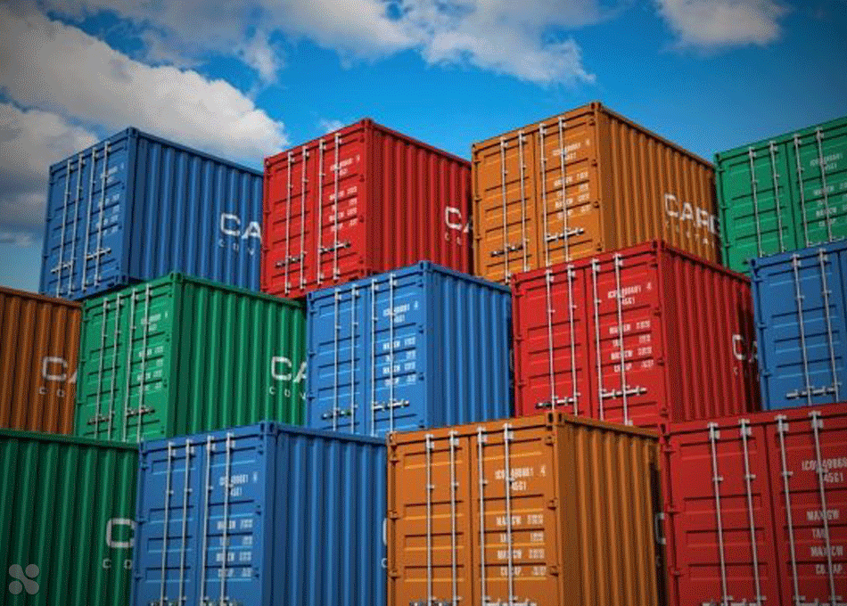
</p>

While containers have indeed revolutionized ways on how software can be delivered, it still had some challenges:

- How do we keep track of which port goes to which container on which host?

- How should we efficiently allocate containers to hosts?

- Given that microservices scale horizontally, how do we map service dependencies?

- Given that applications are frequently updated and container ports are randomized, how do we account for frequent changes?

As an example, check the diagram below. Here we have three NGINX containers running on the same underlying server. To serve the website, we can map ports on the container to the host ports. This enables port-forwarding and will direct any traffic that access the arbitrary host port and forward it to the mapped port on the container.

<p align=center>
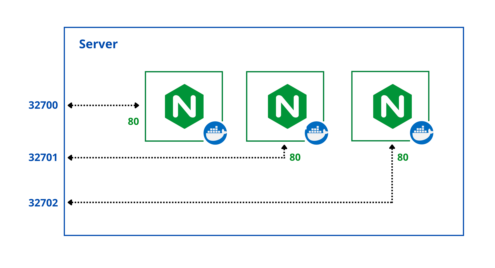
</p>

This can be done by manually mapping ports. We could also simply utilize dynamic mapping by specifying the "-P" flag when running the containers. To create three containers, we can run the command below three times. Each container will have a dynamic port assigned to it.

```bash
docker run -d -P nginx 
```

We can also throw in some basic scripting so that we can run the containers in one swoop.

```bash
for i in $(seq 3) ; do docker run -d -P nginx; done
```

It is still manageable when you have a small number of applications running on single host. However, this becomes more problematic when you add more applications and more hosts. In addition to this, things becomes more complicated when you have dependencies between applications.

<p align=center>
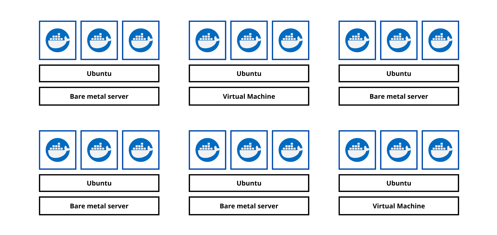
</p>

We can simply use the command below to run this setup but as you can see, we would need a much better solution of managing this kind of situation.

```bash
for i in $(seq 6); do
    for j in $(seq 3); do
        ssh node0$i docker run -d -P app${i}-${j};
    done;
done 
```

From a developer's perspective, it would be just nice if we can:

- just package up an app and let something else manage it for us 
- don't have to  worry about the management of containers 
- eliminate single points of failure 
- scale containers
- update containers without bringing down the application 
- have a robust networking and persistent storage options

Enter Kubernetes.

</details>


<details><summary> What is Kubernetes </summary>

### What is Kubernetes

As we've previously seen, the advent of containers called for much better tools to manage and maintain them. Some of the container orchestrator tools that are being used is the market are Kubernetes, Apache Mesos, and Docker Swarm, with Kubernetes being the leading tool in deploying containerized workloads.

<p align=center>

</p>

What does Kubernetes do?

- starts and stops container-based application
- handles workload placement
- automation of configuration, management, and scalability
- zero downtime with automated rollouts/rollbacks
- abstracts infrastructure by handling it under the hood
- follows *desired state* - which means we can define in code what we want our end state to look like

<p align=center>
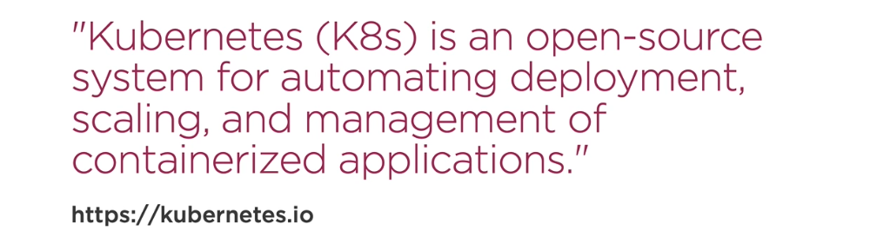
</p>

Besides automation, what are its other functionalities?

* Runtime
* Networking
* Storage orchestration
* self-healing
* Service Mesh
* Logs and metrics
* secrets management
* Tracing

What are its benefits from an administrator's standpoint?

- Speed of deployment
- Ability to absorb change quickly
- Ability to recover quickly (self-healing)
- scale containers
- orchestrate containers
- Hide complexity in the cluster    
- ensure secrets/config are working properly

What are its benefits from a developer's standpoint?

- zero-downtime deployments
- ability to emulate production locally 
- ability to create an end-to-end testing environment
- performance testing scenarios, determining what are the limits of our application
- workload scenarios, for multiple builds in your CICD pipeline
- leverage different deployment options (AB, canary, etc.)

Dive into the succeeding sections to learn more one of main principles of Kubernetes, the use of a single Kubernetes API server.

</details>


<details><summary> Kubernetes API Server </summary>

### Kubernetes API Server

This is the main way to interact with the cluster. It is a RESTful API that runs over HTTP or HTTPS using JSON. 

- composed of **API Objects**, which are a collection of primitives to represent your system's state

- Enables to declaratively configuring the state, which means we define what we want the end result to look like instead of defining the individual steps.

- information exchanged with the cluster are persisted and serialized to the data store

Next up, learn about the four Kubernetes API Objects.

</details>


<details><summary> Kubernetes API Objects </summary>

### Kubernetes API Objects

<p align=center>
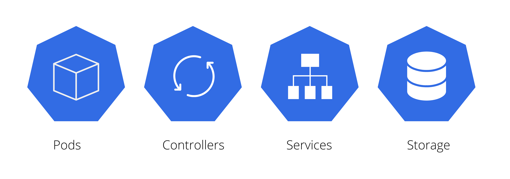
</p>

#### Pods 

A single or a collection of containers deployed as a single unit. From the standpoint of Kubernetes, this is the mmost basic unit of work.

- atomic unit of scheduling
- These are basically our container-based application
- When we define a pod, we also define the resources it needs
- **Ephemeral**, which means no pod is ever re-deployed, a new pod is always used
- **Atomicity**, which means pod is no longer available if a container inside it dies
- 

Kubernetes handles the pod by managing the:

- **state** - is the pod running?
- **health** - is the application inside the pod running?
- **liveness probes** - are we getting the appropriate response back?

A Pod has 1 IP address:

- this means containers inside the Pod share the same IP address
- containers within the same Pod talk via localhost
- Pods coordinate ports


#### Controllers

These keep the system in our desired state. 

- creates and manages Pods
- ensures the desired state is maintained
- responds to a Pod state and health

Controllers include the following:

- **ReplicaSet** - allows us to define the number of replicas for a Pod that we want to be running at all times

- **Deployment** - manages the transition between two ReplicaSets

There are a lot more controllers that Kubernetes offers and the two mentioned above are just some that are based on Pods.

#### Services 

Services provide a persistent axis point to the applications provided by the pods. This basically add persistency based on the state of the system.

- networking abstraction for Pod access
- allocates IP and DNS name for the service
- redeployed Pods are automatically updated
- updates routing information to the Pods
- scales application by adding or removing Pods
- enables loadbalancing to distribute load across the Pods

Essentially, a virtual IP address,

- this virtual IP address is mapped to various Pods
- ensures that external services accessing the Pods only needs to know a single IP

#### Storage

Storage objects serves as persistent storage to keep the data.

- **Volumes**, a storage backed by physical media which is tightly coupled to the Pods

- **Persistent Volume**, a Pod-independent storage defined at the cluster level using a *Persistent Volume Claim*

</details>


<details><summary> Kubernetes Cluster </summary>

### Kubernetes Cluster 

<p align=center>
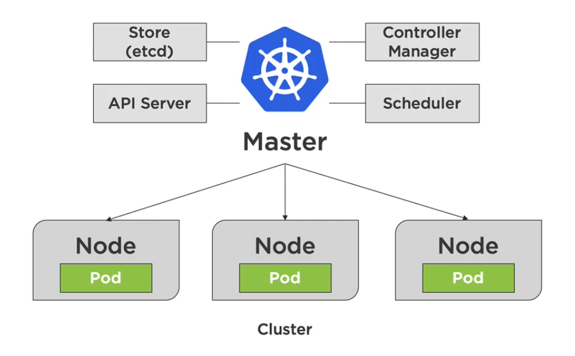
</p>

A **Cluster** is a collection of distributed physical or virtual servers or *nodes*, which is used to host and manage workloads.
 
It has two types:

- **Master node (control plane)**
    Makes global decisions about the cluster. Its components are:
    - *kube-apiserver* - exposes the Kubernetes API
    - *kube-scheduler* - decides which node will handle workload
    - *kube-control-manager* - ensures resources are up-to-date
    - *etcd* - backs-up and keeping manifests for the entire cluster

- **Worker nodes (data plane)**
    Used to host application workloads. Note that both component below are running on **all** nodes - both on master and work nodes.
    - *kubelet* - agent that runs on every node,  notifies the kube- apiserver that this node is part of the cluster
    - *kubeproxy* - network proxy that ensures the reachability and accessibility of workloads places on this specific node

#### Master Node - Control Plane

<p align=center>
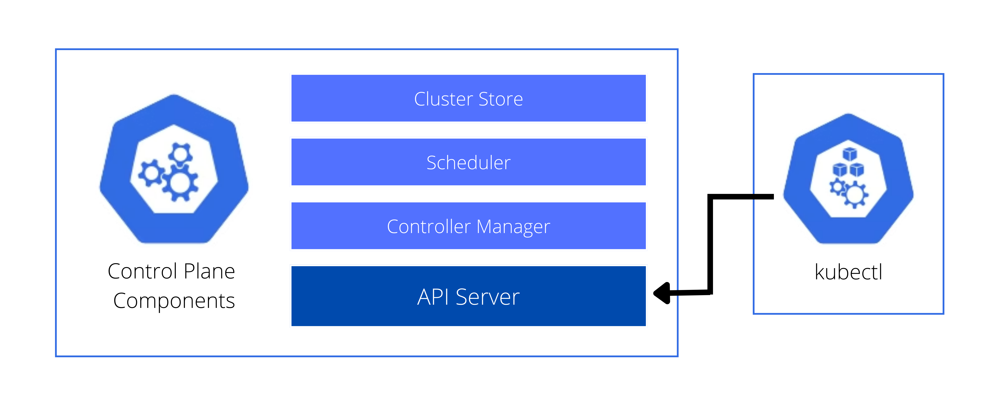
</p>

The master implements the core control functions fo a cluster.
- primary access point for cluster administration
- coordinates cluster operations
- handles monitoring and scheduling
- only runs system Pods, which includes the API server, Cluster Store, Scheduler, and Control Manager
- workloads are always forwarded on the Pods on the nodes

The master is composed of the following:

##### API Server

- essentially the commmunication hub
- core to all the operationa
- all configuration changes pass through the API server
- simple REST API interface
- verifies the operation and updates the etcd

##### etcd (Cluster store)

- persists the state of the Kubernetes objects
- objects are persisted into a key-value store called **etcd**
- implements watches on the stored keys
- all other services are stateless and grab from API server

##### Scheduler

- manages which Nodes to start Pods on
- watches the API server for unsceduled Pods,
- evaluates the resources required by a Pod,
- handles the resource constraints that we define,
- and then schedule the Pods on nodes
- 2-steps process

    - **Filtering** - find feasible nodes where resources could fit 
    - **Score** - Rank each node to choose the most suitable Pod placement

##### Controller Manager

- handles lifecycle functions of the Controllers
- constantly running the controller loops
- watch the current state of the system
- update the API server based on the desired state
- types:

    - **Node controller** - noticing and responding to nodes 
    - **Replication Controller** - maintain the correct number of Pods 
    - **Endpoints Controller** - populates endpoint objects (join servces and Pods)
    - **Service Account and Token Controllers** - create default accounts and API access tokens for namespaces

##### Cloud Controller Manager (for EKS Setup only)

- handles communication with AWS
- autoscaling for bringing up more nodes 
- provision EBS to back container volumes 
- provision loadbalancers

In addition to these five, we'll also mention **kubectl**, which isn't a part of the control plane but is necessary to interact with the API Server.

#### Worker Node  

<p align=center>
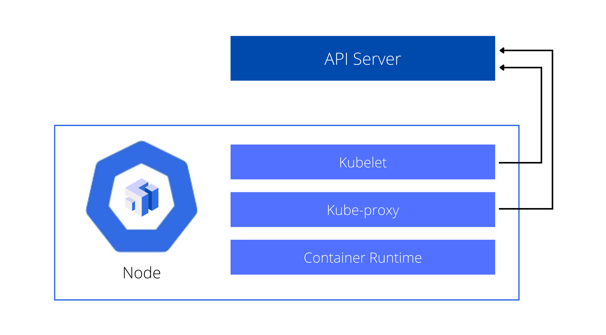
</p>

The node is responsible for starting the pod and ensuring Pods are up and running.
- handles networking
- clusters comprised of multiple nodes

The node is composed of:

##### Kubelet

- this is the node agent that talks to API server which provides the scheduling
- starts and stops up Pods based on the API server 
- if Pods are scheduled for a node, kubelet starts it up
- reports Nore and Pod state
- executes **liveness probes** which monitors the state of the application and Pods themselves

##### Kube-proxy

- network proxy that runs on each nodes that provides rules for cluster IPs
- handles the Pod networking
- talks to API server, which provides the networking information
- if there are changes in networking, the kube-proxy handles the modifications
- use **network proxy iptables**
- handles services abstraction 
- routes traffic to Pods
- manages the loadbalancing

##### Container Runtime

- actual runtime environment for the container image
- pulls the container image from the registry
- provides the environment for the image to run
- default runtime is Docker but there are many others

#### Scheduled/Add-Ons

These are Pods that provide special services to the cluster.
- an example is the DNS Pods, which handles DNS operations
- IP of DNS Pod is in the network configuration
- DNS Pod is used for service discovery inside of the cluster
- other examples are ingres controllers and dashboard for web-based administration

</details>

<details><summary> Pod Operations </summary>

### Pod Operations

Let's say we deployed a cluster with a ReplicaSet of 5 using kubectl. The process would look like this:

<p align=center>
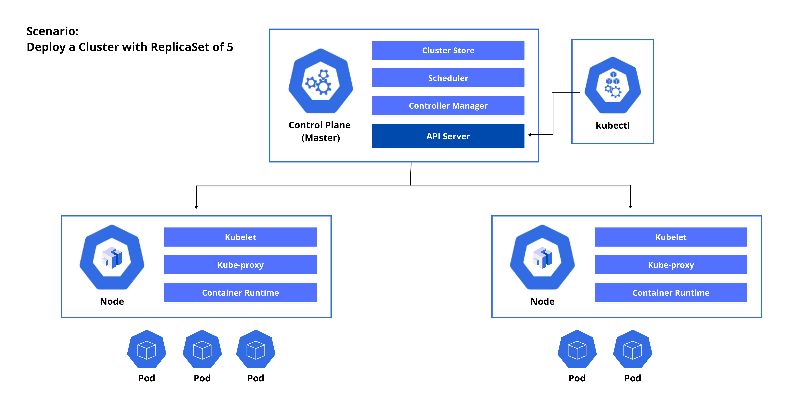
</p>

1. Request is submitted by the kubectl to the API Server.
2. The API Server stores the information to the cluster store.
3. The Controller Manager spins up the 5 pods based on the ReplicaSet requirements and sends this request to the Scheduler.
4. The Scheduler checks the nodes and schedules the two nodes where the Pods will be spun up.
5. On the Node side, the kubelet asks the API Server for any updates. 
6. It will then see that on Node1, three Pods will be spun up. Another two Pods will be spun up on the second node.
7. The Controller Manager monitors the state of the Replicas.

Let's say Node 2 goes down. 

<p align=center>
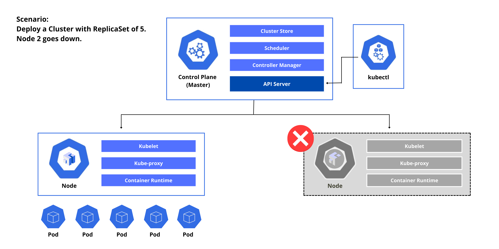
</p>

1. Node 2 will stop reporting to the Controller Manager, which then determines that the current state is now different with the desired state.
2. The Controller Manager send another request to the Scheduler.
3. The Scheduler checks the number of nodes on which to spin up the two pods, which in this case will be Node 1.
4. The kubelet in node1 seees a state change which will then spin up the two additional Pods. 

</details>


<details><summary> Kubernetes Networking </summary>

### Kubernetes Networking

Here are some basic rules to know when it comes to Kubernetes networking.

1. All Pods can communicate with each other on all nodes.
2. All nodes can communicate with all Pods.
3. No Network Address Translation (NAT).

#### Inside a Pod

Let's use the scenario below. We have multi-container Pod inside our node. These two containers inside the Pod will communicate with each other over the localhost using namespaces.

<p align=center>
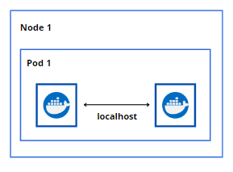
</p>

#### Pod to Pod within a Node

We'll now add two more Pods to the mix. For the three Pods to talk to each other, they'll use the real IP addresses to communicate over the Layer-2 software bridge on the node.

<p align=center>
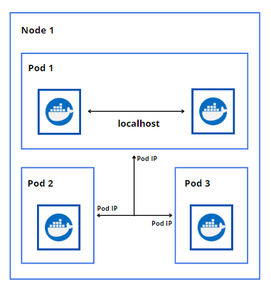
</p>

#### Pod to Pod on Another Node

So far we've only spun up Pods in a single node. Let's add a node 2 that contains a single Pod. For Pods in Node 1 to talk talk to the Pod in Node 2, they will also leverage the IP addresses of the Pods and talk over the Layer 2 or Layer connection, which would involve the underlying network facility.

<p align=center>
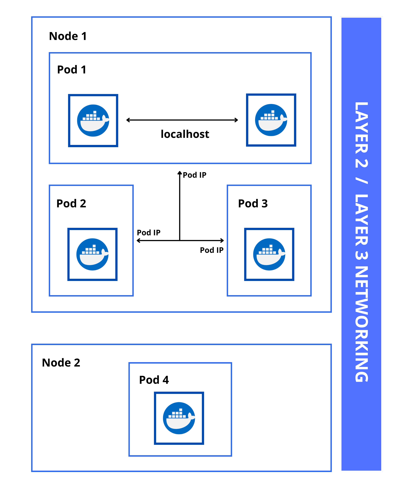
</p>


#### Overlay Network

Another common scenario is an **overlay network** where you (as a developer) don't have control on the underlying network infrastructure. Overlay networks allow the Pods to be "included in the same network". More of this will be discussed in the succeeding sections.

#### External Services 

Lastly, we also have **External Services** where we have an application in our cluster that we want to expose to the public internet using an HTTP service.

<p align=center>
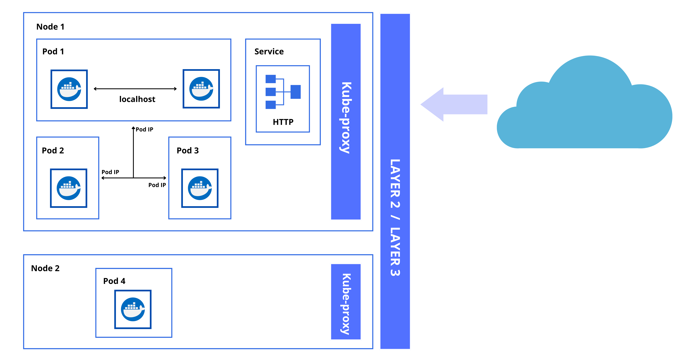
</p>

#### Cluster Network Ports 

On the Master node:

Components | Ports (TCP) | Used By
---------|----------|---------
API                 | 6443      | All
etcd                | 2379-2380 | API server and other instances of etcd
Scheduler           | 10251     | Itself, not exposed to outside world 
Controller Manager  | 10252     | Itself, not exposed to outside world 
Kubelet             | 10250     | Control Plane 

On the Worker nodes:

Components | Ports (TCP) | Used By
---------|----------|---------
Kubelet             | 10250         | Control Plane 
NodePort            | 30000-32767   | All 

</details>


<details><summary> Installation Options </summary>

### Installation Options

> *The rest of succeeding sections is focused on on-premise implementation of Kubernetes. If you prefer to use cloud platforms such as AWS to run Kubernetes, you may jump to the Kubernetes in the Cloud section.*

There are multiple ways to setup a kubernetes cluster. 

- A local cluster (on your machine)

- A production cluster on the cloud

- A on-prem, cloud-agnostic cluster

- A managed production cluster on AWS using EKS

There are available tools to automate bootstrapping clusters on on-premise and public cloud platforms.

For **production-grade cluster**:
- kubeadm
- Kubespray
- Kops
- K3s

For **development-grade cluster,** (testing):
- minikube
- k3d

**k3s** is a lightweight version of kubernetes that can be installed using one binary.

- operational 1-node cluster
- instals *kubectl* - CLI tool

Here are some ways to run Kubernetes on your local machine.

- Minikube
- Docker Desktop
- kind
- kubeadm

</details>


<details><summary> Which is the Right Solution? </summary>

### Which is the Right Solution?

Before we start running Kubernetes, we must review some considerations. 

**Where to install?**

- **Cloud**
    Kubernetes is a cloud-native tool and we could leverage the available services from cloud platforms.

    - Using virtual machines (IaaS)
    - Using managed service (PaaS)

- **On-prem**
    - Bare metal
    - VirtuaL machines 

**Which one should we choose?**

- it all depends on the strategy of the organization
- depends on the skillset and expertise of people in the organization

**We've decided where to run Kubernetes, what's next?**

- Cluster Networking 
- Scalability
- High Availability 
- Disaster Recovery

Checkout these resources to learn more about installation considerations:

- [Picking the Right Solution](https://jamesdefabia.github.io/docs/getting-started-guides/)

- [Getting started](https://kubernetes.io/docs/setup/)

</details>


<details><summary> Steps to Create a Cluster </summary>

### Steps to Create a Cluster

Here are the outline of steps to create a Kubernetes cluster.

1. Install Kubernetes from packages 
2. Create the cluster (specifically the master node)
3. Disable the swap space on the nodes.
4. Configure Pod networking
5. Join additional nodes to our cluster

</details>

<details><summary> Create a Cluster using kubeadm </summary>

### Create a Cluster using kubeadm

Before we can provision a cluster, we must ensure that the control plane and data plane is up and running, which is known as **bootstraping the cluster**. This can be done manually but there's a risk for misconfiguration since we would need to run independent components separately.

We'll use kubeadm to create our cluster. The phases include:

1. We'll run <code>kubeadm init</code>.
2. kubeadm does **pre-flight checks** which ensure the appropraite permissions and system resources are in place.
3. kubeadm creates a **certificate authority** for authentication and encryption.
4. kubeadm generates **kubeconfig files** for authenticating the components against the API server.
5. kubeadm generates **Static Pod Manifests** which are monitored by the kubelet.
6. kubeadm starts up the control plane.
7. kubeadm taints the master, ensuring pods are only scheduled on worker nodes.
8. kubeadm generates a **Bootstrap Token** for joining nodes to the cluster.
9. kubeadm starts **Add-on Pods: DNS and kube-proxy**

Note that the process defined above can be customized by specifying parameters.

</details>


<details><summary> Pods </summary>

### Pods

A **pod** can be a single container or multiple containers that always run together. If you usually run single containers, you can think of a pod as a running container. This is the same concept whether you're running containers on-premise or on the cloud.

Kubernetes control plane software decides:

- when and where to run your pods
- how to manage traffic routing
- how to scales pods based on utilization or other metrics defined. 

In addition to this, Kubernetes also:
- automatically starts pods based on resource requirements
- automatically restarts pods if they or the instances they are running on fail
- gives an IP address and a single DNS name to each pod

To see the pods in the default namespace:

```bash
$ kubectl get pods  
```

To see the pods in all namespaces:

```bash
$ kubectl get pods -A  
```

To see the pods in a specific names, e.g. kube-system: 

```bash
$ kubectl get pods -n kube-system 
```

To get more information about the pod:

```bash
$ kubectl describe <pod-name> 
```

To see the logs of a particular pos: 

```bash
$ kubectl logs <pod-name> 
```

To learn more, check out [Pods in Kubernetes.](https://kubernetes.io/docs/concepts/workloads/pods/)


</details>


<details><summary> DaemonSets </summary>

### DaemonSets

A **DaemonSet** ensures that all (or some) Nodes run a copy of a Pod. As nodes are added to the cluster, Pods are added to them. As nodes are removed from the cluster, those Pods are garbage collected. Deleting a DaemonSet will clean up the Pods it created.

Some typical uses of a DaemonSet are:

- running a cluster storage daemon on every node
- running a logs collection daemon on every node
- running a node monitoring daemon on every node

To see the daemonsets running:

```bash
$ kubectl get ds -n kube-system 
```

To see the daemonset in a specific namespace, e.g. kube-system: 

```bash
$ kubectl get ds -n kube-system 
```

To get more information about the daemonset in a specific namespace, e.g. kube-system: 

```bash
$ kubectl describe <daemonset> -n kube-system
```

To learn more, check out [DaemonSets in Kubernetes](https://kubernetes.io/docs/concepts/workloads/controllers/daemonset/).


</details>


<details><summary> ReplicaSets </summary>

### ReplicaSets 

A ReplicaSet is a declarative statement of how many different pods of the same type that we want to run in the system at any given time. Since it maintains a stable set of replica Pods, it is often used to guarantee the availability of a specified number of identical Pods.

Note that we don't usually create the ReplicaSet but instead we create the Deployments and specify the number of containers that we want to run. You can verify this by checking a deployment:

```bash
$ kubectl edit deployment -n kube-system
```

To see the ReplicaSets running:

```bash
$ kubectl get rs -n kube-system 
```

To see the ReplicaSetsin a specific namespace, e.g. kube-system: 

```bash
$ kubectl get rs -n kube-system 
```

To learn more, check out [ReplicaSets in Kubernetes](https://kubernetes.io/docs/concepts/workloads/controllers/replicaset/).


</details>


<details><summary> Certificate Authority </summary>

### Certificate Authority

By default, kubeadm creates a self-signed certificate authority (CA)

- CA can also be created to be a part of an external PKI
- used to secure cluster communications 
- generates certificates used by API server to encrypt HTTPS
- generates certificates for authenticating users and kubelets
- certificates will be distributed to each node

The CA files will be stored in:

```bash
$ /etc/kubernetes/pki  
```

</details>


<details><summary> Stateless vs. Stateful </summary>

### Stateless Applications 

This means application that doesn't have a state and doesn't write any local files.

- also cannot keep local session 
- if same app is ran multiple times, it won't change state
- scales horizontally 
- session management is done outside the container
- files that need to be saved cannot be saved locally on the container

### Stateful Applications

Includes traditional databases such as PostgreSQL and MySQL which have database files that can't be split over multiple instances.

- cannot horizontally scale
- can be ran on a single container and scale vertically
- use volumes to save data

</details>


<details><summary> Scaling </summary>

### Scaling

Scaling in Kubernetes is done using the **Replication Controller.**

- ensures specified number of replicas ran at all times 
- pods are automatically replaced if they fail, get deleted, or are terminated
- recommended to use even if you're only running 1 pod to ensure pod is always running

</details>

<details><summary> Helm Package Manager </summary>

### Helm Package Manager

Helm is the Kubernetes package manager which helps package installation in Kubernetes and manages package dependencies. 

To learn more, visit the official [Helm website.](https://helm.sh/)

#### Concepts 

- **Chart** - contains all the dependencies to deploy a Kubernetes cluster
- **Config** - optional configs to override default configs
- **Release** - a running instance of a chart

#### Helm 2 vs. Helm 3 

There is a new Helm 3 version, which differs with Helm 2.

- Helm 2 architecture is different
- Helm 2 command line and chart structure might differ 
- Helm 2 charts are compatible with Helm 3

#### Components

- **Helm Client** - CLI client for managing repositories, releases, and interfacing with Helm library

- **Helm Library** - responsible for Helm operations towards the API Server.

#### Set up Helm 

Helm can be installed either from a source, or from pre-built binary releases. The steps for setting up Helm.

- [Install Helm](https://helm.sh/docs/intro/install/) 

- [Initialize a Helm Chart Repository](https://helm.sh/docs/intro/quickstart/#initialize-a-helm-chart-repository)

If you're using a Windows Machine with WSL2 that's running Ubuntu, you can simply run these commands:

```bash
$ curl -fsSL -o get_helm.sh https://raw.githubusercontent.com/helm/helm/main/scripts/get-helm-3

$ chmod 700 get_helm.sh

$ ./get_helm.sh
```

#### Initialize a Repository

Next, add a repository. Note that starting with Helm v3, there are no repositories installed by default. We can also add other repositories.

In the command below, we named the repo "stable".

```bash
$ helm repo add stable https://charts.helm.sh/stable 
```

Let's try to add another repo and give it the name "bitnami"

```bash
$ helm repo add bitnami https://charts.bitnami.com/bitnami 
```

To check the repositories added,

```bash
$ helm repo list 
```

It's best practice to fetch the latest updates from the repo.

```bash
$ helm repo update 
```

We can take a look at all the charts contained in the repository.

```bash
$ helm search repo 
```

#### Deploy a Sample Chart 

Let's try to install a redis chart and name it "my-test-redis1

```bash
$ helm install my-test-redis1 bitnami/redis 
```

Verify that the pods are running.

```bash
$ kubectl get pods 
```

To get a list of deployed charts,

```bash
$ helm ls 
```

#### Delete the Chart 

Run the uninstall command and specify the chart name.

```bash
$ helm uninstall my-test-1 
```

</details>


<details><summary> CNCF Projects </summary>

### CNCF Projects   

Cloud Native Computing Foundation (CNCF) is the open source, vendor-neutral hub of cloud native computing, hosting projects like Kubernetes and Prometheus to make cloud native universal and sustainable. 

CNCF manages different projects which extends the Kubernetes solution to provide more features. Here's some of the projects:

- **CRI-O** - A Kubernetes container runtime that manages the containers.

- **CNI** - pluggable common network interface

- **Jaeger** - an operator for packaging, deploying, and managing applications

- **Rook** - a storage orchestrator for Kubernetes 

You can read about their organizations and the projects that they maintain [here](https://www.cncf.io/).

Each of these projects will have different statuses as defined by CNCF.

- **Sandbox** - project is new and used by innovators only 
- **Incubating** - projects are slowly being adopted
- **Graduated** - project becomes a part of the K8s environment


</details>


<details><summary> Kubernetes in the Cloud </summary>

### Kubernetes in the Cloud

#### EKS - Elastic Kubernetes Service

This is the Kubernetes offering from AWS which allows users to deploy a management plane. 

AWS basically provides the control plane and all it components, and it's up to the users to provision where their workload will run. The workloads can run on Fargate or EC2.

Benefits of EKS:

- no control plane to manage
- built-in loadbalancing, networking, volume storage 
- easy to turn on and off
- integrations with other AWS components to build applications (S3, Redshift, RDS, Lambda, COgnito, etc.)

#### ECS and Fargate

ECS is a proprietary Docker management service developed first to compete with Kubernetes.

- uses JSON task definition
- similar with EKS in many ways but the main difference is that it's proprietary 

Fargate, on the other hand, is a container service that is done in a serverless fashion.

- no node to manage
- No scaling management
- Fargate can be used with EKS and ECS
- JSON task definition
- only pay for active pods, not active node

Now, if you decide to go for Fargate, here are some important reminders:

- container service needs to map tp Fargate CPU or memory tier
- mapping is based on largest sum of resources
- mapping also consumes 250M cores, and 512Mi memory

</details>


<details><summary> Amazon EKS - Managed Kubernetes </summary>

### Amazon EKS - Managed Kubernetes

This is the Kubernetes offering from AWS which allows users to deploy the management plane and let AWS handles the control plane and all it components. 

It's up to the users to provision where their workload will run. The workloads can run on Fargate or EC2.

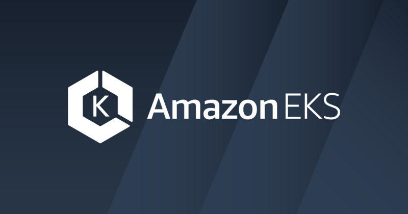  

Traditionally, you'll have to setup and deploy Kubernetes yourself:
- deploy master nodes
- deploy etcd
- setup CA for TLS encryption 
- setup monitoring, auto-scaling, auto-healing
- setup authentication 
- setup worker nodes  

With EKS:
- no control plane to manage

- built-in loadbalancing, networking, volume storage 
- easy to turn on and off
- authentication is handled through IAM
- integrations with other AWS components to build applications (S3, Redshift, RDS, Lambda, Cognito, etc.)
- AMI for nodes can be customized
- container images can be stored through ECR

In the image below, we can see which components that Amazon EKS takes care for us and which components we need to manage as users.

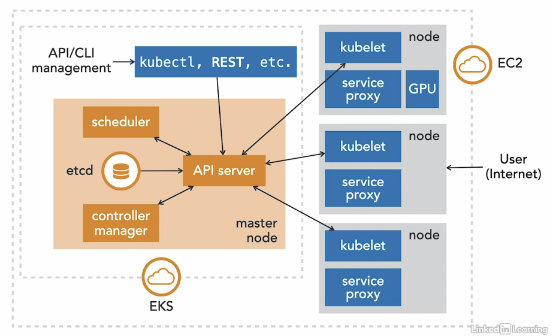  

When you create you EKS cluster, AWS takes care of all of these under the hood:
1. master node is set up for HA
2. etcd is set up  for HA.
3. IAM plugin is setup.
4. CA is setup for TLS.
5. Autoscaling is set up.
6. Loadbalancers are provisioned (NLB and ELB)

**The EKS Control Plane**

- highly available
- single tenant (you don't share it with other customers)
- made of native AWS components
- API server talks to etcd using an ALB
- the whole control plane is fronted by an NLB with fixed IP

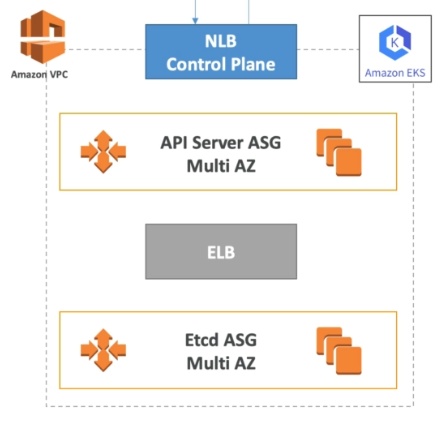  

</details>

<details><summary> Amazon EKS - Pricing </summary>

### Amazon EKS - Pricing

What you pay for:

- EKS cluster per hour
- resources related to running your apps 

What you don't pay for:

- the control plane

To learn more, check out the official [Amazon EKS Pricing](https://aws.amazon.com/eks/pricing/) page.

</details>


<details><summary> Amazon EKS - IAM and RBAC  </summary>

### Amazon EKS - IAM and RBAC

Kubernetes is deeply integrated with IAM and RBAC.

- Authentication is managed by IAM
- Authorization is natively managed by Kubernetes RBAC

We can assign RBAC directly to IAM entities and this will allow them access to the Kubernetes clusters. 

<p align=center>
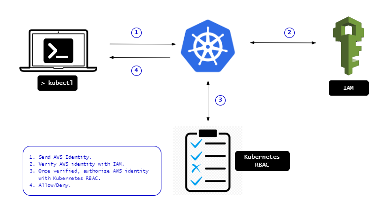
</p>

  

**Worker Nodes**

When create a worker node, it will join the cluster and be assigned an IAM role that authorize in RBAC to let them join:

- system:bootstrappers 
- system:nodes 

This can be seen in the Configmap. To edit the Configmap:

```bash
$ kubectl edit -n kube-system configmap/aws-auth 
```

<p align=center>
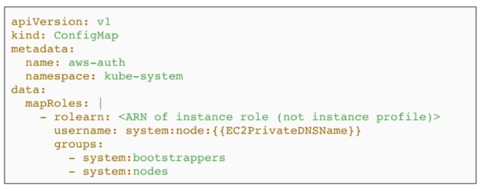
</p>


**IAM Users**

An example of users that we can create:

- **cluster admin** - able to do all administrative operations on a cluster-level

- **read-only user** - limited to a dedicated namespace

We can also assign a more fine-grained policy for the user. 
To learn more, check out this [lab](lab53_EKS_IAM_and_RBAC/README.md).

You can also take a look at [Using RBAC Authorization](https://kubernetes.io/docs/reference/access-authn-authz/rbac/).

</details>


<details><summary> Amazon EKS - Loadbalancers </summary>

### Amazon EKS - Loadbalancers 

Amazon EKS supports the three types of Loadbalancers:

Loadbalancer | Service type B | 
---------|----------|---------
 Classic Loadbalancer | None | 
 Network Loadbalancer | LoadBalancer | 
 Application Loadbalancer | Ingress Controller |


#### AWS Load Balancer Controller 

The AWS Load Balancer Controller manages AWS Elastic Load Balancers for a Kubernetes cluster. The controller provisions the following resources:

- An AWS Application Load Balancer (ALB) when you create a Kubernetes Ingress.

- An AWS Network Load Balancer (NLB) when you create a Kubernetes service of type LoadBalancer

Note that it doesn't create AWS Classic Load Balancers. 
It is recommended to use version *2.4.3* or above if your cluster is version *1.19* and above.

To learn more AWS Load Balancer Controller, check out the links below:

- [AWS User Guide on EKS](https://docs.aws.amazon.com/eks/latest/userguide/aws-load-balancer-controller.html)

- [AWS Load Balancer Controller Github page](https://github.com/kubernetes-sigs/aws-load-balancer-controller)

#### Classic LoadBalancer

By default, EKS will create a classic loadbalancers when you create a Kubernetes *Service* of type *LoadBalancer*. We can change it by adding the **annotations** in the manifest file.

#### Network LoadBalancer

An AWS Network Load Balancer can load balance network traffic to pods deployed to Amazon EC2 IP and instance targets or to AWS Fargate IP targets. 
 

</details>


<details><summary> Amazon EKS - Cluster AutoScaler </summary>

### Amazon EKS - Cluster AutoScaler

The Cluster AutoScaler is responsible for dynamically scaling (in and out) the nodes within a nodegroup.

- not specific to AWS, this is a general Kubernetes concept
- can be based on availability/requests,
- can scale if node is under-utilized
- also possible to have a mixture of on-demand and spot instances
- avaialble RAM and number of CPUs should be similar throughout the noes

For stateful workloads:

- use a nodegroup with single availability zone (AZ)
- underlying EBS volume cannot be shared across AZ

For stateless workloads:

- use a nodegroup with multiple availability zones (AZs)

To learn more, check out this [Github repository](https://github.com/kubernetes/autoscaler).

</details>


<details><summary> Amazon EKS - Control Plane Logging to CloudWatch  </summary>

### Amazon EKS - Control Plane Logging to CloudWatch

Since the Control Plane is managed by AWS, we don't have access to the hosts that are serve the Control Plane and manages the logs. We can access these logs thru CloudWatch by enabling which log type to send.

**Log Types**

- API
- Audit 
- Authenticator 
- Control Manager 
- Scheduler 

We can access the logs by going to the CloudWatch dashboard in the AWS Management Console.

- each log type creates its own CloudWatch log stream 
- prefixed with <code>/aws/eks/cluster-name</code>
- this adds [additional costs](https://aws.amazon.com/cloudwatch/pricing/) for storage and collection

</details>

<details><summary> Error: Cannot View Kubernetes Nodes  </summary>

### Error: Cannot View Kubernetes Nodes 

#### Problem:

You might get the following error when checking the EKS cluster through the AWS Console.

```bash
Your current user or role does not have access to Kubernetes objects on this EKS cluster 
```

#### Cause:

You might be using two different IAM user accounts:

- IAM-user1 - you originally use this to log-in to the AWS Management Console 
- IAM-user2 - this is the new user you created and generated the access key 

In the terminal, you set up the CLI access to connect to your AWS resources by editing
the credentials file. 

```bash
$ vim ~/.aws/credentials 
```

Check the identity.

```bash
$ aws sts get-caller-identity  
```

If the user returned is the same as the user currently logged-in the AWS Management Console, then you shouldn't have any issue.

If they're different users, then that means the user in the CLI (this is the user you used to create the EKS cluster) has different permissions from the user logged in the console.

#### Solution:

You may try to log-in to the console using the same identity that you used in the CLI.
If error still appeared, you may need to attach the inline policy to the group.

  

In the next page, choose the JSON tab and enter the following policy. Make sure to replace 111122223333 with your account ID.

```bash
{
    "Version": "2012-10-17",
    "Statement": [
        {
            "Effect": "Allow",
            "Action": [
                "eks:ListFargateProfiles",
                "eks:DescribeNodegroup",
                "eks:ListNodegroups",
                "eks:ListUpdates",
                "eks:AccessKubernetesApi",
                "eks:ListAddons",
                "eks:DescribeCluster",
                "eks:DescribeAddonVersions",
                "eks:ListClusters",
                "eks:ListIdentityProviderConfigs",
                "iam:ListRoles"
            ],
            "Resource": "*"
        },
        {
            "Effect": "Allow",
            "Action": "ssm:GetParameter",
            "Resource": "arn:aws:ssm:*:111122223333:parameter/*"
        }
    ]
}   
```

Click **Review Policy**, then in the next page, create a name for the policy. Click **Create Policy.** 

Next, create a rolebinding. If you need to change the Kubernetes group name, namespace, permissions, or any other configuration in the file, then download the file and edit it before applying it to your cluster

```bash
$ curl -o eks-console-full-access.yaml https://s3.us-west-2.amazonaws.com/amazon-eks/docs/eks-console-full-access.yaml
```
```bash
$ curl -o eks-console-restricted-access.yaml https://s3.us-west-2.amazonaws.com/amazon-eks/docs/eks-console-restricted-access.yaml 
```

You can apply any of the two YAML files.

```bash
$ kubectl apply -f eks-console-full-access.yaml
```
```bash
$ kubectl apply -f eks-console-restricted-access.yaml
```

Next, map the IAM user or role to the Kubernetes user or group in the aws-auth ConfigMap using eksctl.

```bash
export MYCLUSTER=<put-name-of-the-cluster-here> 
export MYREGION=<put-region-code-here> 
export MYACCOUNTID=<put-account-id-here>
export MYUSER=<put-user-id-here>
```

View the current mappings.

```bash
eksctl get iamidentitymapping --cluster $MYCLUSTER --region=$MYREGION 
```

Add a mapping for a role.

```bash
eksctl create iamidentitymapping \
    --cluster $MYCLUSTER \
    --region=$MYREGION \
    --arn arn:aws:iam::$MYACCOUNTID:role/my-console-viewer-role \
    --group eks-console-dashboard-full-access-group \
    --no-duplicate-arns 
```

Add a mapping for a user.

```bash
eksctl create iamidentitymapping \
    --cluster $MYCLUSTER \
    --region=$MYREGION \
    --arn arn:aws:iam::$MYACCOUNTID:user/$MYUSER \
    --group eks-console-dashboard-restricted-access-group \
    --no-duplicate-arns
```

To learn more, check out these links:

- [Can't see Nodes on the Compute tab or anything on the Resources tab](https://docs.aws.amazon.com/eks/latest/userguide/troubleshooting_iam.html#security-iam-troubleshoot-cannot-view-nodes-or-workloads)

- [View Kubernetes resources](https://docs.aws.amazon.com/eks/latest/userguide/view-kubernetes-resources.html#view-kubernetes-resources-permissions)

</details>


<details><summary> Error: Failing to Delete CloudFormation Stack </summary>

### Error: Failing to Delete CloudFormation Stack 

#### Problem: 

When you try to delete the cluster using the command below, you get an error that says it failed to delete the cluster.

```bash
$ eksctl delete cluster -f manifest.yml 
```

When you go to > CloudFormation dashboard > Stacks > *eksctl-yourcluster*, and then check the Events, you might see this two errors:

When CloudFormation tries to create the node instance profile: 

```bash
Resource handler returned message: "User: arn:aws:iam::12345678910:user/k8s-admin is not authorized to perform: iam:RemoveRoleFromInstanceProfile on resource: instance profile eksctl-eksops-nodegroup-mynodegroup-NodeInstanceProfile-qNlJ2ojEWOdP because no identity-based policy allows the iam:RemoveRoleFromInstanceProfile action (Service: Iam, Status Code: 403, Request ID: b90e26ea-97ff-453b-8e4d-8353c39a3a9b, Extended Request ID: null)" (RequestToken: 139ad70a-2b04-9797-697d-85530cb2496b, HandlerErrorCode: GeneralServiceException) 
```

After the stack failed, CloudFormation tried to rollback but fails to delete the node instance profile:

```bash
Resource handler returned message: "User: arn:aws:iam::12345678910:user/k8s-admin is not authorized to perform: iam:CreateInstanceProfile on resource: arn:aws:iam::12345678910:instance-profile/eksctl-eksops-nodegroup-mynodegroup-NodeInstanceProfile-qNlJ2ojEWOdP because no identity-based policy allows the iam:CreateInstanceProfile action (Service: Iam, Status Code: 403, Request ID: 8f3b2448-5ff3-40b9-80c8-12aeb56eb692, Extended Request ID: null)" (RequestToken: 0b93aa73-eb81-1650-0f47-56a3a476f5b3, HandlerErrorCode: GeneralServiceException)
```

#### Cause:

Your IAM user account doesn't have the needed permissions.

#### Solution: 

As I have had many attempts in resolving the issue, the best option is to create the cluster with the IAM user that has an *AdministratorAccess*. This isn't recommended but this completely solves the issue.

You may also refer to the EKSFullAccess policy file that I have created. It contains the minimum AWS IAM permissions to do EKS operations using eksctl and kubectl.

You may also check out these links:


- [Controlling Access to the Kubernetes API](https://kubernetes.io/docs/concepts/security/controlling-access/)

- [Using Node Authorization](https://kubernetes.io/docs/reference/access-authn-authz/node/)

- [Manage IAM users and roles](https://eksctl.io/usage/iam-identity-mappings/)

- [Configure Kubernetes Role Access](https://www.eksworkshop.com/beginner/091_iam-groups/configure-aws-auth/)

- [How do I resolve an unauthorized server error when I connect to the Amazon EKS API server?](https://aws.amazon.com/premiumsupport/knowledge-center/eks-api-server-unauthorized-error/)

- [Fail to create new cluster with service role error #2182](https://github.com/weaveworks/eksctl/issues/2182)

- [Document minimum IAM requirements #204](https://github.com/weaveworks/eksctl/issues/204)

- [usage of EKS Service IAM Role #122](https://github.com/weaveworks/eksctl/issues/122)


</details>


<details><summary> Cheatsheet: Kubernetes Commands </summary>

### Cheatsheet: Kubernetes Commands

Command | Description
---------|----------
| <code> kubectl get pod </code> | Get information about all running pods
| <code> kubectl describe pod <pod> </code> | Describe one pod
| <code> kubectl expose pod <pod> --port=444 --name=frontend </code> | Expose the port of a pod (creates a new service)
| <code> kubectl port-forward <pod> 8080 </code> | Port forward the exposed pod port to your local machine
| <code> kubectl attach <podname> -i </code> | Attach to the pod
| <code> kubectl exec <pod> -- command </code> | Execute a command on the pod
| <code> kubectl label pods <pod> mylabel=awesome </code> | Add a new label to a pod
| <code> kubectl run -i --tty busybox --image=busybox --restart=Never -- sh </code> | Run a shell in a pod - very useful for debugging
| <code> kubectl get deployments </code> | Get information on current deployments
| <code> kubectl get rs </code> | Get information about the replica sets
| <code> kubectl get pods --show-labels </code> | get pods, and also show labels attached to those pods
| <code> kubectl rollout status deployment/helloworld-deployment </code> | Get deployment status
| <code> kubectl set image deployment/helloworld-deployment k8s-demo=k8s-demo </code> |2 </code> | Run k8s-demo with the image label version 2
| <code> kubectl edit deployment/helloworld-deployment </code> | Edit the deployment object
| <code> kubectl rollout status deployment/helloworld-deployment </code> | Get the status of the rollout
| <code> kubectl rollout history deployment/helloworld-deployment </code> | Get the rollout history
| <code> kubectl rollout undo deployment/helloworld-deployment </code> | Rollback to previous version
| <code> kubectl rollout undo deployment/helloworld-deployment --to-revision=n </code> | Rollback to any version version

</details>


</details>


<!-- Adding this section soon!

<p align=center>
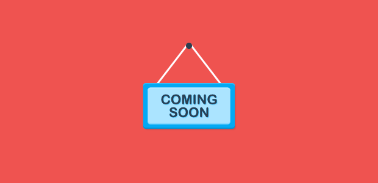
</p> -->

## Resources

Useful courses on Docker:

- [Docker in Production Using Amazon Web Services](https://www.pluralsight.com/courses/docker-production-using-amazon-web-services)

- [Building, Deploying, and Running Containers in Production](https://cloudacademy.com/learning-paths/building-deploying-and-running-containers-in-production-1-888/#)

- [Docker and Kubernetes: The Complete Guide](https://www.udemy.com/course/docker-and-kubernetes-the-complete-guide/)

- [Docker in Production Using Amazon Web Services](https://www.pluralsight.com/courses/docker-production-using-amazon-web-services)

- [The Complete Practical Docker Guide](https://www.oreilly.com/library/view/the-complete-practical/9781803247892/)

- [Complete AWS ECS Bootcamp (Beginner friendly)](https://www.udemy.com/course/aws-ecs-devops-masterclass/)

Useful courses on Kubernetes:

- [Getting Started with Kubernetes LiveLessons, 2nd Edition](https://www.oreilly.com/library/view/getting-started-with/9780136787709/)

- [Hands-on Kubernetes](https://www.oreilly.com/library/view/hands-on-kubernetes/9780136702887/)

- [Learning Path - Kubernetes Administration](https://www.pluralsight.com/paths/kubernetes-administration)

- [Learning Path - Using Kubernetes as a Developer](https://www.pluralsight.com/paths/using-kubernetes-as-a-developer)

- [Learn DevOps: The Complete Kubernetes Course](https://www.udemy.com/course/learn-devops-the-complete-kubernetes-course/)

- [Cloud Native Fundamentals by SUSE](https://www.udacity.com/course/cloud-native-fundamentals--ud064)

- [Running Kubernetes on AWS (EKS)](https://www.linkedin.com/learning/running-kubernetes-on-aws-eks)

- [Hands-On Amazon Elastic Kubernetes Service (EKS) LiveLessons: Running Microservices](https://www.oreilly.com/library/view/hands-on-amazon-elastic/9780137446667/)

- [Packaging Applications with Helm for Kubernetes](https://www.pluralsight.com/courses/kubernetes-packaging-applications-helm)


Other resources on Docker:

- [Dockerfile reference](https://docs.docker.com/engine/reference/builder/#from)

- [Best practices for writing Dockerfiles](https://docs.docker.com/develop/develop-images/dockerfile_best-practices/)

- [Docker Build command](https://docs.docker.com/engine/reference/commandline/build/)

- [Docker Run command](https://docs.docker.com/engine/reference/commandline/run/)

- [Introduction to Docker registry](https://docs.docker.com/registry/introduction/)

- [Docker Tag command](https://docs.docker.com/engine/reference/commandline/tag/)

- [Docker Push command](https://docs.docker.com/engine/reference/commandline/push/)

- [Open Container Initiative (OCI) Specifications](https://www.docker.com/blog/demystifying-open-container-initiative-oci-specifications/)

- [Buildpacks: An App’s Brief Journey from Source to Image](https://buildpacks.io/docs/app-journey/)

Other resources on Kubernetes:

- [DNS for Services and Pods](https://kubernetes.io/docs/concepts/services-networking/dns-pod-service/)

- [Custom Resources or CRDs](https://kubernetes.io/docs/concepts/extend-kubernetes/api-extension/custom-resources/)

- [Autoscaling in Kubernetes](https://kubernetes.io/blog/2016/07/autoscaling-in-kubernetes/)

- [Kubernetes Components](https://kubernetes.io/docs/concepts/overview/components/)

- [eksctl - Config file schema](https://eksctl.io/usage/schema/#config-file-schema)

Github repositories:

- [kubernetes/kops](https://github.com/kubernetes/kops)

- [wardviaene/kubernetes-course](https://github.com/wardviaene/kubernetes-course)

- [wardviaene/devops-box (devops box with pre-built tools)](https://github.com/wardviaene/devops-box)

- [kelseyhightower/kubernetes-the-hard-way](https://github.com/kelseyhightower/kubernetes-the-hard-way)

- [Kubernetes Autoscaler](https://github.com/kubernetes/autoscaler)

- [phcollignon/helm](https://github.com/phcollignon/helm)

- [phcollignon/helm3](https://github.com/phcollignon/helm3)


Metrics, Logging, Health Checks, and Tracing:

- [Pattern: Health Check API](https://microservices.io/patterns/observability/health-check-api.html)

- [Best Practice on Metric Naming](https://prometheus.io/docs/instrumenting/writing_exporters/#metrics)

- [How to Log a Log: Application Logging Best Practices](https://logz.io/blog/logging-best-practices/)

- [log4j - Logging Levels](https://www.tutorialspoint.com/log4j/log4j_logging_levels.htm)

- [Enabling Distributed Tracing for Microservices With Jaeger in Kubernetes](https://containerjournal.com/topics/container-ecosystems/enabling-distributed-tracing-for-microservices-with-jaeger-in-kubernetes/)


Free DNS Service using [freedns](https://freedns.afraid.org/)

- Sign up at http://freedns.afraid.org/
- Choose for subdomain hosting
- Enter the AWS nameservers given to you in route53 as nameservers for the subdomain

Free DNS Service using [dot.tk](http://www.dot.tk)

- provides a free .tk domain name you can use
- you can point it to the amazon AWS nameservers

Free DNS Service using [Namecheap](https://www.namecheap.com/)
- often has promotions for tld’s like .co for just a couple of bucks