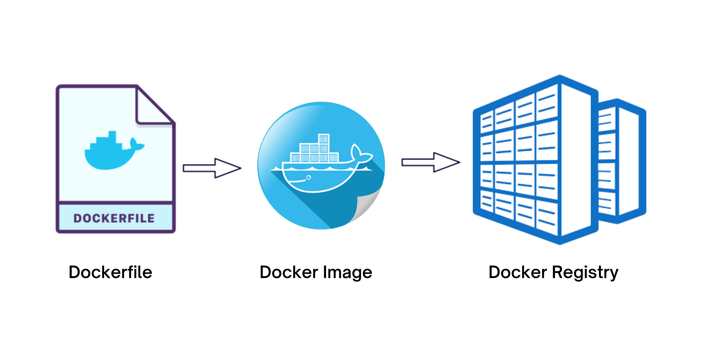
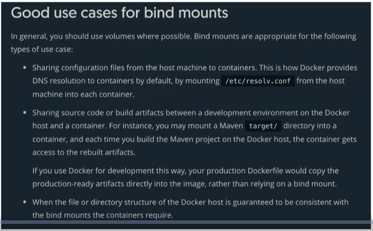
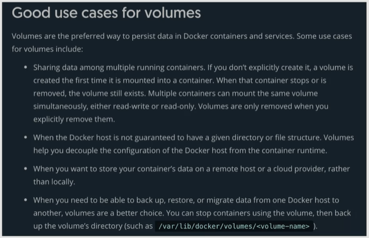

# All Things Docker and Kubernetes #

This repository will contain my notes, drafts, and projects on containerization and orchestration.

It's still at an early stage, but building (and breaking) and deploying containerized workloads are one of the targets I have on my list for ~~2021~~ the present.

Ayt, going full steam ahead!

<p align=center>
    
</p>


## Pre-requisites

It's important to note that you can't run Linux containers without a Linux kernel. This means you still need a runtime interpreter to emulate the Linux kernel system calls.

<details><summary> Install Docker </summary>
 
### Install Docker

With the introduction of Hyper-V, this gave way for **Docker Desktop for Windows** which under the hood, uses WSL2's to launch a VM as the host Linux operating system.

**NOTE:** Running containers on Windows machines is suited for local development purposes only and is NOT RECOMMENDED FOR PRODUCTION USE.

<details><summary> Install Docker on WSL2 without Docker Desktop </summary>

#### Install Docker on WSL2 without Docker Desktop 

Note on [Docker Desktop's changing to paid subscription](https://www.docker.com/legal/docker-subscription-service-agreement/):

> After January 31, 2022, Docker Desktop will require a paid subscription.
> Commercial use of Docker Desktop in larger enterprises requires a Docker Pro, Team or Business subscription for as little as 5 USD per user per month.
> The existing Docker Free subscription has been renamed Docker Personal. Docker Desktop remains free for personal use, education, non-commercial open source projects, and small businesses (fewer than 250 employees AND less than 10M USD in annual revenue).

 
A quick Google search shows how to [install Docker in WSL2 without Docker desktop:](https://dev.solita.fi/2021/12/21/docker-on-wsl2-without-docker-desktop.html)

Remove old Docker installations.

```bash
$ sudo apt remove docker \
docker-engine \
docker.io \
containerd runc 
```

Install some pre-requisites.

```bash
$ sudo apt update 
$ sudo apt install -y --no-install-recommends \
apt-transport-https ca-certificates curl gnupg2
```

Configure package repository

```bash
$ source /etc/os-release 
$ curl -fsSL https://download.docker.com/linux/${ID}/gpg | sudo apt-key add -
$ echo "deb [arch=amd64] https://download.docker.com/linux/${ID} ${VERSION_CODENAME} stable" | sudo tee /etc/apt/sources.list.d/docker.list
$ sudo apt update
```

Install Docker.

```bash
$ sudo apt install -y docker-ce docker-ce-cli containerd.io
```

Add user to group

```bash
$ sudo usermod -aG docker $USER 
```

Configure dockerd

```bash
$ DOCKER_DIR=/mnt/wsl/shared-docker
$ mkdir -pm o=,ug=rwx "$DOCKER_DIR"
$ sudo chgrp docker "$DOCKER_DIR"
$ sudo mkdir /etc/docker
$ sudo vi /etc/docker/daemon.json 

    {
    "hosts": ["unix:///mnt/wsl/shared-docker/docker.sock"]
    }
```

Test if it works. Run the command below. It should return "API listen on.." message.

```bash
$ sudo dockerd 

API listen on /mnt/wsl/shared-docker/docker.sock
```

Do another test. Open another terminal and run the command below.

```bash
$ docker -H unix:///mnt/wsl/shared-docker/docker.sock run --rm hello-world
```

It should return this output.

<details><summary> run hello-world </summary>
 
```bash
Hello from Docker!
This message shows that your installation appears to be working correctly.

To generate this message, Docker took the following steps:
 1. The Docker client contacted the Docker daemon.
 2. The Docker daemon pulled the "hello-world" image from the Docker Hub.
    (amd64)
 3. The Docker daemon created a new container from that image which runs the
    executable that produces the output you are currently reading.
 4. The Docker daemon streamed that output to the Docker client, which sent it
    to your terminal.

To try something more ambitious, you can run an Ubuntu container with:
 $ docker run -it ubuntu bash

Share images, automate workflows, and more with a free Docker ID:
 https://hub.docker.com/

For more examples and ideas, visit:
 https://docs.docker.com/get-started/
```
 
</details>
</br>

The next step is to create a launch script for dockerd. You can do this in two ways:

<details><summary> Manual </summary>

Add the following to .bashrc or .profile 

```bash
$ cat >> ~/.bashrc

DOCKER_SOCK="/mnt/wsl/shared-docker/docker.sock"
test -S "$DOCKER_SOCK" && export DOCKER_HOST="unix://$DOCKER_SOCK"
```
 
</details>

<details><summary> Automatic </summary>

Add the following to .bashrc or .profile 
```bash
$ cat >> ~/.bashrc

DOCKER_DISTRO=$(cat /etc/os-release | grep PRETTY_NAME | cut -c14- | cut -d ' ' -f1,2)
DOCKER_DIR=/mnt/wsl/shared-docker
DOCKER_SOCK="$DOCKER_DIR/docker.sock"
export DOCKER_HOST="unix://$DOCKER_SOCK"

if [ ! -S "$DOCKER_SOCK" ]; then
   mkdir -pm o=,ug=rwx "$DOCKER_DIR"
   sudo chgrp docker "$DOCKER_DIR"
   /mnt/c/Windows/System32/wsl.exe -d $DOCKER_DISTRO sh -c "nohup sudo -b dockerd < /dev/null > $DOCKER_DIR/dockerd.log 2>&1"
fi
```
 
</details>


</details>


<details><summary> Install on RHEL/CentOS </summary>
 
#### Install on RHEL/CentOS

These steps are the ones I followed to install docker on RHEL 8/CentOS in an Amazon EC2 instance. Detailed steps can be found on [Docker's official documentation](https://docs.docker.com/engine/install/centos/).

Check version.

```bash
ll /etc/*release
cat /etc/*release
```

Update base image

```bash
sudo yum -y update
```

Uninstall older versions of docker - if one exists

```bash
sudo yum remove -y docker \
docker-client \
docker-client-latest \
docker-common \
docker-latest \
docker-latest-logrotate \
docker-logrotate \
docker-engine
```

To install Docker, you can do it in two ways:

<details><summary> Install from a package </summary>

Install from a package - Setup repository and install from there.

Choose your OS version in https://download.docker.com/linux/centos/, head to **x86_64/stable/Packages/**, and download the **.rpm** file.

Go to the directory where the rpm file is downloaded and do the installation.

```bash
$ cd <path-to>/package.rpm
$ sudo yum install -y package.rpm
```

Start docker and verify version.

```bash
$ sudo systemctl start docker 
$ docker version 
```

Run a simple "hello-world" container.

```bash
$ sudo docker run hello-world 
```
 
</details>

<details><summary> Install from a script </summary>

Install from a script - Use the convenience scripts
This method is NOT RECOMMENDED for production environments

Do a preview first of the changes before actually applying them.

```bash
$ curl -fsSL https://get.docker.com -o get-docker.sh
$ DRY_RUN=1 sh ./get-docker.sh 
```

Download the script and install the latest release.

```bash
$ curl -fsSL https://get.docker.com -o get-docker.sh
$ sudo sh get-docker.sh 
```

Start docker and verify version.

```bash
$ sudo systemctl start docker 
$ docker version 
```

Run a simple "hello-world" container.

```bash
$ sudo docker run hello-world 
```

</details>
</details>

<details><summary> Install on Ubuntu </summary>

#### Install on Ubuntu

This is a summary of the command that you can run to install docker on Ubuntu.

```bash
$ curl -fsSL https://download.docker.com/linux/ubuntu/gpg | sudo apt-key add - &&
$ sudo add-apt-repository "deb [arch=amd64] https://download.docker.com/linux/ubuntu $(lsb_release -cs) stable" &&
$ sudo apt-get update -y 
$ sudo sudo apt-get install docker-ce docker-ce-cli containerd.io -y 
$ sudo usermod -aG docker ubuntu 
```
  
</details>

<details><summary> Install on Ubuntu using Terraform </summary>

#### Install on Ubuntu using Terraform

Whether you've dabbled around in Terraform or not, this is the fastest way to provision a resource in AWS with Docker installed. This will provision the following:

- a VPC
- an EC2 instance with Docker installed

For more details, check this [repository](https://github.com/joseeden/101-Terraform-Projects/tree/master/lab12_Docker_Kubernetes_Env).

</details>

</details>

<details><summary> Error: Cannot connect to the Docker daemon </summary>

### Error: Cannot connect to the Docker daemon

In case you encounter this message when you test Docker for the first time:

```bash
docker: Cannot connect to the Docker daemon at unix:///var/run/docker.sock. Is the docker daemon running?
```

To resolve this, start the docker service and docker daemon.
```bash
sudo systemctl start docker
sudo systemctl enable docker
sudo systemctl status docker
```
```bash
sudo dockerd
```

You can checkout this [Stackoverflow discussion](https://stackoverflow.com/questions/44678725/cannot-connect-to-the-docker-daemon-at-unix-var-run-docker-sock-is-the-docker) to know more.

</details>


<details><summary> Install Go (optional) </summary>

### Install Go (optional)

This is not required for running containers but we will be using custom binary written in Go in some of the labs.
Doing a quick Google search, we find a link on [how to install Go (golang) on Ubunt](https://www.cyberciti.biz/faq/how-to-install-gol-ang-on-ubuntu-linux/)u:

#### Method 1: Using Snap 

```bash
$ sudo snap install go --classic 
```
You should see the following output returned.
```bash
go 1.18.3 from Michael Hudson-Doyle (mwhudson) installed 
```

#### Method 2: Using apt-get/apt

```bash
$ sudo apt update
$ sudo apt upgrade 
```
```bash
$ sudo apt search golang-go
$ sudo apt search gccgo-go 
```
```bash
$ sudo apt install golang-go 
```

Verify.
```bash
$ go version
go version go1.18.3 linux/amd64 
```

#### Test

Create a simple **hello-world.go** program.

```go
// Hello Word in Go by Vivek Gite
package main
 
// Import OS and fmt packages
import ( 
	"fmt" 
	"os" 
)
 
// Let us start
func main() {
    fmt.Println("Hello, world!")  // Print simple text on screen
    fmt.Println(os.Getenv("USER"), ", Let's be friends!") // Read Linux $USER environment variable 
} 
```

Compile and run.
```bash
$ go run hello-world.go 

Hello, world!
ubuntu , Let's be friends!
```

Build/compile packages and dependencies:
```bash
$ go build hello-world.go
```
```bash
$ ls -l hello*

-rwxrwxr-x 1 ubuntu ubuntu 1766381 Jun 23 08:05 hello-world
-rw-rw-r-- 1 ubuntu ubuntu     305 Jun 23 08:04 hello-world.go
```
```bash
$ ./hello-world

Hello, world!
ubuntu , Let's be friends!
```

</details>

## Docker Basics

Whether you're entirely new to the world of containers or you just simply want to do a quick refresher, feel free to select the topic you're interested in and browse through the bite-sized information.

<details><summary> From VMs to Containers </summary>

### From VMs to Containers

The traditional way fo deploying applications was through *virtual machines or VMs*. The application would use the OS file system, the OS's resources and default packages installed. 

Virtual machines have been extremely efficient in maximizing the use of infrastructure. Instead of running one application on one physical machine, we could run multiple VMs on top of the *hypervisor* which sits on the physical machine.


While it has proved to be useful, it still has its own disadvantages:
- Each virtual machine would require its own operating system. - If you have three VMs sitting on the hypervisor, this would mean there's also three operating system running on top of the hypervisor
- The OS plus the required libraries of each VM takes up a chunk of space on the underlying machine


**Enter containers.** To further optimize the usage of the server, container can be used to *virtualized the operating system.* Through containers, we won't need to run replicated OS. Regardless of how many containers we run on the machine, they will all use the same underlying operating system of the physical machine itself.

To facilitate the creation and management of the containers, we can use a container engine tool, such as **Docker.** 

Overall, the benefits of containers are:
- lightweight in nature
- provides better use of the resources
- develop applications that run consistently across platforms
- can be managed to scale well

</details>

<details><summary> What is Docker? </summary>

### What is Docker?

Docker is a container platform that allows you to separate your application from the underlying infrastructure by bundling the code and all of its dependencies into a self-contained entity that will run the same on any supported system.


Once you have implemented the software, the next phase would be to release it. The steps would primarily be:
- package the source code, config files, and dependencies in a container
- deploy it using a container manage

</details>

<details><summary> The Docker Architecture </summary>

### The Docker Architecture 

  

Docker uses a **client-server** architecture, where:

- the docker daemon serves as the "server" part, and
- the docker binary serves as the docker client

  

<!--    -->

#### Docker daemon

The docker daemon handles the docker objects, which includes the docker images, containers, and networking. It exposes a REST API that the client consumes over Unix socket or a network interface.

#### Docker Binary

The docker binaries are basically the docker commands. This means when you're using issuing the docker commands, you're using the client. It's basically the primary way to interact with the Docker daemon.

</details>

<details><summary> Linux Kernel Features </summary>

### Linux Kernel Features

In addition to the two core components of the Docker architecture, it also uses the following features:

- Namespaces
- Control Groups (Cgroups)
- UnionFS

  

#### Namespaces

Namespaces allow for a high-level process isolation of a system's resources

##### PID namespace

Handles process isolation (PID: Process ID). This means that each namespace has its own process ID.

##### Net namespace

Isolates the network stack and manages the network interfaces. Each namespace has its own private set of IP addresses, firewall, routing tables, etc.

##### IPC namespace 

Allows processes to be isolated from SysV interprocess communication.

##### MNT namespace

Manages the filesystem mountpoints.

##### UTS namespaces

UTS or Unix Timesharing System isolates the hostname, kernel, and version identifiers.

#### Control Groups

This is used by Docker to limit resource allocation. This ensures that a process doesn't consume the entire resources of a system.

- **Resource limiting** - groups ca be set to not exceed a configured memory limit
- **Prioritization** - some groups may get a larger share of CPU utilization or disk I/O throughput
- **Accounting** - measures a group's resource usage
- **Control** - freezing groups of processes

#### UnionFS

The Union filesystem upkeeps the overall sizes of the containers. It starts with a base image and then merges in any changes.

- **Merging** - overlay filesystem branches to merge changes
- **Read/Write** - branches can be read-only(RO) or read-write(RW)

The way it works is:

- when you create a container for the first time, you have a starting image
- this image is a set of files that makes up the base image
- as you add and remove packages, these changes create different layers 
- each layer is a set of file changes
- these file changes are then merged by the UnionFS to the previous layer

</details>

<details><summary> How Docker runs on Windows </summary>

### How Docker runs on Windows

We've learned from the previous section that containers use Linux kernel features such as namespacing and control groups to manage resources being used by the container processes.

Note that these two are not included by default in all operating systems and are specific only to the Linux operating system.

**If these two doesn't exist in Windows, then how are we able to run containers there?**

When we installed Docker for Windows/Mac, we actually installed a Linux virtual machine that will run on our computer. The containers and processes will then be created inside the virtual machine.

  

</details>


<details><summary> Docker Objects </summary>

### Docker Objects



There three docker objects which you need to know here:
the 
- dockerfile
- docker image
- docker registry

</details>


<details><summary> Dockerfile </summary>

### Dockerfile

Before we "bake" the image, we first need to understand how the application is built. We could start by listing down how we might deploy an application manually.

As an example, if we are to deploy a web application, this would be the steps we'll follow:

```bash
1.  Start with OS - CentOS
2.  Update repo
3.  Install dependencies
4.  Install python dependencies
5.  Copy source code to /opt folder
6.  Run the web server using the flask command
```

Once we have the steps laid down, we can begin containerizing our application:

```bash
1.  Create a DOCKERFILE
2.  Build your image and specify the file as input, as well as the tag name
3.  Push it to the dockerhub repository to make it publicly available 
```

To create a dockerfile, here's a basic flow we can follow:

  

#### So What the Heck is a Dockerfile?

This is a set of step-by-step instructions on how to create the image:
- how to package the code and its dependencies
- each operation represents a layer and is cached
- when dockerfile is modified, onlychanged layers will be built

The full list of instructions can be found in the official [Docker website](https://docs.docker.com/engine/reference/builder/). Here are some of the widely used instructions:
- **FROM** - sets the base image
- **RUN** - executes a command
- **COPY** and **ADD** - copy files from host to container
- **CMD** - default command to execute when container starts
- **EXPOSE** - exposes a port

Below is an example of a Dockerfile that targets to package a Python hello-world application:

<details><summary> dockerfile </summary>
 
```bash
# set the base image. A Python base image is used
FROM python:3.8

# set a key-value label for the Docker image
LABEL maintainer="Eden Jose"

# All the files in the current directory is copied
# to the  `/app` directory in the container
COPY . /app

#  defines the working directory within the container
WORKDIR /app

# run commands within the container. 
# Here we install dependencies defined in the requirements.txt file. 
RUN pip install -r requirements.txt

# provide a command to run on container start. 
# For example, start the `app.py` application.
CMD [ "python", "app.py" ]
```
 
</details>


</details>

<details><summary> Docker image </summary>

### Docker Image

After we've created the dockerfile, we can now create the docker image. 
- read-only template
- creates a runnable instance of the application
- used to run the container

A Docker image can be built from an existing Dockerfile using the docker build command. Below is the syntax for this command:

```docker
$ docker build [OPTIONS] PATH
```

To find all valid options for the <code>build</code> command:
```docker
$ docker build --help
```

For example, to build the image of a Python "Hello-world " application from the Dockerfile in the current directory, the following command can be used:

```docker
$ docker build -t python-helloworld .
```

Additionally, you can build the same app that's located on a different directory, say a <code>lesson1/python-app</code> directory

```docker
$ docker build -t python-helloworld /another/directory/python-app
```

To list all available imageS
```DOCKER
$ docker images
```

You can read more about the docker basic commands in the succeeding sections.

</details>


<details><summary> Docker registry </summary>

### Docker Registry

Once you've package the application, tested it locally, and proved that it's meeting the expected behavior, You are now ready to store and distribute it.

To do this, you can push the image to a public Docker image registry, such as
- DockerHub
- Harbor
- Amazon ECR (Elastic Container Registry)
- Google Container Registry

You can also store the image to a private registries and make it available to authorized parties. 

</details>

<details><summary> Tagging the Image </summary>

### Tagging the Image

**Tags for versioning.** Tagging allows you to provide or label specific versions of an image. This is especially useful when you deploy a specific version and if something goes wrong, you can easily roll back to previous version.

**Tags as aliases.** These are simple aliases which can be given to a docker image before or after building an image. If you don't provide a tag, docker automatically gives the image a "latest" tag.

**Tasgs must be an ASCII character string**. It may also include lowercase and uppercase letters, digits, underscores, periods, and dashes. In addition, the tag names must not begin with a period or a dash, and they can only contain 128 characters.

**Images can also have more than one tag.** Docker images can have multiple tags assigned to them. It may appear as different images when you run the <code>docker images</code> command but notice that they all point to the same image ID.

**Tag before pushing the image to a container registry.** It is highly recommended to tag the image first before pushing an image to a Docker registry. Without the tagging, the image would be allocated with a random ID during the build stage.

</details>

<details><summary> Pushing/Pulling an Image to/from a Container Registry </summary>

### Pushing/Pulling an Image to/from a Container Registry

An example of a container registry is Dockerhub. Start with logging-in to Dockerhub in your terminal.

```bash
$ docker login
```

Assuming the image is tagged, the final step is to push the image to a registry. 

```bash
$ docker push NAME[:TAG]
```

For example, to push the sample Python hello-world application tagged with v1 to 'my-repo' repository in DockerHub
```bash
$ docker push my-repo/python-helloworld:v1.0.0
```

To pull an image from DockerHub,
```bash
$ docker pull NAME[:TAG]
```

</details>


<details><summary> Docker Commands </summary>

### Docker commands

This will create the container but will not start it yet.

```bash
$ docker create <image-id> 
```

This starts the container.

```bash
$ docker start <container-id> 
```

This will run an image from a container.

```bash
$ docker run <image-d>
```

  

In the example below, an NGINX container will be ran. Docker will look in the host for the image, and if not found, will check dockerhub na dpull image down.

Note that this is only done first time. For subsequest executions, the same image pulled down will be re-used.
docker run nginx

```bash
$ sudo docker run nginx 
```

To find all valid options for this command
```docker
$ docker run --help
```

Run the next command to list all running containers. Each container will get a random 'container name' assigned to it. This is found in the last column of the output.

```bash
$ docker ps
```

To list all running AND not running containers, run the command below. This also shows the state, 
- if not running - "Exited"
- if running - "Up"

```bash
$ docker ps -a
```

You can set your own contianer-name by using the "--name" flag.

```bash
$ sudo docker run --name Thanos_of_2019 docker/whalesay cowsay Im-Inevitable! 
```

You can also specify the version of image to run in case you have multiple versions of an image by specifying "image:version". This is called a **TAG**.

In this example, we'll pull down two versions of nginx.

```bash
$ sudo docker run nginx
$ sudo docker run nginx:1.14-alpine
```

To run a container from the 1.14-alpine image and set container-name to nginx-2

```bash
$ sudo docker run -d --name nginx-2 nginx:1.14-alpine  
```

To know all the available tags for an image, look for the image in dockerhub.com and you'll find all the supported tags there.

You can also run multiple isntances/containers from the same image

```bash
$ sudo docker run docker/whalesay cowsay Infinity-and-beyond!
$ sudo docker run docker/whalesay cowsay Hello-there!
$ sudo docker run docker/whalesay cowsay Cowabunga!
```

This will show three running containers when you list them.

<details><summary> sudo docker ps -a </summary>
 
```bash
$ sudo docker ps -a

CONTAINER ID   IMAGE             COMMAND                  CREATED          STATUS                      PORTS     NAMES
b4b832aecfb9   docker/whalesay   "cowsay Cowabunga!"      8 seconds ago    Exited (0) 7 seconds ago              happy_gates
a870817d8e27   docker/whalesay   "cowsay Hello-there!"    2 minutes ago    Exited (0) 2 minutes ago              festive_elion
16e5d555d741   docker/whalesay   "cowsay Infinity-and…"   41 minutes ago   Exited (0) 41 minutes ago             friendly_feistel
```
</details>
</br>


This pulls the image down to our host but doesn't run a container.

```bash
$ sudo docker pull <image-name>
$ sudo docker pull nginx
```

This lists all images present in our host.

```bash 
$ docker images
```

This stops a running container. You can simply specify the "silly-name" which is the container name or just the first few digits of the container-id. If the first 2 or 3 digits of the container-id is unique, docker will immediately know which container you want to stop.

```bash
$ docker stop <container-name>
$ docker stop <container-id>
```

This removes the container permanently. You can list all containers afterwards to check.
```bash
$ docker rm <container-name>
```

To forcefully remove a running container,

```bash
$ docker rm -f <container-name> 
```

To remove all running containers,

```bash
$ docker rm -f $(docker container ls -aq) 
```

You can remove all stopped containers AT ONCE by running the _ps_ command and passing it to the _rm_ command. You'll be prompted with a [Y/N] for confirmation. Note that it'll return an error if there is a running container.

```bash
$ sudo docker rm $(sudo docker ps -a -q)
```

To remove all stopped containers without being prompted for confirmation,

```bash
$ docker container prune -f
```

To delete the stopped containers, unused images, and the build cache.

```bash
$ docker system prune 
```

This removes an image permanently. NOTE that no container must be running off of that image. Delete all dependent containers to delete an image.

```bash 
$ docker rmi <image-name>
```

To remove all images with no associated containers,

```bash
$ docker image prune -a -f 
```

It's important to remember that containers are not meant to run operating systems. Container are only meant to run a specific task or process.

Once task is complete, the container exits. The container runs as long as the process inside it is alive. When you run ubuntu, you're just running a base-image of an OS. There is no application/process running in it by default.

```bash 
$ sudo docker run ubuntu
```

You can instruct a process to run by appending the command. In this case, we're telling ubuntu to sleep for 60 seconds. This will appear as a running process for a minute when we run docker _ps_. After that, container will exit.

```bash
$ sudo docker run ubuntu <command>
$ sudo docker run ubuntu cat /etc/hosts
```

We can also execute a command on a running container

```bash
$ sudo docker exec <container-id> <command>
$ sudo docker exec <container-name> <command>
```

If container is running, we can use _exec_ to execute a command.

```bash
$ sudo docker ps
$ sudo docker exec <container-id> cat /etc/hosts
$ sudo docker exec <container-name> cat /etc/hosts
```

  

</details>

<details><summary> Attach Mode </summary>

### Attach Mode

You can run a container is an **ATTACH** mode - this means process will run in the foreground. You cannot do anything else while process is attached to the console until container exits The console won't response to any input, except if you stop it by running Ctrl-C

As an example, we can run a simple web-server that listens on port 8080.

```bash
$ sudo docker run kodekloud/simple-webapp
```

Check the running containers.

```bash 
$ sudo docker ps

CONTAINER ID   IMAGE                     COMMAND           CREATED          STATUS          PORTS      NAMES
734e84936864   kodekloud/simple-webapp   "python app.py"   30 seconds ago   Up 29 seconds   8080/tcp   relaxed_grothendieck
```

</details>

<details><summary> Detach Mode </summary>

### Detach Mode

You can run a container in the background mode by using the "-d" flag. By doing this, you can still work on the console while container runs in the background.

```bash
$ sudo docker run -d ubuntu sleep 60 
```

To attach to the running container in the background, you can run the **attach** command, followed by either the container ID or the container name.

```bash
$ sudo docker ps
$ sudo docker attach <container-id>
$ sudo docker attach <container-name>
```

You can also run and automatically log in to the container by using the "-it" flag.

```bash
sudo docker run -it -d --name nyancat2 06kellyjac/nyancat
```

</details>

<details><summary> Inputs </summary>

### Inputs

By default, a docker container doesn't listen to standard input. It runs in a non-interactive shell. You can map the standard input of your host to the docker container using the "-i" flag.

You can also map your terminal to the container's terminal by using the "-t" flag

    "-i"  - interactive
    "-t"  - terminal

As an example, we can use a simple image of an app that prompts the user for its name.

```bash
$ docker pull kodekloud/simple-prompt-docker
$ docker run -it kodekloud/simple-prompt-docker
```
</details>

<details><summary> Port Mapping </summary>

### Port Mapping

Recall that the underlying host (your machine) where docker is installed is called **DOCKER HOST** or **DOCKER ENGINE**.

If you want to access your app in the container through a web browser, we can use the container's IP, but note that this is an internal IP and is only accessible from the host itselF. This means that users outside the host cannot access this IP.

To get the IP address;

```bash
$ docker ps
$ docker inspect <container-id>
```

To access the ip from within the host, we can open the ip address in a browser in the host. we can also do a curl in the host's terminal. Note that 8080 is the default port of the container

```bash
$ curl <ip-of-vm>:8080
```

We can also use the IP of the docker host, but we need to map the port inside the container to the free port inside the docker host. We can use the "-p" flag to map the ports

As an example, we can use to map container port 5000 to host port 80.

```bash
$ docker run -d -p 80:8080 kodekloud/simple-webapp
```

To see the port mappings in your linux machine:

```bash 
$ netstat -tulpn
```
</details>

<details><summary> Data Persistence </summary>

### Data Persistence

A docker image has different layers, with the first layer as the base image that the image will use and the layers on top as packages being installed. 

The last layer is a writeable layer which applications will use. If a container is started without defining a specific storage option, any data written to the default storage by an application running in a container will be removed as soon as it is stopped.  

  

For this scenario, Docker provides three storage options.

  

#### Bind mounts 

Bind mounts work by mounting a directory (that's on the host) to the container. This is a good storage option since the data lives on a directory outside of the container. When the container is stopped or terminated, the data is perfectly safe andd intact in the directory residing on the host.

It is important to note that you will need the fully qualified path of the directory on the host to mount it inside the directory.

  

  

#### Volumes 

Another option is to use volumes which is similar to bindmounts but docker manages the storage on the host. This means you don't need to know the directory path on the host since this is being managed by Docker itself.

Volumes also allow you to use external storage mechanisms using different drivers, which means you are not limited to the local volume.

  

#### tmpfs (Temporary filesystem)

This is an in-memory filesystem, which is basically inside the container. This isn't persistent and data stored here are only accesible as long as the container is running.

  

</details>

<details><summary> Logs </summary>

### Logs

To see the logs, you can simply use the logs command

```bash
$ docker ps
$ docker logs <container-id>
```
</details>

<details><summary> Environment Variables </summary>

### Environment Variables
 
We can specify an environment variable that we can use in a given code. This is useful when we don't want to modify the code and instead use variables for any values that we need to change in the code

<!--    -->

There are different ways to define environment variables for a containers:

- Dockerfile
- Environment File
- Shell Environment Variables
- Compose File

To learn more about variables, you check these resources:

- [Substitute environment variables in Compose files](https://docs.docker.com/compose/environment-variables/)
- [Exploring Docker Compose Environment variable behaviour](https://www.profit4cloud.nl/blog/exploring-docker-compose-environment-variable-behaviour/#:~:text=Environment%20variables%20can%20be%20defined%20in%20the%20Dockerfile.,the%20resulting%20image%20and%20container.)

</details>

<details><summary> CMD and ENTRYPOINT </summary>

### CMD and ENTRYPOINT

Recall that containers are not meant to host operating systems. Thus when you launch a container of a Linux Image like Ubuntu, it's default command or CMD is bash. This can be seen from the dockerfile itself. 

However if it doesn't detect any terminal, it just stops the process which also stops the container.

If you want to define a command or instruction to run besides the bash when the container is ran, you can specify it in the dockerfile using the CMD keyword.

As an example, we can set the container to sleep for 60 seconds when it is ran by:

```bash 
docker run ubuntu sleep 60
```

An easier way to do this is by including the command itself when creating the **Dockerfile.**

```bash
$ cat > dockerfile 

FROM ubuntu
CMD sleep 60
```

There are ways to specify a command in the dockerfile

```bash 
CMD <command> <parameter1>
CMD ["<command>", "<parameter1>"]                   <<< JSON format
```

We can also use a parameter from the commandline itself. This can be done by using ENTRYPOINT in the **dockerfile**.

```bash 
FROM ubuntu
ENTRYPOINT ["sleep"]
```

Now when you run the container, you'll just have to define the parameter.

```bash
$ docker run ubuntu-sleeper 60
```

Note that you'll get an error when you don't append a parameter in the _docker run_ command because the ENTRYPOINT is expecting a parameter.

To include a default value in case user doesn't provide a parameter along with the _docker run_ command, you can use CMD and ENTRYPOINT together

```bash
FROM ubuntu
ENTRYPOINT ["sleep"]
CMD ["60"]
```

You can also override the entrypoint during runtime by using the "--entrypoint" flag

```bash
docker run --entrypoint sleep2.0 ubuntu-sleeper 60
```
</details>

<details><summary> Docker Compose </summary>

### Docker Compose 

Instead of running multiple RUN commands of different images, we could use **docker compose**. In this example, we'll use a sample voting app with result app architecture.

**First method - multiple RUN**

```bash 
docker run voting=app
docker run redis
docker run worker
docker run db
docker run result-app
```

**Second method - using DOCKER COMPOSE**

```bash 
# docker-compose.yml
services:
    web:
        image: "voting-app"
    cache:
        image: "db"
    messaging:
        image: "worker"
    db:
        image: "db"
    result:
        image: "result-app"
```

As we can see, the second method is much cleaner and is a more precise way to run containers. To run the entire stack defined in the docker-compose.yml,

```bash
$ docker-compose up 
```

**NOTE: This is only applicable if you're running multiple containers in a SINGLE DOCKER HOST.

We can add more details in the docker-compose.yml file.

<details><summary> docker-compose.yml </summary>
 
```bash
services:
  redis:
      image: "redis"
  db:
      image: postgres:9.4
  vote:
      # here we're telling it to build the image from the ./vote directory
      build: ./vote
      ports:
          - 5000:80
      # we're linkedin the voting-app container to the redis container
      # note that links may be deprecated now.
      links:
          - redis
  result:
      build: ./result
      ports:
          - 5001:80
      links:
          - db
  worker:
      image: worker
      links:
          - db
          - redis
```

Check out the labs in this repository to learn more about docker compose.
 
</details>

</details>


<details><summary> Three versions of docker-compose file </summary>

### Docker Compose versions

There are three versions of a docker-compose file. For v2 and v3, you must specify the VERSION.

**VERSION 1**
All containers are attached to the default bridge network and then use LINKS to enable communication between the containers.

```bash
redis:
    image: redis
db:
    image: postgres:9.4
vote:
    image: voting-app
    ports:
        - 5000:80
    links:
        - redis
```
<br>

**VERSION 2**
A dedicated network is automatically created for the application and then attaches all containers to that new network. We can also introduce a "DEPENDENCY" feature where a container can only be started based on a condition

```bash 
version: 2
services:
    redis:
        image: redis
    db:
        image: postgres:9.4
    vote:
        image: voting-app
        ports:
            - 5000:80
        # voting-app is created only when the redis container is started
        depends_on:
            - redis
```
<br>

**VERSION 3**
Almost similar with v2, but this one supports DOCKER SWARM.

```bash 
version: 3
services:
    redis:
        image: redis
    db:
        image: postgres:9.4
    vote:
        image: voting-app
        ports:
            - 5000:80
```

</details>

## Cloud-Native

Another technology that comes to mind when you talk about containers is the concept of cloud-native applications. 

<details><summary> What the heck is Cloud Native? </summary>
 
### So what the heck is Cloud Native?

As defined by [Cloud Native Computing Foundation (CNCF)](https://www.cncf.io/about/charter/) 

> *Cloud native technologies empower organizations to build and run scalable applications in modern, dynamic environments such as public, private, and hybrid clouds. Containers, service meshes, microservices, immutable infrastructure, and declarative APIs exemplify this approach.*
>
> *These techniques enable loosely coupled systems that are resilient, manageable, and observable. Combined with robust automation, they allow engineers to make high-impact changes frequently and predictably with minimal toil.*

In its simplest terms, Cloud native refers to building and managing applications at scale using either private, public, or hybrid cloud platforms.

</details>

<details><summary> Containers and being Cloud Native </summary>

### Containers and being Cloud Native

There are three key things to know here. The first two are **speed** and **agility** - how quickly anorganization can response and adapt to change. 

The third key thing: **containers**.


To recall, containers are simply **processes** but are treated as the smallest unit of an application. They are closely associated with cloud native applications as containers are a great way to deploy applications quickly and resiliently given their lightweight feature.

Now, when you hear containers, it is also often followed by another buzzword: **microservices**.


This will have its own section but for now, just know that microservices are simply a collection of small, independent, and containerized applications.

</details>

<details><summary> Cloud-Native Landscape </summary>

### Cloud-Native Landscape

With the advent of containers, the need for tools to manage and maintain them also arise. Some of the container orchestrator tools that are being used is the market are:

- Kubernetes,
- Apache Mesos, and 
- Docker Swarm 

Of the three, **Kubernetes** is currently the leading tool in deploying containerized workloads.
 


It was a project inside Google and was released in 2014 and is currently being maintained by **CNCF** or **Cloud Native Computing Foundation**, a vendor-agnostic organization that manages open-source projects. The main features of Kubernetes are the automation of:

- Configuration 
- Management
- Scalability

Over time, Kubernetes was developed to include more than just automation but also other functionalities:

- Runtime
- Networking
- Storage
- Service Mesh
- Logs and metrics
- Tracing

</details>

<details><summary> Business and Technical Considerations </summary>

### Business and Technical Considerations

Adoption cloud-native practices means consideration alot of factors, specifically business and technical keypoints, which would need to be assessed by all the stakeholders.

From a business perspective, the adoption of cloud-native tooling represents:

- **Agility** - perform strategic transformations
- **Growth** - quickly iterate on customer feedback
- **Service availability** - ensures the product is available to - customers 24/7

From a technical perspective, the adoption of cloud-native tooling represents:

- **Automation** - release a service without human intervention
- **Orchestration** - introduce a container orchestrator to manage  thousands of services with minimal effort
- **Observability** - ability to independently troubleshoot and debug each component

</details>

## Kubernetes

Adding this section soon!

<p align=center>
    
</p>

## Resources

Useful courses on Docker:

- [Docker in Production Using Amazon Web Services](https://www.pluralsight.com/courses/docker-production-using-amazon-web-services)
- [Building, Deploying, and Running Containers in Production](https://cloudacademy.com/learning-paths/building-deploying-and-running-containers-in-production-1-888/#)
- [Docker and Kubernetes: The Complete Guide](https://www.udemy.com/course/docker-and-kubernetes-the-complete-guide/)

Learn more about Dockerfile best practices:

- [Dockerfile reference](https://docs.docker.com/engine/reference/builder/#from)
- [Best practices for writing Dockerfiles](https://docs.docker.com/develop/develop-images/dockerfile_best-practices/)

Read about the available options when building the image and running containers:

- [Docker Build command](https://docs.docker.com/engine/reference/commandline/build/)
- [Docker Run command](https://docs.docker.com/engine/reference/commandline/run/)

Check out Docker registries, alternatives to package an application, and OCI standards:

- [Introduction to Docker registry](https://docs.docker.com/registry/introduction/)
- [Docker Tag command](https://docs.docker.com/engine/reference/commandline/tag/)
- [Docker Push command](https://docs.docker.com/engine/reference/commandline/push/)
- [Open Container Initiative (OCI) Specifications](https://www.docker.com/blog/demystifying-open-container-initiative-oci-specifications/)
- [Buildpacks: An App’s Brief Journey from Source to Image](https://buildpacks.io/docs/app-journey/)