# All Things Docker and Kubernetes #

This repository will contain my notes, drafts, and projects on containerization and orchestration.

It's still at an early stage, but building (and breaking) and deploying containerized workloads are one of the targets I have on my list for ~~2021~~ the present. Ayt, full steam ahead!

<!-- <p align=center>

</p> -->
<p align=center>

</p>

## How to Use this repo

Simply go to your favorite terminal and clone it. You can now browse the different labs and perform each one. You can also go through the **Docker** and **Kubernetes** topics below for a quick walkthrough.

```bash
git clone https://github.com/joseeden/All-Things-Docker-and-Kubernetes.git
```

## Pre-requisites

Here are some pre-requisites before we can perform the labs. 

### For the Docker labs:

<details><summary> Install Docker </summary>
 
#### Install Docker

With the introduction of Hyper-V, this gave way for **Docker Desktop for Windows** which under the hood, uses WSL2's to launch a VM as the host Linux operating system.

**NOTE:** Running containers on Windows machines is suited for local development purposes only and is NOT RECOMMENDED FOR PRODUCTION USE.

<details><summary> Install Docker on WSL2 without Docker Desktop </summary>

##### Install Docker on WSL2 without Docker Desktop 

Note on [Docker Desktop's changing to paid subscription](https://www.docker.com/legal/docker-subscription-service-agreement/):

> After January 31, 2022, Docker Desktop will require a paid subscription.
> Commercial use of Docker Desktop in larger enterprises requires a Docker Pro, Team or Business subscription for as little as 5 USD per user per month.
> The existing Docker Free subscription has been renamed Docker Personal. Docker Desktop remains free for personal use, education, non-commercial open source projects, and small businesses (fewer than 250 employees AND less than 10M USD in annual revenue).

 
A quick Google search shows how to [install Docker in WSL2 without Docker desktop:](https://dev.solita.fi/2021/12/21/docker-on-wsl2-without-docker-desktop.html)

Remove old Docker installations.

```bash
$ sudo apt remove docker \
docker-engine \
docker.io \
containerd runc 
```

Install some pre-requisites.

```bash
$ sudo apt update 
$ sudo apt install -y --no-install-recommends \
apt-transport-https ca-certificates curl gnupg2
```

Configure package repository

```bash
$ source /etc/os-release 
$ curl -fsSL https://download.docker.com/linux/${ID}/gpg | sudo apt-key add -
$ echo "deb [arch=amd64] https://download.docker.com/linux/${ID} ${VERSION_CODENAME} stable" | sudo tee /etc/apt/sources.list.d/docker.list
$ sudo apt update
```

Install Docker.

```bash
$ sudo apt install -y docker-ce docker-ce-cli containerd.io
```

Add user to group

```bash
$ sudo usermod -aG docker $USER 
```

Configure dockerd

```bash
$ DOCKER_DIR=/mnt/wsl/shared-docker
$ mkdir -pm o=,ug=rwx "$DOCKER_DIR"
$ sudo chgrp docker "$DOCKER_DIR"
$ sudo mkdir /etc/docker
$ sudo vi /etc/docker/daemon.json 

    {
    "hosts": ["unix:///mnt/wsl/shared-docker/docker.sock"]
    }
```

Test if it works. Run the command below. It should return "API listen on.." message.

```bash
$ sudo dockerd 

API listen on /mnt/wsl/shared-docker/docker.sock
```

Do another test. Open another terminal and run the command below.

```bash
$ docker -H unix:///mnt/wsl/shared-docker/docker.sock run --rm hello-world
```

It should return this output.

<details><summary> run hello-world </summary>
 
```bash
Hello from Docker!
This message shows that your installation appears to be working correctly.

To generate this message, Docker took the following steps:
 1. The Docker client contacted the Docker daemon.
 2. The Docker daemon pulled the "hello-world" image from the Docker Hub.
    (amd64)
 3. The Docker daemon created a new container from that image which runs the
    executable that produces the output you are currently reading.
 4. The Docker daemon streamed that output to the Docker client, which sent it
    to your terminal.

To try something more ambitious, you can run an Ubuntu container with:
 $ docker run -it ubuntu bash

Share images, automate workflows, and more with a free Docker ID:
 https://hub.docker.com/

For more examples and ideas, visit:
 https://docs.docker.com/get-started/
```
 
</details>
</br>

The next step is to create a launch script for dockerd. You can do this in two ways:

<details><summary> Manual </summary>

Add the following to .bashrc or .profile 

```bash
$ cat >> ~/.bashrc

DOCKER_SOCK="/mnt/wsl/shared-docker/docker.sock"
test -S "$DOCKER_SOCK" && export DOCKER_HOST="unix://$DOCKER_SOCK"
```
 
</details>

<details><summary> Automatic </summary>

Add the following to .bashrc or .profile 
```bash
$ cat >> ~/.bashrc

DOCKER_DISTRO=$(cat /etc/os-release | grep PRETTY_NAME | cut -c14- | cut -d ' ' -f1,2)
DOCKER_DIR=/mnt/wsl/shared-docker
DOCKER_SOCK="$DOCKER_DIR/docker.sock"
export DOCKER_HOST="unix://$DOCKER_SOCK"

if [ ! -S "$DOCKER_SOCK" ]; then
   mkdir -pm o=,ug=rwx "$DOCKER_DIR"
   sudo chgrp docker "$DOCKER_DIR"
   /mnt/c/Windows/System32/wsl.exe -d $DOCKER_DISTRO sh -c "nohup sudo -b dockerd < /dev/null > $DOCKER_DIR/dockerd.log 2>&1"
fi
```
 
</details>


</details>


<details><summary> Install on RHEL/CentOS </summary>
 
##### Install on RHEL/CentOS

These steps are the ones I followed to install docker on RHEL 8/CentOS in an Amazon EC2 instance. Detailed steps can be found on [Docker's official documentation](https://docs.docker.com/engine/install/centos/).

Check version.

```bash
ll /etc/*release
cat /etc/*release
```

Update base image

```bash
sudo yum -y update
```

Uninstall older versions of docker - if one exists

```bash
sudo yum remove -y docker \
docker-client \
docker-client-latest \
docker-common \
docker-latest \
docker-latest-logrotate \
docker-logrotate \
docker-engine
```

To install Docker, you can do it in two ways:

<details><summary> Install from a package </summary>

Install from a package - Setup repository and install from there.

Choose your OS version in https://download.docker.com/linux/centos/, head to **x86_64/stable/Packages/**, and download the **.rpm** file.

Go to the directory where the rpm file is downloaded and do the installation.

```bash
$ cd <path-to>/package.rpm
$ sudo yum install -y package.rpm
```

Start docker and verify version.

```bash
$ sudo systemctl start docker 
$ docker version 
```

Run a simple "hello-world" container.

```bash
$ sudo docker run hello-world 
```
 
</details>

<details><summary> Install from a script </summary>

Install from a script - Use the convenience scripts
This method is NOT RECOMMENDED for production environments

Do a preview first of the changes before actually applying them.

```bash
$ curl -fsSL https://get.docker.com -o get-docker.sh
$ DRY_RUN=1 sh ./get-docker.sh 
```

Download the script and install the latest release.

```bash
$ curl -fsSL https://get.docker.com -o get-docker.sh
$ sudo sh get-docker.sh 
```

Start docker and verify version.

```bash
$ sudo systemctl start docker 
$ docker version 
```

Run a simple "hello-world" container.

```bash
$ sudo docker run hello-world 
```

</details>
</details>

<details><summary> Install on Ubuntu </summary>

##### Install on Ubuntu

This is a summary of the commands that you can run to install docker on Ubuntu.

```bash
$ curl -fsSL https://download.docker.com/linux/ubuntu/gpg | sudo apt-key add - &&
$ sudo add-apt-repository "deb [arch=amd64] https://download.docker.com/linux/ubuntu $(lsb_release -cs) stable" &&
$ sudo apt-get update -y 
$ sudo sudo apt-get install docker-ce docker-ce-cli containerd.io -y 
$ sudo usermod -aG docker ubuntu 
```
  
</details>

<details><summary> Install on Ubuntu using Terraform </summary>

##### Install on Ubuntu using Terraform

Whether you've dabbled around in Terraform or not, this is the fastest way to provision a resource in AWS with Docker installed. This will provision the following:

- a VPC
- an EC2 instance with Docker installed

For more details, check this [repository](https://github.com/joseeden/All-Things-Terraform/tree/master/lab12_Docker_Kubernetes_Env).

</details>

</details>

<details><summary> Install Docker Compose</summary>
 
#### Install Docker Compose

If you're using Ubuntu, you can install docker-compose by simply running the two commands below:

```bash
$ sudo apt-get update 
$ sudo apt-get install -y docker-compose 
```

Read more about it in [Install Docker Compose CLI plugin page.](https://docs.docker.com/compose/install/compose-plugin/#installing-compose-on-linux-systems)

</details>

<details><summary> Error: Cannot connect to the Docker daemon </summary>

#### Error: Cannot connect to the Docker daemon

In case you encounter this message when you test Docker for the first time:

```bash
docker: Cannot connect to the Docker daemon at unix:///var/run/docker.sock. Is the docker daemon running?
```

To resolve this, start the docker service and docker daemon.
```bash
sudo systemctl start docker
sudo systemctl enable docker
sudo systemctl status docker
```
```bash
sudo dockerd
```

You can checkout this [Stackoverflow discussion](https://stackoverflow.com/questions/44678725/cannot-connect-to-the-docker-daemon-at-unix-var-run-docker-sock-is-the-docker) to know more.

</details>

### For the Kubernetes labs:

<details><summary> Install Kubernetes </summary>

#### Install Kubernetes

This section discuss how to install Kubernetes on virtual machines or bare metal servers.

##### Requirements 

**System Requirements**
- Linux OS
- 2 CPUs 
- 2 GB RAM 
- Disable Swap 

**Container Runtime** 
- Anything that's compatible with CRI (Container Runtime Interface)
- We can also use Docker 

**Networking**
- Connectivity between all nodes 

##### Installation

Required packages (will be installed on ALL nodes):

- kubelet
- kubeadm 
- kubectl 
- container runtime (docker)

Note that we have to do all these steps on ALL the nodes that will be part of the Kubernetes cluster.

Begin with installing the packages, which includes adding the signing key and the repository.

```bash
$ curl -s https://packages.cloud.google.com/apt/doc/apt-key.gpg | sudo apt-key add 
$ sudo bash -c 'cat <<EOF >/etc/apt/sources.list.d/kubernetes.list 
deb http://apt.kubernetes.io/ kubernetes-xenial main
EOF'
```

We can inspect the versions available in the repository using apt-cache.

```bash
$ sudo apt-get update
```
```bash
$ apt-cache policy kubelet | head -20
$ apt-cache policy docker.io | head -20
```

Install the Kubernetes tools.
```bash
$ sudo apt-get install -y kubeadm kubelet kubectl docker.io 
$ sudo apt-mark hold kubeadm kubelet kubectl docker.io
```

Disable the swap.

```bash
$ swapoff -a  
```

Check the status of the kubelet and docker. Notice that kubelet will show an "activating" status. This will stay in this status until a work is assigned to the kubelet.

```bash
$ sudo systemctl status kubelet 
$ sudo systemctl status docker 
```

</details>


<details><summary> Install CLI Tools </summary>

#### Install CLI Tools

Install the following tools by clicking the tool name. The link should bring you to the official installation pages. Note that only the kubectl is necessary for running Kubernetes locally but I recommend installing the other CLI tools too. 

- [aws cli v2](https://docs.aws.amazon.com/cli/latest/userguide/getting-started-install.html) - used by eksctl to grab authentication token
- [eksctl](https://docs.aws.amazon.com/eks/latest/userguide/eksctl.html) - setup and operation of EKS cluster 
- [kubectl](https://kubernetes.io/docs/tasks/tools/) - interaction with K8S API server

If you're using WSL on a Windows laptop, you may simply use the command below.

```bash
# aws cli
curl "https://awscli.amazonaws.com/awscli-exe-linux-x86_64.zip" -o "awscliv2.zip"
unzip awscliv2.zip
sudo ./aws/install
```
```bash
# eksctl
curl --silent --location "https://github.com/weaveworks/eksctl/releases/latest/download/eksctl_$(uname -s)_amd64.tar.gz" | tar xz -C /tmp
sudo mv /tmp/eksctl /usr/local/bin
```
```bash
# kubectl
sudo apt-get update
sudo apt-get install -y ca-certificates curl
sudo apt-get install -y apt-transport-https
sudo curl -fsSLo /usr/share/keyrings/kubernetes-archive-keyring.gpg https://packages.cloud.google.com/apt/doc/apt-key.gpg
echo "deb [signed-by=/usr/share/keyrings/kubernetes-archive-keyring.gpg] https://apt.kubernetes.io/ kubernetes-xenial main" | sudo tee /etc/apt/sources.list.d/kubernetes.list
sudo apt-get update
sudo apt-get install -y kubectl
```

To verify the AWS CLI version:

```bash
$ aws --version 
```

To verify the eksctl version:

```bash
$ eksctl version 
```

To verify the kubectl version:

```bash
$ kubectl version --output=json  
```


</details>


</details>

### Optional Tools:

Some of the labs in this repository uses the tools below. However, they are not necessary for running containers and Kubernetes.

<details><summary> Go </summary>

#### Install Go 

Doing a quick Google search, we find a link on [how to install Go (golang) on Ubunt](https://www.cyberciti.biz/faq/how-to-install-gol-ang-on-ubuntu-linux/)u:

##### Method 1: Using Snap 

```bash
$ sudo snap install go --classic 
```
You should see the following output returned.
```bash
go 1.18.3 from Michael Hudson-Doyle (mwhudson) installed 
```

##### Method 2: Using apt-get/apt

```bash
$ sudo apt update
$ sudo apt upgrade 
```
```bash
$ sudo apt search golang-go
$ sudo apt search gccgo-go 
```
```bash
$ sudo apt install golang-go 
```

Verify.
```bash
$ go version
go version go1.18.3 linux/amd64 
```

##### Test

Create a simple **hello-world.go** program.

```go
// Hello Word in Go by Vivek Gite
package main
 
// Import OS and fmt packages
import ( 
	"fmt" 
	"os" 
)
 
// Let us start
func main() {
    fmt.Println("Hello, world!")  // Print simple text on screen
    fmt.Println(os.Getenv("USER"), ", Let's be friends!") // Read Linux $USER environment variable 
} 
```

Compile and run.
```bash
$ go run hello-world.go 

Hello, world!
ubuntu , Let's be friends!
```

Build/compile packages and dependencies:
```bash
$ go build hello-world.go
```
```bash
$ ls -l hello*

-rwxrwxr-x 1 ubuntu ubuntu 1766381 Jun 23 08:05 hello-world
-rw-rw-r-- 1 ubuntu ubuntu     305 Jun 23 08:04 hello-world.go
```
```bash
$ ./hello-world

Hello, world!
ubuntu , Let's be friends!
```

</details>


<details><summary> Node and NPM  </summary>

#### Install Node and NPM 

Since we will use a custom binary that utilizes NPM and NodeJS in some of the labs, we will need to install this.

##### NodeJS

If you try to use *apt-package* manager to install the latest version of node, there's a chance that you'll download the latest version in the Ubuntu app storee and not the lastest release version of NodeJS.

This is mainly because the Ubuntu team may take a while to test new versions of the software and release them to the official Ubuntu store. 

To install the latest version in the Ubuntu app store but may not be the latest release version,

```bash
$ sudo apt install nodejs -y 
```

To install the lastest release version of NodeJS, do a quick google search for "latest stable release version of nodejs". Note which version is the current one.

<p align>
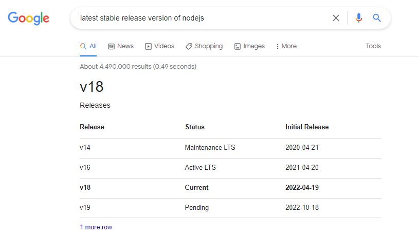
</p>

##### Use NVM to install NodeJS

Let's install **nvm** first. This will allow us to use different versions of node.

```bash
$ curl -o- https://raw.githubusercontent.com/nvm-sh/nvm/v0.35.3/install.sh | bash 
```

Restart your terminal and verify. You should have version **0.35.5** installed or higher.

```bash
$ nvm --version 
```

Install the NodeJS version that you recorded earlier. Note that if you need other versions, you can also install them using the same command.

```bash
$ nvm install <version> 
```

Verify the latest version installed.

```bash
$ node -v 
```

If you have multiple node versions in your machine, you can switch between them.

```bash
$ nvm use <version-number> 
```

##### Use Nodesource to install NodeJS

We can also use Nodesource to install the NodeJS package.

```bash
$ curl -sL https://deb.nodesource.com/setup_18.x | sudo -E bash - 
```

**Note:** v18 is the current "release" NodeJS version and will be promoted to Long-term Support (LTS) in October 2022.

NPM should also be automatically installed. You can verify the NPM version by running the command below. 

```bash
$ npm -v
```

If it is not installed, follow the next steps.

##### NPM

```bash
sudo apt install -y 
```

We may need to run the command below for certain npm packages to run.

```bash 
$ sudo apt install -y build-essential
```

You can read more about the installation process in this [freeCodeCamp article.](https://www.freecodecamp.org/news/how-to-install-node-js-on-ubuntu-and-update-npm-to-the-latest-version/)

</details>

<details><summary> Github Account </summary>

#### Create a Github Account 

Since we will be implementing CICD in some of the labs, we will need to set this up. Github is a free to use code repository.

To sign up for a Github account, click [here](https://github.com/signup).

</details>

<details><summary> AWS Account </summary>

#### Create an AWS Account 

We will be deploying our containerized applications to the cloud so I highly recommend that you sign-up for a **free tier** account in AWS.

Note that an AWS account is also need for the ECS and EKS labs in this repository.

To sign-up for an AWS Free tier account, click [here](https://aws.amazon.com/free/).

</details>

<details><summary> AWS CLI </summary>

#### AWS CLI

To install AWS CLI (along with other CLI tools), you can check out the [Install CLI Tools](#install-cli-tools) section.

If you've installed AWS CLI before then there is a chance that you're using the version 1. You can do either of the following:

- [Replace version 1 with version 2](https://docs.aws.amazon.com/cli/latest/userguide/cliv2-migration-instructions.html#cliv2-migration-instructions-migrate) 
- [Install both version side-by-side](https://docs.aws.amazon.com/cli/latest/userguide/cliv2-migration-instructions.html#cliv2-migration-instructions-migrate)

For this lab, I did a side-by-side install by retaining the V1 and creating an alias for it.

```bash
$ sudo su -
$ which aws 
$ cd /usr/bin && mkdir aws1 && mv aws aws1 
```

Then I [installed AWS CLI version 2](#install-cli-tools).

```bash
$ aws --version
aws-cli/2.7.22 Python/3.9.11 Linux/5.10.102.1-microsoft-standard-WSL2 exe/x86_64.ubuntu.20 prompt/off 
```

</details>

<details><summary> IAM User, Access Key, Credentials, and Policies </summary>

#### IAM User, Access Key, Credentials File, and Policies


**Create the IAM Policy**

Create the **EKSFullAccess** policy that allows us access to EKS and ECR.

1. Go to IAM console.
2. In the left panel, click Policies.
3. Click Create Policy.
4. Choose the JSON tab and paste the policy below.
5. Click Review Policy.
6. Give the policy the name and description.

    Name: EKSFullAccess
    Description: Allows access to EKS and ECR resources.

7. Finally, click Create Policy.


**Create the IAM User, Access Key, and Keypair**

Refer to the links below.

- [Create a "k8s-kp.pem" keypair](https://docs.aws.amazon.com/AWSEC2/latest/UserGuide/create-key-pairs.html)

- [Create a "k8s-user" user with admin access](https://www.techrepublic.com/article/how-to-create-an-administrator-iam-user-and-group-in-aws/)

- [Create an access key for "k8s-user"](https://docs.aws.amazon.com/IAM/latest/UserGuide/id_credentials_access-keys.html#Using_CreateAccessKey)

For the keypair, store it inside <code>~/.ssh</code> directory.


**Create the IAM Group**

Create the **EKS-lab** group.

1. Go to IAM console.
2. In the left panel, click User Groups.
3. Click Create group
4. Give it a user group name: EKS-lab
5. Scroll below to the Attach User section. Choose "k8s-user" and the current user you're signed in to.
6. Scroll below to the Attach permission policies.
7. Filter and add the following policy.

    - AmazonEC2FullAccess
    - AmazonS3FullAccess
    - AmazonVPCFullAccess
    - IAMReadOnlyAccess
    - AWSCloudFormationFullAccess
    - EKSFullAccess (recently created)
    - AmazonSNSReadOnlyAccess (for CloudFormation)

8. Finally, click Create group.


**Create the Service-linked Role**

Refer to the link below.

- [Create a service-linked role](https://us-east-1.console.aws.amazon.com/iamv2/home#/roles)


    Step | Choose this value | 
    ---------|----------|
    Trusted entity type | AWS service 
    Use case | KS (Allow EKS to manage clusters in your behalf) 
    Permission policies | AmazonEKSServiceRolePolicy


**Configure the Credentials File**

In your terminal, configure the <code>.aws/credentials</code> file that's automatically created in your home directory. 

```bash
# /home/user/.aws/credentials

[eksprofile]
aws_access_key_id = AKIAxxxxxxxxxxxxxxxxxxx
aws_secret_access_key = ABCDXXXXXXXXXXXXXXXXXXXXXXX
region = ap-southeast-1
output = json
``` 

Use this profile be setting the variable.

```bash
 
```


</details>


## Docker Basics

Whether you're entirely new to the world of containers or just simply wanting to do a quick refresher, feel free to select the topic you're interested in and browse through the bite-sized sections.

<details><summary> Read more.. </summary>

<details><summary> From VMs to Containers </summary>

### From VMs to Containers

The traditional way fo deploying applications was through *virtual machines or VMs*. The application would use the OS file system, the OS's resources and default packages installed. 

Virtual machines have been extremely efficient in maximizing the use of infrastructure. Instead of running one application on one physical machine, we could run multiple VMs on top of the *hypervisor* which sits on the physical machine.

<p align>
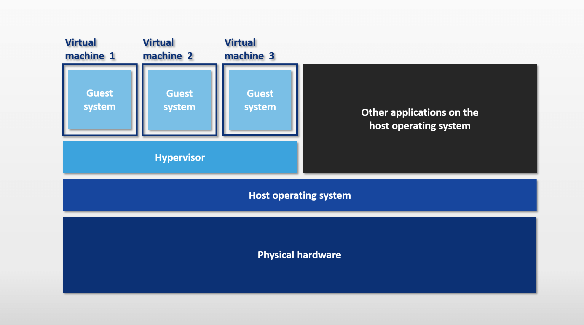
</p>

While it has proved to be useful, it still has its own disadvantages:
- Each virtual machine would require its own operating system. - If you have three VMs sitting on the hypervisor, this would mean there's also three operating system running on top of the hypervisor
- The OS plus the required libraries of each VM takes up a chunk of space on the underlying machine

<p align>
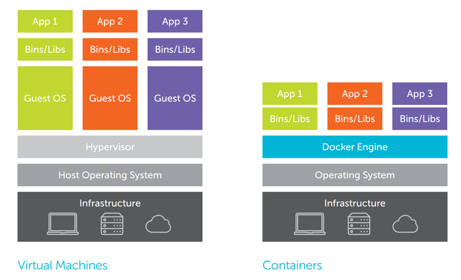
</p>

**Enter containers.** To further optimize the usage of the server, container can be used to *virtualized the operating system.* Through containers, we won't need to run replicated OS. Regardless of how many containers we run on the machine, they will all use the same underlying operating system of the physical machine itself.

To facilitate the creation and management of the containers, we can use a container engine tool, such as **Docker.** 

Overall, the benefits of containers are:
- lightweight in nature
- provides better use of the resources
- develop applications that run consistently across platforms
- can be managed to scale well

</details>

<details><summary> What is Docker? </summary>

### What is Docker?

Docker is a container platform that allows you to separate your application from the underlying infrastructure by bundling the code and all of its dependencies into a self-contained entity that will run the same on any supported system.

<p align>

</p>

Once you have implemented the software, the next phase would be to release it. The steps would primarily be:
- package the source code, config files, and dependencies in a container
- deploy it using a container manage

What are its benefits from a developer's standpoint?

- accelerate developer onboarding 
- eliminate app conflicts and run multiple versions
- environment consistency, solves the "but it works on my machine"  dilemma
- ships software faster 

</details>

<details><summary> The Docker Architecture </summary>

### The Docker Architecture 

<p align>
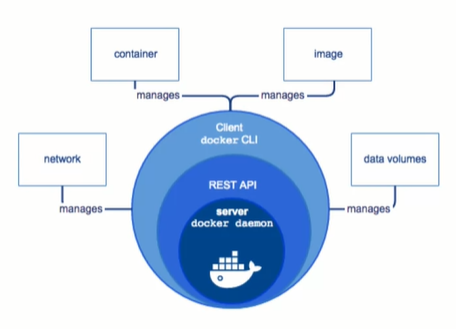
</p>

Docker uses a **client-server** architecture, where:

- the docker daemon serves as the "server" part, and
- the docker binary serves as the docker client

<p align>
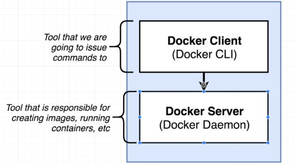
</p>

<p align=center>
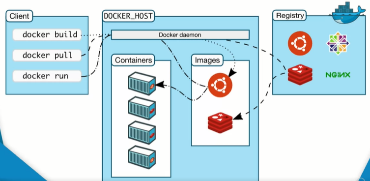
</p>

In addition to this, Docker leverages a container runtime which serves as engine behind the container solutions. It is also the the intermediate layer between the host and the containers.

#### Docker Daemon

The docker daemon handles the docker objects, which includes the docker images, containers, and networking. It exposes a REST API that the client consumes over Unix socket or a network interface. Major functions:
- Image management; building images
- Running APIs
- Networking
- Authentication 
- Security
- Orchestration


#### Docker Binary

The docker binaries are basically the docker commands. This means when you're using issuing the docker commands, you're using the client. It's basically the primary way to interact with the Docker daemon.

</details>

<details><summary> Container Engine  </summary>

#### Container Engine

Under the hood, the container engine takes a container image and turns it into a container. It typically containes a runtime, a CLI tool, and sometimes a daemon.

A more detailed flow is described below:

1. User types in commands, client receives this commands.
2. Commands are converted to REST API calls.
3. Daemon received the API calls.
4. Daemon runs containerd with the API parameters.
5. containerd forwards image to runc instance and starts containers.

</details>


<details><summary> Container Runtime </summary>

#### Container Runtime

The container runtime is a specific part of the container engine.

**runc**
This is the default implementataion defined by OCI runtime specs. It's responsible for:
- creating the containers
- wrapping for libcontainer

**containerd**
This is a code originally from the daemon but is removed.
- manages container operations (start, stop,pause, remove, etc.)
- works with runc and daemon

</details>


<details><summary> Linux Kernel Features </summary>

### Linux Kernel Features

In addition to the two core components of the Docker architecture, it also uses the following features:

- Namespaces
- Control Groups (Cgroups)
- UnionFS

<p align=center>

</p>

#### Namespaces

Namespaces allow for a high-level process isolation of a system's resources

##### PID namespace

Handles process isolation (PID: Process ID). This means that each namespace has its own process ID.

##### Net namespace

Isolates the network stack and manages the network interfaces. Each namespace has its own private set of IP addresses, firewall, routing tables, etc.

##### IPC namespace 

Allows processes to be isolated from SysV interprocess communication.

##### MNT namespace

Manages the filesystem mountpoints.

##### UTS namespaces

UTS or Unix Timesharing System isolates the hostname, kernel, and version identifiers.

#### Control Groups

This is used by Docker to limit resource allocation. This ensures that a process doesn't consume the entire resources of a system.

- **Resource limiting** - groups ca be set to not exceed a configured memory limit
- **Prioritization** - some groups may get a larger share of CPU utilization or disk I/O throughput
- **Accounting** - measures a group's resource usage
- **Control** - freezing groups of processes

#### UnionFS

The Union filesystem upkeeps the overall sizes of the containers. It starts with a base image and then merges in any changes.

- **Merging** - overlay filesystem branches to merge changes
- **Read/Write** - branches can be read-only(RO) or read-write(RW)

The way it works is:

- when you create a container for the first time, you have a starting image
- this image is a set of files that makes up the base image
- as you add and remove packages, these changes create different layers 
- each layer is a set of file changes
- these file changes are then merged by the UnionFS to the previous layer

</details>

<details><summary> How Docker runs on Windows </summary>

### How Docker runs on Windows

We've learned from the previous section that containers use Linux kernel features such as namespacing and control groups to manage resources being used by the container processes.

Note that these two are not included by default in all operating systems and are specific only to the Linux operating system.

**If these two doesn't exist in Windows, then how are we able to run containers there?**

When we installed Docker for Windows/Mac, we actually installed a Linux virtual machine that will run on our computer. The containers and processes will then be created inside the virtual machine.

<p align=center>
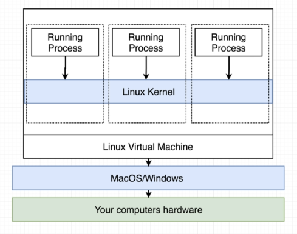
</p>

</details>


<details><summary> Docker Objects </summary>

### Docker Objects

<p align=center>
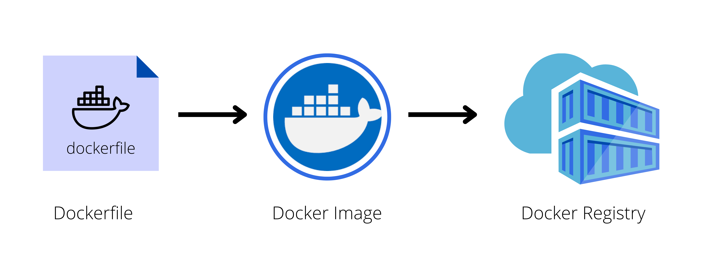
</p>

There three docker objects which you need to know are:
- dockerfile
- docker image
- docker registry

</details>


<details><summary> Dockerfile </summary>

### Dockerfile

Before we "bake" the image, we first need to understand how the application is built. We could start by listing down how we might deploy an application manually.

As an example, if we are to deploy a web application, this would be the steps we'll follow:

```bash
1.  Start with OS - CentOS
2.  Update repo
3.  Install dependencies
4.  Install python dependencies
5.  Copy source code to /opt folder
6.  Run the web server using the flask command
```

Once we have the steps laid down, we can begin containerizing our application:

```bash
1.  Create a DOCKERFILE
2.  Build your image and specify the file as input, as well as the tag name
3.  Push it to the dockerhub repository to make it publicly available 
```

To create a dockerfile, here's a basic flow we can follow:

<p align=center>
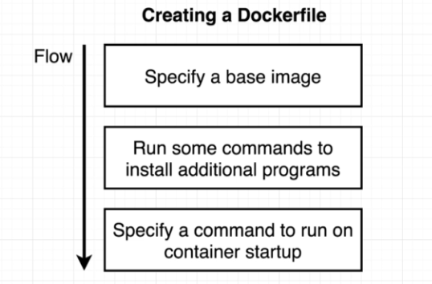
</p>

#### So What the Heck is a Dockerfile?

This is a set of step-by-step instructions on how to create the image:
- how to package the code and its dependencies
- each operation represents a layer and is cached
- when dockerfile is modified, onlychanged layers will be built

The full list of instructions can be found in the official [Docker website](https://docs.docker.com/engine/reference/builder/). Here are some of the widely used instructions:
- **FROM** - sets the base image
- **RUN** - executes a command
- **COPY** and **ADD** - copy files from host to container
- **CMD** - default command to execute when container starts
- **EXPOSE** - exposes a port

Below is an example of a Dockerfile that targets to package a Python hello-world application:

<details><summary> dockerfile </summary>
 
```bash
# set the base image. A Python base image is used
FROM python:3.8

# set a key-value label for the Docker image
LABEL maintainer="Eden Jose"

# All the files in the current directory is copied
# to the  `/app` directory in the container
COPY . /app

#  defines the working directory within the container
WORKDIR /app

# run commands within the container. 
# Here we install dependencies defined in the requirements.txt file. 
RUN pip install -r requirements.txt

# provide a command to run on container start. 
# For example, start the `app.py` application.
CMD [ "python", "app.py" ]
```
 
</details>


</details>

<details><summary> Docker image </summary>

### Docker Image

After we've created the dockerfile, we can now create the docker image. A docker image is
- read-only template
- made up of **overlay filesystem**
- also creates a runnable instance of the application
- used to run the container

#### Overlay Filesystem

A docker image has different layers, with the first layer as the base image that the image will use and the layers on top as packages being installed. 

The last layer is a writeable layer which applications will use. If a container is started without defining a specific storage option, any data written to the default storage by an application running in a container will be removed as soon as it is stopped.  

#### Building from the dockerfile

A Docker image can be built from an existing Dockerfile using the docker build command. Below is the syntax for this command:

```docker
$ docker build [OPTIONS] PATH
```

To find all valid options for the <code>build</code> command:
```docker
$ docker build --help
```

For example, to build the image of a Python "Hello-world " application from the Dockerfile in the current directory, the following command can be used:

```docker
$ docker build -t python-helloworld .
```

Additionally, you can build the same app that's located on a different directory, say a <code>lesson1/python-app</code> directory

```docker
$ docker build -t python-helloworld /another/directory/python-app
```

To list all available imageS
```DOCKER
$ docker images
```

You can read more about the docker basic commands in the succeeding sections.

</details>


<details><summary> Docker registry </summary>

### Docker Registry

Once you've package the application, tested it locally, and proved that it's meeting the expected behavior, You are now ready to store and distribute it.

To do this, you can push the image to a public Docker image registry, such as

- DockerHub
- Harbor
- Amazon ECR (Elastic Container Registry)
- Google Container Registry
- Quay(https://quay.io)

You can also store the image to a private registries and make it available to authorized parties. To be access the registry, you would need to be authenticated by setting up an account.

#### Authenticating to the Registry

You can login to Dockerhub in your terminal.
dockerhub. Note that you need to [set up an account.](https://hub.docker.com/signup).

```bash
$ docker login
```

Now that we've access our registry, we're now ready to push our images. However, it is best practice to tag all your images before sharing them.

</details>

<details><summary> Tagging the Image </summary>

### Tagging the Image

**Tags for versioning.** Tagging allows you to provide or label specific versions of an image. This is especially useful when you deploy a specific version and if something goes wrong, you can easily roll back to previous version.

**Tags as aliases.** These are simple aliases which can be given to a docker image before or after building an image. If you don't provide a tag, docker automatically gives the image a "latest" tag.

**Tasgs must be an ASCII character string**. It may also include lowercase and uppercase letters, digits, underscores, periods, and dashes. In addition, the tag names must not begin with a period or a dash, and they can only contain 128 characters.

**Images can also have more than one tag.** Docker images can have multiple tags assigned to them. It may appear as different images when you run the <code>docker images</code> command but notice that they all point to the same image ID.

**Tag before pushing the image to a container registry.** It is highly recommended to tag the image first before pushing an image to a Docker registry. Without the tagging, the image would be allocated with a random ID during the build stage.

</details>

<details><summary> Pushing/Pulling an Image to/from a Container Registry </summary>

### Pushing/Pulling an Image to/from a Container Registry

An example of a container registry is Dockerhub. Once you've [set up a Dockerhub account.](https://hub.docker.com/signup), you can now login through the terminal.

```bash
$ docker login
```

Assuming the image is tagged, the final step is to push the image to a registry. 

```bash
$ docker push NAME[:TAG]
```

For example, to push the sample Python hello-world application tagged with v1 to 'my-repo' repository in DockerHub
```bash
$ docker push my-repo/python-helloworld:v1.0.0
```

To pull an image from DockerHub,
```bash
$ docker pull NAME[:TAG]
```

</details>


<details><summary> Docker Commands </summary>

### Docker commands

This will create the container but will not start it yet.

```bash
$ docker create <image-id> 
```

This starts the container.

```bash
$ docker start <container-id> 
```

This will run an image from a container.

```bash
$ docker run <image-d>
```

<p align=center>
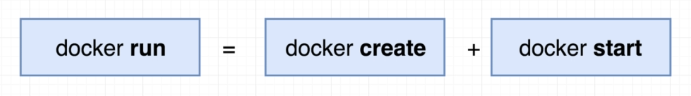
</p>

In the example below, an NGINX container will be ran. Docker will look in the host for the image, and if not found, will check dockerhub na dpull image down.

Note that this is only done first time. For subsequest executions, the same image pulled down will be re-used.
docker run nginx

```bash
$ sudo docker run nginx 
```

To find all valid options for this command
```docker
$ docker run --help
```

Run the next command to list all running containers. Each container will get a random 'container name' assigned to it. This is found in the last column of the output.

```bash
$ docker ps
```

To list all running AND not running containers, run the command below. This also shows the state, 
- if not running - "Exited"
- if running - "Up"

```bash
$ docker ps -a
```

You can set your own contianer-name by using the "--name" flag.

```bash
$ sudo docker run --name Thanos_of_2019 docker/whalesay cowsay Im-Inevitable! 
```

You can also specify the version of image to run in case you have multiple versions of an image by specifying "image:version". This is called a **TAG**.

In this example, we'll pull down two versions of nginx.

```bash
$ sudo docker run nginx
$ sudo docker run nginx:1.14-alpine
```

To run a container from the 1.14-alpine image and set container-name to nginx-2

```bash
$ sudo docker run -d --name nginx-2 nginx:1.14-alpine  
```

To know all the available tags for an image, look for the image in dockerhub.com and you'll find all the supported tags there.

You can also run multiple isntances/containers from the same image

```bash
$ sudo docker run docker/whalesay cowsay Infinity-and-beyond!
$ sudo docker run docker/whalesay cowsay Hello-there!
$ sudo docker run docker/whalesay cowsay Cowabunga!
```

This will show three running containers when you list them.

<details><summary> sudo docker ps -a </summary>
 
```bash
$ sudo docker ps -a

CONTAINER ID   IMAGE             COMMAND                  CREATED          STATUS                      PORTS     NAMES
b4b832aecfb9   docker/whalesay   "cowsay Cowabunga!"      8 seconds ago    Exited (0) 7 seconds ago              happy_gates
a870817d8e27   docker/whalesay   "cowsay Hello-there!"    2 minutes ago    Exited (0) 2 minutes ago              festive_elion
16e5d555d741   docker/whalesay   "cowsay Infinity-and…"   41 minutes ago   Exited (0) 41 minutes ago             friendly_feistel
```
</details>
</br>


This pulls the image down to our host but doesn't run a container.

```bash
$ sudo docker pull <image-name>
$ sudo docker pull nginx
```

This lists all images present in our host.

```bash 
$ docker images
```

This stops a running container. You can simply specify the "silly-name" which is the container name or just the first few digits of the container-id. If the first 2 or 3 digits of the container-id is unique, docker will immediately know which container you want to stop.

```bash
$ docker stop <container-name>
$ docker stop <container-id>
```

This removes the container permanently. You can list all containers afterwards to check.
```bash
$ docker rm <container-name>
```

To forcefully remove a running container,

```bash
$ docker rm -f <container-name> 
```

To remove all running containers,

```bash
$ docker rm -f $(docker container ls -aq) 
```

You can remove all stopped containers AT ONCE by running the _ps_ command and passing it to the _rm_ command. You'll be prompted with a [Y/N] for confirmation. Note that it'll return an error if there is a running container.

```bash
$ sudo docker rm $(sudo docker ps -a -q)
```

To remove all stopped containers without being prompted for confirmation,

```bash
$ docker container prune -f
```

To delete the stopped containers, unused images, and the build cache.

```bash
$ docker system prune 
```

This removes an image permanently. NOTE that no container must be running off of that image. Delete all dependent containers to delete an image.

```bash 
$ docker rmi <image-name>
```

To remove all images with no associated containers,

```bash
$ docker image prune -a -f 
```

It's important to remember that containers are not meant to run operating systems. Container are only meant to run a specific task or process.

Once task is complete, the container exits. The container runs as long as the process inside it is alive. When you run ubuntu, you're just running a base-image of an OS. There is no application/process running in it by default.

```bash 
$ sudo docker run ubuntu
```

You can instruct a process to run by appending the command. In this case, we're telling ubuntu to sleep for 60 seconds. This will appear as a running process for a minute when we run docker _ps_. After that, container will exit.

```bash
$ sudo docker run ubuntu <command>
$ sudo docker run ubuntu cat /etc/hosts
```

We can also execute a command on a running container

```bash
$ sudo docker exec <container-id> <command>
$ sudo docker exec <container-name> <command>
```

If container is running, we can use _exec_ to execute a command.

```bash
$ sudo docker ps
$ sudo docker exec <container-id> cat /etc/hosts
$ sudo docker exec <container-name> cat /etc/hosts
```

<p align=center>
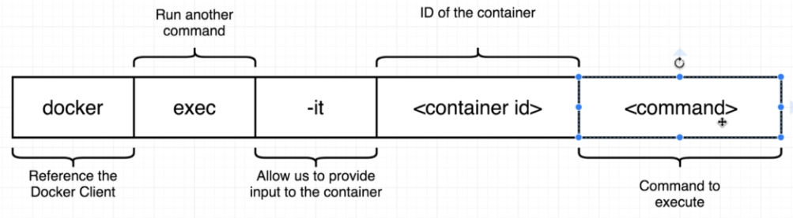
</p>

</details>

<details><summary> Attach and Detach Mode </summary>

### Attach and Detach Mode

You can run a container in an **ATTACH** mode - this means process will run in the foreground. You cannot do anything else while process is attached to the console until container exits The console won't response to any input, except if you stop it by running Ctrl-C

As an example, we can run a simple web-server that listens on port 8080.

```bash
$ sudo docker run kodekloud/simple-webapp
```

Check the running containers.

```bash 
$ sudo docker ps

CONTAINER ID   IMAGE                     COMMAND           CREATED          STATUS          PORTS      NAMES
734e84936864   kodekloud/simple-webapp   "python app.py"   30 seconds ago   Up 29 seconds   8080/tcp   relaxed_grothendieck
```

On the other hand, running containers in **DETACH** mode means the container is running in the background. This can be done by using the "-d" flag. 

```bash
$ sudo docker run -d ubuntu sleep 60 
```

To attach to the running container in the background, you can run the **attach** command, followed by either the container ID or the container name.

```bash
$ sudo docker ps
$ sudo docker attach <container-id>
$ sudo docker attach <container-name>
```

You can also run and automatically log in to the container by using the "-it" flag.

```bash
sudo docker run -it -d --name nyancat2 06kellyjac/nyancat
```

</details>

<details><summary> Inputs </summary>

### Inputs

By default, a docker container doesn't listen to standard input. It runs in a non-interactive shell. You can map the standard input of your host to the docker container using the "-i" flag.

You can also map your terminal to the container's terminal by using the "-t" flag

    "-i"  - interactive
    "-t"  - terminal

As an example, we can use a simple image of an app that prompts the user for its name.

```bash
$ docker pull kodekloud/simple-prompt-docker
$ docker run -it kodekloud/simple-prompt-docker
```
</details>

<details><summary> Port Mapping </summary>

### Port Mapping

Recall that the underlying host (your machine) where docker is installed is called **DOCKER HOST** or **DOCKER ENGINE**.

If you want to access your app in the container through a web browser, we can use the container's IP, but note that this is an internal IP and is only accessible from the host itselF. This means that users outside the host cannot access this IP.

To get the IP address;

```bash
$ docker ps
$ docker inspect <container-id>
```

To access the ip from within the host, we can open the ip address in a browser in the host. we can also do a curl in the host's terminal. Note that 8080 is the default port of the container

```bash
$ curl <ip-of-vm>:8080
```

We can also use the IP of the docker host, but we need to map the port inside the container to the free port inside the docker host. We can use the "-p" flag to map the ports

As an example, we can use to map container port 5000 to host port 80.

```bash
$ docker run -d -p 80:8080 kodekloud/simple-webapp
```

To see the port mappings in your linux machine:

```bash 
$ netstat -tulpn
```
</details>

<details><summary> Persisting Data </summary>

### Persisting Data

Recall that a docker image has different layers, with the first layer as the base image that the image will use and the layers on top as packages being installed. 

The last layer is a writeable layer which applications will use. If a container is started without defining a specific storage option, any data written to the default storage by an application running in a container will be removed as soon as it is stopped.  

<p align=center>
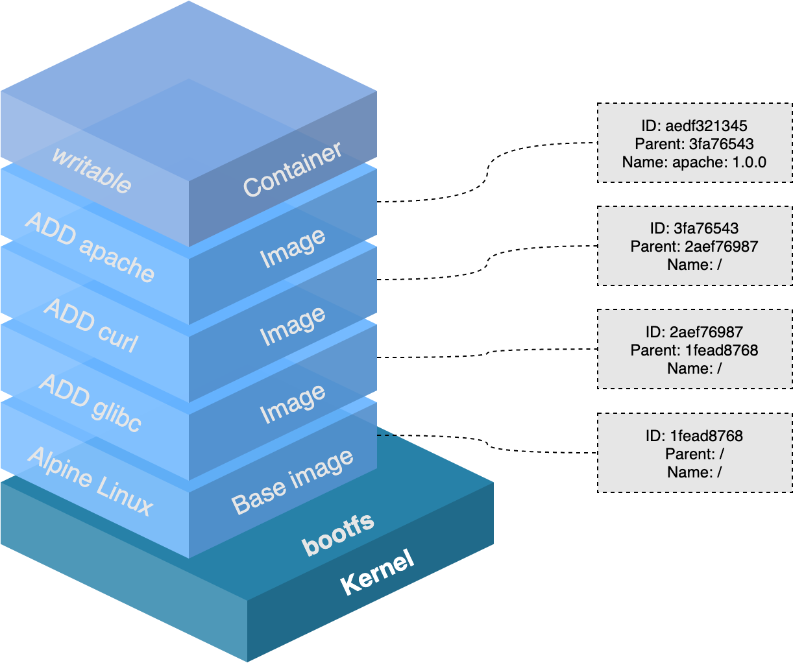
</p>

For this scenario, Docker provides three storage options.

<p align=center>
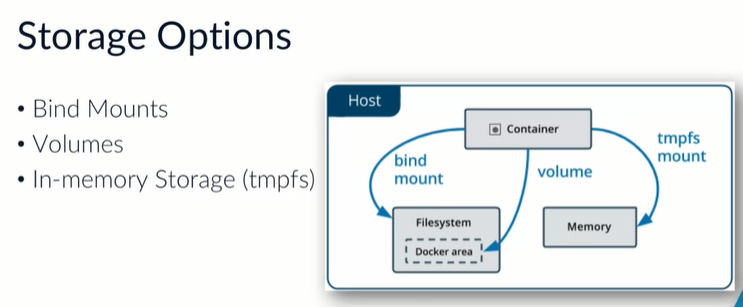
</p>

#### Bind mounts 

Bind mounts work by mounting a directory (that's on the host) to the container. This is a good storage option since the data lives on a directory outside of the container. When the container is stopped or terminated, the data is perfectly safe and intact in the directory residing on the host.

It is important to note that you will need the fully qualified path of the directory on the host to mount it inside the directory.

Use cases:

- **Sharing config files between host and containers** - allows DNS resolution to container by mounting */etc/resolv.conf* into each container 

- **Sharing source code/build artifacts between host and container** - Dockerfile copies artifacts directly into the image, instead of relying on the bind mounts

- **Consistent bindmounts** - when the file/directory structure of the host is consistent with the bind mounts the containers require

#### Volumes 

Another option is to use volumes which is similar to bindmounts but docker manages the storage on the host. This means you don't need to know the directory path on the host since this is being managed by Docker itself.

Volumes also allow you to use external storage mechanisms using different drivers, which means you are not limited to the local volume.

In addition,

- if not explicitly created, volumes are created when you mount them for the first time

- volumes are only removed when you explicitly remove them

Use cases:

- **Sharing data between containers** - allows multiple containers to mount the same volum simultaenously, either read-write or read-only 

- **File/directory structure not guaranteed on the host** - decouples host configuration from the container runtime

- **Remote Storage** - storing the data on a remote host or cloud provider, instead of storing locally 

- **Backup, restore, or migrate** - ensuring data has copies on another host 

To add a local volume to a container:

```bash
$ docker run -d \
    -v <name>:</path/on/container> \ 
    --name <name> \
    <image>
```

To mount existing directory to a container:

```bash
$ docker run -d \
    -mount type=bind, source=</path/on/node>, target=<name> \
    --name <name> \
    <image>
```

#### tmpfs (Temporary filesystem)

This is an in-memory filesystem, which is basically inside the container. This isn't persistent and data stored here are only accesible as long as the container is running.

<p align=center>
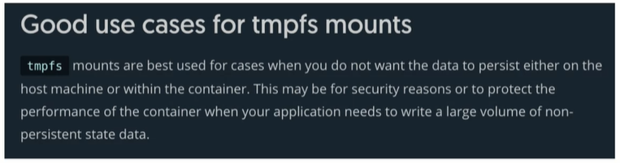
</p>

</details>

<details><summary> Logs </summary>

### Logs

To see the logs, you can simply use the logs command:

```bash
$ docker ps
$ docker logs <container-id>
```

Another way to see logs related to Docker:

```bash
$ journalctl -u docker.service 
```

You may also view the logs in the directory:

```bash
# Linux
/var/log
```
```
# Windows
~AppData\Local\Docker
```

</details>

<details><summary> Environment Variables </summary>

### Environment Variables
 
We can specify an environment variable that we can use in a given code. This is useful when we don't want to modify the code and instead use variables for any values that we need to change in the code.

<p align=center>
<imgsrc=<"Images/docker-env-vars.png">
</p>

There are different ways to define environment variables for a containers:

- Dockerfile
- Environment File
- Shell Environment Variables
- Compose File

To learn more about variables, you check these resources:

- [Substitute environment variables in Compose files](https://docs.docker.com/compose/environment-variables/)
- [Exploring Docker Compose Environment variable behaviour](https://www.profit4cloud.nl/blog/exploring-docker-compose-environment-variable-behaviour/#:~:text=Environment%20variables%20can%20be%20defined%20in%20the%20Dockerfile.,the%20resulting%20image%20and%20container.)

</details>

<details><summary> CMD and ENTRYPOINT </summary>

### CMD and ENTRYPOINT

Recall that containers are not meant to host operating systems. Thus when you launch a container of a Linux Image like Ubuntu, it's default command or CMD is bash. This can be seen from the dockerfile itself. 

However if it doesn't detect any terminal, it just stops the process which also stops the container.

If you want to define a command or instruction to run besides the bash when the container is ran, you can specify it in the dockerfile using the CMD keyword.

As an example, we can set the container to sleep for 60 seconds when it is ran by:

```bash 
docker run ubuntu sleep 60
```

An easier way to do this is by including the command itself when creating the **Dockerfile.**

```bash
$ cat > dockerfile 

FROM ubuntu
CMD sleep 60
```

There are ways to specify a command in the dockerfile

```bash 
CMD <command> <parameter1>
CMD ["<command>", "<parameter1>"]                   <<< JSON format
```

We can also use a parameter from the commandline itself. This can be done by using ENTRYPOINT in the **dockerfile**.

```bash 
FROM ubuntu
ENTRYPOINT ["sleep"]
```

Now when you run the container, you'll just have to define the parameter.

```bash
$ docker run ubuntu-sleeper 60
```

Note that you'll get an error when you don't append a parameter in the _docker run_ command because the ENTRYPOINT is expecting a parameter.

To include a default value in case user doesn't provide a parameter along with the _docker run_ command, you can use CMD and ENTRYPOINT together

```bash
FROM ubuntu
ENTRYPOINT ["sleep"]
CMD ["60"]
```

You can also override the entrypoint during runtime by using the "--entrypoint" flag

```bash
docker run --entrypoint sleep2.0 ubuntu-sleeper 60
```

</details>


<details><summary> Docker Networking </summary>

### Docker Networking

#### Container Network Model 

Docker follows the **Container Network Model** which breaks up networking into components:

- **Sandboxes** - containers running on the same Docker node won't be able to talk to each other

- **Endpoints** - virtual NICs created for each container

- **Networks** - creates a 'fake' network and attach the containers using the nedpoints

- **libnetwork** - made up of the 'control' and 'management' planes

#### Driver

Drivers enable networking in containers. These are the available drivers in Linux:

- **bridge** - default driver, functions as a NAT

- **host** - allows container to access network stacj of the underlying node without NAT 

- **overlay** - creates networks that span multiple nodes, allowing secure, encrypted communication between containers 

- **macvlan** - allows attaching a container to internal LAN, container will have own IP, MAC, like any other device


To create a separate network:

```bash
docker network create -d driver <name> 
```

#### Network Types

**Single-host Bridge Network**

- containers run on a single node
- uses bridge driver 

**Single-host Host Network**

- containers run on a single node 
- uses host driver
- bypasses network isolation, allowing container to access the node's network stack

**Multi-host Overlay Network**

- containers run on multiple nodes 
- virtual switch spans all the hosts (VXLAN)
- uses overlay driver 

**Existing Network**

- containers run on multiple nodes 
- can connect container to local network infrastructure
- does not work on public cloud (promiscuous mode)
- uses macvlan or transparent driver

#### Overlay Networks

In an overlay network, we have containers running on multiple nodes.

- virtual switch that spans all the hosts (VXLAN)
- uses overlay driver
- sets the stage for "swarms"
- control plane is encrypted by default
- data plane can be encrypted using "-o encrypted"

To create an overlay network:

```bash
$ docker network create -d  overlay <name> 
```

To create services for swarms:

```bash
$ docker service create --name <name>  \
    --network <name> \
    --replicas 2 \ 
    <image>
```

#### VXLAN 

Overlay networks uses VXLAN. The idea is to create a layer 2 network on top of layer 3.

- created as-needed on top of the existing L3 network 
- uses encapsulation to add VXLAN informaton to a L3 packet
- VXLAN Tunnel Endpoint (VTEP), tunnel is created between containers 

</details>

<details><summary> Docker Compose </summary>

### Docker Compose 

Instead of running multiple RUN commands of different images, we could use **docker compose**. In this example, we'll use a sample voting app with result app architecture.

We can see below the comparison between the two approaches.

**First method - multiple RUN**

```bash 
docker run voting=app
docker run redis
docker run worker
docker run db
docker run result-app
```

**Second method - using DOCKER COMPOSE**

```bash 
# docker-compose.yml
services:
    web:
        image: "voting-app"
    cache:
        image: "db"
    messaging:
        image: "worker"
    db:
        image: "db"
    result:
        image: "result-app"
```

As we can see, the second method is much cleaner and is a more precise way to run containers. To run the entire stack defined in the docker-compose.yml, run the command below.

**NOTE**: This is only applicable if you're running multiple containers in a SINGLE DOCKER HOST.

```bash
$ docker-compose up 
```

We can add more details in the docker-compose.yml file.

<details><summary> docker-compose.yml </summary>
 
```bash
services:
  redis:
      image: "redis"
  db:
      image: postgres:9.4
  vote:
      # here we're telling it to build the image from the ./vote directory
      build: ./vote
      ports:
          - 5000:80
      # we're linkedin the voting-app container to the redis container
      # note that links may be deprecated now.
      links:
          - redis
  result:
      build: ./result
      ports:
          - 5001:80
      links:
          - db
  worker:
      image: worker
      links:
          - db
          - redis
```
<br>

Check out the labs in this repository to learn more about docker compose.
 
</details>

</details>


<details><summary> Three versions of docker-compose file </summary>

### Docker Compose versions

There are three versions of a docker-compose file. For v2 and v3, you must specify the VERSION.

**VERSION 1**
All containers are attached to the default bridge network and then use LINKS to enable communication between the containers.

```bash
redis:
    image: redis
db:
    image: postgres:9.4
vote:
    image: voting-app
    ports:
        - 5000:80
    links:
        - redis
```
<br>

**VERSION 2**
A dedicated network is automatically created for the application and then attaches all containers to that new network. We can also introduce a "DEPENDENCY" feature where a container can only be started based on a condition

```bash 
version: 2
services:
    redis:
        image: redis
    db:
        image: postgres:9.4
    vote:
        image: voting-app
        ports:
            - 5000:80
        # voting-app is created only when the redis container is started
        depends_on:
            - redis
```
<br>

**VERSION 3**
Almost similar with v2, but this one supports DOCKER SWARM.

```bash 
version: 3
services:
    redis:
        image: redis
    db:
        image: postgres:9.4
    vote:
        image: voting-app
        ports:
            - 5000:80
```

</details>

<details><summary> Docker Compose commands </summary>

### Docker Compose commands

<p align=center>
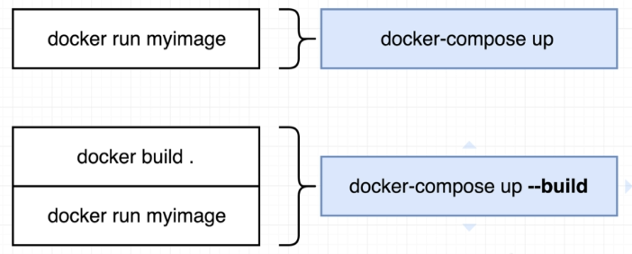
</p>

The difference between the two is **docker-compose** commands are clearly described above. The "--build" tells docker to rebuild the images listed in the docker-compose file and then start up the container.

To run containers in the background using docker-compose,

```bash
$ docker-compose up -d 
```

To stop containers,

```bash
$ docker-compose down 
```

We could also check the running containers by using the command below. Note that you can only run this command in the same directory where you're docker-compose file is located. This command basically checks the docker-compose file, gets the list of containers, and then verifies the status.

```bash
$ docker-compose ps 
```

If we run it inside a directory that doesn't have the docker-compose file, it will return an error.

```bash
~$ docker-compose ps
ERROR:
        Can't find a suitable configuration file in this directory or any
        parent. Are you in the right directory?

        Supported filenames: docker-compose.yml, docker-compose.yaml, compose.yml, compose.yaml 
```

</details>

<details><summary> Status Codes and Restart Policies </summary>

### Status Codes and Restart Policies

It is helpful to know status codes especially when you're troubleshooting errors.

<p align=center>

</p>

For container issues, we can specify restart policies inside our docker-compose file. The default restart policy is "no", which means container won't be restarted if it stops or crashes.

<p align=center>

</p>

**"No"**

Here's an example of a docker-compose file. Notice that we defined **"no"** enclosed in qoutes because without the quotes(no), YAML formatting will interpret it as a boolean false. 

```yml
version: '3'
services:

  node-app:
    image: node
    restart: "no"
```

**always vs. on-failure**

If we use **always**, the container will automatically attempt to restart if it crashes. On the other-hand, **on-failure** would only restart the container if it returns an error status code (non-zero status codes). We also don't need to enclosed them in quotes.

```yml
version: '3'
services:

  node-app:
    image: node
    restart: "no"

  web-server:
    image: redis
    restart: always

  worker:
    image: ubuntu
    restart: on-failure
```

Use **always** for containers that needs to be up 100% of the time, like web servers.

Use **on-failure** for containers that runs batch jobs or files processes.

Check out the labs for Docker Compose in this repository to see how restart policies are used.

</details>


<details><summary> Docker Swarms </summary>

### Docker Swarms

A swarm is a cluster of nodes that work together. This is DOcker's official orchestration system and is similar with Kubernetes.

- provides an API
- uses services instead of running containers individually
- encrypts some services by default:

    - distributed cluster store 
    - networks 
    - TLS
    - cluster joining tokens
    - PKI

#### Types of Nodes 

**Manager Node**

- responsible for running the cluster
- cluster state
- schedules services
- receives API commands and converts them to actions 
- recommended to have "odd" number of nodes for HA 
- if you have "even" number of nodes (ex: 4 nodes), it's possible to have *split brain* issue
- maximum of 7 nodes 

**Worker Nodes**

- runs the containers
- needs at least 1 manager node 

To see all the nodes in your swarm:

```bash
$ docker node ls 
```

#### Creating a Swarm 

Initialize on the first manager node:

```bash
$ docker swarm init \
    --advertise-addr <private-ip>:2377 \
    --listen-addr <private-ip>:2377
```

After initializing, create a token:

```bash
$ docker swarm join-token manager 
```

You can then use this token to join another manager node to the swarm.

To create a token for the worker nodes:

```bash
$ docker swarm join-token worker 
```

Use this token to join a node as a worker node to the swarm.

```bash
$ docker swarm join \
    --token <worker-node-token> \
    --advertise-addr <private-ip>:2377 \ 
    --listen-addr <private-ip>:2377
```


#### Locking a Node 

Note that if a node goes down for some time and restarts, its data may be in conflict with the data in the swarm. To prevent this, enable locking to stops the restarted node from rejoining the swarm and require an administrator password first.

```bash
$ docker swarm init --autolock 
```
```bash
$ docker swarm update --autolock=true 
```

Note that is better to delete and recreate the node so that it gets the recent copy of the data.

#### Creating Services 

Define the image to be used and then the service will run the container for you.

- also specify the desired state (replicas, etc.)
- *replicate mode* by default, containers are distributed evenly 
- *global mode*, a single replica on each node
- scaling up/down

</details>

<details><summary> Docker Security </summary>

### Docker Security

These are the security features that Docker uses under the hood.

**Swarm mode** 

- security settings are turned-on by default
- uses PKI infrastructure for handling certificates 
- tunnel are created between endpoints on the containers

**Docker Content Trust** 

- Sign images for integrity verification

    ```bash
    export DOCKER_CONTENT_TRUST=1 
    ```

**Security Scanning**

- scans images for vulnerabilities

**Secrets**

- data is encrypted and stored

    ```bash
    docker secret 
    ```

</details>

</details>


## Cloud-Native

Another technology that comes to mind when you talk about containers is the concept of cloud-native applications. 

<details><summary> Read more.. </summary>

<details><summary> What the heck is Cloud Native? </summary>
 
### What the heck is Cloud Native?

<p align=center>

</p>

As defined by [Cloud Native Computing Foundation (CNCF)](https://www.cncf.io/about/charter/) 

> *Cloud native technologies empower organizations to build and run scalable applications in modern, dynamic environments such as public, private, and hybrid clouds. Containers, service meshes, microservices, immutable infrastructure, and declarative APIs exemplify this approach.*
>
> *These techniques enable loosely coupled systems that are resilient, manageable, and observable. Combined with robust automation, they allow engineers to make high-impact changes frequently and predictably with minimal toil.*

In its simplest terms, Cloud native refers to building and managing applications at scale using either private, public, or hybrid cloud platforms.

Now, when we hear containers, it is also often followed by another buzzword: **microservices**.

<p align=center>

</p>

Microservices are simply a collection of small, independent, and containerized applications. Read below to learn about the difference between monolitic applications and microservices.

</details>

<details><summary> Containers and being Cloud Native </summary>

### Containers and being Cloud Native

There are three key things to know here. The first two are **speed** and **agility** - how quickly anorganization can response and adapt to change. 

The third key thing: **containers**.

<p align=center>

</p>

To recall, containers are simply **processes** which wraps the dependencies and libraries so that it can be shipped as runnable applications across different platforms. THey are closely associated with cloud native applications as containers are a great way to deploy applications quickly and resiliently given their lightweight feature.

</details>

<details><summary> Cloud-Native Landscape </summary>

### Cloud-Native Landscape

With the advent of containers, the need for tools to manage and maintain them also arise. Some of the container orchestrator tools that are being used is the market are:

- Kubernetes,
- Apache Mesos, and 
- Docker Swarm 

Of the three, **Kubernetes** is currently the leading tool in deploying containerized workloads.
 
 <p align=center>

</p>

It was a project inside Google and was released in 2014 and is currently being maintained by **CNCF** or **Cloud Native Computing Foundation**, a vendor-agnostic organization that manages open-source projects. The main features of Kubernetes are the automation of:

- Configuration 
- Management
- Scalability

Over time, Kubernetes was developed to include more than just automation but also other functionalities:

- Runtime
- Networking
- Storage
- Service Mesh
- Logs and metrics
- Tracing

</details>

<details><summary> Business and Technical Considerations </summary>

### Business and Technical Considerations

Adoption cloud-native practices means consideration alot of factors, specifically business and technical keypoints, which would need to be assessed by all the stakeholders.

From a business perspective, the adoption of cloud-native tooling represents:

- **Agility** - perform strategic transformations
- **Growth** - quickly iterate on customer feedback
- **Service availability** - ensures the product is available to - customers 24/7

From a technical perspective, the adoption of cloud-native tooling represents:

- **Automation** - release a service without human intervention
- **Orchestration** - introduce a container orchestrator to manage  thousands of services with minimal effort
- **Observability** - ability to independently troubleshoot and debug each component

</details>


<details><summary> Design Considerations </summary>

### Design Considerations

It is necessary to allocate time at the start to identifying the design factors ensure that the application will be built and maintained with minimal engineering effort.

1. **List all requirements**
    In this phase, we determine the following:
    - Stakeholders - *who will sponsor the project?*
    - Functionalities - *what functions should be included?*
    - End users - *For whom is this service?*
    - Input and Output Process - *What will be the flow?*
    - Engineering Teams - *Who are needed in doing the project?*


2. **List all available resources**
    Here we determine what is the context of implementing these functionalities.
    - Engineering resources - *Who can work on the project?*
    - Financial resources - *How much is the budget?*
    - Timeframes - *How soon do we want the project to finish?*

</details>


<details><summary> Monoliths and Microservices </summary>

### Monoliths and Microservices

After the requirements are carefully reviewed, we can now start deciding which model we'll use: **monoliths** or **microservices**.

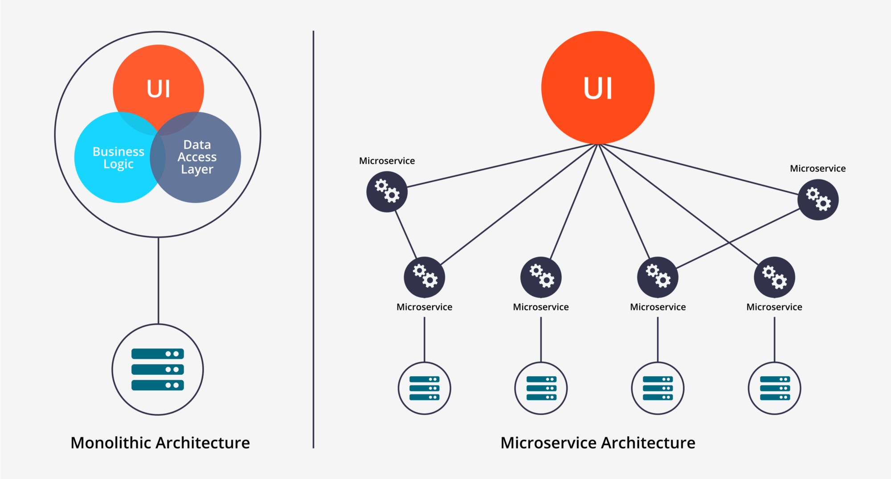

Typically, there will be three tiers in an application:

<!-- 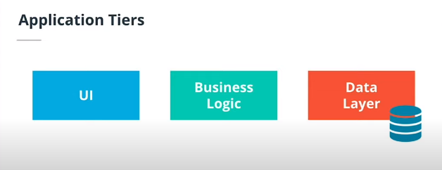 -->

- **UI (User Interface)** - handles HTTP requests and responses
- **Business logic** - contains code that provides service to the users
- **Data layer** - implements access and storage of data objects


In a monolithic architecture, application tiers can be described as:

- part of the same unit
- managed in a single repository
- sharing existing resources (e.g. CPU and memory)
- developed in one programming language
- released using a single binary

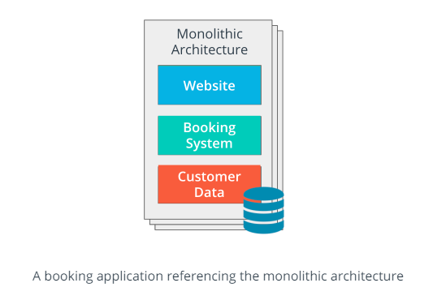

In a microservice architecture, application tiers can be described as

- tiers aremanaged independently
- managed in a separate repository
- own allocated resources (e.g. CPU and memory)
- well-defined APIs for connecting to other units
- implemented using the programming language of choice
- released using its own binary

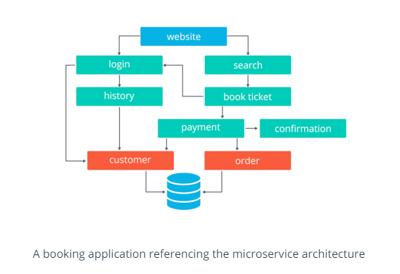

</details>


<details><summary> Tradeoffs </summary>

### Tradeoffs

Depending on which model we choose, each one will have their own set of tradeoffs:

 Tradeoffs | Description | Monoliths | Microservices
---------|----------|---------|---------
**Development Complexity** | Effort required to deploy and manage an application. | <ul><li>one programming language</li><li>one repository</li><li>enables sequential development </li></ul> | <ul><li>multiple programming languages</li><li>multiple repositories</li><li>enables concurrent development </li></ul> |
**Scalability**  | Scaling up or down, based on the incoming traffic. | <ul><li>entire stack is replicated</li><li>heavy on resource consumption</li></ul> | <ul><li>single unit is replicated</li><li>on-demand consumption of resources</li></ul> |
**Time to deploy** | Time to deploy encapsulates the build of a delivery pipeline that is used to ship features. | <ul><li>one delivery pipeline that deploys the entire stack</li><li>more risk with each deployment leading to a lower velocity rate</li></ul> | <ul><li>multiple delivery pipelines that deploy separate units</li><li>less risk with each deployment leading to a higher feature development rate</li></ul> |
**Flexibility** | Ability to adapt to new technologies and introduce new functionalities. | <ul><li>low rate</li><li>entire application stack might need restructuring to incorporate new functionalities</li></ul> | <ul><li>high rate</li><li>since changing an independent unit is straightforward</li></ul> |
**Operational Cost** | Represents the cost of necessary resources to release a product. | <ul><li>low initial cost</li><li>one code base and one pipeline should be managed</li><li>cost increases exponentially when the application needs to operate at scale</li></ul> | <ul><li>high initial cost</li><li>multiple repositories and pipelines require management</li><li>to scale, the cost remains proportional to the consumed resources at that point in time</li></ul>
**Reliability** | Reliability captures practices for an application to recover from failure and tools to monitor an application.| <ul><li>in a failure scenario, the entire stack needs to be recovered</li><li>the visibility into each functionality is low, since all the logs and metrics are aggregated together</li></ul> | <ul><li>in a failure scenario, only the failed unit needs to be recovered</li><li>there is high visibility into the logs and metrics for each unit</li></ul>

</details>


<details><summary> Best Practices for Application Deployments </summary>

### Best Practices for Application Deployments

<p align=center>

</p>

The appropriate model has been decided and we've carefully reviewed the requirements against the monoliths vs. microservices, so what's next? Implementation.

It is essential to understand best practices and follow them during the release and maintenance phases when building solution. Of course, there is no one-size-fits-all strategy and each organization works differently, but knowin these best practices ensures we have resiliency and high availability.

#### Health Checks

Refers to the status of the application and ensuring the expected behavior to take on the traffic is met. 
- normally HTTP endpoints such as <code>/health</code> or <code>status</code>
- returns HTTP response codes to let you know if the application is healthy.

#### Metrics

Measures the performance of an application.
- include statistics collected on the services 
- number of logins, number of active users, number of reqeusts handled, CPU utilization, memory, etc.
- usually  returned via an HTTP endpoint such as <code>/metrics</code>.

#### Logs

Logs aggregation provides significant insights on the application's operation on a particular timeframe
- like metrics, Logs are extremely useful in troubleshooting
- used for debugging application issues. 
- usually collected through *standard out*(STDOUT) or *standard error* (STDERR) 
- collected through a passive logging mechanism and then sent to the shell
- can be collected through logging tools such as Splunk and stored at the backend
- can also go directly to the backend storage without a monitoring tool by using *active logging*.
- common practice to associate each log line with a **timestamp**, that will exactly record when an operation was invoked

| **Logging Levels** | Meaning |
|---|---|
| **DEBUG** | record fine-grained events of application processes |
| **INFO** | provide coarse-grained information about an operation 
| **WARN** | records a potential issue with the service
| **ERROR** | notifies an error has been encountered, however, the application is still running
| **FATAL** | represents a critical situation, when the application is not operational |


#### Tracing

Helpful for understanding the full journey of a request.
- includes all the invoked functions
- usually integrated through a library
- can be utilized by the developer to record each time a service is invoked. 
- records for individual services are defined as spans
- A collection of spans define a trace that recreates the entire lifecycle of a request.

#### Resource Consumption

Refers to how much resources an application uses to perform its operations.
- usually CPU, memory, network throughput, and number of concurrent requests.

</details>


<details><summary> Product is Released, What's Next? </summary>

### Product is Released, What's Next?

After an engineering team has successfully released a product, with both monolith and microservices, the next phase in the application lifecycle is maintenance. 
- product responses to customer feedback and emerging technologies
- new features are added and new tools are integrated
- the application structure and functionalities may change
- architecture of an application is not static, but rather in constant movement

#### Extensibility over Flexibility

During Day 2 operations (maintenance phase), it is more efficient to manage multiple services with a well-defined and simple functionality (as in the case of microservices), rather than add more abstraction layers to support new services (as we’ve seen with the monoliths). 

These are some of most common operations you'll encounter after a product goes live.

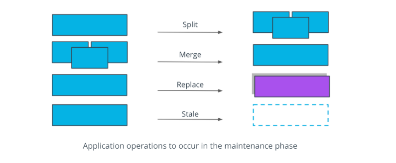

- **split** operation - applied if a service covers too many functionalities and it's complex to manage. Having smaller, manageable units is preferred in this context.

- **merge** operation - applied if units are too granular or perform closely interlinked operations, and it provides a development advantage to merge these together. For example, merging 2 separate services for log output and log format in a single service.

- **replace** operation - adopted when a more efficient implementation is identified for a service. For example, rewriting a Java service in Go, to optimize the overall execution time.

- **stale** operation - performed for services that are no longer providing any business value, and should be archived or deprecated. For example, services that were used to perform a one-off migration process.

These operations are inevitable and you will perform these as your application grows. At the end of the day, the application exists to provide value to customers and to be easily managed by the technical team. 

</details>


</details>


## Kubernetes - In-progress

Kubernetes is an entire universe in itself. Below are bite-sized and easy-to-digect sections for each Kubernetes topic. Go through the topics that interests you, or just dive straight to the labs, your choice! 😀

<details><summary> Read more.. </summary>

<details><summary> Container Management Challenges </summary>

### Container Management Challenges 

Since you've reached this Kubernetes section, I'm assuming that you've work around some of these topics:

- TCP/IP Networking 
- Linux 
- Containers

As a recap, containers are a way to isolate and ship applications with dependencies and runtimes tied to it. In addition to this, containers:

- are considered as "Linux processes" under the hood which exits when the application has done its purpose.
- allows mapping to external volumes to persist data.
- can publish ports which allows access to the application running inside the container.

<p align=center>

</p>

While containers have indeed revolutionized ways on how software can be delivered, it still had some challenges:

- How do we keep track of which port goes to which container on which host?

- How should we efficiently allocate containers to hosts?

- Given that microservices scale horizontally, how do we map service dependencies?

- Given that applications are frequently updated and container ports are randomized, how do we account for frequent changes?

As an example, check the diagram below. Here we have three NGINX containers running on the same underlying server. To serve the website, we can map ports on the container to the host ports. This enables port-forwarding and will direct any traffic that access the arbitrary host port and forward it to the mapped port on the container.

<p align=center>

</p>

This can be done by manually mapping ports. We could also simply utilize dynamic mapping by specifying the "-P" flag when running the containers. To create three containers, we can run the command below three times. Each container will have a dynamic port assigned to it.

```bash
docker run -d -P nginx 
```

We can also throw in some basic scripting so that we can run the containers in one swoop.

```bash
for i in $(seq 3) ; do docker run -d -P nginx; done
```

It is still manageable when you have a small number of applications running on single host. However, this becomes more problematic when you add more applications and more hosts. In addition to this, things becomes more complicated when you have dependencies between applications.

<p align=center>

</p>

We can simply use the command below to run this setup but as you can see, we would need a much better solution of managing this kind of situation.

```bash
for i in $(seq 6); do
    for j in $(seq 3); do
        ssh node0$i docker run -d -P app${i}-${j};
    done;
done 
```

From a developer's perspective, it would be just nice if we can:

- just package up an app and let something else manage it for us 
- don't have to  worry about the management of containers 
- eliminate single points of failure 
- scale containers
- update containers without bringing down the application 
- have a robust networking and persistent storage options

Enter Kubernetes.

</details>


<details><summary> What is Kubernetes </summary>

### What is Kubernetes

As we've previously seen, the advent of containers called for much better tools to manage and maintain them. Some of the container orchestrator tools that are being used is the market are Kubernetes, Apache Mesos, and Docker Swarm, with Kubernetes being the leading tool in deploying containerized workloads.

<p align=center>

</p>

What does Kubernetes do?

- starts and stops container-based application
- handles workload placement
- automation of configuration, management, and scalability
- zero downtime with automated rollouts/rollbacks
- abstracts infrastructure by handling it under the hood
- follows *desired state* - which means we can define in code what we want our end state to look like

<p align=center>

</p>

Besides automation, what are its other functionalities?

* Runtime
* Networking
* Storage orchestration
* self-healing
* Service Mesh
* Logs and metrics
* secrets management
* Tracing

What are its benefits from an administrator's standpoint?

- Speed of deployment
- Ability to absorb change quickly
- Ability to recover quickly (self-healing)
- scale containers
- orchestrate containers
- Hide complexity in the cluster    
- ensure secrets/config are working properly

What are its benefits from a developer's standpoint?

- zero-downtime deployments
- ability to emulate production locally 
- ability to create an end-to-end testing environment
- performance testing scenarios, determining what are the limits of our application
- workload scenarios, for multiple builds in your CICD pipeline
- leverage different deployment options (AB, canary, etc.)

Dive into the succeeding sections to learn more one of main principles of Kubernetes, the use of a single Kubernetes API server.

</details>


<details><summary> Kubernetes API Server </summary>

### Kubernetes API Server

This is the main way to interact with the cluster. It is a RESTful API that runs over HTTP or HTTPS using JSON. 

- composed of **API Objects**, which are a collection of primitives to represent your system's state

- Enables to declaratively configuring the state, which means we define what we want the end result to look like instead of defining the individual steps.

- information exchanged with the cluster are persisted and serialized to the data store

Next up, learn about the four Kubernetes API Objects.

</details>


<details><summary> Kubernetes API Objects </summary>

### Kubernetes API Objects

<p align=center>

</p>

#### Pods 

A single or a collection of containers deployed as a single unit. From the standpoint of Kubernetes, this is the mmost basic unit of work.

- atomic unit of scheduling
- These are basically our container-based application
- When we define a pod, we also define the resources it needs
- **Ephemeral**, which means no pod is ever re-deployed, a new pod is always used
- **Atomicity**, which means pod is no longer available if a container inside it dies
- 

Kubernetes handles the pod by managing the:

- **state** - is the pod running?
- **health** - is the application inside the pod running?
- **liveness probes** - are we getting the appropriate response back?

A Pod has 1 IP address:

- this means containers inside the Pod share the same IP address
- containers within the same Pod talk via localhost
- Pods coordinate ports


#### Controllers

These keep the system in our desired state. 

- creates and manages Pods
- ensures the desired state is maintained
- responds to a Pod state and health

Controllers include the following:

- **ReplicaSet** - allows us to define the number of replicas for a Pod that we want to be running at all times

- **Deployment** - manages the transition between two ReplicaSets

There are a lot more controllers that Kubernetes offers and the two mentioned above are just some that are based on Pods.

#### Services 

Services provide a persistent axis point to the applications provided by the pods. This basically add persistency based on the state of the system.

- networking abstraction for Pod access
- allocates IP and DNS name for the service
- redeployed Pods are automatically updated
- updates routing information to the Pods
- scales application by adding or removing Pods
- enables loadbalancing to distribute load across the Pods

Essentially, a virtual IP address,

- this virtual IP address is mapped to various Pods
- ensures that external services accessing the Pods only needs to know a single IP

#### Storage

Storage objects serves as persistent storage to keep the data.

- **Volumes**, a storage backed by physical media which is tightly coupled to the Pods

- **Persistent Volume**, a Pod-independent storage defined at the cluster level using a *Persistent Volume Claim*

</details>


<details><summary> Kubernetes Cluster </summary>

### Kubernetes Cluster 

<p align=center>

</p>

A **Cluster** is a collection of distributed physical or virtual servers or *nodes*, which is used to host and manage workloads.
 
It has two types:

- **Master node (control plane)**
    Makes global decisions about the cluster. Its components are:
    - *kube-apiserver* - exposes the Kubernetes API
    - *kube-scheduler* - decides which node will handle workload
    - *kube-control-manager* - ensures resources are up-to-date
    - *etcd* - backs-up and keeping manifests for the entire cluster

- **Worker nodes (data plane)**
    Used to host application workloads. Note that both component below are running on **all** nodes - both on master and work nodes.
    - *kubelet* - agent that runs on every node,  notifies the kube- apiserver that this node is part of the cluster
    - *kubeproxy* - network proxy that ensures the reachability and accessibility of workloads places on this specific node

#### Master Node - Control Plane

<p align=center>

</p>

The master implements the core control functions fo a cluster.
- primary access point for cluster administration
- coordinates cluster operations
- handles monitoring and scheduling
- only runs system Pods, which includes the API server, Cluster Store, Scheduler, and Control Manager
- workloads are always forwarded on the Pods on the nodes

The master is composed of the following:

##### API Server

- essentially the commmunication hub
- core to all the operationa
- all configuration changes pass through the API server
- simple REST API interface
- verifies the operation and updates the etcd

##### etcd (Cluster store)

- persists the state of the Kubernetes objects
- objects are persisted into a key-value store called **etcd**
- implements watches on the stored keys
- all other services are stateless and grab from API server

##### Scheduler

- manages which Nodes to start Pods on
- watches the API server for unsceduled Pods,
- evaluates the resources required by a Pod,
- handles the resource constraints that we define,
- and then schedule the Pods on nodes
- 2-steps process

    - **Filtering** - find feasible nodes where resources could fit 
    - **Score** - Rank each node to choose the most suitable Pod placement

##### Controller Manager

- handles lifecycle functions of the Controllers
- constantly running the controller loops
- watch the current state of the system
- update the API server based on the desired state
- types:

    - **Node controller** - noticing and responding to nodes 
    - **Replication Controller** - maintain the correct number of Pods 
    - **Endpoints Controller** - populates endpoint objects (join servces and Pods)
    - **Service Account and Token Controllers** - create default accounts and API access tokens for namespaces

##### Cloud Controller Manager (for EKS Setup only)

- handles communication with AWS
- autoscaling for bringing up more nodes 
- provision EBS to back container volumes 
- provision loadbalancers

In addition to these five, we'll also mention **kubectl**, which isn't a part of the control plane but is necessary to interact with the API Server.

#### Worker Node  

<p align=center>

</p>

The node is responsible for starting the pod and ensuring Pods are up and running.
- handles networking
- clusters comprised of multiple nodes

The node is composed of:

##### Kubelet

- this is the node agent that talks to API server which provides the scheduling
- starts and stops up Pods based on the API server 
- if Pods are scheduled for a node, kubelet starts it up
- reports Nore and Pod state
- executes **liveness probes** which monitors the state of the application and Pods themselves

##### Kube-proxy

- network proxy that runs on each nodes that provides rules for cluster IPs
- handles the Pod networking
- talks to API server, which provides the networking information
- if there are changes in networking, the kube-proxy handles the modifications
- use **network proxy iptables**
- handles services abstraction 
- routes traffic to Pods
- manages the loadbalancing

##### Container Runtime

- actual runtime environment for the container image
- pulls the container image from the registry
- provides the environment for the image to run
- default runtime is Docker but there are many others

#### Scheduled/Add-Ons

These are Pods that provide special services to the cluster.
- an example is the DNS Pods, which handles DNS operations
- IP of DNS Pod is in the network configuration
- DNS Pod is used for service discovery inside of the cluster
- other examples are ingres controllers and dashboard for web-based administration

</details>

<details><summary> Pod Operations </summary>

### Pod Operations

Let's say we deployed a cluster with a ReplicaSet of 5 using kubectl. The process would look like this:

<p align=center>

</p>

1. Request is submitted by the kubectl to the API Server.
2. The API Server stores the information to the cluster store.
3. The Controller Manager spins up the 5 pods based on the ReplicaSet requirements and sends this request to the Scheduler.
4. The Scheduler checks the nodes and schedules the two nodes where the Pods will be spun up.
5. On the Node side, the kubelet asks the API Server for any updates. 
6. It will then see that on Node1, three Pods will be spun up. Another two Pods will be spun up on the second node.
7. The Controller Manager monitors the state of the Replicas.

Let's say Node 2 goes down. 

<p align=center>

</p>

1. Node 2 will stop reporting to the Controller Manager, which then determines that the current state is now different with the desired state.
2. The Controller Manager send another request to the Scheduler.
3. The Scheduler checks the number of nodes on which to spin up the two pods, which in this case will be Node 1.
4. The kubelet in node1 seees a state change which will then spin up the two additional Pods. 

</details>


<details><summary> Kubernetes Networking </summary>

### Kubernetes Networking

Here are some basic rules to know when it comes to Kubernetes networking.

1. All Pods can communicate with each other on all nodes.
2. All nodes can communicate with all Pods.
3. No Network Address Translation (NAT).

#### Inside a Pod

Let's use the scenario below. We have multi-container Pod inside our node. These two containers inside the Pod will communicate with each other over the localhost using namespaces.

<p align=center>

</p>

#### Pod to Pod within a Node

We'll now add two more Pods to the mix. For the three Pods to talk to each other, they'll use the real IP addresses to communicate over the Layer-2 software bridge on the node.

<p align=center>

</p>

#### Pod to Pod on Another Node

So far we've only spun up Pods in a single node. Let's add a node 2 that contains a single Pod. For Pods in Node 1 to talk talk to the Pod in Node 2, they will also leverage the IP addresses of the Pods and talk over the Layer 2 or Layer connection, which would involve the underlying network facility.

<p align=center>

</p>


#### Overlay Network

Another common scenario is an **overlay network** where you (as a developer) don't have control on the underlying network infrastructure. Overlay networks allow the Pods to be "included in the same network". More of this will be discussed in the succeeding sections.

#### External Services 

Lastly, we also have **External Services** where we have an application in our cluster that we want to expose to the public internet using an HTTP service.

<p align=center>

</p>

#### Cluster Network Ports 

On the Master node:

Components | Ports (TCP) | Used By
---------|----------|---------
API                 | 6443      | All
etcd                | 2379-2380 | API server and other instances of etcd
Scheduler           | 10251     | Itself, not exposed to outside world 
Controller Manager  | 10252     | Itself, not exposed to outside world 
Kubelet             | 10250     | Control Plane 

On the Worker nodes:

Components | Ports (TCP) | Used By
---------|----------|---------
Kubelet             | 10250         | Control Plane 
NodePort            | 30000-32767   | All 

</details>


<details><summary> Installation Options </summary>

### Installation Options

> *The rest of succeeding sections is focused on on-premise implementation of Kubernetes. If you prefer to use cloud platforms such as AWS to run Kubernetes, you may jump to the Kubernetes in the Cloud section.*

There are multiple ways to setup a kubernetes cluster. 

- A local cluster (on your machine)

- A production cluster on the cloud

- A on-prem, cloud-agnostic cluster

- A managed production cluster on AWS using EKS

There are available tools to automate bootstrapping clusters on on-premise and public cloud platforms.

For **production-grade cluster**:
- kubeadm
- Kubespray
- Kops
- K3s

For **development-grade cluster,** (testing):
- minikube
- k3d

**k3s** is a lightweight version of kubernetes that can be installed using one binary.

- operational 1-node cluster
- instals *kubectl* - CLI tool

Here are some ways to run Kubernetes on your local machine.

- Minikube
- Docker Desktop
- kind
- kubeadm

</details>


<details><summary> Which is the Right Solution? </summary>

### Which is the Right Solution?

Before we start running Kubernetes, we must review some considerations. 

**Where to install?**

- **Cloud**
    Kubernetes is a cloud-native tool and we could leverage the available services from cloud platforms.

    - Using virtual machines (IaaS)
    - Using managed service (PaaS)

- **On-prem**
    - Bare metal
    - VirtuaL machines 

**Which one should we choose?**

- it all depends on the strategy of the organization
- depends on the skillset and expertise of people in the organization

**We've decided where to run Kubernetes, what's next?**

- Cluster Networking 
- Scalability
- High Availability 
- Disaster Recovery

Checkout these resources to learn more about installation considerations:

- [Picking the Right Solution](https://jamesdefabia.github.io/docs/getting-started-guides/)

- [Getting started](https://kubernetes.io/docs/setup/)

</details>


<details><summary> Creating the Cluster, Finally </summary>

### Creating the Cluster, Finally

Here are the outline of steps to create a Kubernetes cluster

1. Install Kubernetes from packages 
2. Create the cluster (specifically the master node)
3. Disable the swap space on the nodes.
4. Configure Pod networking
5. Join additional nodes to our cluster

You should be able to install Kubernetes by following the steps in the pre-requisites section above. Once that's done, we can proceed with bootstrapping our Kubernetes cluster using kubeadm.

</details>

<details><summary> Bootsrapping a Cluster with kubeadm </summary>

### Bootsrapping a Cluster with kubeadm 

Before we can provision a cluster, we must ensure that the control plane and data plane is up and running, which is known as **bootstraping the cluster**. This can be done manually but there's a risk for misconfiguration since we would need to run independent components separately.

We'll use kubeadm to create our cluster. The phases include:

1. We'll run <code>kubeadm init</code>.
2. kubeadm does **pre-flight checks** which ensure the appropraite permissions and system resources are in place.
3. kubeadm creates a **certificate authority** for authentication and encryption.
4. kubeadm generates **kubeconfig files** for authenticating the components against the API server.
5. kubeadm generates **Static Pod Manifests** which are monitored by the kubelet.
6. kubeadm starts up the control plane.
7. kubeadm taints the master, ensuring pods are only scheduled on worker nodes.
8. kubeadm generates a **Bootstrap Token** for joining nodes to the cluster.
9. kubeadm starts **Add-on Pods: DNS and kube-proxy**

Note that the process defined above can be customized by specifying parameter.

</details>


<details><summary> Certificate Authority </summary>

### Certificate Authority

By default, kubeadm creates a self-signed certificate authority (CA)

- CA can also be created to be a part of an external PKI
- used to secure cluster communications 
- generates certificates used by API server to encrypt HTTPS
- generates certificates for authenticating users and kubelets
- certificates will be distributed to each node

The CA files will be stored in:

```bash
$ /etc/kubernetes/pki  
```

</details>


<details><summary> xxxxxx </summary>

### xxxxxx

</details>


<details><summary> Stateless vs. Stateful </summary>

### Stateless Applications 

This means application that doesn't have a state and doesn't write any local files.

- also cannot keep local session 
- if same app is ran multiple times, it won't change state
- scales horizontally 
- session management is done outside the container
- files that need to be saved cannot be saved locally on the container

### Stateful Applications

Includes traditional databases such as PostgreSQL and MySQL which have database files that can't be split over multiple instances.

- cannot horizontally scale
- can be ran on a single container and scale vertically
- use volumes to save data

</details>


<details><summary> Scaling </summary>

### Scaling

Scaling in Kubernetes is done using the **Replication Controller.**

- ensures specified number of replicas ran at all times 
- pods are automatically replaced if they fail, get deleted, or are terminated
- recommended to use even if you're only running 1 pod to ensure pod is always running

</details>


<!-- <details><summary> xxxxxx </summary>

### xxxxxx

</details> -->


<!-- <details><summary> xxxxxx </summary>

### xxxxxx

</details> -->


<details><summary> CNCF Projects </summary>

### CNCF Projects   

Cloud Native Computing Foundation (CNCF) is the open source, vendor-neutral hub of cloud native computing, hosting projects like Kubernetes and Prometheus to make cloud native universal and sustainable. 

CNCF manages different projects which extends the Kubernetes solution to provide more features. Here's some of the projects:

- **CRI-O** - A Kubernetes container runtime that manages the containers.

- **CNI** - pluggable common network interface

- **Jaeger** - an operator for packaging, deploying, and managing applications

- **Rook** - a storage orchestrator for Kubernetes 

You can read about their organizations and the projects that they maintain [here](https://www.cncf.io/).

Each of these projects will have different statuses as defined by CNCF.

- **Sandbox** - project is new and used by innovators only 
- **Incubating** - projects are slowly being adopted
- **Graduated** - project becomes a part of the K8s environment


</details>


<details><summary> Kubernetes in the Cloud </summary>

### Kubernetes in the Cloud

#### EKS - Elastic Kubernetes Service

This is the Kubernetes offering from AWS which allows users to deploy a management plane. 

AWS basically provides the control plane and all it components, and it's up to the users to provision where their workload will run. The workloads can run on Fargate or EC2.

Benefits of EKS:

- no control plane to manage
- built-in loadbalancing, networking, volume storage 
- easy to turn on and off
- integrations with other AWS components to build applications (S3, Redshift, RDS, Lambda, COgnito, etc.)

#### ECS and Fargate

ECS is a proprietary Docker management service developed first to compete with Kubernetes.

- uses JSON task definition
- similar with EKS in many ways but the main difference is that it's proprietary 

Fargate, on the other hand, is a container service that is ddone in a serverless fashion.

- this means no EC2 instance is needed
- Fargate can be used with EKS and ECS
- No scaling management
- JSON task definition

</details>


<details><summary> Amazon EKS (Elastic Kubernetes Service) </summary>

### Amazon EKS (Elastic Kubernetes Service)

This is the Kubernetes offering from AWS which allows users to deploy a management plane. 

AWS basically provides the control plane and all it components, and it's up to the users to provision where their workload will run. The workloads can run on Fargate or EC2.

  

Traditionally, you'll have to setup and deploy Kubernetes yourself:
- deploy master nodes
- deploy etcd
- setup CA for TLS encryption 
- setup monitoring, auto-scaling, auto-healing
- setup authentication 
- setup worker nodes  

With EKS:
- no control plane to manage
- built-in loadbalancing, networking, volume storage 
- easy to turn on and off
- authentication is handled through IAM
- integrations with other AWS components to build applications (S3, Redshift, RDS, Lambda, Cognito, etc.)
- AMI for nodes can be customized
- container images can be stored through ECR

In the image below, we can see which components that Amazon EKS takes care for us and which components we need to manage as users.

  

When you create you EKS cluster, AWS takes care of all of these under the hood:
1. master node is set up for HA
2. etcd is set up  for HA.
3. IAM plugin is setup.
4. CA is setup for TLS.
5. Autoscaling is set up.
6. Loadbalancers are provisioned (NLB and ELB)

</details>

<details><summary> Amazon EKS - Cluster AutoScaler </summary>

### Amazon EKS - Cluster AutoScaler

The Cluster AutoScaler is responsible for dynamically scaling (in and out) the nodes within a nodegroup.

- not specific to AWS, this is a general Kubernetes concept
- can be based on availability/requests,
- can scale if node is under-utilized
- also possible to have a mixture of on-demand and spot instances
- avaialble RAM and number of CPUs should be similar throughout the noes

For stateful workloads:

- use a nodegroup with single availability zone (AZ)
- underlying EBS volume cannot be shared across AZ

For stateless workloads:

- use a nodegroup with multiple availability zones (AZs)

To learn more, check out this [Github repository](https://github.com/kubernetes/autoscaler).

</details>


<details><summary> Error: Cannot View Kubernetes Nodes  </summary>

## Error: Cannot View Kubernetes Nodes 

You might get the following error when checking the EKS cluster through the AWS Console.

```bash
Your current user or role does not have access to Kubernetes objects on this EKS cluster 
```

You may need to attach the inline policy to the group.

  

In the next page, choose the JSON tab and enter the following policy. Make sure to replace 111122223333 with your account ID.

```bash
{
    "Version": "2012-10-17",
    "Statement": [
        {
            "Effect": "Allow",
            "Action": [
                "eks:ListFargateProfiles",
                "eks:DescribeNodegroup",
                "eks:ListNodegroups",
                "eks:ListUpdates",
                "eks:AccessKubernetesApi",
                "eks:ListAddons",
                "eks:DescribeCluster",
                "eks:DescribeAddonVersions",
                "eks:ListClusters",
                "eks:ListIdentityProviderConfigs",
                "iam:ListRoles"
            ],
            "Resource": "*"
        },
        {
            "Effect": "Allow",
            "Action": "ssm:GetParameter",
            "Resource": "arn:aws:ssm:*:111122223333:parameter/*"
        }
    ]
}   
```

Click **Review Policy**, then in the next page, create a name for the policy. Click **Create Policy.** 

Next, create a rolebinding. If you need to change the Kubernetes group name, namespace, permissions, or any other configuration in the file, then download the file and edit it before applying it to your cluster

```bash
$ curl -o eks-console-full-access.yaml https://s3.us-west-2.amazonaws.com/amazon-eks/docs/eks-console-full-access.yaml
```
```bash
$ curl -o eks-console-restricted-access.yaml https://s3.us-west-2.amazonaws.com/amazon-eks/docs/eks-console-restricted-access.yaml 
```

You can apply any of the two YAML files.

```bash
$ kubectl apply -f eks-console-full-access.yaml
```
```bash
$ kubectl apply -f eks-console-restricted-access.yaml
```

Lastly, map the IAM user or role to the Kubernetes user or group in the aws-auth ConfigMap using eksctl.

```bash
export MYCLUSTER=<put-name-of-the-cluster-here> 
export MYREGION=<put-region-code-here> 
export MYACCOUNTID=<put-account-id-here>
export MYUSER=<put-user-id-here>
```

View the current mappings.

```bash
eksctl get iamidentitymapping --cluster $MYCLUSTER --region=$MYREGION 
```

Add a mapping for a role.

```bash
eksctl create iamidentitymapping \
    --cluster $MYCLUSTER \
    --region=$MYREGION \
    --arn arn:aws:iam::$MYACCOUNTID:role/my-console-viewer-role \
    --group eks-console-dashboard-full-access-group \
    --no-duplicate-arns 
```

Add a mapping for a user.

```bash
eksctl create iamidentitymapping \
    --cluster $MYCLUSTER \
    --region=$MYREGION \
    --arn arn:aws:iam::$MYACCOUNTID:user/$MYUSER \
    --group eks-console-dashboard-restricted-access-group \
    --no-duplicate-arns
```

To learn more, check out these links:

- [Can't see Nodes on the Compute tab or anything on the Resources tab](https://docs.aws.amazon.com/eks/latest/userguide/troubleshooting_iam.html#security-iam-troubleshoot-cannot-view-nodes-or-workloads)

- [View Kubernetes resources](https://docs.aws.amazon.com/eks/latest/userguide/view-kubernetes-resources.html#view-kubernetes-resources-permissions)

</details>


<details><summary> Cheatsheet: Kubernetes Commands </summary>

### Cheatsheet: Kubernetes Commands

Command | Description
---------|----------
| <code> kubectl get pod </code> | Get information about all running pods
| <code> kubectl describe pod <pod> </code> | Describe one pod
| <code> kubectl expose pod <pod> --port=444 --name=frontend </code> | Expose the port of a pod (creates a new service)
| <code> kubectl port-forward <pod> 8080 </code> | Port forward the exposed pod port to your local machine
| <code> kubectl attach <podname> -i </code> | Attach to the pod
| <code> kubectl exec <pod> -- command </code> | Execute a command on the pod
| <code> kubectl label pods <pod> mylabel=awesome </code> | Add a new label to a pod
| <code> kubectl run -i --tty busybox --image=busybox --restart=Never -- sh </code> | Run a shell in a pod - very useful for debugging
| <code> kubectl get deployments </code> | Get information on current deployments
| <code> kubectl get rs </code> | Get information about the replica sets
| <code> kubectl get pods --show-labels </code> | get pods, and also show labels attached to those pods
| <code> kubectl rollout status deployment/helloworld-deployment </code> | Get deployment status
| <code> kubectl set image deployment/helloworld-deployment k8s-demo=k8s-demo </code> |2 </code> | Run k8s-demo with the image label version 2
| <code> kubectl edit deployment/helloworld-deployment </code> | Edit the deployment object
| <code> kubectl rollout status deployment/helloworld-deployment </code> | Get the status of the rollout
| <code> kubectl rollout history deployment/helloworld-deployment </code> | Get the rollout history
| <code> kubectl rollout undo deployment/helloworld-deployment </code> | Rollback to previous version
| <code> kubectl rollout undo deployment/helloworld-deployment --to-revision=n </code> | Rollback to any version version

</details>


</details>


<!-- Adding this section soon!

<p align=center>

</p> -->

## Resources

Useful courses on Docker:

- [Docker in Production Using Amazon Web Services](https://www.pluralsight.com/courses/docker-production-using-amazon-web-services)

- [Building, Deploying, and Running Containers in Production](https://cloudacademy.com/learning-paths/building-deploying-and-running-containers-in-production-1-888/#)

- [Docker and Kubernetes: The Complete Guide](https://www.udemy.com/course/docker-and-kubernetes-the-complete-guide/)

- [Docker in Production Using Amazon Web Services](https://www.pluralsight.com/courses/docker-production-using-amazon-web-services)

- [The Complete Practical Docker Guide](https://www.oreilly.com/library/view/the-complete-practical/9781803247892/)

- [Complete AWS ECS Bootcamp (Beginner friendly)](https://www.udemy.com/course/aws-ecs-devops-masterclass/)

Useful courses on Kubernetes:

- [Getting Started with Kubernetes LiveLessons, 2nd Edition](https://www.oreilly.com/library/view/getting-started-with/9780136787709/)

- [Hands-on Kubernetes](https://www.oreilly.com/library/view/hands-on-kubernetes/9780136702887/)

- [Learning Path - Kubernetes Administration](https://www.pluralsight.com/paths/kubernetes-administration)

- [Learning Path - Using Kubernetes as a Developer](https://www.pluralsight.com/paths/using-kubernetes-as-a-developer)

- [Learn DevOps: The Complete Kubernetes Course](https://www.udemy.com/course/learn-devops-the-complete-kubernetes-course/)

- [Cloud Native Fundamentals by SUSE](https://www.udacity.com/course/cloud-native-fundamentals--ud064)

- [Running Kubernetes on AWS (EKS)](https://www.linkedin.com/learning/running-kubernetes-on-aws-eks)

- [Hands-On Amazon Elastic Kubernetes Service (EKS) LiveLessons: Running Microservices](https://www.oreilly.com/library/view/hands-on-amazon-elastic/9780137446667/)


Other resources on Docker:

- [Dockerfile reference](https://docs.docker.com/engine/reference/builder/#from)

- [Best practices for writing Dockerfiles](https://docs.docker.com/develop/develop-images/dockerfile_best-practices/)

- [Docker Build command](https://docs.docker.com/engine/reference/commandline/build/)

- [Docker Run command](https://docs.docker.com/engine/reference/commandline/run/)

- [Introduction to Docker registry](https://docs.docker.com/registry/introduction/)

- [Docker Tag command](https://docs.docker.com/engine/reference/commandline/tag/)

- [Docker Push command](https://docs.docker.com/engine/reference/commandline/push/)

- [Open Container Initiative (OCI) Specifications](https://www.docker.com/blog/demystifying-open-container-initiative-oci-specifications/)

- [Buildpacks: An App’s Brief Journey from Source to Image](https://buildpacks.io/docs/app-journey/)

Other resources on Kubernetes:

- [DNS for Services and Pods](https://kubernetes.io/docs/concepts/services-networking/dns-pod-service/)

- [Custom Resources or CRDs](https://kubernetes.io/docs/concepts/extend-kubernetes/api-extension/custom-resources/)

- [Autoscaling in Kubernetes](https://kubernetes.io/blog/2016/07/autoscaling-in-kubernetes/)

- [Kubernetes Components](https://kubernetes.io/docs/concepts/overview/components/)

Other resources on Kubernetes:

- [eksctl - Config file schema](https://eksctl.io/usage/schema/#config-file-schema)

Github repositories:

- [kubernetes/kops](https://github.com/kubernetes/kops)

- [wardviaene/kubernetes-course](https://github.com/wardviaene/kubernetes-course)

- [wardviaene/devops-box (devops box with pre-built tools)](https://github.com/wardviaene/devops-box)

- [kelseyhightower/kubernetes-the-hard-way](https://github.com/kelseyhightower/kubernetes-the-hard-way)

- [Kubernetes Autoscaler](https://github.com/kubernetes/autoscaler)


Metrics, Logging, Health Checks, and Tracing:

- [Pattern: Health Check API](https://microservices.io/patterns/observability/health-check-api.html)

- [Best Practice on Metric Naming](https://prometheus.io/docs/instrumenting/writing_exporters/#metrics)

- [How to Log a Log: Application Logging Best Practices](https://logz.io/blog/logging-best-practices/)

- [log4j - Logging Levels](https://www.tutorialspoint.com/log4j/log4j_logging_levels.htm)

- [Enabling Distributed Tracing for Microservices With Jaeger in Kubernetes](https://containerjournal.com/topics/container-ecosystems/enabling-distributed-tracing-for-microservices-with-jaeger-in-kubernetes/)


Free DNS Service using [freedns](https://freedns.afraid.org/)

- Sign up at http://freedns.afraid.org/
- Choose for subdomain hosting
- Enter the AWS nameservers given to you in route53 as nameservers for the subdomain

Free DNS Service using [dot.tk](http://www.dot.tk)

- provides a free .tk domain name you can use
- you can point it to the amazon AWS nameservers

Free DNS Service using [Namecheap](https://www.namecheap.com/)
- often has promotions for tld’s like .co for just a couple of bucks