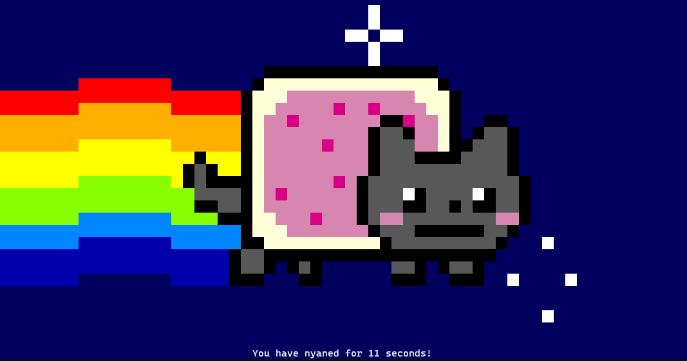

## Lab 01: Running Simple Containers

> This lab is based on [Cloud Academy's course on Building, Deploying, and Running Containers in Production.](https://cloudacademy.com/learning-paths/building-deploying-and-running-containers-in-production-1-888/)

Before we begin, make sure you've setup the following pre-requisites

  - [Install Docker](../README.md#pre-requisites)


In this lab, we'll run two simple containers here.

### whalesay

Run the command below. It will pull the image from Dockerhub and run it locally.

```bash
$ sudo docker run docker/whalesay cowsay Infinity and beyond!
```

You should see and output like this.

```bash
< Infinity and beyond! >
 ----------------------
    \
     \
      \
                    ##        .
              ## ## ##       ==
           ## ## ## ##      ===
       /""""""""""""""""___/ ===
  ~~~ {~~ ~~~~ ~~~ ~~~~ ~~ ~ /  ===- ~~~
       \______ o          __/
        \    \        __/
          \____\______/
```

Now make the whale say "Let's do this!"

```bash
$ sudo docker run docker/whalesay cowsay "Let's do this!"
```
```bash
 ________________
< Let's do this! >
 ----------------
    \
     \
      \
                    ##        .
              ## ## ##       ==
           ## ## ## ##      ===
       /""""""""""""""""___/ ===
  ~~~ {~~ ~~~~ ~~~ ~~~~ ~~ ~ /  ===- ~~~
       \______ o          __/
        \    \        __/
          \____\______/ 
```


### nyancat 

Run the command below. It will pull the image from Dockerhub and run it locally.
```bash
$ sudo docker run -it --rm --name nyancat 06kellyjac/nyancat
```

  
