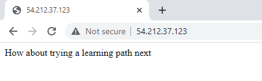

## Lab 04: Serving a Golang Application through Docker 

> *This lab is based on [Cloud Academy's Learning Path on Building, Deploying, and Running Containers in Production.](https://cloudacademy.com/learning-paths/building-deploying-and-running-containers-in-production-1-888/)*

Before we begin, make sure you've setup the following pre-requisites

  - [Install Docker](../README.md#pre-requisites)
  - [Install Go](../README.md#pre-requisites)

### Introduction

In this lab, we'll be deploying a website written in Go(golang) on a container. We'll also make sure that it is accesible from our machine. 

Let's start with creating the project directory where we'll create our files.

```bash
$ mkdir lab04_Serving_Golang_App_through_Docker
$ cd lab04_Serving_Golang_App_through_Docker/
```

### Create the Files 

Install Git.

```bash
$ sudo yum -y install git 
```

Clone the repository to your machine.

```bash
$ git clone https://github.com/cloudacademy/flask-content-advisor.git
$ cd flask-content-advisor 
```

For our website to work, it needs some packages installed. These packages are defined in the **requirements.txt.**

```bash
flask == 1.1.4
markupsafe==2.0.1 
```

Let's now create the dockerfile.

```bash
$ vim Dockerfile 
```
```bash
# Python v3 base layer
FROM python:3

# Set the working directory in the image's file system
WORKDIR /usr/src/app

# Copy everything in the host working directory to the container's directory
COPY . .

# Install code dependencies in requirements.txt
RUN pip install --no-cache-dir -r requirements.txt

# Indicate that the server will be listening on port 5000
EXPOSE 5000

# Set the default command to run the app
CMD [ "python", "src/app.py" ] 
```

### Build the Image 

Build the image from the Dockerfile.

```bash
$ docker build -t flask-content-advisor:latest . 
```

Get the IP of you machine. We will need this later.

```bash
$ curl ipecho.net/plain; echo 
```

### Run the Container

Finally, run the container from the image.

```bash
$ docker run --name advisor -p 80:5000 flask-content-advisor 
```

Open an internet browser and navigate to the IP that you just saved.

  


### Cleanup 

When you're done with the lab, you can stop all running containers by running the command below.

```bash
$ docker stop $(docker ps) 
```

Once all containers have "Exited" status, remove them.

```bash
$ docker ps  -a 
```
```bash
$ docker container prune -f 
```

Finally, remove all images.

```bash
$ docker image prune -af 
```
