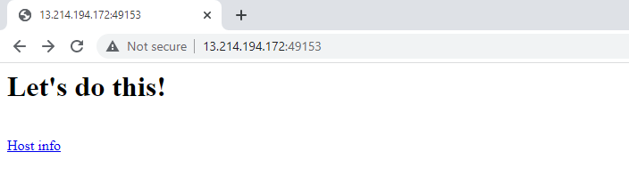

## Lab 06: Port Mapping for a Containerized Application

Before we begin, make sure you've setup the following pre-requisites

  - [Install Docker](../pages/01-Pre-requisites/labs-docker-pre-requisites/README.md)
  - [Install Go](../pages/01-Pre-requisites/labs-optional-tools/README.md#install-go)

### Introduction

In this lab, we'll run a container that serves a basic website written in Go. We'll get to see how to map the container ports dynamically to ports on the local host. We'll also get to specify which ports on the local host to bind our container ports to.

Start with creating the project directory where we'll create our files.

```bash
$ mkdir lab06_Port_Mapping_Containerized_App
$ cd lab06_Port_Mapping_Containerized_App
```

### Create the Files 

Here's the code for our website.

<details><summary> webapp.go </summary>

```go
package main

import (
	"fmt"
	"net/http"
	"os"
)

func hostHandler(w http.ResponseWriter, r *http.Request) {
	name, err := os.Hostname()

	if err != nil {
		panic(err)
	}

	fmt.Fprintf(w, "<h1> HOSTNAME: %s</h1><br>", name)
	fmt.Fprintf(w, "<h1> ENVIRONMENT VARS: </h1><nr>")
	fmt.Fprintf(w, "<ul>")

	for _, evar := range os.Environ() {
		fmt.Fprintf(w, "<li>%s</li>", evar)
	}
	fmt.Fprintf(w, "</ul>")
}

func rootHandler(w http.ResponseWriter, r *http.Request) {
	fmt.Fprintf(w, "<h1> Let's do this! </h1><br>")
	fmt.Fprintf(w, "<a href='/host/'> Host info </a><br>")
}

func main() {
	http.HandleFunc("/", rootHandler)
	http.HandleFunc("/host/", hostHandler)
	http.ListenAndServe(":8080",nil)
}

```

</details>


Let's compile and build the packages.

```bash
$ env GOARCH=386 GOOS=linux go build webapp.go 
```

```bash
$ ll
total 6008
drwxrwxr-x 2 ubuntu ubuntu    4096 Jun 23 10:46 ./
drwxr-x--- 9 ubuntu ubuntu    4096 Jun 23 10:34 ../
-rwxrwxr-x 1 ubuntu ubuntu 6137719 Jun 23 10:46 webapp*
-rw-rw-r-- 1 ubuntu ubuntu     700 Jun 23 10:44 webapp.go 
```

Now let's create the dockerfile.

```bash
FROM scratch
COPY webapp /
EXPOSE 8080
CMD ["/webapp"] 
```

### Build the Image 

```bash
$ docker build -t "webapp" . 
```
```bash
$ docker images
REPOSITORY   TAG       IMAGE ID       CREATED         SIZE
webapp       latest    35cc7454ab2d   3 seconds ago   6.14MB 
```

### Dynamically bind the port and Run the Container

Run the container in the background using the "-d" flag. To access the website, we should also map the local host's port to a port in the container.

Recall that in our dockerfile, our container exposes port 8080.

```bash
EXPOSE 8080
```
To dynamically map the container port to a port on the localhost, use the "-P" flag. In the example below, we see that the container port is binded to port 49153 on the localhost.

```bash
$ docker run -d -P webapp 
```
```bash
$ docker ps
CONTAINER ID   IMAGE     COMMAND     CREATED         STATUS         PORTS                                         NAMES
ce03b2560913   webapp    "/webapp"   5 seconds ago   Up 4 seconds   0.0.0.0:49153->8080/tcp, :::49153->8080/tcp   fervent_lichterman 
```

Get the IP of your machine.

```bash
$ curl ipecho.net/plain; echo 
```

Open your web browser and navigate to the IP, followed by the port.

<p align=center>

</p>

### Map to a Specific Port and Run the Container

To specify the port on the localhost to which to bind the container port, use the "-p" flag.

```bash
$ docker run -d -p 3000:8080 webapp 
```
```bash
$ docker ps
CONTAINER ID   IMAGE     COMMAND     CREATED         STATUS         PORTS                                         NAMES
e3e1018a9eaa   webapp    "/webapp"   7 seconds ago   Up 6 seconds   0.0.0.0:3000->8080/tcp, :::3000->8080/tcp     sad_jemison
ce03b2560913   webapp    "/webapp"   6 minutes ago   Up 6 minutes   0.0.0.0:49153->8080/tcp, :::49153->8080/tcp   fervent_lichterman 
```

Test it by running a cURL.

```bash
$ curl localhost:3000
<h1> Let's do this! </h1><br><a href='/host/'> Host info </a><br> 
```

If we try to run another container and map to the same local host port, it will throw an error.

```bash
$ docker run -d -p 3000:8080 webapp

docker: Error response from daemon: driver failed programming external connectivity on endpoint kind_diffie  
Bind for 0.0.0.0:3000 failed: port is already allocated. 
```

### Cleanup 

When you're done with the lab, you can stop all running containers by running the command below.

```bash
$ docker stop $(docker ps) 
```

Once all containers have "Exited" status, remove them.

```bash
$ docker ps  -a 
```
```bash
$ docker container prune -f 
```

Finally, remove all images.

```bash
$ docker image prune -af 
```
