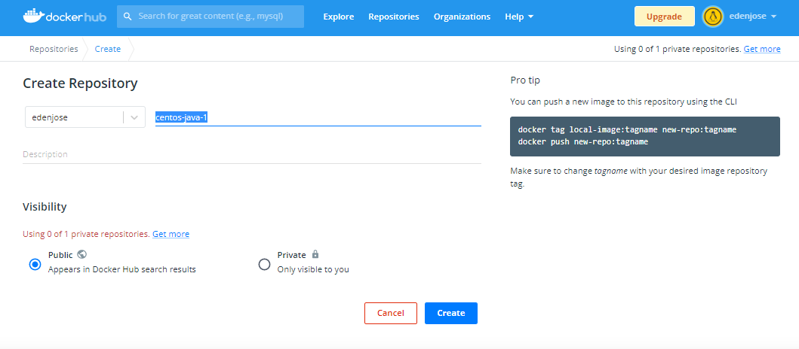
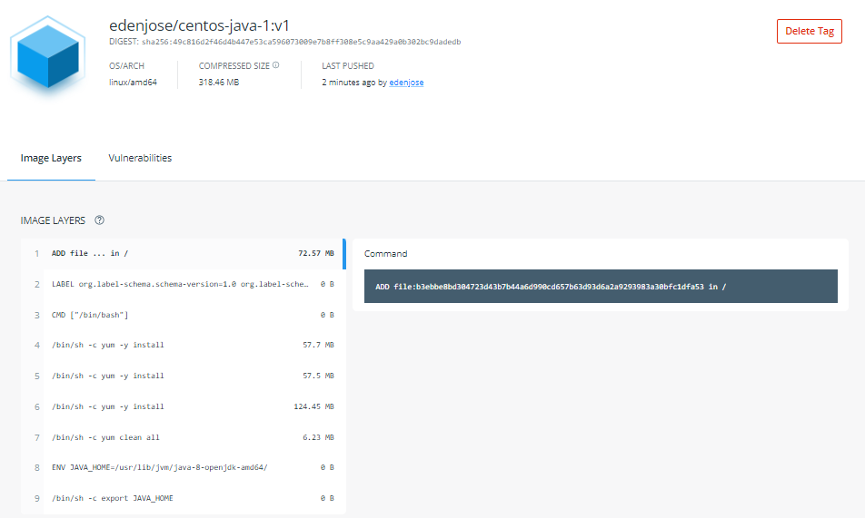

## Lab 09: Tagging Images

Before we begin, make sure you've setup the following pre-requisites

  - [Install Docker](../pages/01-Pre-requisites/labs-docker-pre-requisites/README.md)
  - [Install Go](../pages/01-Pre-requisites/labs-optional-tools/README.md#install-go)

### Introduction

In this lab, we'll get to see how to use tagging for docker images. It is recommended to provide your images with tags and practice it early on since it'll be helpful when identifying versions and features of the images.

Let's start with creating the project directory where we'll create our files.

```bash
$ mkdir Lab09_Tagging_Images 
$ cd Lab09_Tagging_Images
```

### Example 1: Single Tag

#### Create the File

Create **dockerfile-1**. Here we're using CentOS version 7 as the base image and we're installing Java on top of it.

```bash
FROM centos:7
RUN yum -y install wget 
RUN yum -y install unzip 
RUN yum -y install java-1.8.0-openjdk 
RUN yum clean all
ENV JAVA_HOME /usr/lib/jvm/java-8-openjdk-amd64/
RUN export JAVA_HOME 
```

#### Build an Image with a Single Tag

Use the "-f" flag to specify the **dockerfile-1**.

```bash
$ docker build -t "centos-java-1" -f dockerfile-1 . 
```

Notice that we have two images created. Since our dockerfile-1 uses a CentOS:7 image, [it pulls the official image from the dockerhub repository](https://hub.docker.com/_/centos)

```bash
$ docker images
REPOSITORY      TAG       IMAGE ID       CREATED          SIZE
centos-java-1   latest    f4da659e7493   25 seconds ago   939MB
centos          7         eeb6ee3f44bd   9 months ago     204MB 
```

### Example 2: Dockerhub Username and Image Name

#### Create an Account in Dockerhub

For this example, we would need to [create a free account in Dockerhub.](https://hub.docker.com/signup) You should also be able to link your Github account to it. 

Once you have your account setup, create a repository. I'm using "centos-java-1" as my repository name.

<p align=center>

</p>

Back in your terminal, login to dockerhub. Enter your username and password.

```bash
$ sudo docker login

Login with your Docker ID to push and pull images from Docker Hub. If you don't have a Docker ID, head over to https://hub.docker.com to create one.
Username: edenjose
Password: 
```

#### Using Docker Tag

We currently have these two images.

```bash
$ docker images
REPOSITORY      TAG       IMAGE ID       CREATED          SIZE
centos-java-1   latest    f4da659e7493   16 minutes ago   939MB
centos          7         eeb6ee3f44bd   9 months ago     204MB 
```

We want to tag it with another tag and the username for our docker registry using the format below.

```bash
$ sudo docker tag <image ID> <username/repo-name>:latest 
```
```bash
$ docker tag f4d edenjose/centos-java-1:v1 
```

When we check our images, we now see three images. There's actually just two images; the first two are pointing to the same image ID as seen below.

```bash
$ docker images
REPOSITORY               TAG       IMAGE ID       CREATED          SIZE
edenjose/centos-java-1   v1        f4da659e7493   20 minutes ago   939MB
centos-java-1            latest    f4da659e7493   20 minutes ago   939MB
centos                   7         eeb6ee3f44bd   9 months ago     204MB 
```

#### Pushing the Image to the Registry

Now that it's prepped-up, we're ready to push it to our dockerhub repo.

```bash
sudo docker push <username/repo-name>
```
```bash
$ sudo docker push edenjose/centos-java-1:v1 
```

Checking in Dockerhub,

<p align=center>

</p>

<p align=center>

</p>

### Example 3: Multiple Tags

Let's build an image from the same dockerfile-1 in Example 1. These time we'll use "-t" for every tags we give to the image.

```bash
$ docker build -f dockerfile-1 \
-t project-centos-java:projectX \
-t feature-centos-java:v1.a2 \
-t devops-centos-java:devops-team.v12.0 . 
```

We can see that five tags have been created for the same image ID.

```bash
$ docker images
REPOSITORY               TAG                 IMAGE ID       CREATED          SIZE
edenjose/centos-java-1   v1                  f4da659e7493   35 minutes ago   939MB
centos-java-1            latest              f4da659e7493   35 minutes ago   939MB
devops-centos-java       devops-team.v12.0   f4da659e7493   35 minutes ago   939MB
feature-centos-java      v1.a2               f4da659e7493   35 minutes ago   939MB
project-centos-java      projectX            f4da659e7493   35 minutes ago   939MB
centos                   7                   eeb6ee3f44bd   9 months ago     204MB 
```


### Example 4: Versions

Remove the images created from the previous examples.

```bash
$ docker image prune --all --force
``` 

#### Create the File 

Create **dockerfile-2**. Here we're using Ubuntu version 16.04 as the base image. We're also creating a *demo* directory with a file named *message* inside. 

When the container is ran, it will print out the message in stdout by using the "/bin/bash" command.

```bash
FROM ubuntu:16.04

RUN mkdir -p /demo && \
    echo "Version 1" > /demo/message

CMD ["/bin/cat", "/demo/message"]
```

#### Build the Image and Run the Container 

Here we're not specifying a tag for the "lab08" image ID. Docker will automatically give the image a "latest" tag.

```bash
$ docker build -f dockerfile-2 -t lab08 . 
```

As expected, we'll see two images created. The first one is the official Ubuntu image pulled down from the Dockerhub repository and is used as the base image for our "lab08" image.

```bash
$ docker images

REPOSITORY   TAG       IMAGE ID       CREATED         SIZE
lab08        latest    29b1931e8be7   9 seconds ago   135MB
ubuntu       16.04     b6f507652425   9 months ago    135MB
```

To add another tag to the lab08 image,

```bash
$ docker tag lab08:latest lab08:v1
```

```bash
$ docker images
REPOSITORY   TAG       IMAGE ID       CREATED          SIZE
lab08        latest    29b1931e8be7   43 seconds ago   135MB
lab08        v1        29b1931e8be7   43 seconds ago   135MB
ubuntu       16.04     b6f507652425   9 months ago     135MB 
```

If we run a container from the "lab08" image without specifying the tag, it will automatically use the one tagged "latest". When we run the container, it should return the "Version 1" as we've specified in the dockerfile-2.

```bash
$ docker run lab08

Version 1 
```

#### Modify the Dockerfile and Build another Image

Edit the **dockerfile-2.**

```bash
FROM ubuntu:16.04

RUN mkdir -p /demo && \
    echo "Version 2" > /demo/message

CMD ["/bin/cat", "/demo/message"]
```

Build the image and add a tag "v2".

```bash
$ docker build -f dockerfile-2 -t lab08:v2 . 
```
```bash
$ docker images
REPOSITORY   TAG       IMAGE ID       CREATED         SIZE
lab08        v2        768ec6c8d404   7 seconds ago   135MB
lab08        latest    29b1931e8be7   5 minutes ago   135MB
lab08        v1        29b1931e8be7   5 minutes ago   135MB
ubuntu       16.04     b6f507652425   9 months ago    135MB 
```

Now run containers from the images tagged with "latest", "v1" and "v2".

```bash
$ docker run lab08
Version 1
```
```bash 
$ docker run lab08:v1
Version 1
```
```bash
$ docker run lab08:v2
Version 2 
```

As expected, the "latest" and "v1" were built from the dockerfile with "Version 1" as the message. The message has been "baked" onto the image so that when the dockerfile was modified, the two images tagged with "latest" and "v1" were not affected.

### Cleanup 

When you're done with the lab, you can stop all running containers by running the command below.

```bash
$ docker stop $(docker ps) 
```

Once all containers have "Exited" status, remove them.

```bash
$ docker ps  -a 
```
```bash
$ docker container prune -f 
```

Finally, remove all images.

```bash
$ docker image prune -af 
```
