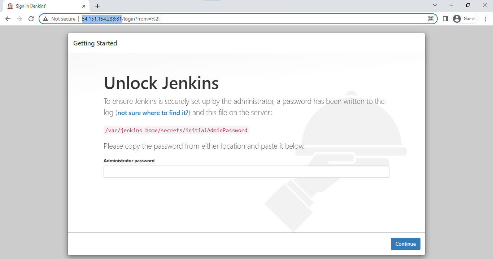
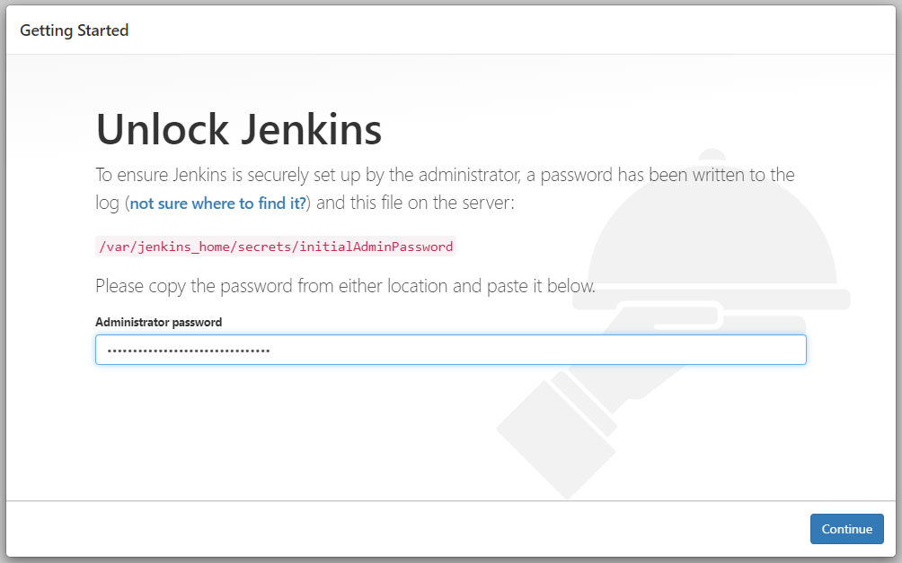

## Lab 10: Running a Jenkins Container
 
Before we begin, make sure you've setup the following pre-requisites

  - [Install Docker](../README.md#pre-requisites)

### Introduction
  
In this lab, we'll mix up the Docker concepts we've played around so far. This is a fairly simple lab as no dockerfile is required and the official container image is already available. 

### Docker run 

We will spin up a Jenkins container with a specified name and mapped ports. We'll only use a single **docker run** commmand:

```bash
$ docker run -d --name my-jenkins-svr -u root -p 81:8080 -v /root/new-folder:/var/jenkins_home jenkins/jenkins 
```

Here's the breakdown:

- This *pull* is optional as the *run* command will automtically pull down the Jenkins image from Dockerhub. Note that you'll come across the first deprecated version. You'll have to pull the new one - **jenkins/jenkins**

  ```bash
  docker pull jenkins/jenkins
  ```
  ```bash
  docker run jenkins/jenkins 
  ```

- Specifies a name for our container

  ```bash
  --name my-jenkins-svr
  ```
- Maps a port using the "-p" flag (8080 is the default port of container, and 81 is a port in our local machine)

  ```bash 
  -p 81:8080
  ```
- Maps the default jenkins directory (that will be created in the container) to a directory in our linux machine by using the "-v" flag

  ```bash
  -v /root/new-folder:/var/jenkins_home
  ```

- We might encounter a permission error when we try to run the container with the flags. Use the "-u" flag, followed by the user in our linux machine

  ```bash 
  -u root
  ```
Notice that we use a "-d" flag which means the container will run in the background. To check if the container is running,

```bash
$ docker ps

CONTAINER ID   IMAGE             COMMAND                  CREATED         STATUS         PORTS
                    NAMES
fb5f7a292cf9   jenkins/jenkins   "/usr/bin/tini -- /u…"   3 seconds ago   Up 2 seconds   50000/tcp, 0.0.0.0:81->8080/tcp, :::81->8080/tcp   my-jenkins-svr 
```

Open a web browser and navigate to the IP address of your local machine followed by port 81, like this:

```bash
54.151.154.238:81/ 
```

You should see the "Unlock Jenkins" page. Before we can use Jenkins, we would need to get the password from the terminal first.

<p align=center>

</p>

Back in our terminal, use the **exec** instruction to **cat** the file specified. Notice that we don't need to specify the entire container ID and just the first three since no other container IDs have the same first three containers, in fact there are no other containers running.

```bash
$ docker ps
CONTAINER ID   IMAGE             COMMAND                  CREATED         STATUS         PORTS
                    NAMES
fb5f7a292cf9   jenkins/jenkins   "/usr/bin/tini -- /u…"   3 minutes ago   Up 3 minutes   50000/tcp, 0.0.0.0:81->8080/tcp, :::81->8080/tcp   my-jenkins-svr 
```

```bash
$ docker exec -it fb5 cat /var/jenkins_home/secrets/initialAdminPassword

a1abcdefghijklmnop123456789qrst
```

Paste the password to the "Unlock Jenkins" page. It should succeed and you should now see the "Customize Jenkins" page.

<p align=center>

</p>

We've successfully deployed a Jenkins container and we've verified that it is running by accessing the Jenkins UI console. We'll end this lab here for now but we'll have an entire set of labs for Jenkins in another repository which I will link here soon.

### Cleanup 

When you're done with the lab, you can stop all running containers by running the command below.

```bash
$ docker stop $(docker ps) 
```

Once all containers have "Exited" status, remove them.

```bash
$ docker ps  -a 
```
```bash
$ docker container prune -f 
```

Finally, remove all images.

```bash
$ docker image prune -af 
```
