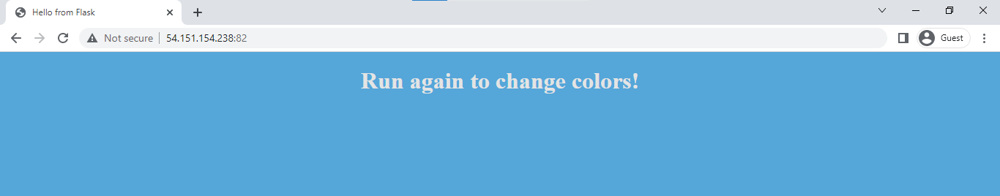
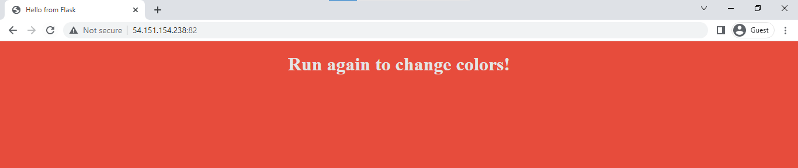
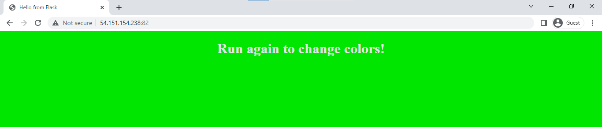

## Lab 11: Shell Environment Variables 

Before we begin, make sure you've setup the following pre-requisites

  - [Install Docker](../README.md#pre-requisites)

### Introduction
  
In this lab, we'll understand how to use shell environment variables. There are other ways to define variables in Docker such as defining through an environment file, a dockerfile, or a docker-compose file. 

We'll containerize an application which will display a simple website that will change colors based on the color we passed on the terminal.

Let's start with creating the project directory where we'll create our files.

```bash
$ mkdir lab11_Shell_Env_Vars
$ cd lab11_Shell_Env_Vars
```

### Create the files 

Create the **templates** directory and the simple **hello.html** inside it.

```bash
$ mkdir templates
$ vim templates/hello.html 
```

<details><summary> hello.html </summary>

```html
<!doctype html>
<title>Hello from Flask</title>
<body style="background: {{ color }};"></body>
<div style="color: #e4e4e4;
    text-align:  center;
    height: 90px;
    vertical-align:  middle;">

  <h1>Run again to change colors!</h1>


  
  <textarea rows="10" cols="50">
    {{ contents }}
  </textarea>
  

</div>
```

</details>
<br>

Here's the **app.py** written in Python.

<details><summary> app.py </summary>

```python
from flask import Flask
from flask import render_template
import socket
import random
import os
import argparse

app = Flask(__name__)

color_codes = {
    "red": "#e74c3c",
    "orange": "#ffa500",
    "yellow": "#ffff4d",
    "green": "#00e600",
    "blue": "#55a6d9",
    "violet": "#ee82ee",
    "indigo": "#4b0082",
    "pink": "#ffc0cb",
    "white": "#ffffff",
    "black": "#000000",
    "gray": "#cccccc"
}

SUPPORTED_COLORS = ",".join(color_codes.keys())

# Get color from Environment variable
COLOR_FROM_ENV = os.environ.get('APP_COLOR')
# Generate a random color
COLOR = random.choice(["red", "green", "blue", "blue2", "darkblue", "pink"])


@app.route("/")
def main():
    # return 'Hello'
    return render_template('hello.html', name=socket.gethostname(), color=color_codes[COLOR])


if __name__ == "__main__":

    print(" This is a sample web application that displays a colored background. \n"
          " A color can be specified in two ways. \n"
          "\n"
          " 1. As a command line argument with --color as the argument. Accepts one of " + SUPPORTED_COLORS + " \n"
          " 2. As an Environment variable APP_COLOR. Accepts one of " + SUPPORTED_COLORS + " \n"
          " 3. If none of the above then a random color is picked from the above list. \n"
          " Note: Command line argument precedes over environment variable.\n"
          "\n"
          "")

    # Check for Command Line Parameters for color
    parser = argparse.ArgumentParser()
    parser.add_argument('--color', required=False)
    args = parser.parse_args()

    if args.color:
        print("Color from command line argument =" + args.color)
        COLOR = args.color
        if COLOR_FROM_ENV:
            print("A color was set through environment variable -" + COLOR_FROM_ENV + ". However, color from command line argument takes precendence.")
    elif COLOR_FROM_ENV:
        print("No Command line argument. Color from environment variable =" + COLOR_FROM_ENV)
        COLOR = COLOR_FROM_ENV
    else:
        print("No command line argument or environment variable. Picking a Random Color =" + COLOR)

    # Check if input color is a supported one
    if COLOR not in color_codes:
        print("Color not supported. Received '" + COLOR + "' expected one of " + SUPPORTED_COLORS)
        exit(1)

    # Run Flask Application
    app.run(host="0.0.0.0", port=8080)
```

</details>
<br>

Next, create the **dockerfile.**

```bash
FROM python:3.6

RUN pip install flask

WORKDIR /opt

COPY ./ /opt

EXPOSE 8080

ENTRYPOINT ["python", "app.py"] 
```

Our project directory should now look like this:

```bash
$ tree

├── app.py
├── dockerfile
└── templates
    └── hello.html

1 directory, 3 files 
```

### Build the Image 

Build the image from the dockerfile and give it the name "my-flask-app". It will take a few minutes to build the image since it will pull down the Python container image from Dockerhub. It will then use the Python image as the base image. You should see the "Successful built" returned once it's done.

```bash
$ docker build . -t my-flask-app 
```
```bash
Successfully built d40b9ef9ada7
Successfully tagged my-flask-app:latest 
```

Verify that the image is created.  As mentioned, the Python image is pulled down to our local machine.

```bash
$ docker images
REPOSITORY     TAG       IMAGE ID       CREATED              SIZE
my-flask-app   latest    d40b9ef9ada7   About a minute ago   913MB
python         3.6       54260638d07c   6 months ago         902MB 
```

### The Fun Part - Run the Container!

Before we run the container, get the IP of your machine.

```bash
$ curl ipecho.net/plain; echo 
```

We'll use the command below to run the container. Use the "-e" flag to define the **APP_COLOR** variable and specify a color. Make sure to append the image name/repository at the end.

```bash
$ docker run -p 82:8080 -e APP_COLOR=blue my-flask-app 
```

It should return the following output:

<details><summary> docker run - output </summary>

```bash
 This is a sample web application that displays a colored background.
 A color can be specified in two ways.

 1. As a command line argument with --color as the argument. Accepts one of red,orange,yellow,green,blue,violet,indigo,pink,white,black,gray

 2. As an Environment variable APP_COLOR. Accepts one of red,orange,yellow,green,blue,violet,indigo,pink,white,black,gray
 3. If none of the above then a random color is picked from the above list.
 Note: Command line argument precedes over environment variable.


No Command line argument. Color from environment variable =blue
 * Serving Flask app 'app' (lazy loading)
 * Environment: production
   WARNING: This is a development server. Do not use it in a production deployment.
   Use a production WSGI server instead.
 * Debug mode: off
 * Running on all addresses.
   WARNING: This is a development server. Do not use it in a production deployment.
 * Running on http://172.17.0.2:8080/ (Press CTRL+C to quit) 
```

</details>
</br>

Open a web browser and navigate to the IP address followed by the port number, like this:

```bash
54.151.154.238:82/ 
```

You should see the website displayed.

<p align=center>

</p>

Back in your terminal, hit **Ctrl-C** to quit and run the container again. Specify "red" this time.

```bash
$ docker run -p 82:8080 -e APP_COLOR=red my-flask-app 
```

The website color should now change to red.

<p align=center>

</p>

Try running containers and use different colors. Note that the code only accepts eleven colors. If you specified a color that is not declared in the code, you'll get the error message below:

```bash
$ docker run -p 82:8080 -e APP_COLOR=darkblue my-flask-app 
```
```bash
No Command line argument. Color from environment variable =darkblue
Color not supported. Received 'darkblue' expected one of red,orange,yellow,green,blue,violet,indigo,pink,white,black,gray
```

**What if we didn't specify the environment variable?**

```bash
$ docker run -p 82:8080 my-flask-app 
```

<p align=center>

</p>

As seen, the website will randomly choose a color from declared list of colors. Note that this catch-all is defined in the application code so that it won't return an error if it doesn't find any "color".

In general, Docker will complain and return an error message if the environment variable doesn't have a value assigned to it.

### Cleanup 

When you're done with the lab, you can stop all running containers by running the command below.

```bash
$ docker stop $(docker ps) 
```

Once all containers have "Exited" status, remove them.

```bash
$ docker ps  -a 
```
```bash
$ docker container prune -f 
```

Finally, remove all images.

```bash
$ docker image prune -af 
```
