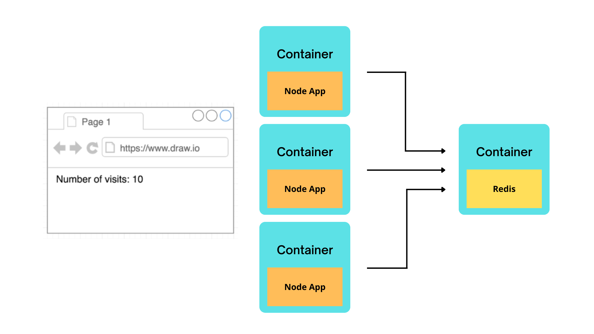
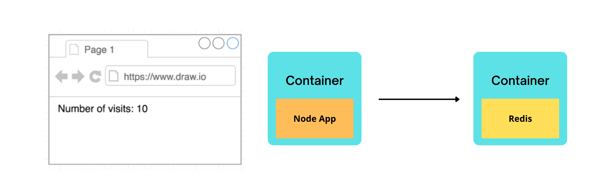
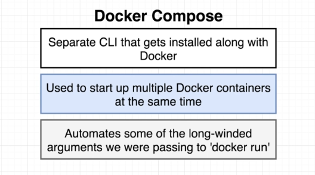
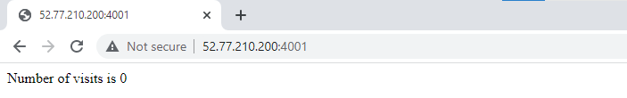
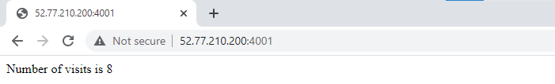
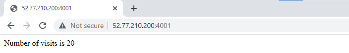
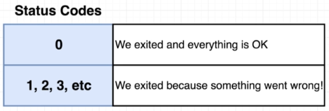
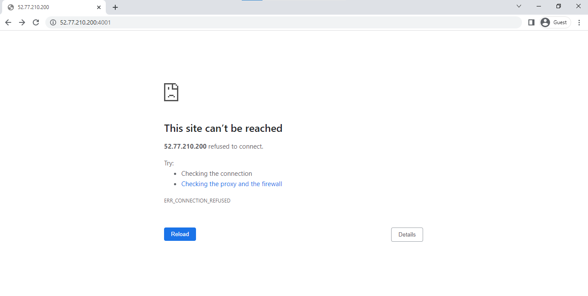
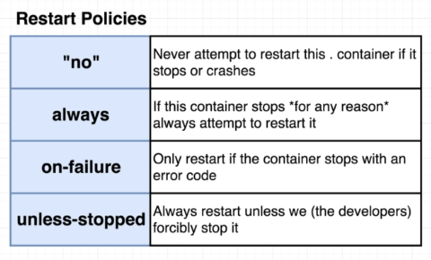

## Lab 12: Docker Compose for Multiple Local Containers

Before we begin, make sure you've setup the following pre-requisites

  - [Install Docker](../pages/01-Pre-requisites/labs-docker-pre-requisites/README.md)

### Introduction

In this lab, we'll containerize a web application that displays (inside a web browser) the number of visits it received. For this to work, we would need two components:

- a web server running the Node application
- a Redis server which will store the number of visits

For future scaling, we will use this architecture where we have multiple Node server connecting to a single instance of a Redis container.

<p align=center>

</p>

Let's start with creating the project directory where we'll create our files.

```bash
$ mkdir lab12_Docker_Compose_Multiple_Containers 
$ cd lab12_Docker_Compose_Multiple_Containers
```

### Starting small

For the first iteration of this lab, we don't need to think about scaling just yet so we'll create a single container for the Node application and a single container for the Redis server.

<p align=center>

</p>

### Create the App Server code

Create the **package.json**. We'll specify the dependencies and scripts  of our application here. The "redis" dependency is a Javascript client library for connecting to a Redis server.

```bash
{
  "dependencies": {
    "express": "*",
    "redis": "2.8.0"
  },
  "scripts": {
    "start": "node index.js"
  }
} 
```

Next, create the **index.js** which will hold the application code.

```js
// Import express and redis library
const express = require('express');
const redis = require('redis');

// Creates instance of the express application
// Setup connection to Redis server
const app = express();
const client = redis.createClient();

// Initializes the number of visits to zero at the start
client.set('visits', 0);

// App handler
// Gets the number of visits and update visit counter
app.get('/', (req, res) => {
  client.get('visits', (err, visits) => {
    res.send('Number of visits is ' + visits);
    client.set('visits', parseInt(visits) + 1);
  });
});

// If application is launched successfully,
// it'll show the "Listening..." message
app.listen(8081, () => {
  console.log('Listening on port 8081');
}); 
```

### Create the Dockerfile for the Node App 

Create the **dockerfile** for the Node server.

```bash
FROM node:alpine

WORKDIR '/app'

COPY package.json .
RUN npm install
COPY . .

CMD ["npm", "start"]
```

### Build the Image

Build the image from the dockerfile.

```bash
$ docker build . -t nodeapp-visits -f dockerfile 
```

```bash
$ docker images
REPOSITORY       TAG       IMAGE ID       CREATED              SIZE
nodeapp-visits   latest    1f5db8562b53   About a minute ago   180MB
node             alpine    515db77e67c7   8 days ago           174MB 
```

We can try to run a container from this container image but it'll return an error because it will try to connect to a Redis server which we haven't setup yet.

Since an official Redis container image is already available, we can simple run the container. Docker will check first if the image exists locally and when it's not able to find one, it will check the image from Dockerhub and pull it down to our local machine.

```bash
$ docker run -d redis 
```

**Now that we have a running Redis container, can we run the container for the Node App?** Nope. We'll still get an error because even though the Redis server is already up, the Node app doesn't have a way to communicate to the Redis instance. We would need to setup the networking.

### Using Docker-Compose

There are two options to setup the network connections between containers:

- using the Docker CLI
- using Docker Compose

Of the two, docker-compose is mostly used since it's much easier to define the configuration in a docker-compose file than running CLI commmands every single time. 

Note that docker-compose isn't only used to setup networking between containers but it is extremely useful when you're starting up and managing multiple containers at the same time. 

<p align=center>

</p>

Create the **docker-compose.yml.** We define the "redis" and "node-app" as **services**. Since Redis has an available image from Dockerhub, we can use it.

```bash
# There are three versions, v3 support docker swarm.
version: '3'

services:

  redis-server:
    image: 'redis'

  node-app:
    build: .
    ports: 
      - "4001:8081"
```

As for the node-app, we want docker-compose to basically do the same process of "building the image" and "running the container". We use the **build** instruction which tells Docker to look for a dockerfile in the current directory (".") and build the image from there.

In addition to this, we also want to map the local machine's port 4001 to the container's port 8081.

**Creating the Containers inside the Same Network**

It's important to know that this docker-compose file will create all the containers inside the same network. This ensures the containers can freely talk and exchange information between them without the need to expose ports between the two.

**Great. Containers can now talk to each other. But how can the application code access the Redis server?**

To do this, we can simply modify the **index.js** and add the 'redis-server' as host option in the **client** instance. We can also specify the default port that will be used by the Redis serve, which is port 6379.

<details><summary> index.js </summary>
 
```js 
// Import express and redis library
const express = require('express');
const redis = require('redis');

// Creates instance of the express application
// Setup connection to Redis server
const app = express();
const client = redis.createClient({
  host:  'redis-server',
  port: 6379
});

// Initializes the number of visits to zero at the start
client.set('visits', 0);

// App handler
// Gets the number of visits and update visit counter
app.get('/', (req, res) => {
  client.get('visits', (err, visits) => {
    res.send('Number of visits is ' + visits);
    client.set('visits', parseInt(visits) + 1);
  });
});

// If application is launched successfully,
// it'll show the "Listening..." message
app.listen(8081, () => {
  console.log('Listening on port 8081');
}); 
```

</details>
<br>

Our project directory should now look like this:

```bash
$ tree
.
├── docker-compose.yml
├── dockerfile
├── index.js
└── package.json

0 directories, 4 files
```

Before we run the containers, make sure to get the IP address of your local machine.

```bash
$ curl ipecho.net/plain; echo  
```

### Run the Containers

Now that we've created the necessary files, it's time to spin up the containers. Simply run the command below. This will look for a docker-compose.yml file in the working directory and create containers based on this file.

```bash
$ docker-compose up 
```

Once it's done, you should see the message:

```bash
redis-server_1  | 1:M 26 Jun 2022 09:30:13.281 * Ready to accept connections
node-app_1      |
node-app_1      | > start
node-app_1      | > node index.js
node-app_1      |
node-app_1      | Listening on port 4001 
```

Open a web browser and navigate to the IP address followed by the port number, like this:

```bash
52.77.210.200:4001
```

You should see the "Number of visits" is initially set to 0. Refresh it a couple of time to see it updating.

<p align=center>

</p>

<p align=center>>

</p>

<p align=center>>

</p>

To run the containers in the background,

```bash
$ docker-compose up -d
```

We can also check the image created and the running containers.

```bash
$ docker images

REPOSITORY                                          TAG       IMAGE ID       CREATED          SIZE
lab12_docker_compose_multiple_containers_node-app   latest    c554701a5427   12 minutes ago   180MB
redis                                               latest    2e50d70ba706   2 days ago       117MB
node                                                alpine    515db77e67c7   9 days ago       174MB 
```
```bash
$ docker ps

CONTAINER ID   IMAGE                                               COMMAND                  CREATED         STATUS         PORTS                                       NAMES
35cd41a20d63   lab12_docker_compose_multiple_containers_node-app   "docker-entrypoint.s…"   8 seconds ago   Up 7 seconds   0.0.0.0:4001->8081/tcp, :::4001->8081/tcp   lab12_docker_compose_multiple_containers_node-app_1
1d6804f6ccc0   redis                                               "docker-entrypoint.s…"   8 seconds ago   Up 7 seconds   6379/tcp                                    lab12_docker_compose_multiple_containers_redis-server_1
```

We could also check the running containers by using the docker-compose command below. Note that you can only run this command in the same directory where you're docker-compose file is located. This command basically checks the docker-compose file, gets the list of containers, and then verifies the status.

```bash
$ docker-compose ps 
```

If we run it inside a directory that doesn't have the docker-compose file, it will return an error.

```bash
~$ docker-compose ps
ERROR:
        Can't find a suitable configuration file in this directory or any
        parent. Are you in the right directory?

        Supported filenames: docker-compose.yml, docker-compose.yaml, compose.yml, compose.yaml 
```

### Crash the Containers

To stop the containers, we can simply run the command below.

```bash
$ docker-compose down
```

Let's say we intentionally want to cause an error by modifying the code. We're adding new variable called **process** and we'll force the code to return a "0" code whenever the site is visited. This is an exit status code.

<p align=center>

</p>

<details><summary> index.js </summary>
 
```js
// Import express and redis library
const express = require('express');
const redis = require('redis');
const process = require('process');

// Creates instance of the express application
// Setup connection to Redis server
const app = express();
const client = redis.createClient({
  host:  'redis-server',
  port: 6379
});

// Initializes the number of visits to zero at the start
client.set('visits', 0);

// App handler
// Gets the number of visits and update visit counter
app.get('/', (req, res) => {
  process.exit(0);
  client.get('visits', (err, visits) => {
    res.send('Number of visits is ' + visits);
    client.set('visits', parseInt(visits) + 1);
  });
});

// If application is launched successfully,
// it'll show the "Listening..." message
app.listen(8081, () => {
  console.log('Listening on port 4001');
}); 
```

</details>

Since we edited the code, we want Docker to rebuild the image and run the containers again.

```bash
$ docker-compose up --build 
```

Open your web browser again and enter your local machine's IP address and port. It should display an error.

<p align=center>

</p>

Back in our terminal, we should see this message returned,

```bash
lab12_docker_compose_multiple_containers_node-app_1 exited with code 0 
```

Open another tab and check the containers. We can see that the node container has stopped and only the redis container is running.

```bash
$ docker ps

CONTAINER ID   IMAGE     COMMAND                  CREATED          STATUS          PORTS      NAMES
19cd6f6179ec   redis     "docker-entrypoint.s…"   18 seconds ago   Up 17 seconds   6379/tcp   lab12_docker_compose_multiple_containers_redis-server_1 
```

### Add a Restart Policy 

To make sure that our containers will restart if it crashes, we can define a restart policy in the docker-compose file. As a recall, here are the restart policies that we can set:

<p align=center>

</p>

Set the **docker-compose.yml** to always restart when containers crash.

<details><summary> docker-compose.yml </summary>
 
```yml
# There are three versions, v3 support docker swarm.
version: '3'

services:

  redis-server:
    image: 'redis'

  node-app:
    restart: always
    build: .
    ports: 
      - "4001:8081"
```

</details>
<br>

Run the containers again and then try to open your web browser again. Notice that it still returns an error.

```bash
$ docker-compose up --build 
```

<p align=center>

</p>


Back in our terminal, we see that the node container attempts to restart.

```bash
node-app_1      | > start
node-app_1      | > node index.js
node-app_1      |
node-app_1      | Listening on port 4001
node-app_1      |
node-app_1      | > start
node-app_1      | > node index.js
node-app_1      |
node-app_1      | Listening on port 4001
lab12_docker_compose_multiple_containers_node-app_1 exited with code 0
node-app_1      |
node-app_1      | > start
node-app_1      | > node index.js
node-app_1      |
node-app_1      | Listening on port 4001
```

### Cleanup 

When you're done with the lab, you can stop all running containers by running the command below.

```bash
$ docker-compose down
```

Finally, remove all images.

```bash
$ docker image prune -af 
```
