# Lab 13: Really Big Project - Part 1: Create a Production-Grade Workflow

> *This lab is based on [Docker and Kubernetes: The Complete Guide](https://www.udemy.com/course/docker-and-kubernetes-the-complete-guide/)*

Before we begin, make sure you've setup the following pre-requisites

  - [Install Docker](../README.md#pre-requisites)
  - [Install Node and NPM](../README.md#pre-requisites)
  <!-- - [Install Go](../README.md#pre-requisites) -->

## Introduction

In this lab, we'll walk through a production-grade workflow which will use Docker to deploy an application. Remember that an application will not be deployed just one time. Changes will be introduced to an application, additional features will be develop to improve the application, and we will need to re-deploy the changes made. This is why we need to follow a workflow that allows a continuous development, testing, and deployment.

<p align="center">
  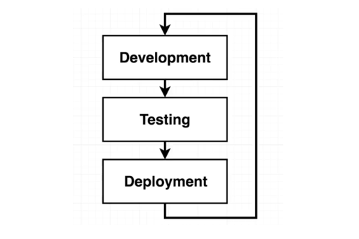
</p>

Let's start with creating the project directory where we'll create our files.

```bash
$ mkdir lab13_Big_Project 
$ cd lab13_Big_Project
```

You might find this entire lab to be exhaustingly long as there are a lot of steps to do here, lots of setups to build, and of course lots of stuff to break!

I've condensed the pages and contained them into collapsible sections so you can easily jump from one section to another by clicking the ▶ button. Once you're done with one section, you can simply collapse it and move to the next one.


## The Workflow

Before we get into the dirty work, let's understand first the development workflow that we'll follow for this project and for the rest of the other succeeding labs.

<details><summary> Click me to read more! </summary>
 

<p align=center>
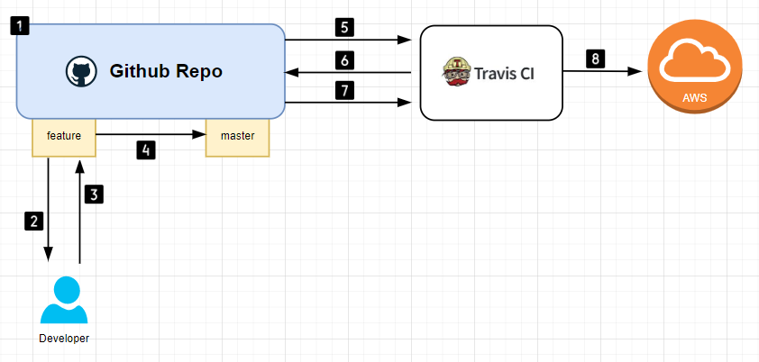
</p>

1. We'll have a Github repository which will serve as the central source of truth. The repo will have two branches: 
    - The feature branch is the development branch.
    - The master branch will have the final clean working code that will be deployed to our hosting provider.
2. We (the developer) always pulls the code from the feature branch down to our local machine. We can then make changes on the local copy of the codebase
3. We'll then push the changes back to the feature branch.
4. Create a pull request (PR) to merge the changes in feature branch over to the master branch.
5. Application is automatically pushed to Travis CI to run tests on the code.
6. After the tests pass, the PR is then merged to master.
7. Code is pushed to Travis CI again to run tests.
8. After the tests pass, deploy the application to AWS Elastic Beanstalk.

Here's another way to look at it:

<p align="center">
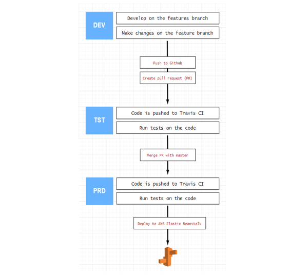
</p>
 
</details>


## The Project - Application

We'll work on a fairly simple React code and deploy it in a container. We'll be focusing less on the actual code and more on how we can wrap it in Docker. 

<details><summary> Click me to read more! </summary>
<br>

> *Note: If you are using Windows machines, you might encounter some issues. You may refer to the [Issues Encountered on Windows-based Machines](#issues-encountered-for-windows-based-machines)**

Before we proceed, make sure you've installed NodeJS and NPM. You can check out the [pre-requisites section]((../README.md#pre-requisites)) to know more.

Start with generating the app using **npx** to get the most current current libraries and resolve any depency conflicts. Note that there are two ways to do this.

**Before npm@.5.2.0**

```bash
$ npm install -g create-react-app
$ create-react-app client 
```

**As of npm@5.2.0 (recommended)**

```bash
$ npx create-react-app client 
```

We'll generate the project using the recommended approach. Enter "y" when prompted with the "Ok to proceed? (y)" message. More details on the CRA usage with npx can be found in the [official docs.](https://create-react-app.dev/docs/getting-started#quick-start)

It should return the following message:

<details><summary> create-react-app: output </summary>
 
```bash
Success! Created client at /home/ubuntu/client
Inside that directory, you can run several commands:

  npm start
    Starts the development server.

  npm run build
    Bundles the app into static files for production.

  npm test
    Starts the test runner.

  npm run eject
    Removes this tool and copies build dependencies, configuration files
    and scripts into the app directory. If you do this, you can’t go back!

We suggest that you begin by typing:

  cd client
  npm start

Happy hacking! 
```

</details>
<br>

We named the project "client" but we can also give it a different name, like:

```bash
$ npx create-react-app proj-eden-frontend
```

We'll use the **proj-eden-frontend** as our React application. A folder should be created for this project.

```bash
$ ls -l
total 8
drwxrwxr-x 6 ubuntu ubuntu 4096 Jun 27 09:53 client
drwxrwxr-x 6 ubuntu ubuntu 4096 Jun 27 10:00 proj-eden-frontend 
```

</details>

### 01 - Running NPM Commands 

We'll be running these three commands multiple times during the whole project.

<details><summary> Click me to read more! </summary>
<br>

**npm run start**
A development-only command which starts up a development server to host the application and to make it available inside our web browser. Note that this is NOT USED FOR PRODUCTION.

**npm run test**
This run tests associated with the project. All tests should pass before we can deploy our application.

**npm run build**
This concatenates all the Javascript projects files into one single file. This file will then be served to the production environment.

Let's go now to our React app, **proj-eden-frontend**.

```bash
$ cd proj-eden-frontend
```

#### npm run test

Let's try running tests. Run the command below and enter "a" to run all tests. Press "q" to quit.

```bash
$ npm run test 
```

<p align=center>
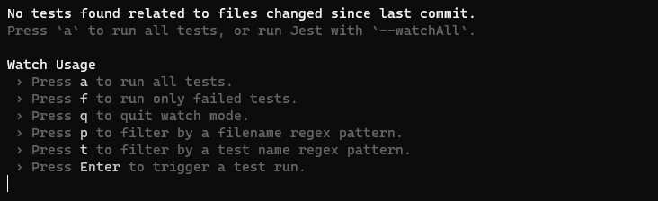
</p><p align=center>
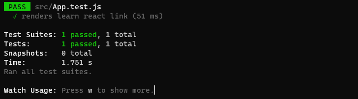
</p>

#### npm run build 

Now try to run **build.**

```bash
$ npm run build 
``` 

You should get the output below.

<details><summary> npm run build: output </summary>

```bash
Creating an optimized production build...
Compiled successfully.

File sizes after gzip:

  46.6 kB  build/static/js/main.f62b9e1e.js
  1.78 kB  build/static/js/787.e4717afd.chunk.js
  541 B    build/static/css/main.073c9b0a.css

The project was built assuming it is hosted at /.
You can control this with the homepage field in your package.json.

The build folder is ready to be deployed.
You may serve it with a static server:

  npm install -g serve
  serve -s build

Find out more about deployment here:

  https://cra.link/deployment 
```

</details>
<br>

You should now have the **build** folder created inside the **proj-eden-frontend** directory. If you try to run **tree**, it will display all the files and directory which are all nested inside. You should have around 4000+ files inside this project directory.

```bash
$ tree

4703 directories, 35518 files
```

These are the two files which we'll serve as a website.

```bash
$ ll build/index.html 
$ ll src/App.js
```

#### npm run start 

Finally, let's start a development server.

```bash
$ npm run start 
```

It should automatically open your web browser. If it doesn't, get your IP from the terminal.

```bash
$ curl ipecho.net/plain; echo 
```

Open your web browser and navigate to the IP address followed by port 3000, like this:

```bash
54.179.200.135:3000/
```

You should now see the React page.

<p align=center>
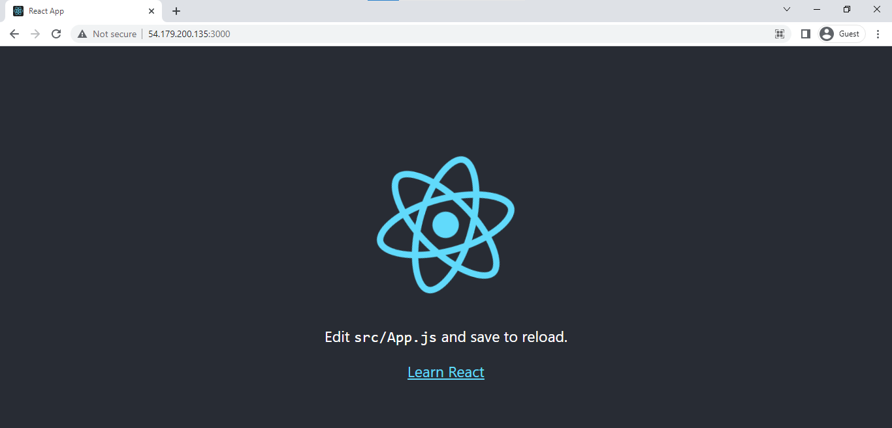
</p>

</details>

### 02 - Node modules are heavy files 

When we run the **tree** command inside the project directory, we saw that there are 4000+ files inside it. 

<details><summary> Click me to read more! </summary>

Majority of these files are actually **node modules** which are dependencies that the React need to run the application. 

```bash
$ tree node_modules/ 
```

If we're running locally, we will definitely need these dependencies. But since we'll be containerizing the application, we can simply delete this folder.

```bash
$ rm -r node_modules 
```

When you check in your browser again, you should now see error messages. This is alright as we'll run everything inside a container in the next steps.

<p align=center>
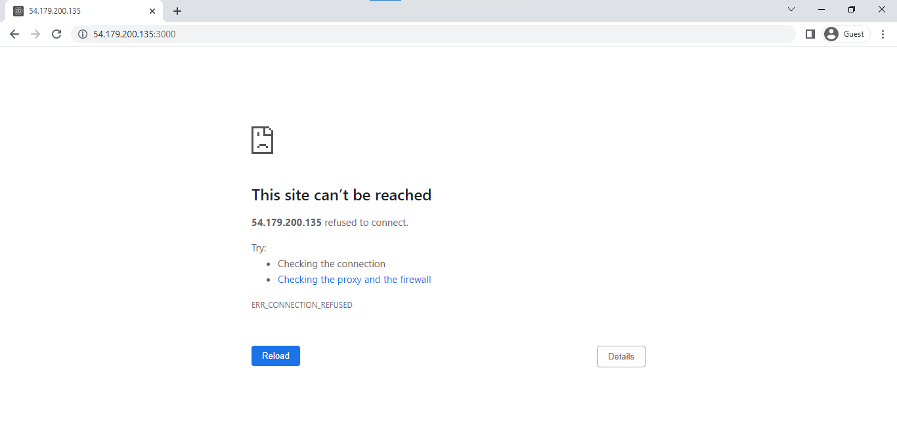
</p>

</details>

### 03 - Multiple Dockerfiles

Since we'll have a development and a production environment,  we will need to create separate dockerfiles for each.

<details><summary> Click me to read more! </summary>

Here's what we'll try to do:

<p align=center>
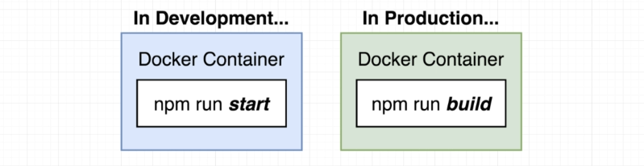
</p>

</details>

----------------------------------------------

## Time to Go DEV

We'll now start working on the code and deploy it inside a container in a development (DEV) environment. After that, we'll run simple tests on the environment.

<details><summary> Click me to read more! </summary>

To understand how our containerized application will work in a DEV environment,

<p align=center>
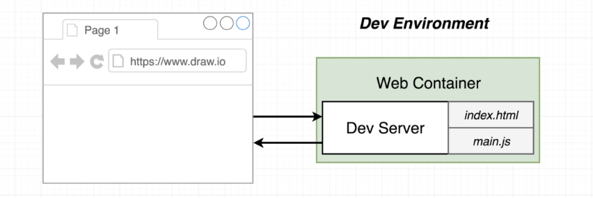
</p>

1. We will launch a development server inside our container which will receive requests from outside the container.
2. When we access the application from our web browser, our web browser will send requests to the app inside the container.
3. The dev server handles the incoming requests, takes the html and js files and sends them back to the browser where it will be served.

</details>

### 01 - Using the Dockerfile

Let's start with creating the dockerfile for DEV inside our project directory.

<details><summary> Click me to read more! </summary>

#### Create the Dockerfile and Build the Image

Make sure you're on the correct directory.

```bash
$ cd ~/lab13_Big_Project/proj-eden-frontend
```

```bash
$ vim dockerfile.dev
```

<details><summary> dockerfile.dev </summary>

```bash
# Uses node:alpine as base image
FROM node:alpine

# Creates working directory
WORKDIR '/app' 

# Copies file to working directory 
COPY package.json .

# Installs npm
RUN npm install

# Copy the remaining files
COPY . .

# If you're using Ubuntu, uncomment the two line below.
# This is because Ubuntu mounts volumes using the root user.
# If you're using different linux distro, comment out these two lines
RUN chown -R node /app/node_modules
USER node

# Starts development server 
CMD ["npm", "run", "start"]
```
</details>
<br>

Build the image. Give it a image name using the "-t" flag followed by the name. This would take a few minutes

```bash
$ sudo docker build . -t proj-eden-frontend -f dockerfile.dev 
```

You should see two images created. The **node** image is the base image for the **proj-eden-frontend** image.

```bash
$ sudo docker images

REPOSITORY           TAG       IMAGE ID       CREATED         SIZE
proj-eden-frontend   latest    332f15e15139   2 minutes ago   532MB
node                 alpine    515db77e67c7   10 days ago     174MB 
```

#### Run the Container 

Start a container from the dockerfile. We'll also expose the container's port 3000 and map it to our local machine's port 4002. You can choose any port in your machine but we'll use 4002 here. Also, run the container in detached mode so it doesn't take over the terminal.

```bash
$ sudo docker run -d -p 4002:3000 proj-eden-frontend
```

If you haven't recorded your local machine's IP address, you can check them again.

```bash
$ curl ipecho.net/plain; echo 
```

Open your web browser and navigate to the IP address through port 4002. You should see the React app landing page.

<p align=center>
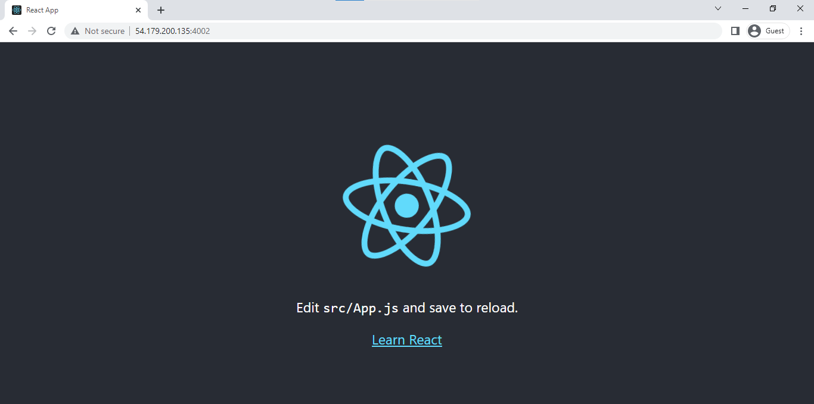
</p>

Going back to our dockerfile, notice that after copying the package.json, we also copied the rest of the other files onto the container, include the main javascript file and the HTML files that'll be served through the hosting provider.

<details><summary> dockerfile.dev </summary>

```bash
# Uses node:alpine as base image
FROM node:alpine

# Creates working directory
WORKDIR '/app' 

# Copies file to working directory 
COPY package.json .

# Installs npm
RUN npm install --silent

# Copy the remaining files
COPY . .

# If you're using Ubuntu, uncomment the two line below.
# This is because Ubuntu mounts volumes using the root user.
# If you're using different linux distro, comment out these two lines
RUN chown -R node /app/node_modules
USER node

# Starts development server 
CMD ["npm", "run", "start"]
```
 
</details>
</br>

The problem with this approach is when we need to edit the Javascript file locally, it will not be automatically reflected to the application running inside the container. This is because the container is launched from the dockerfile that uses the unmodified Javascript file.

We will need to build a new image everytime we introduce changes to the files that the dockerfile is using. 

Make changes, re-build the image, run new containers.


#### Map the Volumes 

To ensure that changes are immediately reflected to the application, we would need to isolate the project files from the container. This means that instead of copying the projects files to the container, we'll store it in a volume outside the container and then reference that volume when the container is ran.

<p align>
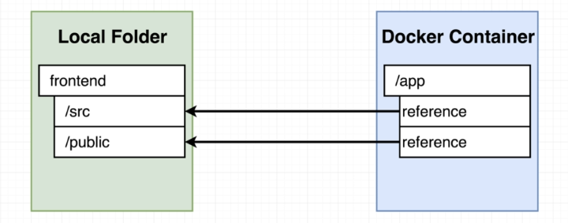
</p>

To map a directory inside the container to a directory on the local host(can be anywhere, as long as it's outside the container and the container can access it), we can use the commmand below:

```bash
$ sudo docker run -d -p 4002:3000 -v /app/node_modules -v $(pwd):/app <image-id> 
```
<p align=center>
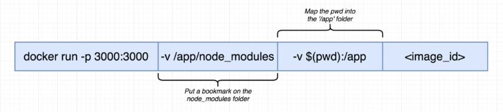
</p>

In the command above, we have following arguments:

- "-p 4002:3000" - we're mapping the localhost port 4002 to the container port 3000

- "-v /app/node_modules" - ensures that the "node_modules" folder will not be map to a folder outside the container

- "-v $(pwd):/app" - maps the current local directory to the "/app" directory inside the container

- "image-id" - the container image that we'll build

Recall that we deleted the **node_modules** folder awhile back. Now when we start up the container using the command below,

```bash
$ sudo docker run -d -p 4002:3000 -v $(pwd):/app <image-id> 
```

It will look for the modules folder outside the container. It won't find any of the modules and this will return an error.

<p align>
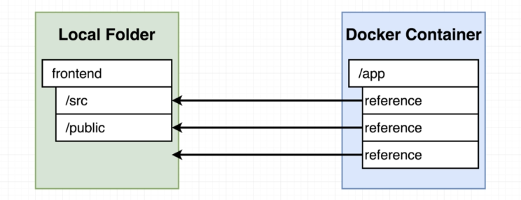
</p>

To make sure that the container doesn't look for the **node_modules** folder outside the container and instead use the **node_modules** that will be installed inside the container, we add a "bookmark" to the modules directory inside the container,

```bash
$ sudo docker run -d -p 4002:3000 -v /app/node_modules -v $(pwd):/app <image-id> 
```

#### Let's now test this 

We want to make sure that any changes we make to the project files will automatically be displayed on the application that's running inside the container.

Let's try to modify a javascript file. Inside Vim, display the line number by typing the second command.

```bash
$ vim src/App.js 
```
```bash 
:set nu 
```

Type "i" to enter insert mode. This will allow you to edit the file.

In line 10, replace the:

```bash
Edit <code>src/App.js</code> and save to reload. 
```

with:

```bash
I feel the need, the need for speed! 
```

The new **App.js** should now look like this:

<details><summary> src/App.js </summary>

```js
import logo from './logo.svg';
import './App.css';

function App() {
  return (
    <div className="App">
      <header className="App-header">
        
        <p>
          I feel the need, the need for speed! 
        </p>
        <a
          className="App-link"
          href="https://reactjs.org"
          target="_blank"
          rel="noopener noreferrer"
        >
          Learn React
        </a>
      </header>
    </div>
  );
}

export default App;
```

</details>
<br>

Press the ESC tab and type the command below to save.

```bash
:wq! 
```

Going back to the browser, do a refresh. We see that the change is not reflected on the application.

<p align=center>

</p>

As we've seen, the changes isn't applied because this application is still spun up from the first image.

Re-build the image again. 

```bash
$ sudo docker build . -t proj-eden-frontend -f dockerfile.dev 
```
```bash
$ sudo docker images
REPOSITORY           TAG       IMAGE ID       CREATED         SIZE
proj-eden-frontend   latest    c6b96a053685   3 seconds ago   532MB
<none>               <none>    332f15e15139   3 hours ago     532MB
node                 alpine    515db77e67c7   10 days ago     174MB 
```

Leave the first container running and create a second container with the two "-v" flag. Map this container to port 4003. 

```bash
$ sudo docker run -d -p 4003:3000 -v /app/node_modules -v $(pwd):/app proj-eden-frontend
```

Going back to the browser, navigate to your IP address through port 4003. It should now display the new message.

<p align>
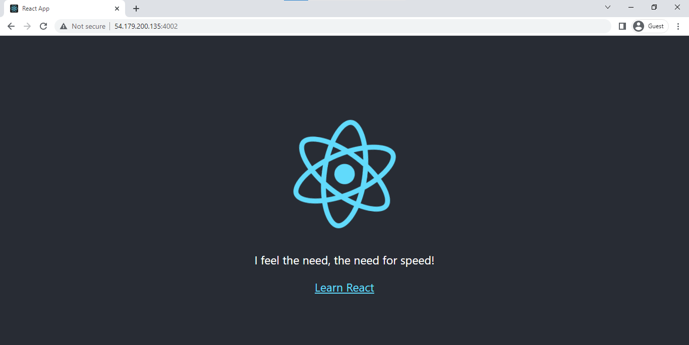
</p>

Back in your terminal, edit the **src/App.js** again and change the message to:

```bash
To infinity and beyond! 
```

<p align=center>

</p>


To stop all the running containers,

```bash
$ sudo docker stop $(sudo docker ps) 2> /dev/null
```

</details>


### 02 - Using Docker-compose

We've managed to containerize the React application and map the volume to a directory inside the container. We've also isolated the Javascript file being served inside our browser so that it doesn't get copied onto the container. 

<details><summary> Click me to read more! </summary>

This allows us to modify the JS file and be applied to the application immediately without going through the entire process of rebuilding the image and running a new container.

**Multiple shell parameters** 

We've been running the **docker run** command with the parameters and arguments. If you have a few parameters to add, it's no problem to run them on the terminal. But this becomes tedious and more prone to error if you're introducing several parameters when running this command.

As a solution, we can define this parameters in a **docker-compose.yml** file in the same directory as the **dockerfile.dev**.

```bash
version: '3'
services:
  
  web:  
    build: 
      context: .
      dockerfile: dockerfile.dev
    
    ports:
      - "4002:3000"
    
    volumes:
      - /app/node_modules
      - .:/app 
```

Run the container. 

```bash
$ sudo docker-compose up 
```

Inside your web browser. You should be able to naviaget to your IP machine's IP address through port 4002. Edit the **App.js** and reload the site inside your web browser to see the changes appear immediately.

Going back to our **docker-compose.yml** file.

<details><summary> docker-compose.yml </summary>

```bash
version: '3'
services:
  
  web:  
    build: 
      context: .
      dockerfile: dockerfile.dev
    
    ports:
      - "4002:3000"
    
    volumes:
      - /app/node_modules
      - .:/app 
```

</details>
<br>

Notice the attributes under **build** block. The **context** means docker-compose will look for the dockerfile in a specific directory. In this case, it will look in the current working directory which is represented by "."

In the **volumes** block, we specify the bookmarked **node_modules** inside the container so that Docker won't need to look for this directory in the volume outside the container. We also see the ".:/app" which means the current working directory on the localhost will be mapped to the /app directory inside the container.

What's interesting about the **volumes** block is that it would seem that the only files that need to exist inside the container are dependencies inside the **node_modules** folder. All the other files can essentially be isolated and stored outside the container.

But wait, didn't we have a line in our **dockerfile.dev** that copies all the project files onto the container?

```bash
COPY . . 
```

<details><summary> dockerfile.dev </summary>

```bash
# Uses node:alpine as base image
FROM node:alpine

# Creates working directory
WORKDIR '/app' 

# Copies file to working directory 
COPY package.json .

# Installs npm
RUN npm install --silent

# Copy the remaining files
COPY . .

# If you're using Ubuntu, uncomment the two line below.
# This is because Ubuntu mounts volumes using the root user.
# If you're using different linux distro, comment out these two lines
RUN chown -R node /app/node_modules
USER node

# Starts development server 
CMD ["npm", "run", "start"] 
```

</details>
<br>

**If the container can just reference the project files that are outside the container, why do we need to still copy them onto the container?**

The answer is, we don't. We can remove the 'COPY . .' and the container would still be launched and the application would still work. But if we decide to change the process or use a different tool other than docker-compose in the distant future, this COPY command ensures that the dockerfile would still work without docker-compose.


</details>

### 03 - Run Tests inside the Container 

We've containerize the React App and manage to run the containers with both the dockerfile option and docker-compose. We'll now shift our focus on running tests on the project.

<details><summary> Click me to read more! </summary>

Running tests on the container is straightforward. Make sure to build the image first. Note that we tagged the image with "proj-eden-frontend".

```bash
$ sudo docker build . -t proj-eden-frontend -f dockerfile.dev 
```

Now to run tests, it will be done when we run the container itself. Make sure to include "-it" and the command "npm run test" at the end. 

```bash
$ sudo docker run -it proj-eden-frontend npm run test
```

You should see an interactive terminal returned. 

<p align=center>
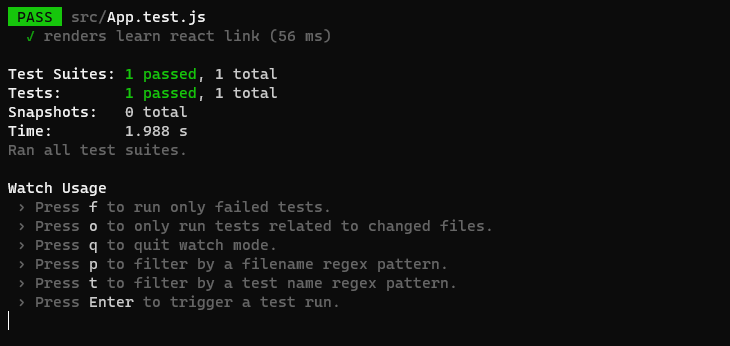
</p>

Press "Enter" to trigger a test run. To quit, press 'q'.

<p align=center>
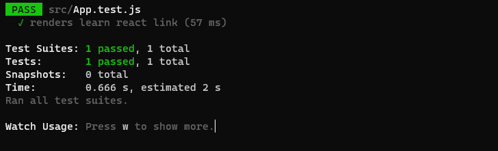
</p>

</details>

### 04 - Updating Test Files

We've run the provided tests on our application. Now let's check if we can modify the tests and see if this will affect the containers we ran.

<details><summary> Click me to read more! </summary>

#### Method 1: Live Updating Tests

Similar with updating the project files, we could also update the test files. However, remember that the container basically a "snapshot" which means it uses the original test files and will not reflect any changes done to the test files unless you rebuild the image again and run a new container. 

There are two ways to make sure that the container reflects the changes on the test files, and we'll try the first approach first.

Start with launching the container again. We'll use **docker-compose** to spin up the container so that we don't have to enter a lot of parameters. 

```bash
$ sudo docker-compose up --build -d
```
```bash
$ sudo docker ps -a 
```

Open a second terminal and attach to the running container and run the test again. This can be done by running "exec -it" on the container, followed by the 'npm run test'.

```bash
$ sudo docker exec -it <container-id> npm run test 
```

'Enter' to trigger tests runs. It will show 'Tests: 1 passed'. 

<p align=center>

</p>

Open a third terminal and go inside the **proj-eden-frontend** directory again. The test file that we need to edit is "src/App.test.js".

Edit the testfile by duplicating the **test** block. Save the changes. 

<details><summary> App.test.js </summary>

```js
import { render, screen } from '@testing-library/react';
import App from './App';

test('renders learn react link', () => {
  render(<App />);
  const linkElement = screen.getByText(/learn react/i);
  expect(linkElement).toBeInTheDocument();
});

test('renders learn react link', () => {
  render(<App />);
  const linkElement = screen.getByText(/learn react/i);
  expect(linkElement).toBeInTheDocument();
});
```
 
</details>

Going back to your second terminal, press 'Enter' multiple times to trigger another test runs. It should now show two tests passed.

<p align=center>
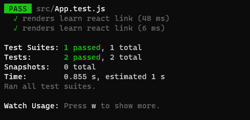
</p>

Try adding 5 more tests to the **App.test.js** then reduce it to just 3 test. Then observe if there'll be changes to the ongoing test.

<p align=center>
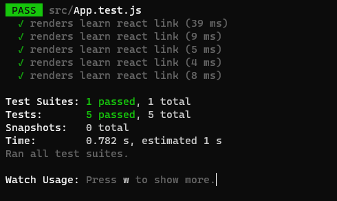
</p>

<p align=center>>
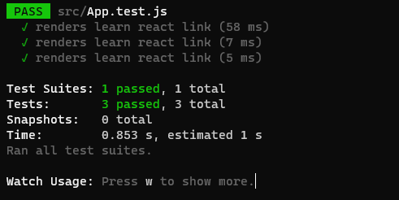
</p>

Note that this isn't the most efficient way to reflect the changes to the test files since you'll have to re-attach to the running container and run 'npm run test' again each time you modify the test files.


#### Method 2: Docker-Compose for Running Tests 

We sort of did used docker-compose in the first approach when we spin up the containers but we just attached to the running container and run the 'npm run test' again to make sure that the changes in the test files are applied.

This second approach is slight different since we'll modify the **docker-compose.yml**. We'll add a second service that's intended for running tests only. This means it'll actuall create two containers, one for the project and a second one for testing the project. 

<details><summary> docker-compose.yml </summary>

```bash
version: '3'
services:
  
  web:  
    build: 
      context: .
      dockerfile: dockerfile.dev 
    ports:
      - "4002:3000" 
    volumes:
      - /app/node_modules
      - .:/app 

  test:
    build: 
      context: .
      dockerfile: dockerfile.dev 
    volumes:
      - /app/node_modules
      - .:/app  
    command: ["npm", "run", "test"] 
```
 
</details>
<br>
Notice that we used the exact same blocks for the service **test** except for the port mapping since the test will just run in the background. We also added the **command** attribute where we specify the 'npm run test'.

Before we proceed, let's clean up the stopped containers firs so we have a fresh slate. 

```bash
$ sudo docker ps -a
$ sudo docker container prune -f
$ sudo docker ps -a 
```

Let's now test.

```bash
$ sudo docker-compose up --build 
```

You should see an output like this:

<p align=center>
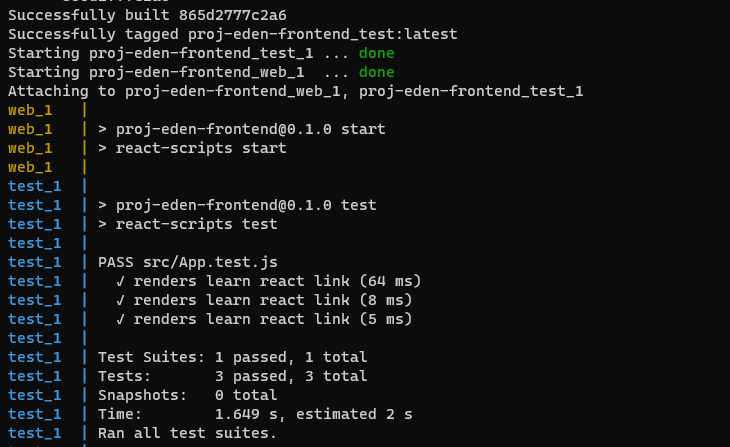
</p>

On a second terminal, check the running containers. You should see two.

```bash
$ sudo docker ps 
```

**The downside of this approach**. The first approach provides us with an interactive terminal where we can press 'Enter' to re-run tests and other options as well. With this second one, we don't have a connection to the standard input (stdin) so there's no way to interact with the test suite.

</details>

----------------------------------------------

## Time to Go Prod

We're now done with implementing the **npm run start** and **npm run test** in a development environment. We saw how we can deploy an application inside a container and run tests on them. 

<details><summary> Click me to read more! </summary>
</br>

We've also ensured that changes introduced to the project files and test files will be automatically reflected on the application without the need for rebuilding the image and running new containers. 

We achieved this by isolating the files outside the container and instructing the container to reference them during startup. We've done all of this in a development environment. It's time to build a production version of the application.

</details>

### 01 - How Applications Runs in Different Environments

We've discussed before how application runs in a DEV environment. To recap, the containerized application runs a dev server inside it which facilitates all the requests coming in and serving the project files. 

<details><summary> Click me to read more! </summary>
</br>

The dev server also exists to handle any changes being done on the project files

<p align>

</p>

In a production environment, the code is expected to be a final person which cannot be modified on the fly. This would mean that we will have to remove the dev server which handles all the code changes. The dev server will be replaced by an **Nginx web server** which will handle the incoming requests.

<p align>
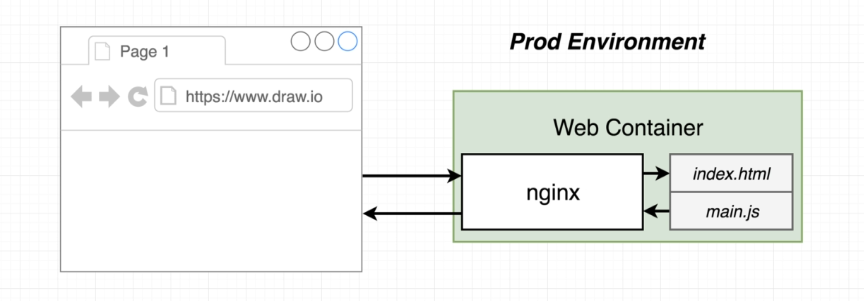
</p>

We'll be creating a separate dockerfile for our production environment. This dockerfile will create a production container will start up an NGINX instance that will serve all the HTML and JS files.

</details>

### 02 - Multi-Step Docker Builds   

We'll repeat the same steps that we did for our DEV environment, but with some slight adjustments. 

<details><summary> Click me to read more! </summary>
</br>

But first, let's understand once again the steps that we'll have to do using this diagram. It's a pretty straightforward diagram and we have basic understanding on how we'll create the containers at this point. However, there will be some questions that we need to answer first.

<p align>
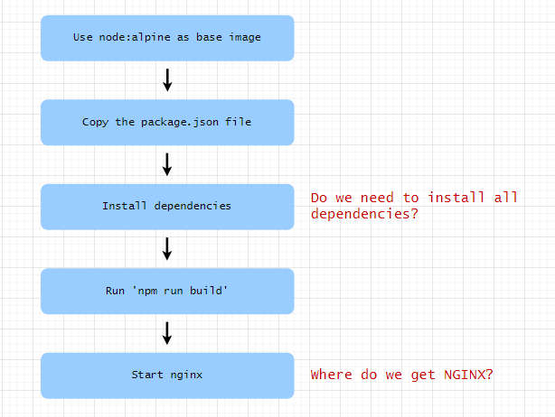
</p>

#### Do we need to install all dependencies?

Recall when we install the dependencies during the project generation, it created a directory with over 4000+ folder inside, with majority of the files in the **node_modules** folder. This dependencies were required to run "npm run build" command which builds the application. After this is done, the dependencies are not required anymore. 

When deploying the project to the container, the only essential directory is the **build** folder. The rest can be entirely removed.

```bash
$ ll -d */
drwxrwxr-x 3 ubuntu ubuntu 4096 Jun 28 04:13 build//
drwxr-xr-x 2 root   root   4096 Jun 28 04:21 node_modules//
drwxrwxr-x 2 ubuntu ubuntu 4096 Jun 28 04:12 public//
drwxrwxr-x 2 ubuntu ubuntu 4096 Jun 28 04:12 src// 
```

#### Where do we get NGINX?

We'll be using the [official NGINX container image from Dockerhub.](https://hub.docker.com/_/nginx).

<p align>
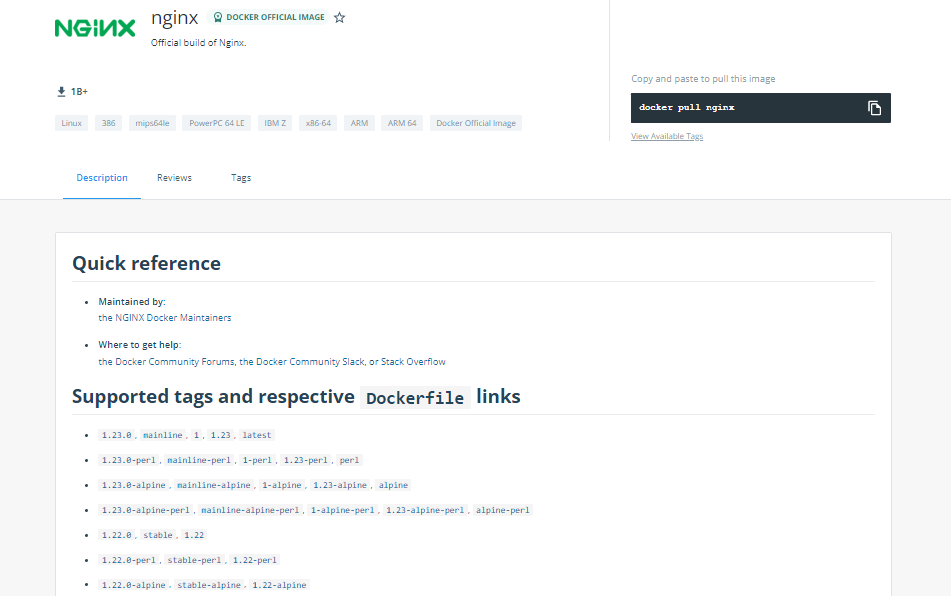
</p>

We'll now be using two base images: "node:alpine" and "nginx". To do this, we'll be doing a **Multi-step Docker Build.** We'll understand this more when we create our dockerfile for PRD.

<p align>
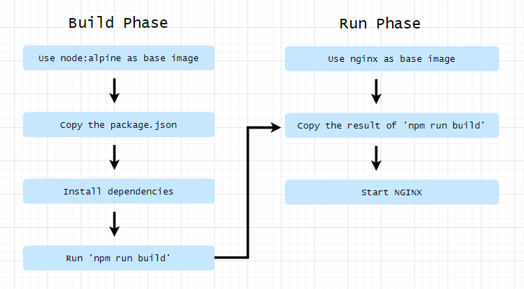
</p>

### 03 - Using the Dockerfile

Let's create our **dockerfile.prd** file. Notice that we now have two "FROM" statements here. Consider one "FROM" block as a step, so after the first "FROM" block is done running, Docker will proceed with running the second "FROM" block.

```bash
# This is the build-phase
FROM node:alpine as build-phase 
WORKDIR '/app'
COPY package.json .
RUN npm install
COPY . .
RUN npm run build

# This is the run phase
FROM nginx
COPY --from=build-phase /app/build /usr/share/nginx/html 
```

On the **build phase**, we see the FROM is appended with "as build-phase". This is basically an alias, which tells Docker that the first FROM block is for the "build phase" and this block will be referenced by second block, the run-phase.

On the **run phase**, we see the COPY line. The "--from" parameter actually pulls data from another step, which in this case is from the **build-phase**. It follows these format:

```bash
COPY --from=<step>  <src-dir>  <dest-dir>
```

The source directory (src-dir) is the "/app/build" from the first step. We want to copy this over to the destination directory (dest-dir). From the [Hosting some simple static content](https://hub.docker.com/_/nginx) of the official documentation, we see a sample:

```bash
# Sample from the documentation
FROM nginx
COPY static-html-directory /usr/share/nginx/html 
```

The "/usr/share/nginx/html" is a default directory where NGINX checks for any app files to serve. So basically, we need to put the HTML and JS files in this directory.

</details>

### 04 - Run the Container 

This is the final step for the Part 1 of "Really Big Project". It actually took me around three days to complete Part 1 but I've actually learned a lot during the whole process. While it is not completely done yet, I have gained a lot more insights about containerizing application.

Speaking of containerizing applications, let's now run our container!

<details><summary> Click me to read more! </summary>
<br> 

But first, build the image. We'll give the name "proj-prd".

```bash
$ sudo docker build . -f dockerfile.prd -t proj-prd 
```

Get your machine's IP address.

```bash
$ curl ipecho.net/plain; echo 
```

Now run the container in detached mode. Let's map our local machine's port 8080 to the container's port 80.

```bash
$ sudo docker run -d -p 8080:80 proj-prd 
```

Open your web browser and navigate to your IP address through port 8080. You should now see the React page.

<p align>
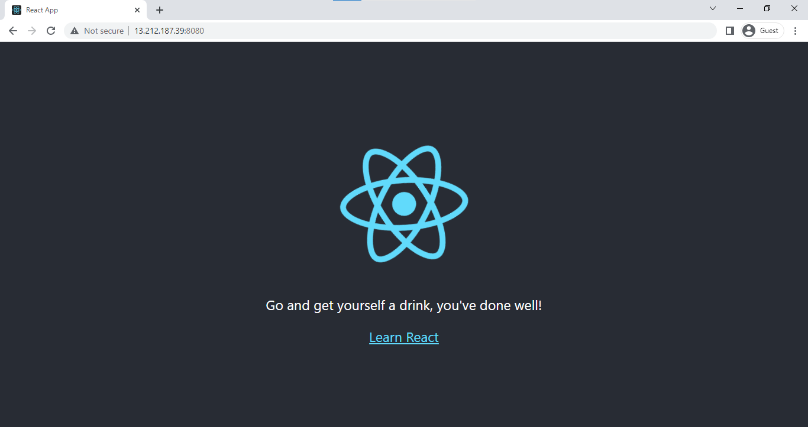
</p>
 
</details>

----------------------------------------------

## What's Next 

Proceed to the next lab to deploy our containerized app to the outside world. But first, go get yourself a drink. Cheers!


<p align=center>

</p>

----------------------------------------------

## Issues Encountered on Windows-based Machines 

Below are just some of errors you may encounter if you're doing this lab in a Windows machine.

<details><summary> Click me to read more! </summary>

### npm start doesn't detect changes

You may encounter some issues where the Create-React-App can't detect files that are changed on Windows-based machines. You can try out the following:

1. In the root project directory, create a file called .env

2. Add the following text to the file and save it: 

    ```bash 
    CHOKIDAR_USEPOLLING=true
    ```

Read more about it [here](https://create-react-app.dev/docs/troubleshooting/#npm-start-doesn-t-detect-changes).


### npm ERR - enoent ENOENT - no such file or directory

You may encounter this error if you're using VirtualBox inside a Windows machine and you're trying to run the command below:

```bash
$ sudo docker-compose up --build 

npm ERR! enoent ENOENT: no such file or directory, open '/app/package.json
```

This may be due to the Docker Toolbox that is being used by VirtualBox. The folders and volume mounts may have been broken and the files that are supposed to be copied to the container were erased.

To resolve this:

1. [Upgrade your VitualBox installation](npm ERR! enoent ENOENT: no such file or directory, open '/app/package.json)

2. If you're still having issues, try to do a complete detroy and build again. Also make sure that your project files are located in C:\Users and not on a remote or external drive.

    ```bash
    $ sudo docker-compose down
    $ sudo docker-compose up --build
    ```

</details>
