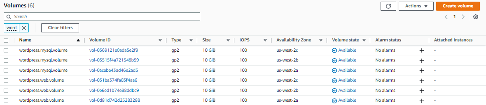

# Lab 29: Create Kubernetes Nginx Ingress Controller for External API Traffic

Before we begin, make sure you've setup the following pre-requisites

- [Basic Understanding of Kubernetes](../README.md#kubernetes)
- [AWS account](../pages/01-Pre-requisites/labs-optional-tools/README.md#create-an-aws-account)
- [AWS IAM Requirements](../pages/01-Pre-requisites/labs-optional-tools/01-AWS-IAM-requirements.md)
- [AWS CLI, kubectl, and eksctl](../pages/01-Pre-requisites/labs-kubernetes-pre-requisites/README.md#install-cli-tools) 


Here's a breakdown of the sections for this lab.


## Introduction

In this lab, we'll launch a single-node EKS Cluster and deploy a containerize Wordpress application which consists of the following containers:

- Frontend web server running Apache
- Backend database running MySQL

Storage:

- EBS GP2 volumes for persistent storage

Architecture:

  


## Create the EBS Volumes

Before we create the EKS cluster, we first need a total of six EBS volumes that are equally spread across three availability zones. Please check out the AWS Documentation to know how to [create an EBS Volume.](https://docs.aws.amazon.com/AWSEC2/latest/UserGuide/ebs-creating-volume.html)

- us-west-2a
  - wordpress.mysql.volume
  - wordpress.web.volume
- us-west-2b
  - wordpress.mysql.volume
  - wordpress.web.volume
- us-west-2c
  - wordpress.mysql.volume
  - wordpress.web.volume

  


## Launch a Simple EKS Cluster

Before we start, let's first verify if we're using the correct IAM user's access keys. This should be the user we created from the **pre-requisites** section above.

```bash
aws sts get-caller-identity 
```
```bash
{
    "UserId": "AIDxxxxxxxxxxxxxx",
    "Account": "1234567890",
    "Arn": "arn:aws:iam::1234567890:user/k8s-admin"
} 
```

For the cluster, we can reuse the [eksops.yml](./eksops.yml) file from the other labs. Launch the cluster.

```bash
$ time eksctl create cluster -f eksops.yml 
```

From the AWS Management Console, we should see the the **Cluster-1** created and in **Active** state.

  

We should also see the nodes and node group.

  


## Download kubectl and awscli 

We'll be connecting to our EKS cluster from our local development computer. If you haven't yet, install the kubectl and awscli utility tools.

```bash
curl -o kubectl https://amazon-eks.s3.us-west-2.amazonaws.com/1.21.2/2021-07-05/bin/linux/amd64/kubectl
chmod +x ./kubectl
sudo cp ./kubectl /usr/local/bin
export PATH=/usr/local/bin:$PATH 
```
```bash
curl "https://awscli.amazonaws.com/awscli-exe-linux-x86_64.zip" -o "awscliv2.zip"
unzip awscliv2.zip
sudo ./aws/install
```

To verify:

```bash
$  kubectl version --short --client=true

Client Version: v1.21.2-13+d2965f0db10712
 
```
```bash
$ aws --version

aws-cli/2.9.15 Python/3.9.11 Linux/4.14.246-187.474.amzn2.x86_64 exe/x86_64.amzn.2 prompt/off
```


## Update kubeconfig 

After setting up eksctl, retrieve the EKS cluster name that you just created.

```bash
EKS_CLUSTER_NAME=$(aws eks list-clusters --region us-west-2 --query clusters[0] --output text)
echo $EKS_CLUSTER_NAME
```

Next, retrieve connection details and update the kubeconfig file. This ensures that we'll be authenticated to the EKS cluster so we'll be able to talk to our cluster and perform operations.

```bash
$ aws eks update-kubeconfig --name $EKS_CLUSTER_NAME --region us-west-2 

Added new context arn:aws:eks:us-west-2:598251627037:cluster/Cluster-1 to /home/ec2-user/.kube/config 
```

Check the nodes.

```bash
$ kubectl get nodes 

NAME                                          STATUS   ROLES    AGE   VERSION
ip-192-168-9-108.us-west-2.compute.internal   Ready    <none>   18m   v1.21.14-eks-fb459a0
```

## Create the MySQL Database Password 


## Deploy the MySQL Database 


## Deploy the Frontend 

We'll be using the [frontend-web.yml](./frontend-web.yml) to deploy the frontend web server running Apache.


## End-to-end Testing of Wordpress Application 


## Cleanup 


## Resources

- [Amazon EKS - Launch Kubernetes Cluster and Deploy WordPress](https://cloudacademy.com/lab/amazon-eks-launch-cluster-and-deploy-microservices-application/?context_id=888&context_resource=lp)