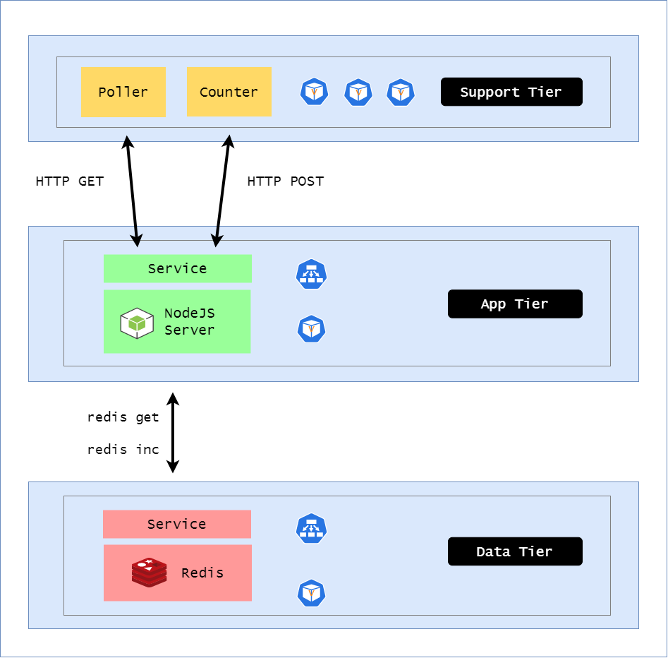

# Lab 44: Horizontal Pod AutoScaler

Pre-requisites:

- [Basic Understanding of Kubernetes](../README.md#kubernetes)
- [AWS account](../pages/01-Pre-requisites/labs-optional-tools/README.md#create-an-aws-account)
- [AWS IAM Requirements](../pages/01-Pre-requisites/labs-optional-tools/01-AWS-IAM-requirements.md)
- [AWS CLI, kubectl, and eksctl](../pages/01-Pre-requisites/labs-kubernetes-pre-requisites/README.md#install-cli-tools) 

Here's a breakdown of sections for this lab.


- [Introduction](#introduction)
- [Launch a Simple EKS Cluster](#launch-a-simple-eks-cluster)
- [Create the Namespace](#create-the-namespace)
- [Deploy the Metrics Server](#deploy-the-metrics-server)
- [Data Tier and Support Tier](#data-tier-and-support-tier)
- [Resource Requests](#resource-requests)
- [Deploy the Horizontal Pod AutoScaler](#deploy-the-horizontal-pod-autoscaler)
- [Next Step](#next-step)


## Introduction

In this lab, we'll see how Kubernetes supports CPU-based autoscaling based on defined custom metrics. We can do this by setting the target CPU percentage along with the minimum and maximum number of allowed replicas.

For collecting the metrics, we'll use **Metrics Server** which is a solution maintained by Kubernetes. Once metrics server is running, the autoscaler can retireve the metrics collected and make calls using the Kuberenetes metrics API.

Here's the architecture that we'll use.

<p align=center>

</p>

## Launch a Simple EKS Cluster

Before we start, let's first verify if we're using the correct IAM user's access keys. This should be the user we created from the **pre-requisites** section above.

```bash
$ aws sts get-caller-identity 
```
```bash
{
    "UserId": "AIDxxxxxxxxxxxxxx",
    "Account": "1234567890",
    "Arn": "arn:aws:iam::1234567890:user/k8s-admin"
} 
```

For the cluster, we can reuse the **eksops.yml** file from the previous labs.

<details><summary> eksops.yml </summary>
 
```bash
apiVersion: eksctl.io/v1alpha5
# apiVersion: client.authentication.k8s.io/v1beta1
kind: ClusterConfig

metadata:
    version: "1.23"
    name: eksops
    region: ap-southeast-1 
nodeGroups:
    -   name: ng-dover
        instanceType: t3.large
        minSize: 1
        maxSize: 5
        desiredCapacity: 1
        ssh: 
            publicKeyName: "k8s-kp"
```
 
</details>

Launch the cluster.

```bash
time eksctl create cluster -f eksops.yml 
```

Check the nodes and pods.

```bash
kubectl get nodes 
```

Save the cluster, region, and AWS account ID in a variable. We'll be using these in a lot of the commands later.

```bash
MYREGION=ap-southeast-1
MYCLUSTER=eksops 
MYAWSID=$(aws sts get-caller-identity | python3 -c "import sys,json; print (json.load(sys.stdin)['Account'])")
```

## Create the Namespace

We'll use [namespace-autoscaling.yml](manifests/namespace-autoscaling.yml) to create **autoscaling** namespace.

```bash
apiVersion: v1
kind: Namespace
metadata:
  name: autoscaling
  labels:
    app: counter
```

Apply.

```bash
kubectl apply -f namespace-autoscaling.yml 
```

Verify.

```bash
$ kubectl get ns
NAME                STATUS   AGE
default             Active   8h
autoscaling         Active   18s 
```


## Deploy the Metrics Server

Download the [metrics server v0.6.1](https://github.com/kubernetes-sigs/metrics-server/releases/tag/v0.6.1).

```bash
kubectl apply -f https://github.com/kubernetes-sigs/metrics-server/releases/download/v0.6.1/components.yaml
```

It should return the following output:

```bash
serviceaccount/metrics-server created
clusterrole.rbac.authorization.k8s.io/system:aggregated-metrics-reader created
clusterrole.rbac.authorization.k8s.io/system:metrics-server created
rolebinding.rbac.authorization.k8s.io/metrics-server-auth-reader created
clusterrolebinding.rbac.authorization.k8s.io/metrics-server:system:auth-delegator created
clusterrolebinding.rbac.authorization.k8s.io/system:metrics-server created
service/metrics-server created
deployment.apps/metrics-server created
apiservice.apiregistration.k8s.io/v1beta1.metrics.k8s.io created 
```

Verify the state of deployment.

```bash
kubectl get deployment metrics-server -n kube-system 
```
```bash
NAME             READY   UP-TO-DATE   AVAILABLE   AGE
metrics-server   1/1     1            1           91s
```

## Data Tier and Support Tier 

We'll use the same [deployment-data.yml](manifests/eployment-data.yml) and deployment-support.yml](manifests/deployment-support.yml). from the previous lab, but we'll specify the namespace as **autoscaling**.

Apply the changes.

```bash
kubectl apply -f deployment-data.yml -f deployment-support.yml
```

## Resource Requests 

Let's now take a look at our [deployment-app.yml](manifests/deployment-app.yml). We have defined the resource requests in the pod spec sections. Each pod will request 20 milli-CPU.

Apply.

```bash
kubectl apply -f deployment-app.yml 
```

Check the pods.

```bash
$ kubectl get pods -n autoscaling
NAME                            READY   STATUS    RESTARTS   AGE
app-tier-6ddbb5d4b7-fkrph       1/1     Running   0          10m
app-tier-6ddbb5d4b7-h627c       1/1     Running   0          10m
app-tier-6ddbb5d4b7-kvbv6       1/1     Running   0          10m
app-tier-6ddbb5d4b7-vkd85       1/1     Running   0          10m
app-tier-6ddbb5d4b7-xsrj5       1/1     Running   0          10m
data-tier-6c8f55b94f-vwqj6      1/1     Running   0          11m
support-tier-66f4cc4f7c-qkc5s   2/2     Running   0          5s
```

Verify the deployment.

```bash
$ kubectl get deployments app-tier -n autoscaling
NAME       READY   UP-TO-DATE   AVAILABLE   AGE
app-tier   5/5     5            5           2m57s
```

## Deploy the Horizontal Pod AutoScaler 

We'll now use a Kubenetes resource called HorizontalPodScaler which scales in/out the Pods. In [horizontal-autoscaler.yml](manifests/horizontal-autoscaler.yml), we're setting the minimum to 3 replica and the maxium to 5 replicas.

```bash
apiVersion: autoscaling/v1
kind: HorizontalPodAutoscaler
metadata:
  name: app-tier
  namespace: autoscaling
  labels:
    app: microservices
    tier: app
spec:
  maxReplicas: 5
  minReplicas: 3
  scaleTargetRef:
    apiVersion: apps/v1
    kind: Deployment
    name: app-tier
  targetCPUUtilizationPercentage: 70 
```

We've also set the **targetCPUUtilizationPercentage** to 70% which means that if the average CPU utilization is 70% or higher, the autoscaler will increase the number of Pods until the CPU utilization is returned below the set target.

Apply.

```bash
kubectl apply -f horizontal-autoscaler.yml 
```

We should now see 3 pods for the app-tier.

```bash
$ kubectl get deployments -n autoscaling

NAME           READY   UP-TO-DATE   AVAILABLE   AGE
app-tier       3/3     3            3           15m
data-tier      1/1     1            1           15m
support-tier   1/1     1            1           4m28s 
```
```bash
$ kubectl get pods -n autoscaling

NAME                            READY   STATUS    RESTARTS   AGE
app-tier-6ddbb5d4b7-4px9r       1/1     Running   0          19s
app-tier-6ddbb5d4b7-kvbv6       1/1     Running   0          14m
app-tier-6ddbb5d4b7-w7vpz       1/1     Running   0          19s
data-tier-6c8f55b94f-vwqj6      1/1     Running   0          15m
support-tier-66f4cc4f7c-qkc5s   2/2     Running   0          3m55s 
```

To see how much utilization our app-tier pods is using, run the command below. Here we can see that it's only using 3% and is well below the target 70% CPU threshold.

```bash
$ kubectl get hpa -n autoscaling

NAME       REFERENCE             TARGETS   MINPODS   MAXPODS   REPLICAS   AGE
app-tier   Deployment/app-tier   3%/70%    3         5         3          9m27s
```

To see more details about the HPA: 

```bash
$ kubectl describe hpa -n autoscaling 

Warning: autoscaling/v2beta2 HorizontalPodAutoscaler is deprecated in v1.23+, unavailable in v1.26+; use autoscaling/v2 HorizontalPodAutoscaler
Name:                                                  app-tier
Namespace:                                             autoscaling
Labels:                                                app=microservices
                                                       tier=app
Annotations:                                           <none>
CreationTimestamp:                                     Sat, 24 Sep 2022 07:37:36 +0800
Reference:                                             Deployment/app-tier
Metrics:                                               ( current / target )
  resource cpu on pods  (as a percentage of request):  3% (0) / 70%
Min replicas:                                          3
Max replicas:                                          5
Deployment pods:                                       3 current / 3 desired
Conditions:
  Type            Status  Reason               Message
  ----            ------  ------               -------
  AbleToScale     True    ScaleDownStabilized  recent recommendations were higher than current one, applying the highest recent recommendation
  ScalingActive   True    ValidMetricFound     the HPA was able to successfully calculate a replica count from cpu resource utilization (percentage of request)
  ScalingLimited  False   DesiredWithinRange   the desired count is within the acceptable range
Events:
  Type    Reason             Age    From                       Message
  ----    ------             ----   ----                       -------
  Normal  SuccessfulRescale  2m19s  horizontal-pod-autoscaler  New size: 1; reason: All metrics below target
  Normal  SuccessfulRescale  109s   horizontal-pod-autoscaler  New size: 3; reason: Current number of replicas below Spec.MinReplicas 
```

## Next Step 

Head on to the next lab to see how rolling updates and rollbacks works.