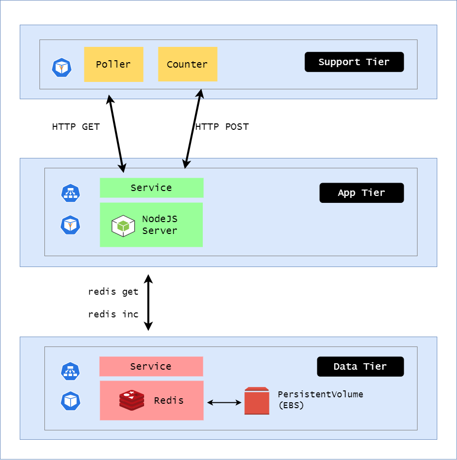

# Lab 49: ConfigMaps and Secrets

Pre-requisites:

- [Basic Understanding of Kubernetes](../README.md#kubernetes)
- [AWS account](../pages/01-Pre-requisites/labs-optional-tools/README.md#create-an-aws-account)
- [AWS IAM Requirements](../pages/01-Pre-requisites/labs-optional-tools/01-AWS-IAM-requirements.md)
- [AWS CLI, kubectl, and eksctl](../pages/01-Pre-requisites/labs-kubernetes-pre-requisites/README.md#install-cli-tools) 

Here's a breakdown of sections for this lab.

- [Introduction](#introduction)
- [Launch a Simple EKS Cluster](#launch-a-simple-eks-cluster)
- [Create the Namespace](#create-the-namespace)
- [ConfigMap](#configmap)
- [Data Tier](#data-tier)
- [ConfigMap - Apply and Test](#configmap---apply-and-test)
- [Secrets](#secrets)
- [App Tier](#app-tier)
- [Secrets - Apply and Test](#secrets---apply-and-test)
- [Cleanup](#cleanup)


## Introduction

We'll be using the same architecture from the previous labs but this time, we'll incorporate ConfigMaps and Secrets:

- ConfigMap for Redis configuration
- Secret for injecting sensitive environment variables into the app tier

Our architecture looks like this:

<p align=center>

</p>

To learn more, check out [ConfigMaps and Secrets](../pages/04-Kubernetes/021-Configmaps.md) 


## Launch a Simple EKS Cluster

Before we start, let's first verify if we're using the correct IAM user's access keys. This should be the user we created from the **pre-requisites** section above.

```bash
$ aws sts get-caller-identity 
```
```bash
{
    "UserId": "AIDxxxxxxxxxxxxxx",
    "Account": "1234567890",
    "Arn": "arn:aws:iam::1234567890:user/k8s-admin"
} 
```

For the cluster, we can reuse the **eksops.yml** file from the previous labs.

<details><summary> eksops.yml </summary>
 
```bash
apiVersion: eksctl.io/v1alpha5
# apiVersion: client.authentication.k8s.io/v1beta1
kind: ClusterConfig

metadata:
    version: "1.23"
    name: eksops
    region: ap-southeast-1 
nodeGroups:
    -   name: ng-dover
        instanceType: t3.large
        minSize: 1
        maxSize: 5
        desiredCapacity: 1
        ssh: 
            publicKeyName: "k8s-kp"
```
 
</details>

Launch the cluster.

```bash
time eksctl create cluster -f eksops.yml 
```

Check the nodes and pods.

```bash
kubectl get nodes 
```

Save the cluster, region, and AWS account ID in a variable. We'll be using these in a lot of the commands later.

```bash
MYREGION=ap-southeast-1
MYCLUSTER=eksops 
MYAWSID=$(aws sts get-caller-identity | python3 -c "import sys,json; print (json.load(sys.stdin)['Account'])")
```


## Create the Namespace

We'll use [namespace-cm.yml](manifests/namespace-cm.yml) to create the **cm** namespace.

```bash
apiVersion: v1
kind: Namespace
metadata:
  name: cm
  labels:
    app: counter
```

Apply.

```bash
kubectl apply -f manifests/namespace-cm.yml 
```

Verify.

```bash
$ kubectl get ns
NAME                STATUS   AGE
default             Active   8h
volumes             Active   18s 
```

## ConfigMap

Let's now create the [config-redis.yml](manifests/config-redis.yml) for the Redis.

```bash
apiVersion: v1
kind: ConfigMap
metadata:
  name: redis-config
data:
  config: |     # YAML for multi-line StringEquals
    # Redis config file
    tcp-keepalive 240
    maxmemory 1mb
```

## Data Tier 

Here's the [tier-data.yml](manifests/tier-data.yml) that we'll use.

```bash
apiVersion: v1
kind: Service
metadata:
  name: data-tier
  namespace: cm
  labels:
    app: microservices
spec:
  ports:
  - port: 6379
    protocol: TCP # default 
    name: redis # optional when only 1 port
  selector:
    tier: data 
  type: ClusterIP # default
---
apiVersion: apps/v1 # apps API group
kind: Deployment
metadata:
  name: data-tier
  namespace: cm
  labels:
    app: microservices
    tier: data
spec:
  replicas: 1
  selector:
    matchLabels:
      tier: data
  template:
    metadata:
      labels:
        app: microservices
        tier: data
    spec: # Pod spec
      containers:
      - name: redis
        image: redis:latest
        imagePullPolicy: IfNotPresent
        ports:
          - containerPort: 6379
            name: redis
        livenessProbe:
          tcpSocket:
            port: redis # named port
          initialDelaySeconds: 15
        readinessProbe:
          exec:
            command:
            - redis-cli
            - ping
          initialDelaySeconds: 5
        command:
          - redis-server
          - /etc/redis/redis.conf
        volumeMounts:
          - mountPath: /etc/redis
            name: config
      volumes:
        - name: config
          configMap:
            name: redis-config
            items:
            - key: config
              path: redis.conf  
```

## ConfigMap - Apply and Test 

Let's now create the configmap and the data tier.

```bash
cd manifests 
kubectl apply -f config-redis.yml
kubectl apply -f tier-data.yml
```

Check the resources created.

```bash
$ kubectl get cm -n cm
  
NAME               DATA   AGE
kube-root-ca.crt   1      18m
redis-config       1      64s 
```
```bash
$ kubectl get pods -n cm

NAME                         READY   STATUS    RESTARTS   AGE
data-tier-674b7bcc64-h8czg   1/1     Running   0          76s 
```

Let's check if the config file was used inside the pod.

```bash
$ kubectl exec -n cm data-tier-674b7bcc64-h8czg -it -- cat /etc/redis/redis.conf

# Redis config file
tcp-keepalive 240
maxmemory 1mb 
```

To prove that Redis actually loaded the config file:

```bash
$ kubectl exec -n cm data-tier-674b7bcc64-h8czg -it -- redis-cli CONFIG GET tcp-keepalive

1) "tcp-keepalive"
2) "240"
```

Here we can see that the keepalive time used by the Redis app is the same as the keepalive time defined in the config file.

## Secrets

Next, let's set up the [secrets-app.yml](manifests/secrets-app.yml).

```bash
apiVersion: v1
kind: Secret
metadata:
  name: app-tier-secret
  namespace: cm
stringData: # unencoded data
  api-key: LRcAmM1904ywzK3esX
  decoded: hello
data: #for base-64 encoded data
  encoded: aGVsbG8= # hello in base-64

# api-key secret (only) is equivalent to
# kubectl create secret generic app-tier-secret --from-literal=api-key=LRcAmM1904ywzK3esX
```

Note that manifests for the secrets are not usually checked into source control since they contain sensitive information. Another option is to create the secrets through the *kubectl* utility.

Secrets are stored as base64-encoded string text and defined as **data.** They are automatically decoded by Kubernetes when manifests is ran. Note that this encoding doesn't improve any security since anyone can decode this using the correct tools. 

If you don't want to encode the secrets, you can define them under **stringData** and Kubernetes will take case of the encoding when the manifest is ran. In the manifest above, we've included both the encoded and decoded secret, which is "hello".

## App Tier 

Here's the [tier-app.yml](manifests/tier-app.yml) that we'll use for the app tier.

```bash
apiVersion: v1
kind: Service
metadata:
  name: app-tier
  namespace: cm
  labels:
    app: microservices
spec:
  ports:
  - port: 8080
  selector:
    tier: app
---
apiVersion: apps/v1
kind: Deployment
metadata:
  name: app-tier
  namespace: cm
  labels:
    app: microservices
    tier: app
spec:
  replicas: 1
  selector:
    matchLabels:
      tier: app
  template:
    metadata:
      labels:
        app: microservices
        tier: app
    spec:
      containers:
      - name: server
        image: lrakai/microservices:server-v1
        ports:
          - containerPort: 8080
            name: server
        env:
          - name: REDIS_URL
            # Environment variable service discovery
            # Naming pattern:
            #   IP address: <all_caps_service_name>_SERVICE_HOST
            #   Port: <all_caps_service_name>_SERVICE_PORT
            #   Named Port: <all_caps_service_name>_SERVICE_PORT_<all_caps_port_name>
            value: redis://$(DATA_TIER_SERVICE_HOST):$(DATA_TIER_SERVICE_PORT_REDIS)
            # In multi-container example value was
            # value: redis://localhost:6379 
          - name: DEBUG
            value: express:*
          - name: API_KEY
            valueFrom:
              secretKeyRef:
                name: app-tier-secret
                key: api-key
        livenessProbe:
          httpGet:
            path: /probe/liveness
            port: server
          initialDelaySeconds: 5
        readinessProbe:
          httpGet:
            path: /probe/readiness
            port: server
          initialDelaySeconds: 3
      initContainers:
        - name: await-redis
          image: lrakai/microservices:server-v1
          env:
          - name: REDIS_URL
            value: redis://$(DATA_TIER_SERVICE_HOST):$(DATA_TIER_SERVICE_PORT_REDIS)
          command:
            - npm
            - run-script
            - await-redis
```

## Secrets - Apply and Test 

We'll now ran the manifest for both the secret and the app tier.

```bash
cd manifests 
kubectl apply -f secrets-app.yml 
kubectl apply -f tier-app.yml
```

We should see the secret created with the  *Opaque* type.
```bash
$ kubectl get secrets -n cm

NAME                  TYPE                                  DATA   AGE
app-tier-secret       Opaque                                3      2m24s
default-token-2tzdf   kubernetes.io/service-account-token   3      40m 
```

We should now also see two pods running.

```bash
$ kubectl get pods -n cm

NAME                         READY   STATUS    RESTARTS   AGE
app-tier-5569b58f55-9jb2j    1/1     Running   0          10s
data-tier-674b7bcc64-h8czg   1/1     Running   0          22m 
```

To verify that the secret was created an environment inside the container:

```bash
$ kubectl exec -n cm  app-tier-5569b58f55-9jb2j -- env | grep KEY

API_KEY=LRcAmM1904ywzK3esX
```

Before we finish this lab, we should know that since secrets and configmaps are managed separately from the deployments, any changes in the custom resources doesn't automatically reflect in the deployments. The pods must be actively updated whenever there's a new version of the configmaps and secrets.


## Cleanup 

Make sure to delete the cluster after the lab to save costs.

```bash
time eksctl delete cluster -f eksops.yml 
```

When you delete your cluster, make sure to also double check the AWS Console and ensure that the Cloudformation stacks (which we created by eksctl) are dropped cleanly.
