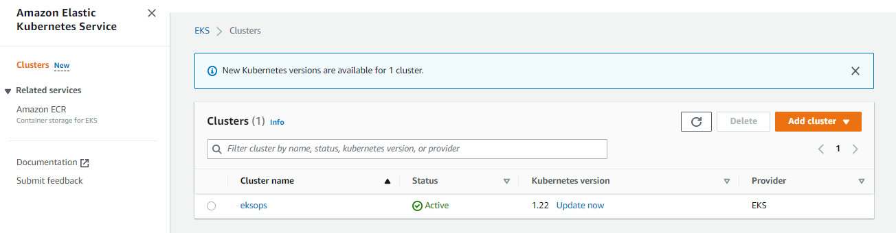
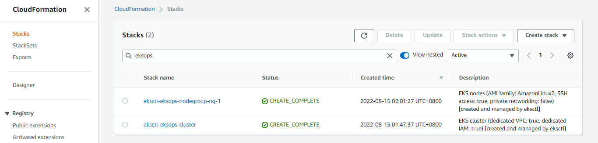
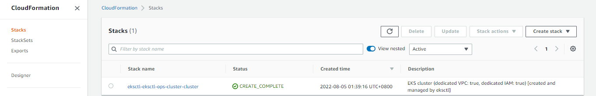
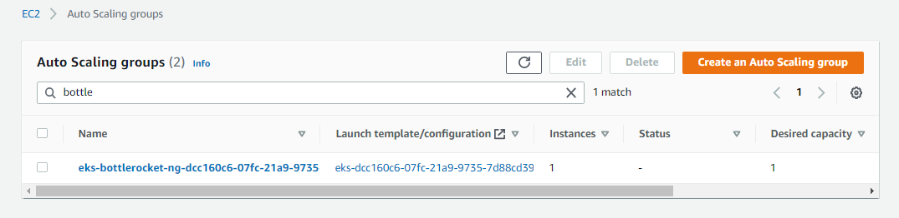
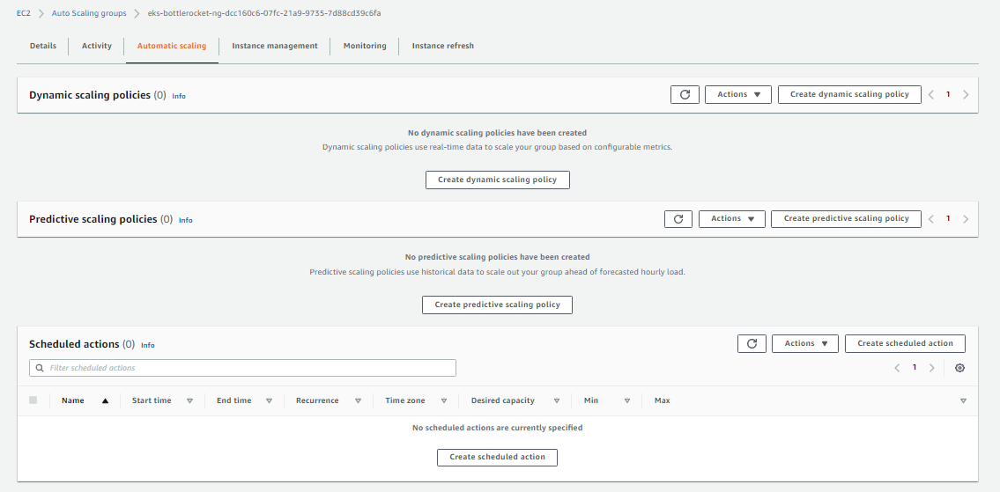
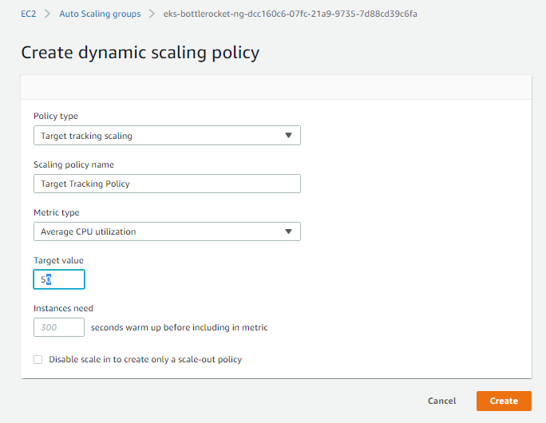

# Lab 50: EKS Operations using eksctl and kubectl

Pre-requisites:

  - [Basic Understanding of Kubernetes](../README.md#kubernetes)
  - [AWS account](../README.md#pre-requisites)

Here's a breakdown of sections for this lab.

- [Creating the Access](#creating-the-access)
- [Setup CLI and Access Key](#setup-cli-and-access-key)
- [Create an EKS cluster using eksctl](#create-an-eks-cluster-using-eksctl)
- [Create kubeconfig file automatically](#create-kubeconfig-file-automatically)
- [Create an EKS cluster using a YAML file](#create-an-eks-cluster-using-a-yaml-file)
- [Scaling Nodegroups](#scaling-nodegroups)
- [Adding Spot Instances](#adding-spot-instances)
- [Using Different AMI and Instance Types](#using-different-ami-and-instance-types)
- [Worker Pools](#worker-pools)
- [Assigning Labels to Nodes and Pools](#assigning-labels-to-nodes-and-pools)
- [Deleting a Nodegroup](#deleting-a-nodegroup)
- [Deleting the Cluster](#deleting-the-cluster)

For this lab, we'll be using **ap-southeast-1** region (Singapore).

----------------------------------------------

## Creating the Access 

We will need to do the following before we can create clusters and perform EKS operations.

- [Create a "k8s-kp.pem" keypair](https://docs.aws.amazon.com/AWSEC2/latest/UserGuide/create-key-pairs.html)

- [Create a "k8s-admin" user with admin access](https://www.techrepublic.com/article/how-to-create-an-administrator-iam-user-and-group-in-aws/)

- [Create an access key for "k8s-admin"](https://docs.aws.amazon.com/IAM/latest/UserGuide/id_credentials_access-keys.html#Using_CreateAccessKey)


## Setup CLI and Access Key

Install the following CLI tools by clicking the links:

- [aws cli](../README.md#install-cli-tools) - used by eksctl to grab authentication token
- [eksctl](../README.md#install-cli-tools) - setup and operation of EKS cluster 
- [kubectl](../README.md#install-cli-tools) - interaction with K8S API server

Once you've installed AWS CLI, [create an access key and setup your credentials file](../README.md#install-cli-tools). It should look like this:

```bash
# /home/user/.aws/credentials

[k8s-admins]
aws_access_key_id = AKIAxxxxxxxxxxxxxxxxxxx
aws_secret_access_key = ABCDXXXXXXXXXXXXXXXXXXXXXXX
region = ap-southeast-1
output = json
```

To use this profile, export it as a variable.

```bash
$ export AWS_PROFILE=k8s-admins
```

To verify, we can run the commands below:

```bash
$ aws configure list 
```
```bash
$ aws sts get-caller-identity 
```

Although the region is already set in the profile, we'll also be using the region in many of the commands. We can save it as a variable.

```bash
$ export AWSREGION=ap-southeast-1 
```

## Create an EKS cluster using eksctl

Create first the project directory.

```bash
$ mkdir eksops-dir
$ cd eksops-dir
```

Launch a simple cluster using the command below. This will take a few minutes to deploy.

```bash
$ eksctl create cluster 
```

The cluster will have the default parameters below:
- silly auto-generated name, e.g., fabulous-mushroom-1527688624
- two m5.large worker nodes
- using the official AWS EKS AMI
- us-west-2 region (this will be overridden if region was set) 
- a dedicated VPC 

To check the cluster,

```bash
$ eksctl get clusters 
```

To delete the cluster,

```bash
$ eksctl delete cluster --name <cluster-name> 
```

## Create kubeconfig file automatically

Let's setup another fairly simple EKS cluster with the default parameters again.

```bash
$ eksctl create cluster
$ eksctl get clusters 
```

Save the cluster name and the region in a variable.

```bash
$ export AWSREGION=ap-southeast-1 
$ export mycluster=<cluster-name>
```

Beside eksctl, we will also use kubectl to talk to our EKS cluster. To do this, we need the kubconfig file which should be automatically generated when we deployed the cluster.

We can also create and update the kubeconfig file using either of the commands below.

```bash
$ aws eks update-kubeconfig --region $AWSREGION --name $MYCLUSTER
```
```bash
$ eksctl utils write-kubeconfig --cluster $MYCLUSTER 
```

The kubeconfig should be created in the $HOME/.kube/ directory.

```bash
$ cat ~/.kube/config 
```

## Create an EKS cluster using a YAML file

In this section, we'll use a YAML file to deploy an EKS cluster:
- region is ap-southeast-1
- contains one nodegroup
- nodegroup consists of 3 worker nodes
- each node will be t2.small
- ssh access is allowed

Create the **eksops.yml** file.

```bash
$ vi eksops-dir/eksops.yml

apiVersion: eksctl.io/v1alpha5
# apiVersion: client.authentication.k8s.io/v1beta1
kind: ClusterConfig

metadata:
    name: eksops
    region: ap-southeast-1 

nodeGroups:
    -   name: ng-1
        instanceType: t2.small
        desiredCapacity: 3
        minSize: 2
        maxSize: 10
        ssh: 
            publicKeyName: "k8s-kp"
```

Run the command below to create the cluster. This will take around 10-15 minutes. It will automatically create a VPC and 2 subnets in two different availability zones (AZ).

```bash
$ eksctl create cluster -f eksops.yml
```

We can also track how long it ran by adding <code>time</code> at the beginning.

```bash
$ time eksctl create cluster -f eksops.yml

real    16m56.835s
user    0m3.387s
sys     0m0.713s
```

In the output, you should see the location where the <code>kubeconfig</code> file is saved.

```bash
saved kubeconfig as "/home/joseeden/.kube/config 
```

At the AWS Console, go to the EKS page to verify if the cluster is created.

  

<!--    -->

To check the nodegroup and the running nodes, simply go to the Compute tab. If you can't see them, checkout 

```bash
EKS > Clusters > eksops > Click Compute tab 
```

Recall that Amazon EKS uses Cloudformation to provision the resources under the hood. You can see the stack created in the CloudFormation console.

  

<!--    -->

You should also see the nodes as running instances in the EC2 console.

  

Back at the terminal, check the running nodes.

```bash
$ kubectl get nodes 
```

Check the running cluster.

```bash
$ eksctl get cluster 
```

Save the cluster in a variable. 

```bash
$ export MYCLUSTER=<cluster-name>
```

Inspect the nodegroup,

```bash
$ eksctl get nodegroup --cluster eksops
```


## Scaling Nodegroups

Initially, we set the *desiredCapacity* to 3 in the YAML file. To scale the number of nodes to 5, run the command below. Note that it will take a few minutes before the nodes are added.

```bash
$  eksctl scale nodegroup \
    --cluster=$MYCLUSTER \
    --name=ng-1 \
    --nodes=5
```
```bash
$ kubectl get nodes 
```

We could also scale in to reduce the number of nodes. 

```bash
$  eksctl scale nodegroup \
    --cluster=$MYCLUSTER \
    --name=ng-1 \
    --nodes=2
```
```bash
$ kubectl get nodes 
```

Now, if we try to scale up to 7 nodes, we'll get an error. This is because in our YAML file, we only specified a max of 5 nodes.

```bash
Error: failed to scale nodegroup for cluster "eksops", error: operation error Auto Scaling: UpdateAutoScalingGroup, https response error StatusCode: 400, RequestID: b6fa0012-c353-4b40-9ccb-c6045b781126, api error ValidationError: Desired capacity:7 must be between the specified min size:2 and max size:5
```

Similarly, we can't scale the nodes down to zero because we specified 2 as our **minSize** in our YAML file.

```bash
Error: failed to scale nodegroup for cluster "eksops", error: operation error Auto Scaling: UpdateAutoScalingGroup, https response error StatusCode: 400, RequestID: b6fa0012-c353-4b40-9ccb-c6045b781126, api error ValidationError: Desired capacity:0 must be between the specified min size:2 and max size:5
```

## Adding Spot Instances 

Let's now edit the same YAML file to create another nodegroup. The second nodegroup will have a mix of on-demand and spot instances.

<details><summary> eksops.yml </summary>
 
```bash
 apiVersion: eksctl.io/v1alpha5
# apiVersion: client.authentication.k8s.io/v1beta1
kind: ClusterConfig

metadata:
    name: eksops
    region: ap-southeast-1 

nodeGroups:
    -   name: ng-1
        instanceType: t2.small
        desiredCapacity: 3
        minSize: 2
        maxSize: 5
        ssh: 
            publicKeyName: "k8s-kp"
    -   name: ng-mix
        instancesDistribution:
            maxPrice: 0.2
            instanceTypes: [
                "t2.small",
                "t3.small"
            ]
            onDemandBaseCapacity: 0
            onDemandPercentageAboveBaseCapacity: 50
        ssh:
            publicKeyName: "k8s-kp"

```
 
</details>
</br>

Notice the **onDemandBaseCapacity** which is set to 0, and **onDemandPercentageAboveBaseCapacity** which is set to 50. This means that 50% of all the EC2 instances will be on-demand and the other 50% will be spot instances.

To create the nodegroup, run the command below.

```bash
$ eksctl create nodegroup \
    --config-file=eksops.yml \
    --include='ng-mix' 
```

Verify the number of nodes per nodegroup.

```bash
$ eksctl get nodegroup --cluster eksops 
```

Go back to the EC2 console to check how many are nodes are now running.

## Using Different AMI and Instance Types

In addition to using on-demand and spot instances, we can also use a different AMI and instance type.

Using he same cluster, we'll create another nodegroup:

- uses t2.medium instance type
- Bottlerocket AMI. 

We'll also call the new nodegroup "bottlerocket-ng".

```bash
$ eksctl create nodegroup \
    --node-type t2.medium \
    --node-ami-family Bottlerocket \
    --name bottlerocket-ng \
    --cluster $MYCLUSTER
```

To list the nodegroups,

```bash
$ eksctl get nodegroups --cluster $MYCLUSTER
```

To delete the newly added nodegroup,

```bash
$ eksctl delete nodegroup bottlerocket-ng \
    --cluster $MYCLUSTER 
```

## Worker Pools

We can also leverage the autoscaling capability  of EKS by creating the worker pools.

In the command below, we'll be adding a new nodegroup with an autoscaling group and we define the minimum and maximum number of nodes.

```bash
$ eksctl create nodegroup \
    --node-type t2.medium \
    --asg-access \
    --nodes-min 1 \
    --nodes-max 3 \
    --name bottlerocket-ng \
    --cluster $MYCLUSTER
```

To verify,

```bash
$ eksctl get nodegroups --cluster $MYCLUSTER
```

The next step is to create the scaling policy that the cluster will use. Log in to your AWS Management console and go to the EC2 dashboard > Auto scaling groups.

  

Search for the name of the new nodegroup and click the auto scaling group. Then click the **Automatic scaling** tab. In the next page, click **Create dynamic scaling policy**.

  

Use the default values. Click **Create.**

  


## Assigning Labels to Nodes and Pools 

A way to differentiate the nodes is using the labels.

```bash
$ kubectl get nodes --show-labels 
```

We can also assign a label to a node. Note that if this node is upgraded or is replaced by a new node, the label disappear as well. In this example, we're assigning the label "nodename=azumi" to one of the nodes.

```bash
$ kubectl label nodes <node-name> nodename=azumi 
```

We can also assign a label to all the nodes created under a nodegroup. In this example, we're creating a the nodegroup "admiral-ng" with the label "nodelink=uplink"

```bash
$ eksctl create nodegroup \
    --cluster $MYCLUSTER \
    --name admiral-ng \
    --node-type t2.medium \
    --node-labels nodelink=uplink 
```


## Deleting a Nodegroup

We use the same command but this time we specify *delete* to delete one of the nodegroups.

```bash
$ eksctl delete nodegroup \
    --config-file=eksops.yml \
    --include='ng-mix' \
    --approve
``` 

Note that if you delete a nodegroup, any pods that might be previously running on this nodegroup will be pushed to the other nodegroup. The scheduler basically stops allocating pods to this nodegroup.

## Cleanup - Deleting the Cluster

To delete the cluster, run the command below.

```bash
$ time eksctl delete cluster -f eksops.yml
```

When you delete your cluster, make sure to double check the AWS Console and check the Cloudformation stacks (which we created by eksctl) are dropped cleanly.

