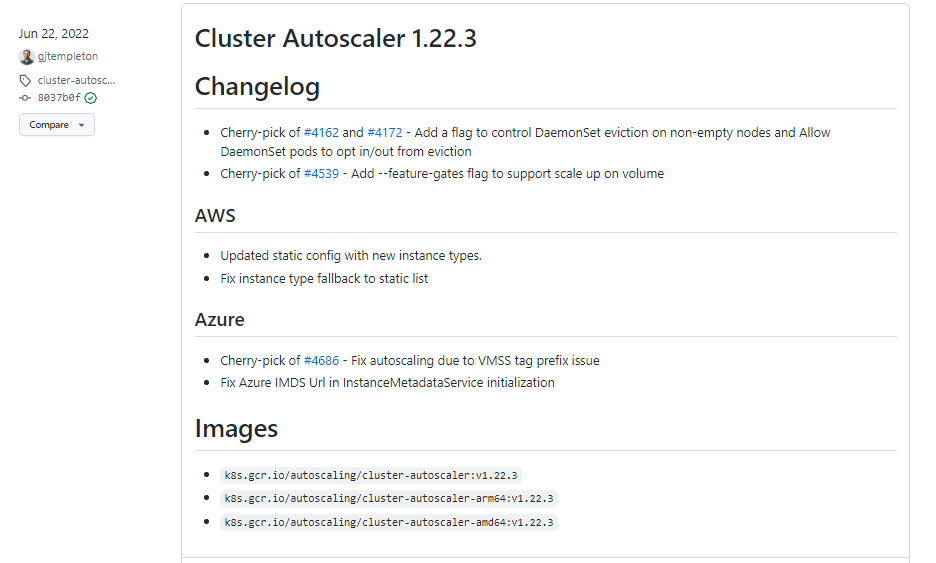

# Lab 51: EKS Cluster Autoscaler

Pre-requisites:

  - [Basic Understanding of Kubernetes](../README.md#kubernetes)
  - [AWS account](../README.md#pre-requisites)

Here's a breakdown of sections for this lab.

  - [Creating the Access](#creating-the-access)
  - [Setup CLI Tools and Access Key](#setup-cli-tools-and-access-key)
  - [Create Nodegroups with Autoscaling](#create-nodegroups-with-autoscaling)
  - [Deploy the Cluster Autoscaler](#deploy-the-cluster-autoscaler)
  - [Create NGINX Deployment](#create-nginx-deployment)
  - [Trigger the NGINX Autoscaler](#trigger-the-nginx-autoscaler)
      - [Scaling Out](#scaling-out)
      - [Scaling In](#scaling-in)
  - [Checking the Logs](#checking-the-logs)
  - [Cleanup](#cleanup)


## What we will do

We'll be creating dedicated nodegroups with autoscaling enabled:

- for stateful workloads, 2 nodegroups with single AZ 
- for stateless workloads, 1 nodegroup across 3 AZs

Then, we'll deploy the autoscaler.

- create deployment
- add annotation to the deployment to prevent eviction
- set matching image version and cluster name

Finally, we'll create the nginx deployment

- scale up and down
- verify in the autoscaler logs


For this lab, we'll be using ap-southeast-1 region (Singapore).

----------------------------------------------

## Creating the Access 

We will need to do the following before we can create clusters and perform EKS operations.

- [Create the IAM Policy](../README.md#setup-eks-access-on-aws)
- [Create the IAM User, Access Key, and Keypair](../README.md#setup-eks-access-on-aws)
- [Create the IAM Group](../README.md#setup-eks-access-on-aws)

    
For the IAM User and Group, you can use the values below. Make sure to add the user to the group.

- IAM User: k8s-admin
- IAM Group: k8s-lab

## Setup CLI Tools and Access Key

Install the following CLI tools by clicking the links:

- [aws cli](../README.md#install-cli-tools) - used by eksctl to grab authentication token
- [eksctl](../README.md#install-cli-tools) - setup and operation of EKS cluster 
- [kubectl](../README.md#install-cli-tools) - interaction with K8S API server

Once you've installed AWS CLI, [add the access key to your credentials file](../README.md#install-cli-tools). It should look like this:

```bash
# /home/user/.aws/credentials

[k8s-admin]
aws_access_key_id = AKIAxxxxxxxxxxxxxxxxxxx
aws_secret_access_key = ABCDXXXXXXXXXXXXXXXXXXXXXXX
region = ap-southeast-1
output = json
```

You can use a different profile name. To use the profile, export it as a variable.

```bash
$ export AWS_PROFILE=k8s-admin
```

To verify, we can run the commands below:

```bash
$ aws configure list 
```
```bash
$ aws sts get-caller-identity 
```

Although the region is already set in the profile, we'll also be using the region in many of the commands. We can save it as a variable.

```bash
$ export AWSREGION=ap-southeast-1 
```

## Create Nodegroups with Autoscaling

Let's check this manifest.

<details><summary> green-line.yml </summary>
 
```yaml
apiVersion: eksctl.io/v1alpha5
kind: ClusterConfig

metadata:
  version: "1.22"
  name: green-line
  region: ap-southeast-1 

nodeGroups:

  - name: ng-dover
    instanceType: m5.large
    desiredCapacity: 3
    ssh: #use existing ec2-key
      publicKeyName: k8s-kp

  - name: scale-clementi-1a
    instanceType: t3.large
    desiredCapacity: 1
    maxSize: 10
    availabilityZones: ["ap-southeast-1a"]
    iam:
      withAddonPolicies:
        autoScaler: true
    labels:
      nodegroup-type: stateful-workload 
      instance-type: onDemand
    ssh: #use existing ec2-key
      publicKeyName: k8s-kp

  - name: scale-clementi-1b
    instanceType: t3.large
    desiredCapacity: 1
    maxSize: 10
    availabilityZones: ["ap-southeast-1b"]
    iam:
      withAddonPolicies:
        autoScaler: true
    labels:
      nodegroup-type: stateful-workload 
      instance-type: onDemand    
    ssh: #use existing ec2-key
      publicKeyName: k8s-kp

  - name: scale-spot
    desiredCapacity: 1
    maxSize: 10
    instancesDistribution:
      onDemandBaseCapacity: 0
      onDemandPercentageAboveBaseCapacity: 0
      instanceTypes: [
        "t3.large",
        "t2.xlarge",
        "m5.xlarge"
      ]

    availabilityZones: [
      "ap-southeast-1a",
      "ap-southeast-1b",
      "ap-southeast-1c"
      ]

    iam:
      withAddonPolicies:
        autoScaler: true
    labels:
      nodegroup-type: stateless-workload 
      instance-type: spot    
    ssh: #use existing ec2-key
      publicKeyName: k8s-kp

availabilityZones: [
      "ap-southeast-1a",
      "ap-southeast-1b",
      "ap-southeast-1c"
      ]       
```

</details>
<br>

We can see that there's four nodegroups here:

01. **ng-dover**
This is a simple nodegroup which will consist of 3 nodes.

02. **scale-clementi-1a**
This nodegroup will be confined to the ap-southeast-1a AZ.

    - autoscaling is enabled
    - specified labels, helpful for scheduling pods on selected nodes 

03. **scale-clementi-1a**
This nodegroup will be confined to the ap-southeast-1b AZ.

    - autoscaling is enabled
    - specified labels, helpful for scheduling pods on selected nodes 

04. **scale-spot**
This nodegroup will span three AZs. 

    - will use three instance types
    - will not contain on-demand instances, only spot instances
    - labelled for stateless-workloads

Create the cluster.

```bash
$ eksctl create cluster -f green-line.yml 
```

We can also save the cluster name in a variable since we'll be using it multiple times in this lab.

```bash
$ export MYCLUSTER=green-line
```

To verify the nodes,

```bash
$ kubectl get nodes 
```

Inspect the nodegroups.

```bash
$ eksctl get nodegroup --cluster $MYCLUSTER
```

We can do some parsing to display only the important columns:

- cluster name 
- nodegroup
- Minimum Size
- Maximum Size
- Desired Capacity
- instance-type

```bash
$ eksctl get nodegroup --cluster green-line | awk '{if (NR!=1) {print $1 " " $2 " " $5 " " $6 " " $7 " " $8}}' | column -t 
```

```bash
green-line  ng-dover           3  3   3  m5.large
green-line  scale-clementi-1a  1  10  1  t3.large
green-line  scale-clementi-1b  1  10  1  t3.large
green-line  scale-spot         1  10  1  t3.large 
```

Let's now delete the first node group, ng-dover.

```bash
$ time eksctl delete nodegroup -f green-line.yml \
  --include="ng-dover" \
  --approve
```

Verify.

```bash
$ kubectl get nodes 
```
```bash
$ eksctl get nodegroup --cluster $MYCLUSTER
```

## Deploy the Cluster Autoscaler 

As a brief explanation about the [Cluster Autoscaler](https://github.com/kubernetes/autoscaler/tree/master/cluster-autoscaler):

> **Cluster Autoscaler** is a tool that automatically adjusts the size of the Kubernetes cluster when one of the following conditions is true:
>
> - there are pods that failed to run in the cluster due to insufficient resources.
> - there are nodes in the cluster that have been underutilized for an extended period of time and their pods can be placed on other existing nodes.

It is also recommended to use the Kubernetes control plane version for the Cluster Autoscaler. From our **green-line.yml** manifest,

```bash
metadata:
  version: "1.22" 
```

Check if the  [version release](https://github.com/kubernetes/autoscaler/releases) in the Kubernetes Cluster Autoscaler Github page. We'll be using version 1.22.3.

  

We will use the available [Cluster Autoscaler manifest](https://github.com/kubernetes/autoscaler/blob/master/cluster-autoscaler/cloudprovider/aws/examples/cluster-autoscaler-autodiscover.yaml) from the Kubernetes Github repository. 

<details><summary> cluster-autoscaler-autodiscover.yaml </summary>
 
```bash
---
apiVersion: v1
kind: ServiceAccount
metadata:
  labels:
    k8s-addon: cluster-autoscaler.addons.k8s.io
    k8s-app: cluster-autoscaler
  name: cluster-autoscaler
  namespace: kube-system
---
apiVersion: rbac.authorization.k8s.io/v1
kind: ClusterRole
metadata:
  name: cluster-autoscaler
  labels:
    k8s-addon: cluster-autoscaler.addons.k8s.io
    k8s-app: cluster-autoscaler
rules:
  - apiGroups: [""]
    resources: ["events", "endpoints"]
    verbs: ["create", "patch"]
  - apiGroups: [""]
    resources: ["pods/eviction"]
    verbs: ["create"]
  - apiGroups: [""]
    resources: ["pods/status"]
    verbs: ["update"]
  - apiGroups: [""]
    resources: ["endpoints"]
    resourceNames: ["cluster-autoscaler"]
    verbs: ["get", "update"]
  - apiGroups: [""]
    resources: ["nodes"]
    verbs: ["watch", "list", "get", "update"]
  - apiGroups: [""]
    resources:
      - "namespaces"
      - "pods"
      - "services"
      - "replicationcontrollers"
      - "persistentvolumeclaims"
      - "persistentvolumes"
    verbs: ["watch", "list", "get"]
  - apiGroups: ["extensions"]
    resources: ["replicasets", "daemonsets"]
    verbs: ["watch", "list", "get"]
  - apiGroups: ["policy"]
    resources: ["poddisruptionbudgets"]
    verbs: ["watch", "list"]
  - apiGroups: ["apps"]
    resources: ["statefulsets", "replicasets", "daemonsets"]
    verbs: ["watch", "list", "get"]
  - apiGroups: ["storage.k8s.io"]
    resources: ["storageclasses", "csinodes", "csidrivers", "csistoragecapacities"]
    verbs: ["watch", "list", "get"]
  - apiGroups: ["batch", "extensions"]
    resources: ["jobs"]
    verbs: ["get", "list", "watch", "patch"]
  - apiGroups: ["coordination.k8s.io"]
    resources: ["leases"]
    verbs: ["create"]
  - apiGroups: ["coordination.k8s.io"]
    resourceNames: ["cluster-autoscaler"]
    resources: ["leases"]
    verbs: ["get", "update"]
---
apiVersion: rbac.authorization.k8s.io/v1
kind: Role
metadata:
  name: cluster-autoscaler
  namespace: kube-system
  labels:
    k8s-addon: cluster-autoscaler.addons.k8s.io
    k8s-app: cluster-autoscaler
rules:
  - apiGroups: [""]
    resources: ["configmaps"]
    verbs: ["create","list","watch"]
  - apiGroups: [""]
    resources: ["configmaps"]
    resourceNames: ["cluster-autoscaler-status", "cluster-autoscaler-priority-expander"]
    verbs: ["delete", "get", "update", "watch"]

---
apiVersion: rbac.authorization.k8s.io/v1
kind: ClusterRoleBinding
metadata:
  name: cluster-autoscaler
  labels:
    k8s-addon: cluster-autoscaler.addons.k8s.io
    k8s-app: cluster-autoscaler
roleRef:
  apiGroup: rbac.authorization.k8s.io
  kind: ClusterRole
  name: cluster-autoscaler
subjects:
  - kind: ServiceAccount
    name: cluster-autoscaler
    namespace: kube-system

---
apiVersion: rbac.authorization.k8s.io/v1
kind: RoleBinding
metadata:
  name: cluster-autoscaler
  namespace: kube-system
  labels:
    k8s-addon: cluster-autoscaler.addons.k8s.io
    k8s-app: cluster-autoscaler
roleRef:
  apiGroup: rbac.authorization.k8s.io
  kind: Role
  name: cluster-autoscaler
subjects:
  - kind: ServiceAccount
    name: cluster-autoscaler
    namespace: kube-system

---
apiVersion: apps/v1
kind: Deployment
metadata:
  name: cluster-autoscaler
  namespace: kube-system
  labels:
    app: cluster-autoscaler
spec:
  replicas: 1
  selector:
    matchLabels:
      app: cluster-autoscaler
  template:
    metadata:
      labels:
        app: cluster-autoscaler
      annotations:
        prometheus.io/scrape: 'true'
        prometheus.io/port: '8085'
    spec:
      priorityClassName: system-cluster-critical
      securityContext:
        runAsNonRoot: true
        runAsUser: 65534
        fsGroup: 65534
      serviceAccountName: cluster-autoscaler
      containers:
        - image: k8s.gcr.io/autoscaling/cluster-autoscaler:v1.22.3
          name: cluster-autoscaler
          resources:
            limits:
              cpu: 100m
              memory: 600Mi
            requests:
              cpu: 100m
              memory: 600Mi
          command:
            - ./cluster-autoscaler
            - --v=4
            - --stderrthreshold=info
            - --cloud-provider=aws
            - --skip-nodes-with-local-storage=false
            - --expander=least-waste
            - --node-group-auto-discovery=asg:tag=k8s.io/cluster-autoscaler/enabled,k8s.io/cluster-autoscaler/green-line
          volumeMounts:
            - name: ssl-certs
              mountPath: /etc/ssl/certs/ca-certificates.crt #/etc/ssl/certs/ca-bundle.crt for Amazon Linux Worker Nodes
              readOnly: true
          imagePullPolicy: "Always"
      volumes:
        - name: ssl-certs
          hostPath:
            path: "/etc/ssl/certs/ca-bundle.crt"
```
 
</details>
</br>

Note that if you'll use the same YAML file, you'll need to edit line 147 and line 163 and replace 

- v1.22.3 if you're using a different version of Kubernetes control plane.
- green-line with your cluster name.

```bash
[line 147]       - image: k8s.gcr.io/autoscaling/cluster-autoscaler:v1.22.3 
[line 163]       --node-group-auto-discovery=asg:tag=k8s.io/cluster-autoscaler/enabled,k8s.io/cluster-autoscaler/green-line
``` 

Let's now deploy the cluster autoscaler.

```bash
$ kubectl apply -f cluster-autoscaler-autodiscover.yml 
```

It should return the following output.

```bash
serviceaccount/cluster-autoscaler created
clusterrole.rbac.authorization.k8s.io/cluster-autoscaler created
role.rbac.authorization.k8s.io/cluster-autoscaler created
clusterrolebinding.rbac.authorization.k8s.io/cluster-autoscaler created
rolebinding.rbac.authorization.k8s.io/cluster-autoscaler created
deployment.apps/cluster-autoscaler created 
```

We need to annotate the deployment as well. **Annotations** are used to store data external to Kubernetes. This usually consists of machine-generated data, and can even be stored in JSON form. 

In our setup, annotating the deployment ensures that the autoscaler does not evict its own pods.

```bash
$ kubectl -n kube-system annotate deployment.apps/cluster-autoscaler \
    cluster-autoscaler.kubernetes.io/safe-to-evict="false" \
    --overwrite
```

As a final step, let's edit the deployment using VIM. Make sure to replace the following:

- YOUR-CLUSTER-NAME
- image: k8s.gcr.io/cluster-autoscaler:v1.22.3

```bash
$ kubectl -n kube-system edit deployment.apps/cluster-autoscaler 
```

In VIM, you could enter ":set nu" to display the line numbers. Edit line 50 to 52. Once you save and exit, the deployment will automatically be updated. Verify:

```bash
$ kubectl -n kube-system describe deployment cluster-autoscaler 
```

Verify the pod is running.

```bash
$ kubectl apply -f  cluster-autoscaler-autodiscover.yml
```

If it doesn't display the cluster autoscaler, you can also run:

```bash
$ kubectl get pods -A
```

## Create NGINX Deployment

Time to see the cluster autoscaler in action. To do this, we'll create an NGINX deployment and scale it. Let's check the manifest.


<details><summary> nginx.yml </summary>
 
```bash
apiVersion: apps/v1
kind: Deployment

metadata:
  name: nginx-autoscaler

spec:
  
  replicas: 2 # tells deployment to run 2 pods matching the template
  selector:
    matchLabels:
      app: nginx
  
  template:
    metadata:
      labels:
        app: nginx
        service: nginx
    spec:
      containers:
      - name: nginx
        image: nginx:1.14.2
        resources:
          limits:
            cpu: "300m"
            memory: "512Mi"
          requests:
            cpu: "300m"
            memory: "512Mi"
      nodeSelector:
        instance-type: spot 
```
 
</details>
</br>

We'll start the deployment with only 1 replica, meaning just 1 instance. We'll use the NGINX image and we'll also limit the resources. The container will only be launched if the nodes receive requests that consumes 500m CPUs.

Lastly, recall the labels we set for the spot instances nodegroup in **green-line.yml**. 

<details><summary> green-line.yml </summary>
 
```bash
  - name: scale-spot
    desiredCapacity: 1
    maxSize: 10

    labels:
      nodegroup-type: stateless-workload 
      instance-type: spot    
```

</details>
</br>

In our NGINX manifest, we're telling EKS to deploy the pods only to the nodes that has "instance-type: spot".

Let's now apply this manifest.

```bash
$ kubectl apply -f nginx.yml 
```

Check the pods. It will first go through *ContainerCreating* stage before changing to *Running*.

```bash
$ kubectl get pods 
```
```bash
joseeden@EdenJose:lab51_EKS_Cluster_Autoscaler$ kubectl get pods
NAME                                READY   STATUS    RESTARTS   AGE
nginx-autoscaler-8458c98b94-ntztw   1/1     Running   0          35s
nginx-autoscaler-8458c98b94-vqrjl   1/1     Running   0          35s 
```

To check all the pods that running,

```bash
$ kubectl get pods -A 
```

This should spin up a single spot instance. To verify,

```bash
$ kubectl get nodes -l instance-type=spot 
```

## Trigger the NGINX Autoscaler

### Scaling Out

Previously, we only have 2 pods running in a single spot instance.

```bash
$ kubectl get pods
$ kubectl get nodes -l instance-type=spot 
```

Let's try to scale the NGINX autoscaler to 3.

```bash
$ kubectl scale --replicas=3 deployment/nginx-autoscaler 
```

Verify.

```bash
$ kubectl get pods
```

Now, let's try to scale it to 6 pods. 

```bash
$ kubectl scale --replicas=6 deployment/nginx-autoscaler  
```

We'll see that the new pod will get stuck in *Pending* state. This is because the autoscaler is launching a second spot instance that will run the 6th pod.

```bash
$ kubectl get pods

NAME                                READY   STATUS    RESTARTS   AGE
nginx-autoscaler-8458c98b94-c7jv8   1/1     Running   0          46s
nginx-autoscaler-8458c98b94-hcpgr   0/1     Pending   0          4s
nginx-autoscaler-8458c98b94-khmf8   1/1     Running   0          16s
nginx-autoscaler-8458c98b94-ntztw   1/1     Running   0          12m
nginx-autoscaler-8458c98b94-rgsjf   1/1     Running   0          5m6s
nginx-autoscaler-8458c98b94-vqrjl   1/1     Running   0          12m 
```

We only have 1 spot instance previously. If we check again,

```bash
$ kubectl get nodes -l instance-type=spot

NAME                                                STATUS   ROLES    AGE     VERSION
ip-192-168-12-178.ap-southeast-1.compute.internal   Ready    <none>   2m12s   v1.22.12-eks-ba74326
ip-192-168-43-200.ap-southeast-1.compute.internal   Ready    <none>   164m    v1.22.12-eks-ba74326 
```

Now if we see the pods again, all pods are now in Running state.

```bash
$ kubectl get pods

NAME                                READY   STATUS    RESTARTS   AGE
nginx-autoscaler-8458c98b94-hcpgr   1/1     Running   0          5m26s
nginx-autoscaler-8458c98b94-jz22k   1/1     Running   0          6s
nginx-autoscaler-8458c98b94-lc2qp   1/1     Running   0          5s
nginx-autoscaler-8458c98b94-q564z   1/1     Running   0          6s
nginx-autoscaler-8458c98b94-vvlt5   1/1     Running   0          5s
nginx-autoscaler-8458c98b94-z4nj9   1/1     Running   0          6s 
```

### Scaling In 

The same way works when we reduce the replicas. It will terminate some pods, and then reduce the number of spot instances needed.

Let's first scale to 20 replicas. This should spin up additional spot instances.

```bash
$ kubectl scale --replicas=1 deployment/nginx-autoscaler 
```
```bash
$ kubectl get pods 
```
```bash
$ kubectl get nodes -l instance-type=spot

NAME                                                STATUS   ROLES    AGE     VERSION
ip-192-168-12-178.ap-southeast-1.compute.internal   Ready    <none>   8m25s   v1.22.12-eks-ba74326
ip-192-168-43-200.ap-southeast-1.compute.internal   Ready    <none>   171m    v1.22.12-eks-ba74326
ip-192-168-74-36.ap-southeast-1.compute.internal    Ready    <none>   78s     v1.22.12-eks-ba74326
ip-192-168-8-54.ap-southeast-1.compute.internal     Ready    <none>   82s     v1.22.12-eks-ba74326 
```

Now let's bring down the replicas to just 1. We'll see the pods terminating.

```bash
$ kubectl scale --replicas=1 deployment/nginx-autoscaler 
```
```bash
$ kubectl get pods
NAME                                READY   STATUS        RESTARTS   AGE
nginx-autoscaler-8458c98b94-9nh9m   1/1     Terminating   0          2m48s
nginx-autoscaler-8458c98b94-gdmsd   1/1     Running       0          2m48s
nginx-autoscaler-8458c98b94-zkd4s   1/1     Terminating   0          2m48s 
```

The default cooldown for spot instances is 5 minutes. This means it will take around 5 minutes before the spot instances are reduced to minimum needed to handle the pods.

```bash
$ kubectl get nodes -l instance-type=spot  
```


## Checking the Logs

To check the logs of the cluster autoscaler:

```bash
$ kubectl -n kube-system logs deployment.apps/cluster-autoscaler 
```

We can filter the output to only show the scaling events:

```bash
$ kubectl -n kube-system logs deployment.apps/cluster-autoscaler | grep -A5 "Expanding" 
```

This would return:

```bash
I0824 15:27:44.672038       1 waste.go:57] Expanding Node Group eksctl-green-line-nodegroup-scale-spot-NodeGroup-TIP9P0PV6I19 would waste 85.00% CPU, 93.48% Memory, 89.24% Blended
I0824 15:27:44.672062       1 scale_up.go:468] Best option to resize: eksctl-green-line-nodegroup-scale-spot-NodeGroup-TIP9P0PV6I19
I0824 15:27:44.672072       1 scale_up.go:472] Estimated 1 nodes needed in eksctl-green-line-nodegroup-scale-spot-NodeGroup-TIP9P0PV6I19
I0824 15:27:44.672093       1 scale_up.go:586] Final scale-up plan: [{eksctl-green-line-nodegroup-scale-spot-NodeGroup-TIP9P0PV6I19 1->2 (max: 10)}]
I0824 15:27:44.672114       1 scale_up.go:675] Scale-up: setting group eksctl-green-line-nodegroup-scale-spot-NodeGroup-TIP9P0PV6I19 size to 2
I0824 15:27:44.672164       1 auto_scaling_groups.go:219] Setting asg eksctl-green-line-nodegroup-scale-spot-NodeGroup-TIP9P0PV6I19 size to 2
--
I0824 15:34:47.328761       1 waste.go:57] Expanding Node Group eksctl-green-line-nodegroup-scale-spot-NodeGroup-TIP9P0PV6I19 would waste 32.50% CPU, 70.68% Memory, 51.59% Blended
I0824 15:34:47.328785       1 scale_up.go:468] Best option to resize: eksctl-green-line-nodegroup-scale-spot-NodeGroup-TIP9P0PV6I19
I0824 15:34:47.328798       1 scale_up.go:472] Estimated 2 nodes needed in eksctl-green-line-nodegroup-scale-spot-NodeGroup-TIP9P0PV6I19
I0824 15:34:47.328821       1 scale_up.go:586] Final scale-up plan: [{eksctl-green-line-nodegroup-scale-spot-NodeGroup-TIP9P0PV6I19 2->4 (max: 10)}]
I0824 15:34:47.328842       1 scale_up.go:675] Scale-up: setting group eksctl-green-line-nodegroup-scale-spot-NodeGroup-TIP9P0PV6I19 size to 4
I0824 15:34:47.328873       1 auto_scaling_groups.go:219] Setting asg eksctl-green-line-nodegroup-scale-spot-NodeGroup-TIP9P0PV6I19 size to 4 
```

## Cleanup

Make sure to delete the cluster after the lab to save costs.

```bash
$ time eksctl delete cluster -f green-line.yml 
```

When you delete your cluster, make sure to double check the AWS Console and check the Cloudformation stacks (which we created by eksctl) are dropped cleanly.

