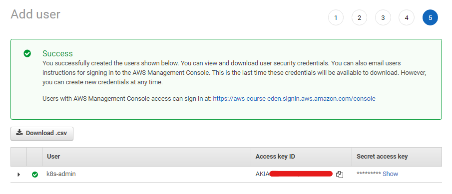
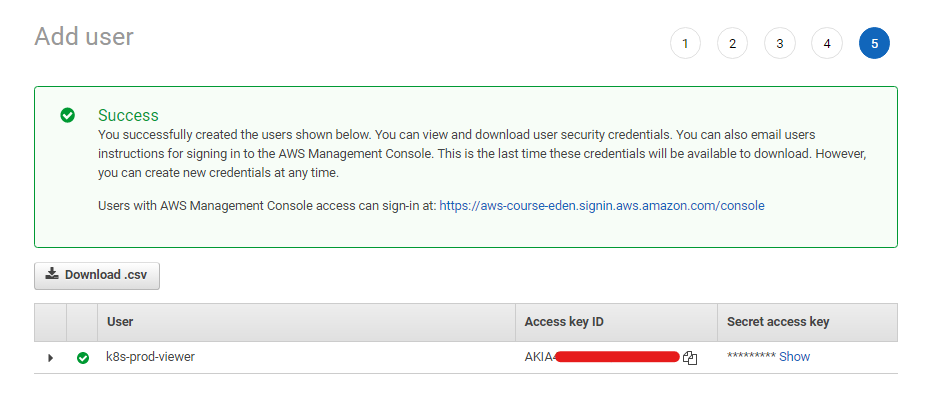

# Lab 53: IAM and RBAC

Pre-requisites:

  - [Basic Understanding of Kubernetes](../README.md#kubernetes)
  - [AWS account](../README.md#create-an-aws-account)


Here's a breakdown of sections for this lab.

- [Introduction](#introduction)
- [Before we start](#before-we-start)
    - [IAM](#iam)
    - [CLI Tools](#cli-tools)
    - [Launch a Simple Cluster](#launch-a-simple-cluster)
- [Part 1: Create a cluster admin](#part-1-create-a-cluster-admin)
    - [Create the cluster admin user](#create-the-cluster-admin-user)
    - [Add the Cluster-admin user to Configmap](#add-the-cluster-admin-user-to-configmap)
    - [Create CLI access for the Cluster-admin user](#create-cli-access-for-the-cluster-admin-user)
    - [Test the new user's access](#test-the-new-users-access)
- [Part 2: Create a Read-only user for a dedicated namespace](#part-2-create-a-read-only-user-for-a-dedicated-namespace)
    - [Create the Namespace](#create-the-namespace)
    - [Create the IAM User](#create-the-iam-user)
    - [Create the Role and Rolebinding](#create-the-role-and-rolebinding)
    - [Add the Read-only User to the Configmap](#add-the-read-only-user-to-the-configmap)
    - [Create CLI access for the Read-only user](#create-cli-access-for-the-read-only-user)
    - [Test the Read-only User's Access](#test-the-read-only-users-access)
- [Cleanup](#cleanup)

----------------------------------------------

## Introduction 

In this lab, we'll create additional users and provide them RBAC permissions to access our Kubernetes clusters. This lab has two parts:

**Part 1: Create a cluster admin**

- Create an IAM user
- Map user to Kubernetes role
- Test the setup 

**Part 2: Create a Read-only user for a dedicated namespace**

- Create the namespace 
- Create the IAM user
- Create a role and rolebinding 
- Map user to Kubernetes role
- Test the setup 

We'll also be using **ap-southeast-1** region (Singapore).

**New Developers joining**

Let's assume two new developers have been added to our team.

- developerMax will be given the admin access 
- developerYung will be given the read-only access 


## Before we start

### IAM 

We need to do the following before we can perform EKS operations.

- [Create the IAM Policy](../README.md#setup-eks-access-on-aws)
- [Create the IAM User, Access Key, and Keypair](../README.md#setup-eks-access-on-aws)
- [Create the IAM Group](../README.md#setup-eks-access-on-aws)

For the IAM User and Group, you can use the values below. Make sure to add the user to the group.

- IAM User: k8s-user
- IAM Group: k8s-lab

Once you've created the <code>k8s-user</code>, log-in to the AWS Management Console using this IAM user.

To avoid confusion, we'll label the user accounts as:

- **k8s-user** - main admin user that we'll use 

- **k8s-user-2** - a second admin user that we'll create 

- **k8s-user-prodviewer** - a read-only user that we'll create

### CLI Tools

We also need to install the following CLI tools:

- [aws cli](../README.md#install-cli-tools) - used by eksctl to grab authentication token
- [eksctl](../README.md#install-cli-tools) - setup and operation of EKS cluster 
- [kubectl](../README.md#install-cli-tools) - interaction with K8S API server

Once you've installed AWS CLI, [add the access key to your credentials file](../README.md#install-cli-tools). It should look like this:

```bash
# /home/user/.aws/credentials

[k8s-admin]
aws_access_key_id = AKIAxxxxxxxxxxxxxxxxxxx
aws_secret_access_key = ABCDXXXXXXXXXXXXXXXXXXXXXXX
region = ap-southeast-1
output = json
```

You can use a different profile name. To use the profile, export it as a variable.

```bash
$ export AWS_PROFILE=k8s-admin
```

To verify, we can run the commands below:

```bash
$ aws configure list 
```
```bash
$ aws sts get-caller-identity 
```

Although the region is already set in the profile, we'll also be using the region in many of the commands. We can save it as a variable.

```bash
$ export AWSREGION=ap-southeast-1 
```

### Launch a Simple Cluster

To use as an example later on, we can launch a simple cluster. But before we do that, let's first verify if we're using the main admin's access keys 

```bash
$ aws sts get-caller-identity 
```
```bash
{
    "UserId": "AIDxxxxxxxxxxxxxx",
    "Account": "1234567890",
    "Arn": "arn:aws:iam::1234567890:user/k8s-user"
} 
```

For the cluster, we can reuse the **eksops.yml** file from the previous labs.

<details><summary> eksops.yml </summary>
 
```bash
apiVersion: eksctl.io/v1alpha5
kind: ClusterConfig

metadata:
    version: "1.22"
    name: eksops
    region: ap-southeast-1 

nodeGroups:
    -   name: ng-dover
        instanceType: m5.large
        desiredCapacity: 3
        ssh: 
            publicKeyName: "k8s-kp"
```
 
</details>
</br>

Launch the cluster.

```bash
$ time eksctl create cluster -f eksops.yml 
```

Check the nodes and pods.

```bash
$ kubectl get nodes 
$ kubectl get pods -A
```

## Part 1: Create a cluster admin

This is actually similar to the [Before we start](#before-we-start) section since the first user we created already has cluster-level privileges. However in Part 1 of this lab, we need to create an additional cluster admin that doesn't have console access.

### Create the cluster admin user 

We can simply follow the same steps:

1. Login to the AWS Management Console.
2. Go to IAM > Users > Add users 
3. In the next page, set the following:

    - User name: k8s-user-2
    - Select AWS credential type: Access key - Programmatic access

4. Click **Next: permissions** > **Next: tags**

    - Key: Name 
    - Value: k8s-user-2

5. Click **Next: Review** > **Create user**
6. You should see the **Success** message in the last page, along with the access key ID and secret access key.
7. Click **Download .csv** > **Close**


      

Back at the Users page, click the user that you just created. Copy the **User ARN**. We'll be using it in the next step.


### Add the Cluster-admin user to Configmap 

Verify that the COnfigmap is created in our cluster. This should return the **aws-auth**.

```bash
$ kubectl -n kube-system get cm 
```

Next is to edit the the Configmap. We can edit the file using the command below:

```bash
$ kubectl edit configmap aws-auth -n kube-system 
```

Another approach it to print the Configmap in YAML format and then store it in a file which we can edit later. We'll proceed with this approach.

```bash
$ kubectl -n kube-system get configmap aws-auth -o yaml > aws-auth-configmap.yml
```

Edit the file. Populate the **mapUsers** block. Replace userarn with your newly created user's ARN.

```bash
$ vim aws-auth-configmap.yml
```
```bash
mapUsers: |
 -  username: k8s-user-2
    userarn: arn:aws:iam::1234567890:user/k8s-user-2
    groups:
        - system:masters
```


Apply the changes.

```bash
$ kubectl -n kube-system apply -f aws-auth-configmap.yml 
```

Check if the user was saved in the Configmap.

```bash
$ kubectl -n kube-system describe cm aws-auth 
```

### Create CLI access for the Cluster-admin user 

Recall that we have two new developers added to our team. The first one is developerMax who will have given the admin access.

To **k8s-user** access, he can simply create a new profile for the new user in his credentials file. After that, add the access key ID and secret acces key from the CSV file that's downloaded in the [Create the cluster admin User](#create-the-cluster-admin-user) step.

```bash
$ vim ~/.aws/credentials 
```
```bash
[k8s-user-2]
aws_access_key_id = AKIAxxxxxxxxxxxxxxxxxxx
aws_secret_access_key = ABCDXXXXXXXXXXXXXXXXXXXXXXX
region = ap-southeast-1
output = json
```

To use the new profile, export it as a variable. Check the identity again.

```bash
$ export AWS_PROFILE=k8s-user-2 
```
```bash
$ aws sts get-caller-identity 
```
```bash
{
    "UserId": "AIDxxxxxxxxxxxxxx",
    "Account": "1234567890",
    "Arn": "arn:aws:iam::1234567890:user/k8s-user-2"
} 
```

### Test the new user's access

Check if the new user can also access the nodes and pods.

```bash
$ kubectl get nodes 
$ kubectl get pods
```

In addition to retrieving information about the running clusters, let's also test if the new user can perform other EKS operations.

Edit the **eksops.yml** and add a second nodegroup.

<details><summary> eksops.yml </summary>

```bash
apiVersion: eksctl.io/v1alpha5
kind: ClusterConfig

metadata:
    version: "1.22"
    name: eksops
    region: ap-southeast-1 

nodeGroups:

    -   name: ng-dover
        instanceType: m5.large
        desiredCapacity: 3
        ssh: 
            publicKeyName: "k8s-kp"

    # Uncomment the code below to add a second nodegroup
    -   name: ng-clementi
        instanceType: m5.large
        desiredCapacity: 3
        ssh: 
            publicKeyName: "k8s-kp"   
```
 
</details>
</br>

Apply the changes.

```bash
$ eksctl create nodegroup \
    --config-file=eksops.yml \
    --include='ng-clementi' 
```

Check the resources again.

```bash
$ kubectl get nodes 
$ kubectl get pods
```


## Part 2: Create a Read-only user for a dedicated namespace

In Part 2, we'll create a IAM user account for our new dev, *developerYung*. The IAM user is allowed to access the **prod** namespace but is restricted from interacting with other namespaces.

Here are the steps that we'll follow:

1. Create the namespace 
2. Create the IAM user
3. Create a role and rolebinding 
4. Add the User to the Configmap
5. Test the setup 

### Create the Namespace 

Simply run the command below to create a new namespace called **prod**.

```bash
$ kubectl create ns prod 
```

Verify.

```bash
$ kubectl get ns 
```


### Create the IAM User

Follow the same steps from the [Create the cluster admin User](#create-the-cluster-admin-user) step in Part 1. Use the values below.

- Username: k8s-user-prodviewer
- Select AWS credential type: Access key - Programmatic access

Don't forget to click the **Dowload .csv** after creating the user.

  


### Create the Role and Rolebinding

Create a **role-prodviewer.yml**. This role allows user to retrieve information about the resources in the *prod* namespace only.

```bash
kind: Role
apiVersion: rbac.authorization.k8s.io/v1
metadata:
    name: role-prodviewer
    namespace: prod
rules:
- apiGroups: [  # "" indicates the core API group
    "",
    "extensions",
    "apps"
    ] 
  resources: [  # can be further limited, e.g. pods, deployments
    "*"
    ]
  verbs: [
    "get", 
    "watch", 
    "list"
    ]
```

Next, create the **rolebind-prodviewer.yml**. This specifies the user and the role to be attached to the user.

```bash
kind: RoleBinding
apiVersion: rbac.authorization.k8s.io/v1
metadata:
  name: rolebind-prodviewer
  namespace: prod
subjects:
# You can specify more than one "subject"
- kind: User
  name: k8s-user-prodviewer # "name" is case sensitive
  apiGroup: ""
#   apiGroup: rbac.authorization.k8s.io
roleRef:
  # "roleRef" specifies the binding to a Role / ClusterRole
  kind: Role #this must be Role or ClusterRole
  name: role-prodviewer # this must match the name of the Role or ClusterRole you wish to bind to
  apiGroup: ""
#   apiGroup: rbac.authorization.k8s.io 
```

Let's now create the two resources.

```bash
$ kubectl apply -f role-prodviewer.yml 
$ kubectl apply -f rolebind-prodviewer.yml 
```


### Add the Read-only User to the Configmap

Edit the configmap.

```bash
$ kubectl edit configmap aws-auth -n kube-system  
```

Add the user in the **mapUsers** block. For the groups, specify the role that we created. Add the user ARN and the user name as well.

```bash
  mapUsers: |

    - groups:
      - system:masters
      userarn: arn:aws:iam::123456789098:user/k8s-user-2
      username: k8s-user-2

    - groups:
      - role-prodviewer
      userarn: arn:aws:iam::123456789098:user/k8s-user-prodviewer
      username: k8s-user-prodviewer 
```

Verify if the user has been added.

```bash
$ kubectl -n kube-system describe cm aws-auth 
```


### Create CLI access for the Read-only user

We can now give the user account to developerYung. He just needs to modify his AWS credentials file.

```bash
$ vim ~/.aws/credentials 
```
```bash
[k8s-user-prodviewer]
aws_access_key_id = AKIAxxxxxxxxxxxxxxxxxxx
aws_secret_access_key = ABCDXXXXXXXXXXXXXXXXXXXXXXX
region = ap-southeast-1
output = json
```

Export as a variable then check the identity.

```bash
$ export AWS_PROFILE=k8s-user-prodviewer 
```
```bash
$ aws sts get-caller-identity 
```
```bash
{
    "UserId": "AIDxxxxxxxxxxxxxx",
    "Account": "1234567890",
    "Arn": "arn:aws:iam::1234567890:user/k8s-user-prodviewer"
} 
```

### Test the Read-only User's Access

Check if the new user can also access the nodes and pods.
He should be getting a "not authorized" error message.

```bash
$ kubectl get nodes 
$ kubectl get pods
```

In addition to retrieving information about the running clusters, let's also test if the new user can perform other EKS operations. He should be getting a "not authorized" error message.

```bash
$ eksctl get nodegroup --cluster eksops 
```

## Cleanup

Before we officially close this lab, make sure to destroy all resources to prevent incurring additional costs.

```bash
$ time eksctl delete cluster -f eksops.yml 
```

Note that when you delete your cluster, make sure to double check the AWS Console and check the Cloudformation stacks (which we created by eksctl) are dropped cleanly.


