# Lab 54: Everything in Console

Pre-requisites:

  - [Basic Understanding of Kubernetes](../README.md#kubernetes)
  - [AWS account](../README.md#create-an-aws-account)


Here's a breakdown of sections for this lab.

<!-- TOC -->

- [Introduction](#introduction)
- [Creating the Access](#creating-the-access)
- [Setup CLI Tools](#setup-cli-tools)
- [Configure CLI Access](#configure-cli-access)
- [Create the EKSClusterRole](#create-the-eksclusterrole)
- [Create the VPC and Nodes through CloudFormation](#create-the-vpc-and-nodes-through-cloudformation)
- [Create the EKS cluster](#create-the-eks-cluster)
- [Create the Worker Nodes](#create-the-worker-nodes)
- [Verify the Nodes](#verify-the-nodes)
- [Access the Cluster through CLI](#access-the-cluster-through-cli)
- [Deploy an NGINX pod](#deploy-an-nginx-pod)
- [Cleanup](#cleanup)


For this lab, we'll be using **ap-southeast-1** region (Singapore).


## Introduction

In this lab, we'll be creating the cluster through the EKS dahsboard in AWS Management Console.

## Creating the Access 

We need to do the following before we can perform EKS operations.

- [Create the IAM Policy](../README.md#setup-eks-access-on-aws)
- [Create the IAM User, Access Key, and Keypair](../README.md#setup-eks-access-on-aws)
- [Create the IAM Group](../README.md#setup-eks-access-on-aws)

For the IAM User and Group, you can use the values below. Make sure to add the user to the group.

- IAM User: k8s-admin
- IAM Group: k8s-lab

While you can attach the EKSFullAccess policy to your user, you can als give it the *AdministratorAccess*. 

Once you've created the <code>k8s-admin</code>, log-in to the AWS Management Console using this IAM user.

## Setup CLI Tools 

Install the following CLI tools by clicking the links:

- [aws cli](../README.md#install-cli-tools) - used by eksctl to grab authentication token
- [eksctl](../README.md#install-cli-tools) - setup and operation of EKS cluster 
- [kubectl](../README.md#install-cli-tools) - interaction with K8S API server

## Configure CLI Access 

Although we said that "Everything is done in the console", we can also verify the Kubernetes cluster from our CLI. 

In your terminal, [add the access key and secret access key to your credentials file](../README.md#install-cli-tools). It should look like this:

```bash
# /home/user/.aws/credentials

[k8s-admin]
aws_access_key_id = AKIAxxxxxxxxxxxxxxxxxxx
aws_secret_access_key = ABCDXXXXXXXXXXXXXXXXXXXXXXX
region = ap-southeast-1
output = json
```
You can use a different profile name. To use the profile, export it as a variable.

```bash
$ export AWS_PROFILE=k8s-admin
```

To verify, we can run the commands below:

```bash
$ aws configure list 
```
```bash
$ aws sts get-caller-identity 
```

Although the region is already set in the profile, we'll also be using the region in many of the commands. We can save it as a variable.

```bash
$ export AWSREGION=ap-southeast-1 
```

## Create the EKSClusterRole 

1. Go to IAM dashboard.
2. in the left menu, click **Roles** > **Create Role**
3. In the **Select trusted entity page**, choose **AWS Service.**
4. In the **Use cases for other AWS services**, type **EKS**.
5. Select the **EKS - Cluster** then click **Next** > **Next**
6. Git it a name: **EKSServiceRole**.
7. Finally, click **Create role**.

## Create the VPC through CloudFormation

Let's start with creating a VPC where our EKS Cluster will reide. We'll use a Cloudformation template from the [AWS Docmentation.](https://docs.aws.amazon.com/eks/latest/userguide/creating-a-vpc.html)

1. Go to Cloudformation dashboard and click **Create cluster**.
2. Under the **Prepare template**, choose **Template is ready**.
3. Under **Specify template**, choose **Amazon S3 URL**.
4. In the **Amazon S3 URL field**, paste the link below.

    ```bash
    https://s3.us-west-2.amazonaws.com/amazon-eks/cloudformation/2020-10-29/amazon-eks-vpc-private-subnets.yaml 
    ```

5. Click Next.
6. Give the stack a name: ***eks-lab-vpc***. Click **Next**.
7. Add tags:

    - Key: Name 
    - Value: eks-lab-vpc

8. Click **Next** > **Create stack.**

## Create the Nodegroup through CloudFormation

Next, we'll create the nodegroup.

1. Back at the Stacks page, click **Create stack** > **With new resources**.
2. Follow the same steps, and paste the link below:

    ```bash
    https://s3.us-west-2.amazonaws.com/amazon-eks/cloudformation/2020-10-29/amazon-eks-nodegroup-role.yaml 
    ```
3. Click **Next**. In the next page, give it a name: ***eks-lab-nodegroup***.

4. After clickig **Next**. sdd tags:
    - Key: Name 
    - Value: eks-lab-nodegroup 

5. Click **Next** to go to the next page.
6. Scroll down below to the **The following resource(s) require capabilities: [AWS::IAM::Role]** section. Tick the checkbox.
7. Click **Create stack.**

Back at the Stacks page, wait for the two stacks to finish setting up.

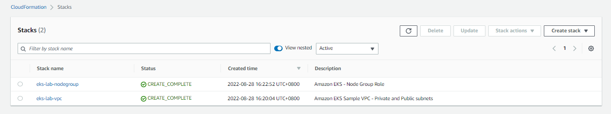  

## Create the EKS cluster 

Recall that the EKS has two planes, Management plabne and Contol Plane. Let's create the control plane.

1. Go to the EKS Dashboard and click **Add cluster > Create.**
2. Give it a name: ***eks-bounavista***.
3. For the Kubernetes version, select the default.
4. For the role, select **EKSClusterRole** then click **Next.**
5. For thee VPC, select the **eks-lab-vpc** that we created.
6. For the security group, select the one created by cloudformation: **ControlPlaneSecurityGroup.**
7. Under the **Cluster endpoint access**, select **Public**.
8. Click **Next > Next**.
9. In the **Review and create** page, scroll down to the bottom and click **Create cluster**

It will take a few minutes before the cluster is created.

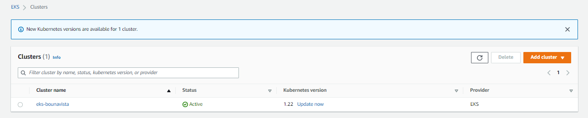  

## Create the Worker Nodes 

1. Go to **EKS > Clusters > eks-buonavista**.
2. Click the **Compute** tab. 
3. In the **Node groups** section, click **Add node group.**

    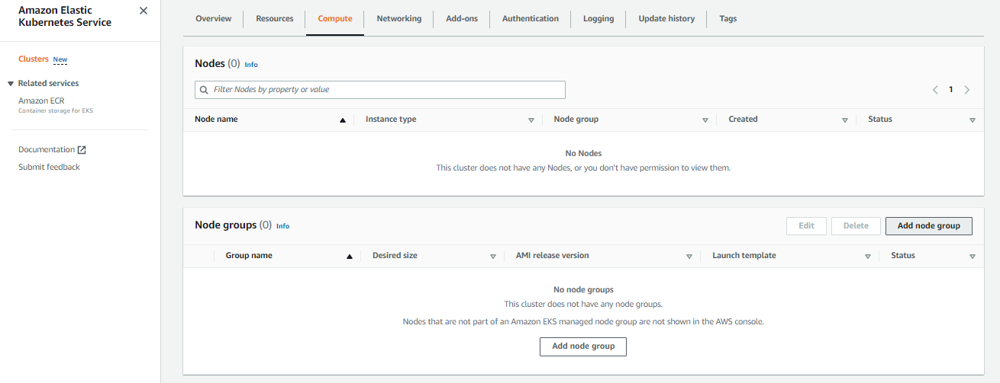  

4. Give it a name: ***eks-buounavista-ng1***
5. For the Node IAM Role, select the role that was created by Cloudformation: NodeInstanceRole
6. In the next page, set the configurations:

    - Instance type: t3.small 
    - Disk Size: 5G
    - Desired Size: 2
    - Minimum Size: 1
    - Minimum Size: 5

7. Click **Next > Next > Create**

Back at the Compute tab, wait for the node to change status from **NotReady** to **Ready**.

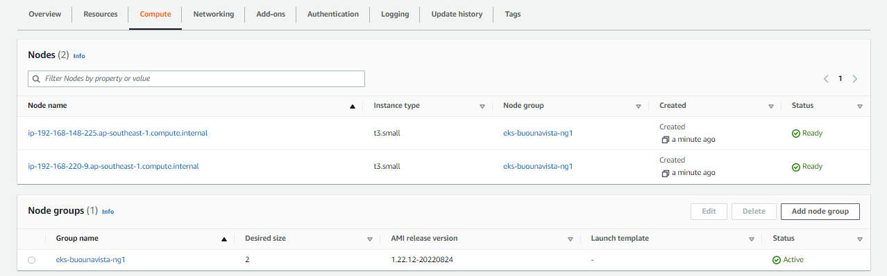  

## Verify the Nodes 

Go to the EC2 dashboard. We should see the nodes created for our EKS cluster.

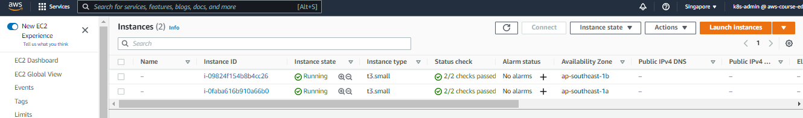  

## Access the Cluster through CLI 

In your terminal, check if the identity that you're using is the same as the user you used to log-in to the AWS Console.

```bash
$ aws sts get-caller identity 
```

You should be able to retrieve the nodes now.

```bash
$ kubectl get nodes  
```

If you get this error,

```bash
error: You must be logged in to the server (Unauthorized)  
```

Run the command below to update the kubeconfig file.

```bash
$ aws eks update-kubeconfig \
    --region ap-southeast-1 \
    --name eks-buenavista 
```

If this doesn't solve the error, you may need to edit the <code>~/.kube/config</code> manually and add the cluster information. You can find all of these in the **Overview** tab of your cluster in the EKS dashboard.

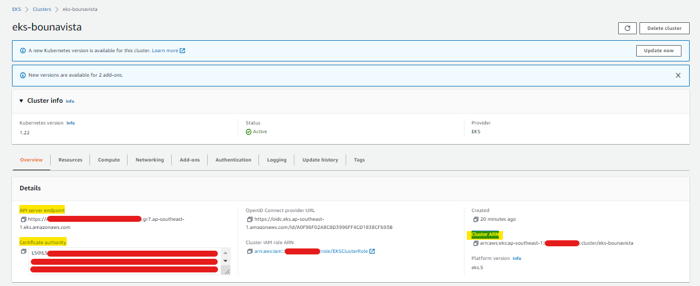  

Modify the kubeconfig file.

```bash
$ vim ~/.kube/config  
```

#### Clusters

Start with the **cluster block**. You need to add the:
- certificate-authority-data
- server endpoint 
- cluster ARN

```bash
clusters:
- cluster:
    certificate-authority-data: <Certificate-authority>
    server: <API server endpoint>
  name: <Cluster ARN>
```


#### Contexts 

Next is the **Context** block.

```bash
contexts:
- context:
    cluster: <Cluster ARN>
    user: <Cluster ARN>
  name: eks-buonavista 
```

#### Users

Finally, configure the **Users** block.

```bash
users:
- name: <Cluster ARN>
  user:
    exec:
      apiVersion: client.authentication.k8s.io/v1beta1
      args:
      - --region
      - ap-southeast-1
      - eks
      - get-token
      - --cluster-name
      - eks-bounavista
      command: aws
      env:
      - name: AWS_PROFILE
        value: k8s-admin 
```

Retrieve the contexts. It should now show the new cluster.

```bash
$ kubectl config get-contexts  
```

If you other cluster added to the config file, you can switch over to the new cluster. Notice that the "*" now shifts to the new cluster when you retrieve the contexts again.

```bash
$ kubectl config use-context eks-bounavista 
```
```bash
$ kubectl config get-contexts  
```

Now try to retrieve the nodes.

```bash
$ kubectl get nodes 
```

Then try to check the nodes and cluster.

```bash
$ aws eks list-clusters
{
    "clusters": [
        "eks-bounavista"
    ]
}
``
```bash
$ kubectl get nodes
NAME                                                 STATUS   ROLES    AGE   VERSION
ip-192-168-148-225.ap-southeast-1.compute.internal   Ready    <none>   15m   v1.22.12-eks-ba74326
ip-192-168-220-9.ap-southeast-1.compute.internal     Ready    <none>   16m   v1.22.12-eks-ba74326
```

Verify if they're the same nodes in the EKS dashboard.

  


## Deploy an NGINX pod 

As a bonus, let's try to deploy an NGINX pod using this **nginx.yml** file.

```yaml 
apiVersion: v1
kind: Pod
metadata:
  name: nginx-demo
  namespace: default
spec:
  containers:
  - name: nginx-ctr
    image: nginx:latest
    ports:
      - containerPort: 80
```

Apply the manifest.

```bash
$ kubectl apply -f nginx.yml

pod/nginx-demo created
```

Retrieve the pods.

```bash
$ kubectl get pods

NAME         READY   STATUS    RESTARTS   AGE
nginx-demo   1/1     Running   0          11s 
```

Go back to the your cluster in the EKS dashboard and open the **Resources** tab. Open **Workloads > Pod**.

In the **All Namespaces** dropdown bar, select **default**. You should now see the NGINX pod running.

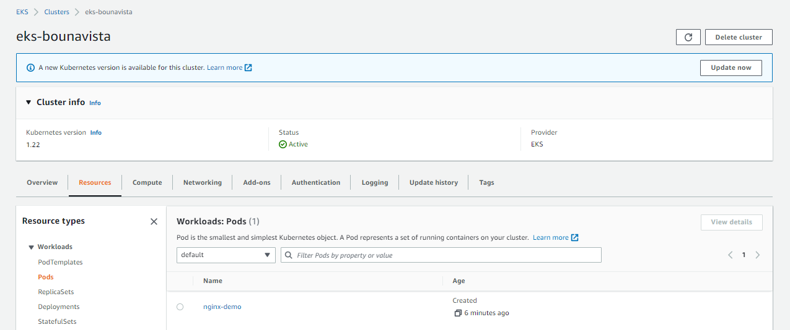  

Click **nginx-demo** to see mroe information about the pod. Scroll down below to the **Events** section. If there are any errors hta occured, it will be displayed here.

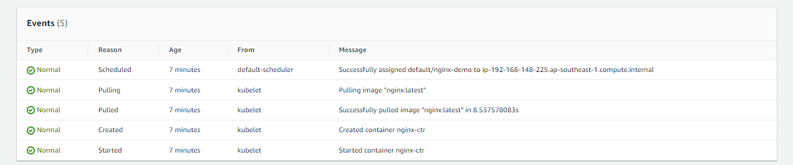  


## Cleanup

Before we officially close this lab, make sure to destroy all resources to prevent incurring additional costs.
Go to the EKS dashboard and delete the nodegroup, then the cluster.

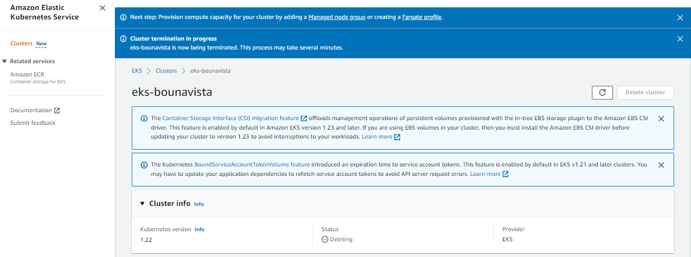  

Next, go to the Cloudformation dashboard and delete the two stacks.
Note that when you delete your cluster, make sure to double check if the stacks are dropped cleanly.

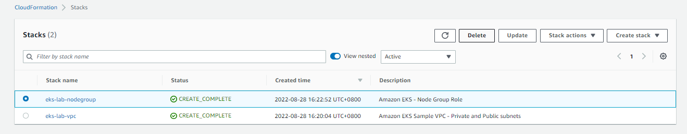  

It could encounter an error sometimes which causes the stack to fail.

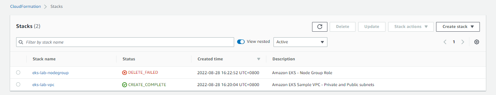  

In this cases, open the stack and go to the **Resources** tab. The **Status Reason** should display what caused the delete to fail.

  

For this error, we can simply click the link in the **Physical ID** and it should bring us to the role that we need to detach.

Since we don't need the role anymore, we can simply delete it.

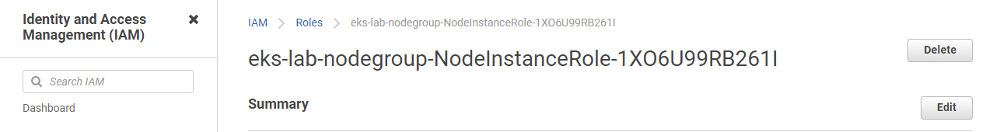  

Go back to the Stacks page in Cloudformation and retry the delete again.

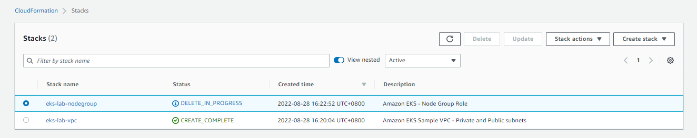  

The delete should now succeed. Delete the other stack to completely remove all resources.

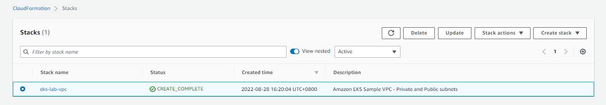  


