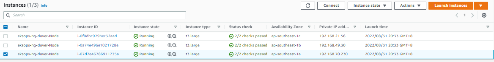
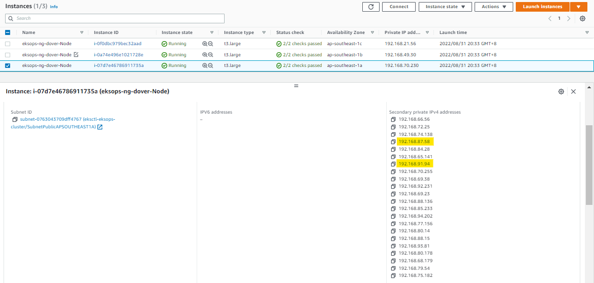
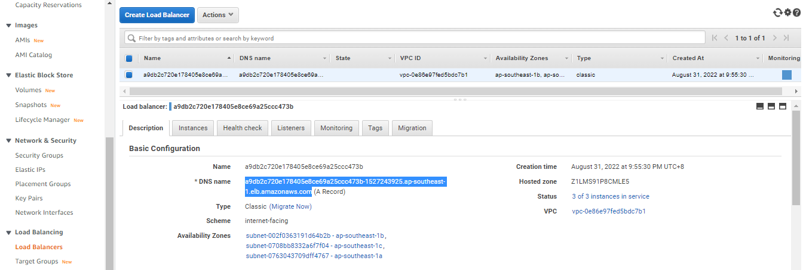
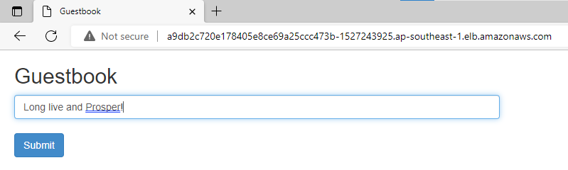

# Lab 56: Deploy a Stateless Guestbook Application

Pre-requisites:

- [Basic Understanding of Kubernetes](../README.md#kubernetes)
- [AWS account](../pages/01-Pre-requisites/labs-optional-tools/README.md#create-an-aws-account)
- [AWS IAM Requirements](../pages/01-Pre-requisites/labs-optional-tools/01-AWS-IAM-requirements.md)
- [AWS CLI, kubectl, and eksctl](../pages/01-Pre-requisites/labs-kubernetes-pre-requisites/README.md#install-cli-tools) 


Here's a breakdown of sections for this lab.

  - [Introduction](#introduction)
  - [The Application Architecture](#the-application-architecture)
  - [Launch a Simple EKS Cluster](#launch-a-simple-eks-cluster)
  - [Deploy the Backend Resources](#deploy-the-backend-resources)
  - [Deploy the Frontend Resources](#deploy-the-frontend-resources)
  - [Scaling the Pods](#scaling-the-pods)
  - [Perform some Chaos Testing](#perform-some-chaos-testing)
  - [Cleanup](#cleanup)

We'll be using **ap-southeast-1** region (Singapore).


## Introduction

In this lab, we'll deploy an EKS cluster and then deploy a simple guestbook application that uses a Redis database. We'll also scale up and down our Pods and see the results. 

Lastly, we will also get to use and test a publicly accesible AWS LoadBalancer with our Kubernetes cluster.

## The Application Architecture 

<p align=center>

</p>


**Backend: Redis**
- single master (writes)
- multi slaves (reads)
- loadbalancing done internally between slaves
- slaves sync continuously with master

**Frontend: PHP App**  
- uses AWS ELB to loadbalance between the Pods
- "Read" balanced over multiple slave DBs
- "Writes" done on the single machine Redis DB

To learn more about the sample application, check out [Guestbook application on Kubernetes.](https://github.com/kubernetes/examples/tree/master/guestbook)

## Launch a Simple EKS Cluster

Before we start, let's first verify if we're using the correct IAM user's access keys. This should be the user we created from the **pre-requisites** section above.

```bash
$ aws sts get-caller-identity 
```
```bash
{
    "UserId": "AIDxxxxxxxxxxxxxx",
    "Account": "1234567890",
    "Arn": "arn:aws:iam::1234567890:user/k8s-admin"
} 
```

For the cluster, we can reuse the **eksops.yml** file from the previous labs.

<details><summary> eksops.yml </summary>
 
```bash
apiVersion: eksctl.io/v1alpha5
# apiVersion: client.authentication.k8s.io/v1beta1
kind: ClusterConfig

metadata:
    version: "1.23"
    name: eksops
    region: ap-southeast-1 
nodeGroups:
    -   name: ng-dover
        instanceType: t3.large
        minSize: 1
        maxSize: 5
        desiredCapacity: 1
        ssh: 
            publicKeyName: "k8s-kp"
```
 
</details>

Launch the cluster.

```bash
$ time eksctl create cluster -f eksops.yml 
```

Check the nodes and pods.

```bash
$ kubectl get nodes 
```

## Deploy the Backend Resources 

Let's start with creating the backend resources composed of:

- Redis Master Pod
- Redis Master Service (provides accesible fixed URL)
- Redis Slave Pods
- Redis Slave Service (performs the loadbalancing)

Create the **redis-master.yml**. In this manifest, we're creating two resources: a deployment and a service.

```bash
vim redis-master.yml 
```

<details><summary> redis-master.yml </summary>
 
```bash
# SOURCE: https://cloud.google.com/kubernetes-engine/docs/tutorials/guestbook

apiVersion: apps/v1
kind: Deployment
metadata:
  name: redis-master
  labels:
    app: redis
    # role: master
    # tier: backend
spec:
  replicas: 1
  selector:
    matchLabels:
      app: redis
      role: master
      tier: backend
  template:
    metadata:
      labels:
        app: redis
        role: master
        tier: backend
    spec:
      containers:
      - name: master
        image: "docker.io/redis:6.0.5"
        resources:
          requests:
            cpu: 100m
            memory: 100Mi
        ports:
        - containerPort: 6379 
---
apiVersion: v1
kind: Service
metadata:
  name: redis-master
  labels:
    app: redis
    role: master
    tier: backend
spec:
  ports:
  - port: 6379
    targetPort: 6379
  selector:
    app: redis
    role: master
    tier: backend        
```

</details>

In the **Deployment**, we can see the specifications. The *selector* tells kubectl to apply the deployment on instances and assign them the three labels: *app, role,* and *tier*.

The container image used is the Redis image available from Docker. We're also specifying limits for the CPU and memory, along with the port to use.

In the **Service** resource, we also specified the specifications and the labels for the Redis service. This will from the Redis master Pod
Deploy the Redis service.

Deploy the resources.

```bash
kubectl apply -f redis-master.yml 
```
```bash
deployment.apps/redis-master created
service/redis-master created 
```

Check if the Pod is created.

```bash
kubectl get pods 
```
```bash
NAME                            READY   STATUS    RESTARTS   AGE
redis-master-7fb7b4d7c5-xvdsb   1/1     Running   0          16m 
```

Also check the service. Notice that the redis-master was assigned a cluster IP, which is only accesible from within the cluster.

```bash
kubectl get svc  
```
```bash
NAME           TYPE        CLUSTER-IP      EXTERNAL-IP   PORT(S)    AGE
kubernetes     ClusterIP   10.100.0.1      <none>        443/TCP    59m
redis-master   ClusterIP   10.100.186.99   <none>        6379/TCP   34m
```

Let's now create the **redis-slave.yml**.

```bash
vim redis-slave.yml 
```
<details><summary> redis-slave.yml </summary>
 
```bash
 # SOURCE: https://cloud.google.com/kubernetes-engine/docs/tutorials/guestbook

apiVersion: apps/v1
kind: Deployment
metadata:
  name: redis-slave
  labels:
    app: redis
    role: slave
    tier: backend
spec:
  replicas: 2
  selector:
    matchLabels:
      app: redis
  template:
    metadata:
      labels:
        app: redis
        role: slave
        tier: backend
    spec:
      containers:
      - name: slave
        image: gcr.io/google_samples/gb-redisslave:v1
        resources:
          requests:
            cpu: 100m
            memory: 100Mi
        ports:
        - containerPort: 6379
        # defines how the followers can talk to the Redis master
        env:
        - name: GET_HOSTS_FROM
          value: dns
--- 

apiVersion: v1
kind: Service
metadata:
  name: redis-slave
  labels:
    app: redis
    role: slave
    tier: backend
spec:
  ports:
    # the port that this service should serve on
  - port: 6379
  selector:
    app: redis
    role: slave
    tier: backend
```
 
</details>

Deploy the slave resources.

```bash
kubectl apply -f redis-slave.yml 
```
```bash
deployment.apps/redis-slave created
service/redis-slave created 
```

Check if the Pods and services are created. As we can see, all the Pods have beeb assigned a private IP address.

```bash
kubectl get pods  
kubectl get svc
```

We can also get more information about the Pods by adding the the "- wide" parameter. Notice the IP addres in the **Node** column. These are IP address of the instances in which the Pod is currently deployed on.

```bash
kubectl get pods -o wide 
```
```bash
NAME                            READY   STATUS    RESTARTS   AGE   IP              NODE                                                NOMINATED NODE   READINESS GATES
redis-master-7fb7b4d7c5-xvdsb   1/1     Running   0          33m   192.168.87.58   ip-192-168-70-230.ap-southeast-1.compute.internal   <none>           <none>
redis-slave-566774f44b-2nb58    1/1     Running   0          24s   192.168.7.123   ip-192-168-21-56.ap-southeast-1.compute.internal    <none>           <none>
redis-slave-566774f44b-hhpqn    1/1     Running   0          24s   192.168.91.94   ip-192-168-70-230.ap-southeast-1.compute.internal   <none>           <none> 
```

Notice that the Redis Master and *redis-slave-566774f44b-hhpqn* are both running in the same node, based on Node IP. We can also confirm this on the EC2 dashboard.

<!--    -->

  

We can see that an instance has multiple secondary IP addresses attached to the Elastic Network Interfaces (ENI), which in turn is attached to the EC2 instance.

Note that depending on the instance-type that you choose, there is a [limitation in the ENI](https://docs.aws.amazon.com/AWSEC2/latest/UserGuide/using-eni.html) that can be attached to the instance, which means the smaller the instance type, the fewer the ENIs that can be attached, the fewer the IP addresses that can be used, and the fewer the Pods that can be ran in the node.

To learn more about a node,

```bash
kubectl describe node <node-ip> 
```


## Deploy the Frontend Resources

Now that our backend is ready, wee can now deploy the frontend resources:

- Guestbook Pods
- Guestbook Service (internet-facing AWS LoadBalancer)

After this, we'll inspect the underlying resources:

- Elastic LoadBalancer
- Security Groups 
- Elastic Network Interfaces (ENI)

Let's create the **frontend-app.yml**.

```bash
vim frontend-app.yml  
```
<details><summary> frontend-app.yml </summary>
 
```bash
 
```
 
</details>

Deploy the frontend app.

```bash
kubectl apply -f frontend-app.yml 
```

Check the Pods and Service. In the output for the *service*, notice that the frontend service (with type *LoadBalancer*) has an external-IP.

```bash
kubectl get pods 
```
```bash
NAME                            READY   STATUS    RESTARTS   AGE
frontend-57df59b89c-7css6       1/1     Running   0          53s
frontend-57df59b89c-chcfx       1/1     Running   0          53s
frontend-57df59b89c-t9xcr       1/1     Running   0          53s
redis-master-7fb7b4d7c5-xvdsb   1/1     Running   0          67m
redis-slave-566774f44b-2nb58    1/1     Running   0          34m
redis-slave-566774f44b-hhpqn    1/1     Running   0          34m 
```
```
kubectl get svc 
```
```bash
NAME           TYPE           CLUSTER-IP      EXTERNAL-IP                                                                    PORT(S)        AGE
frontend       LoadBalancer   10.100.151.42   a9db2c720e178405e8ce69a25ccc473b-1527243925.ap-southeast-1.elb.amazonaws.com   80:30694/TCP   79s
kubernetes     ClusterIP      10.100.0.1      <none>                                                                         443/TCP        93m
redis-master   ClusterIP      10.100.186.99   <none>                                                                         6379/TCP       68m
redis-slave    ClusterIP      10.100.115.57   <none>                                                                         6379/TCP       34m 
```

To see full DNS name of the LoadBalancer, run the command below and search for the **LoadBalancer Ingress.**

```bash
kubectl describe service frontend 
```

We can also see this LoadBalancer created in **EC2** > **LoadBalancers**. In the **Description**, copy the **DNS Name.**



Open a new browser tab and paste the DNS name. You should now see the guestbook app. Type a message and click **Submit.**

  


## Scaling the Pods


## Perform some Chaos Testing


## Cleanup

Before we officially close this lab, make sure to destroy all resources to prevent incurring additional costs.

```bash
$ time eksctl delete cluster -f  
```

Note that when you delete your cluster, make sure to double-check the AWS Console and check the Cloudformation stacks (which we created by eksctl) are dropped cleanly.


