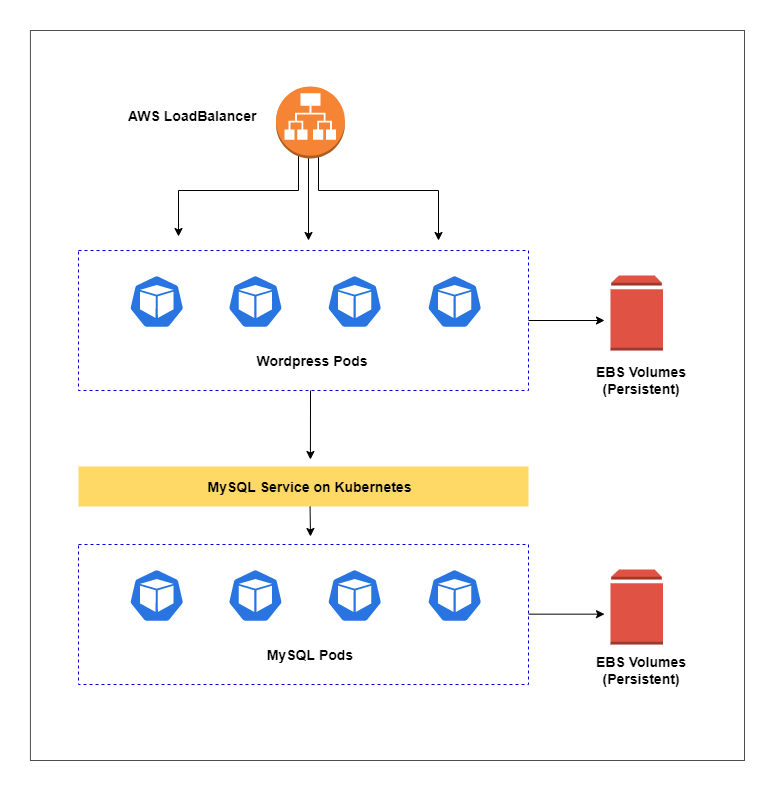

# Lab 57: Deploy a Stateful Application using EBS

Pre-requisites:

- [Basic Understanding of Kubernetes](../README.md#kubernetes)
- [AWS account](../pages/01-Pre-requisites/labs-optional-tools/README.md#create-an-aws-account)
- [AWS IAM Requirements](../pages/01-Pre-requisites/labs-optional-tools/01-AWS-IAM-requirements.md)
- [AWS CLI, kubectl, and eksctl](../pages/01-Pre-requisites/labs-kubernetes-pre-requisites/README.md#install-cli-tools) 

Here's a breakdown of sections for this lab.

<insert-TOC-here>


we'll be using **ap-southeast-1** region (Singapore).


## Introduction

In this lab, we'll be deploying a stateful Wordpress application and a MySQL database. We will also deploy the application using EBS volumes

TODO:

- Create a Namespace
- Create Storage Class and Persistent Volumes
- Deploy DB Backend (MySQL)
- Deployment vs. StatefulSet
    - Wordpress as Deployment
    - Wordpress as StatefulSet

## The Application Architecture 

<!-- <p align=center>

</p> -->

<!-- <p align=center>

</p> -->

<p align=center>

</p> -->


Our sample application will be composed of two layers:

- Web layer: Wordpress application 
- Data layer: MySQL database 

While the database can store records, both these layer will need a place somewhere to store the media content. Having said, our application will have the following:

**Frontend resources:**

- an Amazon Elastic Block Storage (EBS) volume that will serve as persistent storage to store the HTML files.

- an internet-facing Amazon Elastic LoadBalancer (ELB) to expose our application to the web

- the actual Wordpress application running on Pods

**Backend resources:**

- a MySQL database running on Pods 

- a MySQL service that connects the frontend to the database

- an Amazon Elastic Block Storage (EBS) volume to store the MySQL data


## Launch a Simple EKS Cluster

Before we start, let's first verify if we're using the correct IAM user's access keys. This should be the user we created from the **pre-requisites** section above.

```bash
$ aws sts get-caller-identity 
```
```bash
{
    "UserId": "AIDxxxxxxxxxxxxxx",
    "Account": "1234567890",
    "Arn": "arn:aws:iam::1234567890:user/k8s-admin"
} 
```

For the cluster, we can reuse the **eksops.yml** file from the previous labs.

<details><summary> eksops.yml </summary>
 
```bash
apiVersion: eksctl.io/v1alpha5
# apiVersion: client.authentication.k8s.io/v1beta1
kind: ClusterConfig

metadata:
    version: "1.23"
    name: eksops
    region: ap-southeast-1 
nodeGroups:
    -   name: ng-dover
        instanceType: t3.large
        minSize: 1
        maxSize: 5
        desiredCapacity: 1
        ssh: 
            publicKeyName: "k8s-kp"
```
 
</details>

Launch the cluster.

```bash
$ time eksctl create cluster -f eksops.yml 
```

Check the nodes and pods.

```bash
$ kubectl get nodes 
```


## Cleanup

Before we officially close this lab, make sure to destroy all resources to prevent incurring additional costs.

```bash
$ time eksctl delete cluster -f eksops.yml 
```

Note that when you delete your cluster, make sure to double-check the AWS Console and check the Cloudformation stacks (which we created by eksctl) are dropped cleanly.


## xxxx


