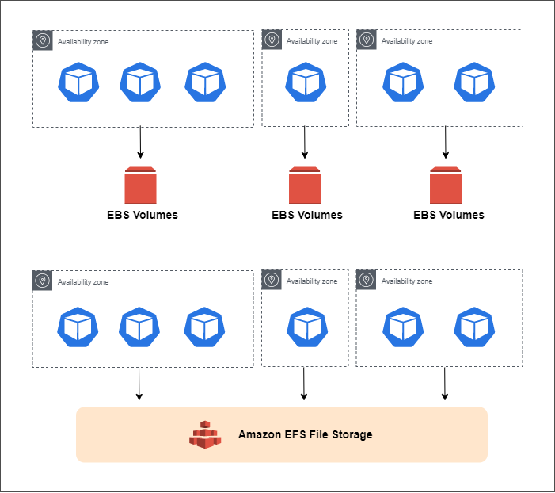

# Lab 57: Deploy a Stateful Application using EBS

Pre-requisites:

- [Basic Understanding of Kubernetes](../README.md#kubernetes)
- [AWS account](../pages/01-Pre-requisites/labs-optional-tools/README.md#create-an-aws-account)
- [AWS IAM Requirements](../pages/01-Pre-requisites/labs-optional-tools/01-AWS-IAM-requirements.md)
- [AWS CLI, kubectl, and eksctl](../pages/01-Pre-requisites/labs-kubernetes-pre-requisites/README.md#install-cli-tools) 

Here's a breakdown of sections for this lab.

<!-- TOC -->

- [Introduction](#introduction)
- [The Application Architecture](#the-application-architecture)
    - [EBS Volumes](#ebs-volumes)
- [Launch a Simple EKS Cluster](#launch-a-simple-eks-cluster)
- [Setup the Kubernetes Dashboard](#setup-the-kubernetes-dashboard)
- [Create a Namespace](#create-a-namespace)
- [Create Storage Class and Persistent Volumes](#create-storage-class-and-persistent-volumes)
    - [StorageClass](#storageclass)
    - [Approach 1: Dynamic Provisioning using the default StorageClass](#approach-1-dynamic-provisioning-using-the-default-storageclass)
    - [Approach 2: Provision PVC using a new StorageClass](#approach-2-provision-pvc-using-a-new-storageclass)
    - [Approach 3: Using the ebs.csi provisioner](#approach-3-using-the-ebscsi-provisioner)
- [Deploy the Database MySQL](#deploy-the-database-mysql)
- [Cleanup](#cleanup)


We'll be using **ap-southeast-1** region (Singapore).


## Introduction

In this lab, we'll be deploying a stateful Wordpress application and a MySQL database. We will also deploy the application using EBS volumes

```bash
TODO:
- Create a Namespace
- Create Storage Class and Persistent Volumes
- Deploy DB Backend (MySQL)
- Deployment vs. StatefulSet
    - Wordpress as Deployment
    - Wordpress as StatefulSet
```


## The Application Architecture 

<!-- <p align=center>

</p> -->

<p align=center>

</p>

<!-- <p align=center>

</p> --> 


Our sample application will be composed of two layers:

- Web layer: Wordpress application 
- Data layer: MySQL database 

While the database can store records, both these layer will need a place somewhere to store the media content. Having said, our application will have the following:

**Frontend resources:**

- an Amazon Elastic Block Storage (EBS) volume that will serve as persistent storage to store the HTML files.

- an internet-facing Amazon Elastic LoadBalancer (ELB) to expose our application to the web

- the actual Wordpress application running on Pods

**Backend resources:**

- a MySQL database running on Pods 

- a MySQL service that connects the frontend to the database

- an Amazon Elastic Block Storage (EBS) volume to store the MySQL data


### EBS Volumes 

Before we proceed with the lab, here are some key points to remember about EBS volumes:

- They are specific to each Availability Zone (AZ)
- Recreated Pods can only be started in the AZ of the existing EBS volume
- Pods in the same AZ can share the same EBS volume
- If you have two AZs, then each AZ should have their own EBS volume

To properly deploy the application, the Wordpress Pods needs be able to share the same storage even if the Pods are spread across different Availability Zone. However, this can't be accomplished if we're using EBS volumes as persistent storage.

So for this kind requirement, we will need to utilize **Amazon Elastic Filesystem (EFS)**. This is a drive that can be attached in multiple instances in multiple availability zones.

<p align=center>

</p>

We'll explore Stateful applications using EFS in the next lab where we'll deploy the application Pods across availability zones.

For now, let's dive into stateful applications with EBS volumes.


## Launch a Simple EKS Cluster

Before we start, let's first verify if we're using the correct IAM user's access keys. This should be the user we created from the **pre-requisites** section above.

```bash
$ aws sts get-caller-identity 
```
```bash
{
    "UserId": "AIDxxxxxxxxxxxxxx",
    "Account": "1234567890",
    "Arn": "arn:aws:iam::1234567890:user/k8s-admin"
} 
```

For the cluster, we can reuse the **eksops.yml** file from the previous labs.

<details><summary> eksops.yml </summary>
 
```bash
apiVersion: eksctl.io/v1alpha5
# apiVersion: client.authentication.k8s.io/v1beta1
kind: ClusterConfig

metadata:
    version: "1.23"
    name: eksops
    region: ap-southeast-1 
nodeGroups:
    -   name: ng-dover
        instanceType: t3.large
        minSize: 1
        maxSize: 5
        desiredCapacity: 1
        ssh: 
            publicKeyName: "k8s-kp"
```
 
</details>

Launch the cluster.

```bash
$ time eksctl create cluster -f eksops.yml 
```

Check the nodes and pods.

```bash
$ kubectl get nodes 
```

Save the cluster, region, and AWS account ID in a variable. We'll be using these in a lot of the commands later.

```bash
MYREGION=ap-southeast-1
MYCLUSTER=eksops 
MYAWSID=12345678910
```

## Setup the Kubernetes Dashboard 

The [previous lab](../lab55_EKS_Kubernetes_Dashboard/README.md) explained the concept and uses of Kubernetes Dashboard so we'll not be diving into that here. I do recommend that you check it out since the Kubernetes dashboard is one helpful utility tool which you can use when managing your Kubernetes clusters.

Here's a summary of commands that we need to run:

Download the metrics server.

```bash
kubectl apply -f https://github.com/kubernetes-sigs/metrics-server/releases/download/v0.6.1/components.yaml
```

Deploy the Kubernetes dashboard.

```bash
export KB_VER=v2.5.1
kubectl apply -f https://raw.githubusercontent.com/kubernetes/dashboard/$KB_VER/aio/deploy/recommended.yaml  
```

Create the service account that we'll use to authenticate to the Kubernetes dashboard.

```bash
vim kb-admin-svc.yml 
```

<details><summary> kb-admin-svc.yml </summary>
 
```bash
apiVersion: v1
kind: ServiceAccount
metadata:
  name: kb-admin-svc
  namespace: kube-system
---
apiVersion: rbac.authorization.k8s.io/v1
kind: ClusterRoleBinding
metadata:
  name: kb-admin-svc
  namespace: kube-system
roleRef:
  apiGroup: rbac.authorization.k8s.io
  kind: ClusterRole
  name: cluster-admin
subjects:
  - kind: ServiceAccount
    name: kb-admin-svc
    namespace: kube-system
```
 
</details>

Apply the YAML file.

```bash
kubectl apply -f kb-admin-svc.yml
```

Get the bearer token of the service account that we just created.

```bash
kubectl -n kube-system describe secret \
$(kubectl -n kube-system get secret | grep kb-admin-svc | awk '{print $1}') 
```

Run this command to access Dashboard from your local workstation.

```bash
kubectl proxy 
```

Open a web browser and paste this URL. Enter the token that we just copied.

```bash
http://localhost:8001/api/v1/namespaces/kubernetes-dashboard/services/https:kubernetes-dashboard:/proxy/#/login 
```

## Create a Namespace

We'll create a namespace to separate our workloads and isolate environments. Namespaces could also be used to group:

- access control
- quota on resources
- projects
- teams
- clients

To get the namespaces that we currently have in our cluster:

```bash
kubectl get ns
```
```bash
NAME              STATUS   AGE
default           Active   31m
kube-node-lease   Active   31m
kube-public       Active   31m
kube-system       Active   31m
```

Let's create a new namespace and call it "ns-lab57".

```bash
kubectl create ns ns-lab57
```

Verify if the namespace is created.

```bash
kubectl get ns
```

## Create Storage Class and Persistent Volumes

A **StorageClass** provides a way for administrators to describe the "classes" of storage they offer. This concept is sometimes called "*profiles*" in other storage systems.


### StorageClass 

**Note**:

If you're using Kubernetes version 1.11, the storageclass isn't created by default when you launch an EKS cluster and you must create them yourself.

We've been using version 1.22 for our Kubernetes labs so we should have one storageclass created by AWS for us. To check, run the command below:

```bash
kubectl get sc -A
```
```bash
kubectl get sc -A --namespace=ns-lab57
```
 
Both commands should return the default storageclass.

```bash
NAME            PROVISIONER             RECLAIMPOLICY   VOLUMEBINDINGMODE      ALLOWVOLUMEEXPANSION   AGE
gp2 (default)   kubernetes.io/aws-ebs   Delete          WaitForFirstConsumer   false                  162m
```

If it doesn't return a storageclass, you may check out the [StorageClass page](../pages/04-Kubernetes/017-StorageClass.md) to learn how to create one.


### Approach 1: Dynamic Provisioning using the default StorageClass

> *Update-September-2022:*
> *I'm having issues with provisioning a PVC using the default AWS storageclass. You may skip this and proceed to the second approach.*

<details><summary> Dynamic Provisioning using the default StorageClass </summary>
 
Since we already have a default StorageClass, we can enable **dynamic volume provisioning** next by creating a **persistent volume claim** and including the StorageClass. To learn more, you may read [Dynamic Volume Provisioning on Kubernetes.](https://kubernetes.io/docs/concepts/storage/dynamic-provisioning/#using-dynamic-provisioning)

Let's now create our persistent volume claim (pvc):

```bash
vim pvc-claim.yml 
```
```bash
apiVersion: v1
kind: PersistentVolumeClaim
metadata:
  name: pvc-mysql
  labels:
    app: wordpress
spec:
  accessModes:
    - ReadWriteOnce
  resources:
    requests:
      storage: 20Gi 
  storageClassName: fast
---
apiVersion: v1
kind: PersistentVolumeClaim
metadata:
  name: pvc-wordpress
  labels:
    app: wordpress
spec:
  accessModes:
    - ReadWriteOnce
  resources:
    requests:
      storage: 20Gi 
  storageClassName: fast
```

In the YAML file above, we're creating two PVCs: one for MySQL and one for the Wordpress app.

Notice also that both PVCs are specified to have an **accessModes: ReadWriteOnce**, which means the PVC can be used by a Pod for read and write operations.

Apply the manifest.

```bash
kubectl apply -f  pvc-claim.yml --namespace=ns-lab57
```
```bash
persistentvolumeclaim/pvc-mysql created
persistentvolumeclaim/pvc-wordpress created 
```

Now, I had some problems when trying to create a PersistentVolumeClaim using the default StorageClass. The way it should work is that:

1. We create a PersistentVolumeClaim.
2. The default **gp2** StorageClass should automatically provision a PersistentVolume and bind the PVC to the PV.
3. It should be able to bind successfully.

However, it appears [I am unable to create persistent volume on AWS using the default storage class in Kubernetes](https://stackoverflow.com/questions/62989213/unable-to-create-persistent-volume-on-aws-using-the-default-storage-class-in-kub). When I check both the PersistentVolume:

```bash
$ kubectl get pv -A
No resources found 
```
```bash
$ kubectl get pv -n ns-lab57
No resources found 
```

Checking the PVC, it's just stuck in *Pending* status.

```bash
$ kubectl get pvc -n ns-lab57
NAME            STATUS    VOLUME   CAPACITY   ACCESS MODES   STORAGECLASS   AGE
pvc-mysql       Pending                                      gp2            27m
pvc-wordpress   Pending                                      gp2            27m 
```

Tried to get more details on the PVCs,

```bash
$ kubectl describe pvc -A
Name:          pvc-mysql
Namespace:     ns-lab57
StorageClass:  gp2
Status:        Pending
Volume:
Labels:        app=wordpress
Annotations:   <none>
Finalizers:    [kubernetes.io/pvc-protection]
Capacity:
Access Modes:
VolumeMode:    Filesystem
Used By:       <none>
Events:
  Type    Reason                Age                     From                         Message
  ----    ------                ----                    ----                         -------
  Normal  WaitForFirstConsumer  3m19s (x26 over 9m30s)  persistentvolume-controller  waiting for first consumer to be created before binding


Name:          pvc-wordpress
Namespace:     ns-lab57
StorageClass:  gp2
Status:        Pending
Volume:
Labels:        app=wordpress
Annotations:   <none>
Finalizers:    [kubernetes.io/pvc-protection]
Capacity:
Access Modes:
VolumeMode:    Filesystem
Used By:       <none>
Events:
  Type    Reason                Age                     From                         Message
  ----    ------                ----                    ----                         -------
  Normal  WaitForFirstConsumer  3m19s (x26 over 9m30s)  persistentvolume-controller  waiting for first consumer to be created before binding
```

At this point, I've tried every possible keywords and keyphrases to search in Google but almost every articles suggests creating a new default StorageClass and then create the PVC.

Delete the PVCs and proceed to the second approach.

```bash
kubectl delete -f pvc-claim.yml -n ns-lab57 
```
```bash
kubectl get pvc -n ns-lab57 
```

</details>

### Approach 2: Provision PVC using a new StorageClass

> *Update-September-2022:*
> *This also didn't worked. Apparently, you need to use the "ebs.csi.aws.com" external provisioner or manually create the PV first. You may skip this and proceed to the third approach.*

<details><summary> Provision PVC using a new StorageClass </summary>
 
We'lll use the **gp2-new** YAML file.

```bash
vim sc-gp2.yml 
```
```bash
kind: StorageClass
apiVersion: storage.k8s.io/v1
metadata:
  name: gp2-new
  annotations:
    storageclass.kubernetes.io/is-default-class: "true"
provisioner: kubernetes.io/aws-ebs
parameters:
  type: gp2
  fsType: ext4  
reclaimPolicy: Retain
mountOptions:
  - debug 
```

Apply.

```bash
$ kubectl apply -f sc-gp2.yml -n ns-lab57 
```

We now have two default storage classes.

```bash
$ kubectl get sc -n ns-lab57
NAME                PROVISIONER             RECLAIMPOLICY   VOLUMEBINDINGMODE      ALLOWVOLUMEEXPANSION   AGE
gp2 (default)       kubernetes.io/aws-ebs   Delete          WaitForFirstConsumer   false                  83m
gp2-new (default)   kubernetes.io/aws-ebs   Retain          Immediate              false                  107s 
```

Remove the *default* label on the old **gp2** storageclass.

```bash
kubectl patch storageclass gp2 -p '{"metadata":{"annotations":{"storageclass.kubernetes.io/is-default-class":"false"}}}' 
```

Verify.

```bash
$ kubectl get sc -n ns-lab57
NAME                PROVISIONER             RECLAIMPOLICY   VOLUMEBINDINGMODE      ALLOWVOLUMEEXPANSION   AGE
gp2                 kubernetes.io/aws-ebs   Delete          WaitForFirstConsumer   false                  87m
gp2-new (default)   kubernetes.io/aws-ebs   Retain          Immediate              false                  5m48s 
```

Let's now try to create the PVC.

```bash
vim pvc-claim.yml 
```
```bash
apiVersion: v1
kind: PersistentVolumeClaim
metadata:
  name: pvc-mysql
  labels:
    app: wordpress
spec:
  accessModes:
    - ReadWriteOnce
  resources:
    requests:
      storage: 20Gi 
  storageClassName: gp2-new
---
apiVersion: v1
kind: PersistentVolumeClaim
metadata:
  name: pvc-wordpress
  labels:
    app: wordpress
spec:
  accessModes:
    - ReadWriteOnce
  resources:
    requests:
      storage: 20Gi 
  storageClassName: gp2-new 
```


```bash
kubectl apply -f pvc-claim.yml -n ns-lab57 
```

Now this wouldn't succeed. The PV will not get created and the PVC will still be stuck in *Pending* status.

```bash
$ kubectl get pv -A
No resources found 
```

```bash
$ kubectl get pvc -A
NAMESPACE   NAME            STATUS    VOLUME   CAPACITY   ACCESS MODES   STORAGECLASS   AGE
ns-lab57    pvc-mysql       Pending                                      gp2-new        2m53s
ns-lab57    pvc-wordpress   Pending                                      gp2-new        2m53s 
```

Checking more details on the PVC, we see that it still waiting for the PV to be created either by the ""ebs.csi.aws.com" or to be manually created by system administrator.

```bash
$ kubectl describe pvc -A
Name:          pvc-mysql
Namespace:     ns-lab57
StorageClass:  gp2-new
Status:        Pending
Volume:
Labels:        app=wordpress
Annotations:   volume.beta.kubernetes.io/storage-provisioner: ebs.csi.aws.com
               volume.kubernetes.io/storage-provisioner: ebs.csi.aws.com
Finalizers:    [kubernetes.io/pvc-protection]
Capacity:
Access Modes:
VolumeMode:    Filesystem
Used By:       <none>
Events:
  Type    Reason                Age                   From                         Message
  ----    ------                ----                  ----                         -------
  Normal  ExternalProvisioning  11s (x17 over 3m59s)  persistentvolume-controller  waiting for a volume to be created, either by external provisioner "ebs.csi.aws.com" or manually created by system administrator


Name:          pvc-wordpress
Namespace:     ns-lab57
StorageClass:  gp2-new
Status:        Pending
Volume:
Labels:        app=wordpress
Annotations:   volume.beta.kubernetes.io/storage-provisioner: ebs.csi.aws.com
               volume.kubernetes.io/storage-provisioner: ebs.csi.aws.com
Finalizers:    [kubernetes.io/pvc-protection]
Capacity:
Access Modes:
VolumeMode:    Filesystem
Used By:       <none>
Events:
  Type    Reason                Age                From                         Message
  ----    ------                ----               ----                         -------
  Normal  ExternalProvisioning  12s (x18 over 4m)  persistentvolume-controller  waiting for a volume to be created, either by external provisioner "ebs.csi.aws.com" or manually created by system administrator 
```

Since this isn't working, delete the PVCs.

```bash
kubectl delete -f pvc-claim.yml -n ns-lab57 
```

Let's modify the **pvc-claim.yml** and specify the **storageClassName**.

<details><summary> pvc-claim.yml </summary>
 
```bash
apiVersion: v1
kind: PersistentVolumeClaim
metadata:
  name: pvc-mysql
  labels:
    app: wordpress
spec:
  accessModes:
    - ReadWriteOnce
  resources:
    requests:
      storage: 20Gi 
  storageClassName: gp2-new
---
apiVersion: v1
kind: PersistentVolumeClaim
metadata:
  name: pvc-wordpress
  labels:
    app: wordpress
spec:
  accessModes:
    - ReadWriteOnce
  resources:
    requests:
      storage: 20Gi 
  storageClassName: gp2-new
```
 
</details>

Apply the changes.

```bash
kubectl apply -f pvc-claim.yml -n ns-lab57 
```

This still did not create the PV and the PVC is still stuck in *Pending* status.

```bash
$ kubectl get pv -A
No resources found 
```
```bash
$ kubectl get pvc -A
NAMESPACE   NAME            STATUS    VOLUME   CAPACITY   ACCESS MODES   STORAGECLASS   AGE
ns-lab57    pvc-mysql       Pending                                      gp2-new        10m
ns-lab57    pvc-wordpress   Pending                                      gp2-new        10m 
```

We see that it is still waiting for the PV to be created.

```bash
$ kubectl describe pvc -A
Name:          pvc-mysql
Namespace:     ns-lab57
StorageClass:  gp2-new
Status:        Pending
Volume:
Labels:        app=wordpress
Annotations:   volume.beta.kubernetes.io/storage-provisioner: ebs.csi.aws.com
               volume.kubernetes.io/storage-provisioner: ebs.csi.aws.com
Finalizers:    [kubernetes.io/pvc-protection]
Capacity:
Access Modes:
VolumeMode:    Filesystem
Used By:       <none>
Events:
  Type    Reason                Age                From                         Message
  ----    ------                ----               ----                         -------
  Normal  ExternalProvisioning  8s (x43 over 10m)  persistentvolume-controller  waiting for a volume to be created, either by external provisioner "ebs.csi.aws.com" or manually created by system administrator


Name:          pvc-wordpress
Namespace:     ns-lab57
StorageClass:  gp2-new
Status:        Pending
Volume:
Labels:        app=wordpress
Annotations:   volume.beta.kubernetes.io/storage-provisioner: ebs.csi.aws.com
               volume.kubernetes.io/storage-provisioner: ebs.csi.aws.com
Finalizers:    [kubernetes.io/pvc-protection]
Capacity:
Access Modes:
VolumeMode:    Filesystem
Used By:       <none>
Events:
  Type    Reason                Age                From                         Message
  ----    ------                ----               ----                         -------
  Normal  ExternalProvisioning  8s (x43 over 10m)  persistentvolume-controller  waiting for a volume to be created, either by external provisioner "ebs.csi.aws.com" or manually created by system administrator 
```

Since this is also a deadend, delete the PVC and proceed to the third approach.

```bash
kubectl delete -f pvc-claim.yml -n ns-lab57 
```
```bash
kubectl get pvc -n ns-lab57 
```

</details>


### Approach 3: Using the ebs.csi provisioner

> *This one is actually working, but requires a few steps:*
  > *Step 1: Creating an IAM OIDC provider for your cluster*
  > *Step 2: Deploy and test the Amazon EBS CSI driver*
  > *Step 3: Create the StorageClass*
  > *Step 4: Create the PersistentVolumeClaim*

<details><summary> Using the ebs.csi provisioner </summary>
 
Before we proceed, let's modify the **sc-gp2.yml** file from the previous approach and change the annotation to *false*. If you skip the two pevious approaches, you don't need to modify or create the **sc-gp2.yml** file.

```bash
vim sc-gp2.yml 
```
```bash
  annotations:
    storageclass.kubernetes.io/is-default-class: "false" 
```

Apply the changes.

```bash
kubectl apply -f sc-gp2.yml -n ns-lab57
```

Verify that it is not the default storage class anymore.

```bash
$ kubectl get sc -A
NAME      PROVISIONER             RECLAIMPOLICY   VOLUMEBINDINGMODE      ALLOWVOLUMEEXPANSION   AGE
gp2       kubernetes.io/aws-ebs   Delete          WaitForFirstConsumer   false                  133m
gp2-new   kubernetes.io/aws-ebs   Retain          Immediate              false                  52m
```

#### Step 1: Creating an IAM OIDC provider for your cluster

These approach actually has a few requirements before we can provision the PersistentVolume. One of this is the IAM OIDC Provider.

First, view your cluster's OIDC provider URL. If you did launch the EKS cluster in the previous [section](#launch-a-simple-eks-cluster), then you'll the region and cluster-name saved in a variable. If you already have a running cluter, simply create the variables for the region and cluster-name. You can also create a variable for your AWS account ID.

```bash
MYREGION=ap-southeast-1
MYCLUSTER=eksops 
MYAWSID=12345678910
```
```bash
aws eks describe-cluster \
--name $MYCLUSTER \
--region $MYREGION \
--query "cluster.identity.oidc.issuer" --output text 
```

It should return the OIDC URL, like this:

```bash
https://oidc.eks.ap-southeast-1.amazonaws.com/id/12345678910ABCDEFGHIJKLMNOPRSTUVWXYZ
```

Retrieve your cluster's OIDC provider ID and store it in a variable. Then let's check if we have an IAM OIDC provider.

```bash
oidc_id=$(aws eks describe-cluster --name $MYCLUSTER --region $MYREGION --query "cluster.identity.oidc.issuer" --output text | cut -d '/' -f 5) 
```
```bash
aws iam list-open-id-connect-providers | grep $oidc_id 
```

It should return the OIDC provider.

```bash
    "Arn": "arn:aws:iam::12345678910:oidc-provider/oidc.eks.ap-southeast-1.amazonaws.com/id/12345678910ABCDEFGHIJKLMNOPRSTUVWXYZ" 
```

If no output is returned, then you must create an IAM OIDC provider for your cluster.

```bash
eksctl utils associate-iam-oidc-provider \
--cluster $MYCLUSTER \
--region $MYREGION \
--approve 
```

Verify if the OIDC provider is created.

```bash
aws iam list-open-id-connect-providers | grep $oidc_id 
```

#### Step 2: Deploy and test the Amazon EBS CSI driver

Download an example IAM policy with permissions that allow your worker nodes to create and modify Amazon EBS volumes:

```bash
curl -o example-iam-policy.json https://raw.githubusercontent.com/kubernetes-sigs/aws-ebs-csi-driver/v0.9.0/docs/example-iam-policy.json 
```

Create an IAM policy named Amazon_EBS_CSI_Driver:

```bash
aws iam create-policy --policy-name AmazonEKS_EBS_CSI_Driver_Policy --policy-document file://example-iam-policy.json 
```

View your cluster's OIDC provider ARN. Check **oidc_id** in step 1.

```bash
aws iam list-open-id-connect-providers | grep $oidc_id
```

Create an IAM trust policy file. Replace the value in the *Federated* field with you OIDC Provider ARN and the *Condition* field with the OIDC Provider URL.

```bash
cat <<EOF > trust-policy.json
{
  "Version": "2012-10-17",
  "Statement": [
    {
      "Effect": "Allow",
      "Principal": {
        "Federated": "arn:aws:iam::12345678910:oidc-provider/oidc.eks.ap-southeast-1.amazonaws.com/id/12345678910ABCDEFGHIJKLMNOPRSTUVWXYZ"
      },
      "Action": "sts:AssumeRoleWithWebIdentity",
      "Condition": {
        "StringEquals": {
          "oidc.eks.ap-southeast-1.amazonaws.com/id/12345678910ABCDEFGHIJKLMNOPRSTUVWXYZ:sub": "system:serviceaccount:kube-system:ebs-csi-controller-sa"
        }
      }
    }
  ]
}
EOF 
```

Create an IAM role and attach the new policy.

```bash
aws iam create-role \
  --role-name AmazonEKS_EBS_CSI_DriverRole \
  --assume-role-policy-document file://"trust-policy.json" 
```
```bash
aws iam attach-role-policy \
--policy-arn arn:aws:iam::$MYAWSID:policy/AmazonEKS_EBS_CSI_Driver_Policy \
--role-name AmazonEKS_EBS_CSI_DriverRole 
```

To deploy the Amazon EBS CSI driver in China regions:

```bash
kubectl apply -k "github.com/kubernetes-sigs/aws-ebs-csi-driver/deploy/kubernetes/overlays/stable-cn/?ref=master" 
```

If you're based on a different region, run:

```bash
kubectl apply -k "github.com/kubernetes-sigs/aws-ebs-csi-driver/deploy/kubernetes/overlays/stable/?ref=master" 
```

Annotate the ebs-csi-controller-sa Kubernetes service account with the Amazon Resource Name (ARN) of the IAM role.

```bash
kubectl annotate serviceaccount ebs-csi-controller-sa \
  -n kube-system \
  eks.amazonaws.com/role-arn=arn:aws:iam::$AWSID:role/AmazonEKS_EBS_CSI_DriverRole 
```

Currently, we have running pods which does not have the necessary IAM permissions from policy attached to the role. Delete the driver pods so that EKS can re-deploy the Pods with the new permissions.

```bash
kubectl delete pods \
  -n kube-system \
  -l=app=ebs-csi-controller
```

#### Step 3: Create the StorageClass

If you haven't done it yet, remove the *default* label on the old **gp2** default storageclass. Verify afterwards.

```bash
kubectl patch storageclass gp2 -p '{"metadata":{"annotations":{"storageclass.kubernetes.io/is-default-class":"false"}}}' 
```
```bash
kubect get sc -A 
```

Create another StorageClass but this time we'll use the external provisioner **ebs.csi.aws.com**. Also make sure to set it as the default storageclass by specifying *true* on the annotation.

```bash 
vim sc-lab57.yml
```
```bash
apiVersion: storage.k8s.io/v1
kind: StorageClass
metadata:
  name: sc-lab57
  annotations:
    storageclass.kubernetes.io/is-default-class: "true"
provisioner: ebs.csi.aws.com # Amazon EBS CSI driver
volumeBindingMode: Immediate # EBS volumes are AZ specific
parameters:
  csi.storage.k8s.io/fstype: xfs
  type: gp2 
  encrypted: 'true' 
  # EBS volumes will always be encrypted by default
reclaimPolicy: Delete
mountOptions:
- debug
```

Apply. 

```bash
kubectl apply -f sc-lab57.yml -n ns-lab57 
```

Verify. We'll now see the new storageclass set as default.

```bash
$ kubectl get sc -A
NAME                 PROVISIONER             RECLAIMPOLICY   VOLUMEBINDINGMODE      ALLOWVOLUMEEXPANSION   AGE
gp2                  kubernetes.io/aws-ebs   Delete          WaitForFirstConsumer   false                  4h27m
sc-lab57 (default)   ebs.csi.aws.com         Delete          Immediate              false                  35m
```

We can also get more information on the new storageclass. 

```bash
kubectl describe storageclass sc-lab57 
```
```bash
Name:            sc-lab57
IsDefaultClass:  Yes
Annotations:     kubectl.kubernetes.io/last-applied-configuration={"apiVersion":"storage.k8s.io/v1","kind":"StorageClass","metadata":{"annotations":{"storageclass.kubernetes.io/is-default-class":"true"},"name":"sc-lab57"},"mountOptions":["debug"],"parameters":{"csi.storage.k8s.io/fstype":"xfs","encrypted":"true","type":"gp2"},"provisioner":"ebs.csi.aws.com","reclaimPolicy":"Delete","volumeBindingMode":"Immediate"}
,storageclass.kubernetes.io/is-default-class=true
Provisioner:           ebs.csi.aws.com
Parameters:            csi.storage.k8s.io/fstype=xfs,encrypted=true,type=gp2
AllowVolumeExpansion:  <unset>
MountOptions:
  debug
ReclaimPolicy:      Delete
VolumeBindingMode:  Immediate
Events:             <none>
```

The annotation section is a bit messed up and I was trying to format the output to a JSON but unfortunately *kubectl describe* doesn't support "-o json". Of course, there are other ways to format the output, either by using [jq](https://medium.com/geekculture/my-jq-cheatsheet-34054df5b650) or [JSONPath](https://kubernetes.io/docs/reference/kubectl/jsonpath/) but I'll leave that up to you.


#### Step 4: Create the PersistentVolumeClaim

We already have he PVC YAML file created earlier, but since we've done a lot of testing and modifications here and there, we'll be using the one below:

```bash
vim pvc-claim.yml 
```
```bash
apiVersion: v1
kind: PersistentVolumeClaim
metadata:
  name: pvc-mysql
  labels:
    app: wordpress
spec:
  accessModes:
    - ReadWriteOnce
  resources:
    requests:
      storage: 20Gi 
  storageClassName: sc-lab57
---
apiVersion: v1
kind: PersistentVolumeClaim
metadata:
  name: pvc-wordpress
  labels:
    app: wordpress
spec:
  accessModes:
    - ReadWriteOnce
  resources:
    requests:
      storage: 20Gi 
  storageClassName: sc-lab57 
```

Apply the changes.

```bash
kubectl apply -f pvc-claim.yml -n ns-lab57 
```

Check the PV and PVC. The resources should now be created.

```bash
$ kubectl get pv -A
NAME                                       CAPACITY   ACCESS MODES   RECLAIM POLICY   STATUS   CLAIM                    STORAGECLASS   REASON   AGE
pvc-c8d2ff27-8da7-445d-891d-ddecfef16368   20Gi       RWO            Delete           Bound    ns-lab57/pvc-mysql       sc-lab57                2s
pvc-d5e3ede3-b60c-4198-8b81-e95fc3639282   20Gi       RWO            Delete           Bound    ns-lab57/pvc-wordpress   sc-lab57                2s 
```

```bash
$ kubectl get pvc -A
NAMESPACE   NAME            STATUS   VOLUME                                     CAPACITY   ACCESS MODES   STORAGECLASS   AGE
ns-lab57    pvc-mysql       Bound    pvc-c8d2ff27-8da7-445d-891d-ddecfef16368   20Gi       RWO            sc-lab57       12s
ns-lab57    pvc-wordpress   Bound    pvc-d5e3ede3-b60c-4198-8b81-e95fc3639282   20Gi       RWO            sc-lab57       12s 
```

Going to the AWS Management Console > EC2 > Volumes, we can see the EBS volumes have been automatically created.

  

In the **State** volume, we can see the two untagged EBS volumes are *availabile*. This means both are currently not attached to any instance.

</details>


As reference, here are the links that I followed:

- [EKS Workshop guide.](https://www.eksworkshop.com/beginner/170_statefulset/storageclass/)

- [Creating an IAM OIDC provider for your cluster](https://docs.aws.amazon.com/eks/latest/userguide/enable-iam-roles-for-service-accounts.html)

- [How do I use persistent storage in Amazon EKS?](https://aws.amazon.com/premiumsupport/knowledge-center/eks-persistent-storage/)

- [Dynamic Volume Provisioning](https://github.com/kubernetes-sigs/aws-ebs-csi-driver/tree/e175fe64989019e2d8f77f5a5399bad1dfd64e6b/examples/kubernetes/dynamic-provisioning)

## Deploy the Database (MySQL)

TODO 

## Cleanup

Before we officially close this lab, make sure to destroy all resources to prevent incurring additional costs.

```bash
$ time eksctl delete cluster -f eksops.yml 
```

Note that when you delete your cluster, make sure to double-check the AWS Console and check the Cloudformation stacks (which we created by eksctl) are dropped cleanly.


## xxxx


