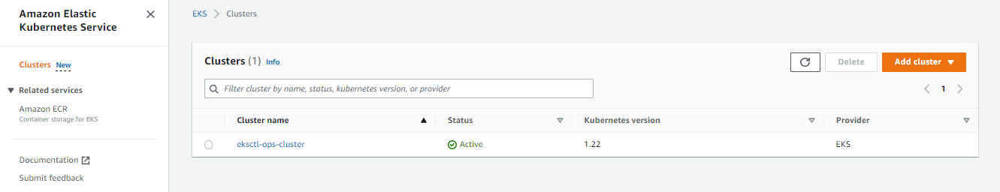
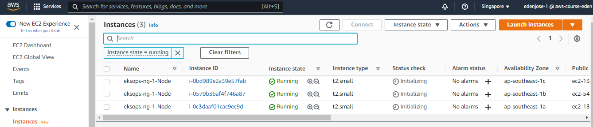

# Lab xx: EKS Operations using eksctl

Pre-requisites:

  - [Basic Understanding of Kubernetes](../README.md#kubernetes)
  - [Sign-up for an AWS account](../README.md#pre-requisites)

For this lab, we'll be using ap-southeast-1 region (Singapore).

## Creating the Access 

We will need to do the following before we can create clusters and perform EKS operations.

- [Create a "k8s-kp.pem" keypair](https://docs.aws.amazon.com/AWSEC2/latest/UserGuide/create-key-pairs.html)

- [Create a "k8s-user" user with admin access](https://www.techrepublic.com/article/how-to-create-an-administrator-iam-user-and-group-in-aws/)

- [Create an access key for "k8s-user"](https://docs.aws.amazon.com/IAM/latest/UserGuide/id_credentials_access-keys.html#Using_CreateAccessKey)

- [Create a service-linked role](https://us-east-1.console.aws.amazon.com/iamv2/home#/roles)


    Step | Choose this value | 
    ---------|----------|
    Trusted entity type | AWS service 
    Use case | KS (Allow EKS to manage clusters in your behalf) 
    Permission policies | AmazonEKSServiceRolePolicy

    For the keypair, store it inside <code>~/.ssh</code> directory.


## Setup CLI and Access Key

Install the following CLI tools by clicking the links:

- [aws cli](../README.md#install-cli-tools) - used by eksctl to grab authentication token
- [eksctl](../README.md#install-cli-tools) - setup and operation of EKS cluster 
- [kubectl](../README.md#install-cli-tools) - interaction with K8S API server

Once you've installed AWS CLI, [create an access key and setup your credentials file](../README.md#install-cli-tools). It should look like this:

```bash
# /home/user/.aws/credentials

[default]
aws_access_key_id = AKIAxxxxxxxxxxxxxxxxxxx
aws_secret_access_key = ABCDXXXXXXXXXXXXXXXXXXXXXXX
region = ap-southeast-1
output = json
```

## Create the EKS cluster via eksctl

We'll deploy an intial cluster:
- region is ap-southeast-1
- contains one nodegroup
- nodegroup consists of 3 worker nodes
- each node will be t2.small
- ssh access is allowed

Create first the project directory.

```bash
$ mkdir eksops-dir
```

Create the **eksops.yaml** file which will contain the specifications of our cluster.

```bash
$ vi eksops-dir/eksops.yml

apiVersion: eksctl.io/v1alpha5
# apiVersion: client.authentication.k8s.io/v1beta1
kind: ClusterConfig

metadata:
    name: eksops
    region: ap-southeast-1 

nodeGroups:
    -   name: ng-1
        instanceType: t2.small
        desiredCapacity: 3
        minSize: 2
        maxSize: 10
        ssh: 
            publicKeyName: "k8s-kp"
```

Run the command below to create the cluster. This will take around 10-15 minutes. It will automatically create a VPC and 2 subnets in two different availability zones (AZ).

```bash
$ eksctl create cluster -f eksops-dir/eksops.yaml
```

We can also track how long it ran by adding <code>time</code> at the beginning.

```bash
$ time eksctl create cluster -f eksops-dir/eksops.yml

real    16m56.835s
user    0m3.387s
sys     0m0.713s
```

In the output, you should see the location where the <code>kubeconfig</code> file is saved.

```bash
saved kubeconfig as "/home/joseeden/.kube/config 
```

At the AWS Console, go to the EKS page to verify if the cluster is created.

  

<!--    -->

To check the nodegroup and the running nodes, simply go to the Compute tab. If you can't see them, scroll down to the **Errors** section to troubleshoot.

```bash
EKS > Clusters > eksops > Click Compute tab 
```

Recall that Amazon EKS uses Cloudformation to provision the resources under the hood. You can see the stack created in the CloudFormation console.

  

<!--    -->

You should also see the nodes as running instances in the EC2 console.

  

Back at the terminal, you can also check the running nodes,

```bash
$ kubectl get nodes 
```

To check the running cluster,

```bash
$ eksctl get cluster 
```

To inspect the nodegroup,

```bash
$ eksctl get nodegroup --cluster eksops
```

## Scaling Nodegroups

Initially, we set the *desiredCapacity* to 3 in the YAML file. To scale the number of nodes to 5, run the command below. Note that it will take a few minutes before the nodes are added.

```bash
$  eksctl scale nodegroup --cluster=eksops --name=ng-1 --nodes=5
```
```bash
$ kubectl get nodes 
```

We could also scale in to reduce the number of nodes. 

```bash
$  eksctl scale nodegroup --cluster=eksops --name=ng-1 --nodes=2
```
```bash
$ kubectl get nodes 
```

Now, if we try to scale up to 15 nodes, we'll get an error. This is because in our YAML file, we only specified a max of 10 nodes.

```bash
$ eksctl scale nodegroup --cluster eksops --nodes 15 --name ng-1
2022-08-15 07:45:27 [ℹ]  scaling nodegroup "ng-1" in cluster eksops
Error: failed to scale nodegroup for cluster "eksops", error: operation error Auto Scaling: UpdateAutoScalingGroup, https response error StatusCode: 400, RequestID: b6fa0012-c353-4b40-9ccb-c6045b781126, api error ValidationError: Desired capacity:15 must be between the specified min size:0 and max size:10 
```

Similarly, we can't scale the nodes down to zero because we specified 2 as our **minSize** in our YAML file.

```bash
$ eksctl scale nodegroup --cluster eksops --nodes 0 --name ng-1
2022-08-15 07:45:27 [ℹ]  scaling nodegroup "ng-1" in cluster eksops
Error: failed to scale nodegroup for cluster "eksops", error: operation error Auto Scaling: UpdateAutoScalingGroup, https response error StatusCode: 400, RequestID: b6fa0012-c353-4b40-9ccb-c6045b781126, api error ValidationError: Desired capacity:0 must be between the specified min size:2 and max size:10 
```

## Adding a Nodegroup

Let's now edit the same YAML file to create another nodegroup. The second nodegroup will have a mix of on-demand and spot instances.

<details><summary> eksops.yml </summary>
 
```bash
 apiVersion: eksctl.io/v1alpha5
# apiVersion: client.authentication.k8s.io/v1beta1
kind: ClusterConfig

metadata:
    name: eksops
    region: ap-southeast-1 

nodeGroups:
    -   name: ng-1
        instanceType: t2.small
        desiredCapacity: 3
        minSize: 2
        maxSize: 5
        ssh: 
            publicKeyName: "k8s-kp"
    -   name: ng-mix
        instancesDistribution:
            maxPrice: 0.2
            instanceTypes: [
                "t2.small",
                "t3.small"
            ]
            onDemandBaseCapacity: 0
            onDemandPercentageAboveBaseCapacity: 50
        ssh:
            publicKeyName: "k8s-kp"

```
 
</details>
</br>

Notice the **onDemandBaseCapacity** which is set to 0, and **onDemandPercentageAboveBaseCapacity** which is set to 50. This means that 50% of all the EC2 instances will be on-demand and the other 50% will be spot instances.

To create the nodegroup, run the command below.

```bash
$ eksctl create nodegroup --config-file=eksops.yml --include='ng-mix' 
```

Verify the number of nodes per nodegroup.

```bash
$ eksctl get nodegroup --cluster eksops 
```

Go back to the EC2 console to check how many are nodes are now running

## Deleting a Nodegroup

We use the same command but this time we specify *delete*.

```bash
$ eksctl delete nodegroup --config-file=eksops.yml \
    --include='ng-mix' \
    --approve
``` 

Note that if you delete a nodegroup, any pods that might be previously running on this nodegroup will be pushed to the other nodegroup. The scheduler basically stops allocating pods to this nodegroup.

## Deleting the Cluster

To delete the cluster,

```bash
$ time eksctl delete cluster -f eksops-dir/eksops.yml
```

