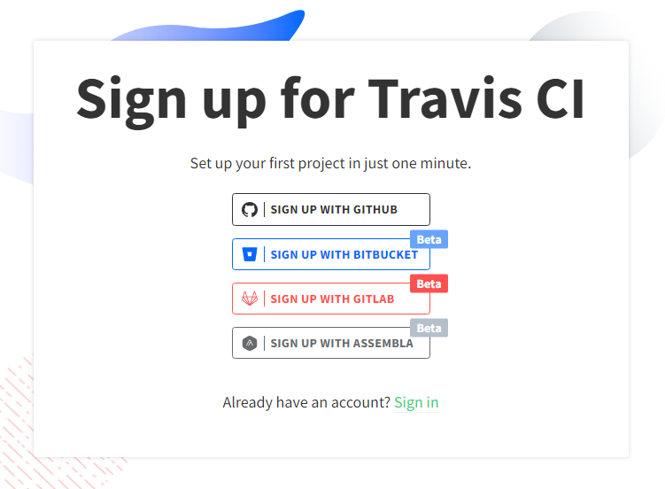
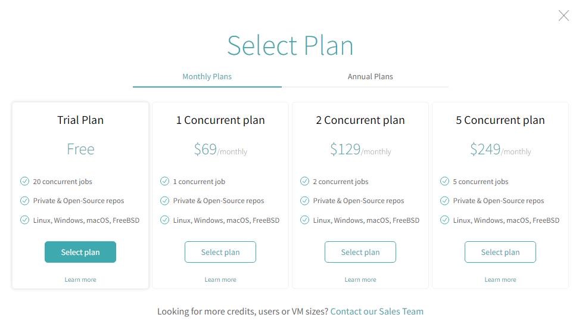
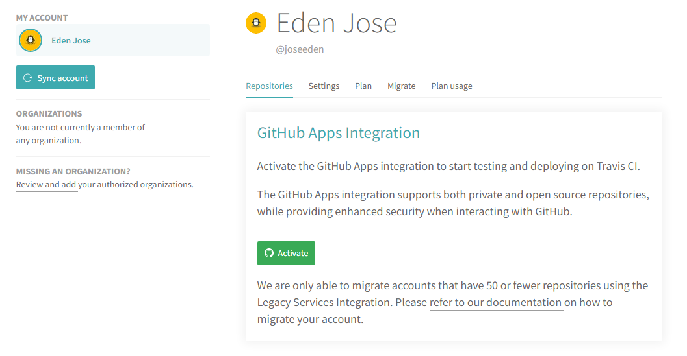

# Optional Tools:

Here are some optional tool that are not needed to run Docker and Kubernetes. However, some of the labs in this repository uses Docker alongside some other technologies.

Feel free to go through the ones you need.


- [Create an AWS Account](#create-an-aws-account)
- [Install AWS CLI](#install-aws-cli)
- [IAM User, Access Key, Credentials File, and Policies](#iam-user-access-key-credentials-file-and-policies)
- [Create a Github Account](#create-a-github-account)
- [Setup Git Locally](#setup-git-locally)
- [Setup Travis CI](#setup-travis-ci)
- [Install Go](#install-go)
    - [Method 1: Using Snap](#method-1-using-snap)
    - [Method 2: Using apt-get/apt](#method-2-using-apt-getapt)
    - [Test](#test)
- [Install Node and NPM](#install-node-and-npm)
- [Other Simple CLI Utilities](#other-simple-cli-utilities)


## Create an AWS Account 

We will be deploying our containerized applications to the cloud so I highly recommend that you sign-up for a **free tier** account in AWS.

Note that an AWS account is also need for the ECS and EKS labs in this repository.

To sign-up for an AWS Free tier account, click [here](https://aws.amazon.com/free/).


## Install AWS CLI

To install AWS CLI, check out [the official AWS Installation Guide for AWS CLI v2](https://docs.aws.amazon.com/cli/latest/userguide/getting-started-install.html)

If you've installed AWS CLI before then there is a chance that you're using the version 1. You can do either of the following:

- [Replace version 1 with version 2](https://docs.aws.amazon.com/cli/latest/userguide/cliv2-migration-instructions.html#cliv2-migration-instructions-migrate) 
- [Install both version side-by-side](https://docs.aws.amazon.com/cli/latest/userguide/cliv2-migration-instructions.html#cliv2-migration-instructions-migrate)

For this lab, I did a side-by-side install by retaining the V1 and creating an alias for it.

```bash
$ sudo su -
$ which aws 
$ cd /usr/bin && mkdir aws1 && mv aws aws1 
```

Then I [installed AWS CLI version 2](#install-cli-tools), so now I have both version running on my terminal.

```bash
$ aws1 --version
aws-cli/1.18.69 Python/3.8.10 Linux/5.10.102.1-microsoft-standard-WSL2 botocore/1.16.19 
```
```bash
$ aws --version
aws-cli/2.7.22 Python/3.9.11 Linux/5.10.102.1-microsoft-standard-WSL2 exe/x86_64.ubuntu.20 prompt/off 
```


## IAM User, Access Key, Credentials File, and Policies

Here are some steps that you need to do if you're going to do the labs in AWS.

- Create the IAM Policy
- Create a Service-linked Role
- Create an IAM User
- Generate the Access Key ID and Secret Access Key
- Create the IAM Group
- Configure the Credentials File
- Generate a Keypair

To learn more, check the [IAM requirements](01-AWS-IAM-requirements.md) page.

## Create a Github Account 

Since we will be implementing CICD in some of the labs, we will need to set this up. Github is a free to use code repository.

To sign up for a Github account, click [here](https://github.com/signup).

## Setup Git Locally

In addition to creating the Github account, you will also need to setup Git in your machine.

- [Add your SSH keys to your Github account](https://docs.github.com/en/authentication/connecting-to-github-with-ssh/adding-a-new-ssh-key-to-your-github-account).

- [Install Git on your computer](https://git-scm.com/book/en/v2/Getting-Started-Installing-Git)

- [Configure Git](https://git-scm.com/book/en/v2/Customizing-Git-Git-Configuration)


## Setup Travis CI 

Travis CI is an opensource CI tool which we can use to build and test our project. Wherever changes are pushed to our Github repo, Travis CI automatically pulls the code and allows us to run tests on it.

Once the code passed the test, Travis CI can automatically deploy our code to AWS.

To setup Travis CI, Go to the [Travis CI site](https://app.travis-ci.com/signup) and sign up using your SCM account. Choose **Sign up with Github**.

<p align=center>

</p>

In the next page, choose **Authorize Travis CI.**
You may need to confirm your account through the email sent to your email address.

In the upper right, click your profile avatar and select Settings. 

We will need to select a plan before we can use Travis CI. Choose the **Free Trial plan** and fill up your personal details. A valid credit/debit card number is also needed to proceed. 

<p align=center>

</p>

In the Repositories tab, click the green **Activate** button to integrate Travis CI with your Github account. In the next page, click **Approve and install.**

<p align=center>

</p>

Click on the Dashboard tab at the top to view all the Github repositories that are synced with Travis CI.


## Install Go 

Doing a quick Google search, we find a link on [how to install Go (golang) on Ubunt](https://www.cyberciti.biz/faq/how-to-install-gol-ang-on-ubuntu-linux/)u:

### Method 1: Using Snap 

```bash
$ sudo snap install go --classic 
```
You should see the following output returned.
```bash
go 1.18.3 from Michael Hudson-Doyle (mwhudson) installed 
```

### Method 2: Using apt-get/apt

```bash
$ sudo apt update
$ sudo apt upgrade 
```
```bash
$ sudo apt search golang-go
$ sudo apt search gccgo-go 
```
```bash
$ sudo apt install golang-go 
```

Verify.
```bash
$ go version
go version go1.18.3 linux/amd64 
```

### Method 3: Using a Script 

Here is a script for installing Go in your Linux instance. You can also use this scrpit if you're running WSL on your Windows machine.

```bash
#!/bin/bash

## Install Go
wget https://storage.googleapis.com/golang/go1.6.2.linux-amd64.tar.gz
sudo rm -rf /usr/local/go
sudo tar -C /usr/local -xzf go1.6.2.linux-amd64.tar.gz
echo "export GOPATH=~/go" >> ~/.bashrc
source ~/.bashrc 
```

Make the script executable and then run it.

```bash
chmod +x install-go.sh 
./install-go.sh 
```

If you're using Google Cloud Platform to do the labs, the Cloud Shell should be pre-installed with Go but it might not be running the most recent version so you may need to run the script there.

### Test

Create a simple **hello-world.go** program.

```go
// Hello Word in Go by Vivek Gite
package main
 
// Import OS and fmt packages
import ( 
	"fmt" 
	"os" 
)
 
// Let us start
func main() {
    fmt.Println("Hello, world!")  // Print simple text on screen
    fmt.Println(os.Getenv("USER"), ", Let's be friends!") // Read Linux $USER environment variable 
} 
```

Compile and run.
```bash
$ go run hello-world.go 

Hello, world!
ubuntu , Let's be friends!
```

Build/compile packages and dependencies:
```bash
$ go build hello-world.go
```
```bash
$ ls -l hello*

-rwxrwxr-x 1 ubuntu ubuntu 1766381 Jun 23 08:05 hello-world
-rw-rw-r-- 1 ubuntu ubuntu     305 Jun 23 08:04 hello-world.go
```
```bash
$ ./hello-world

Hello, world!
ubuntu , Let's be friends!
```


## Install Node and NPM 

Since we will use a custom binary that utilizes NPM and NodeJS in some of the labs, we need to install these tools.

- [NodeJS](02-Install-Nodejs-Npm.md)
- [NPM](02-Install-Nodejs-Npm.md)


## Other Simple CLI Utilities 

```bash
sudo apt install -y \
jq \
curl  
```


<br>

[Back to first page](../../../README.md#projects)