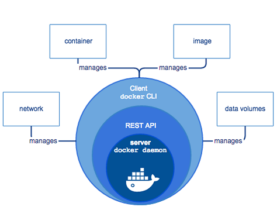
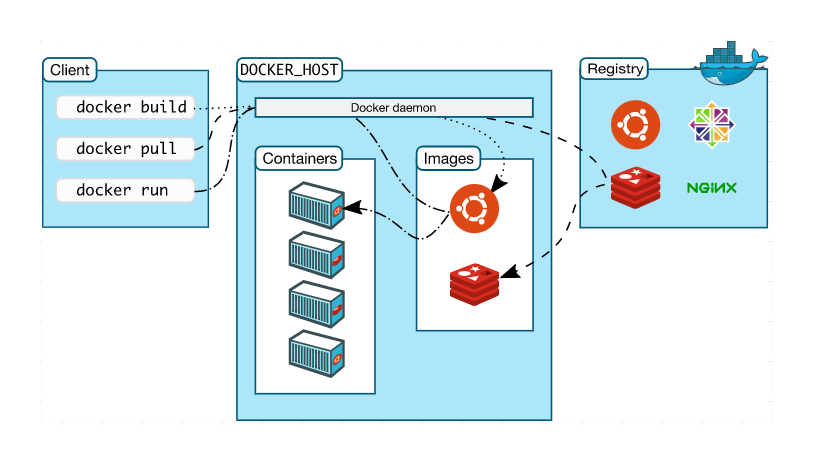

# The Docker Architecture 

- [The Client and the Server](#the-client-and-the-server)
- [Docker Daemon](#docker-daemon)
- [Docker Binary](#docker-binary)
- [Container Engine](#container-engine)
- [Container Runtime](#container-runtime)
    - [runc](#runc)
    - [containerd](#containerd)

----------------------------------------------

## The Client and the Server 

<!-- 

 -->

Docker uses a **client-server** architecture, where:

- the docker daemon serves as the "server" part, and
- the docker binary serves as the docker client
 

 

In addition to this, Docker leverages a container runtime which serves as engine behind the container solutions. It is also the the intermediate layer between the host and the containers.

## Docker Daemon

The docker daemon handles the docker objects, which includes the docker ../../images, containers, and networking. It exposes a REST API that the client consumes over Unix socket or a network interface. Major functions:
- Image management; building ../../images
- Running APIs
- Networking
- Authentication 
- Security
- Orchestration

## Docker Binary

The docker binaries are basically the docker commands. This means when you're using issuing the docker commands, you're using the client. It's basically the primary way to interact with the Docker daemon.

## Container Engine

Under the hood, the container engine takes a container image and turns it into a container. It typically containes a runtime, a CLI tool, and sometimes a daemon.

A more detailed flow is described below:

1. User types in commands, client receives this commands.
2. Commands are converted to REST API calls.
3. Daemon received the API calls.
4. Daemon runs containerd with the API parameters.
5. containerd forwards image to runc instance and starts containers.

## Container Runtime

The container runtime is a specific part of the container engine.

### runc
This is the default implementataion defined by OCI runtime specs. It's responsible for:
- creating the containers
- wrapping for libcontainer

### containerd
This is a code originally from the daemon but is removed.
- manages container operations (start, stop,pause, remove, etc.)
- works with runc and daemon
