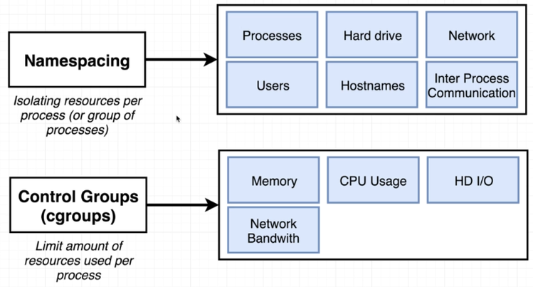

# Linux Kernel Features

In addition to the two core components of the Docker architecture, it also uses the following features:

- [Namespaces](#namespaces)
- [Control Groups](#control-groups)
- [UnionFS](#unionfs)

## Namespaces

Namespaces allow for a high-level process isolation of a system's resources. These are logical separation of container workloads. Here are some types of namespaces:

- [PID namespace](#pid-namespace)
- [Net namespace](#net-namespace)
- [IPC namespace](#ipc-namespace)
- [MNT namespace](#mnt-namespace)
- [UTS namespaces](#uts-namespaces)

### PID namespace

Handles process isolation (PID: Process ID). This means that each namespace has its own process ID.

### Net namespace

Isolates the network stack and manages the network interfaces. Each namespace has its own private set of IP addresses, firewall, routing tables, etc.

### IPC namespace 

Allows processes to be isolated from SysV interprocess communication.

### MNT namespace

Manages the filesystem mountpoints.

### UTS namespaces

UTS or Unix Timesharing System isolates the hostname, kernel, and version identifiers.

## Control Groups

This is used by Docker to limit resource allocation. This ensures that a process doesn't consume the entire resources of a system.

- **Resource limiting** - groups ca be set to not exceed a configured memory limit
- **Prioritization** - some groups may get a larger share of CPU utilization or disk I/O throughput
- **Accounting** - measures a group's resource usage
- **Control** - freezing groups of processes

## UnionFS

The Union filesystem upkeeps the overall sizes of the containers. It starts with a base image and then merges in any changes.

- **Merging** - overlay filesystem branches to merge changes
- **Read/Write** - branches can be read-only(RO) or read-write(RW)

How it works:

- when you create a container for the first time, you have a starting image
- this image is a set of files that makes up the base image
- as you add and remove packages, these changes create different layers 
- each layer is a set of file changes
- these file changes are then merged by the UnionFS to the previous layer
