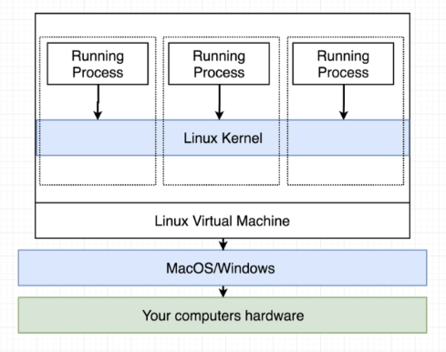

# How Docker runs on Windows

We've learned from the previous sections that containers use Linux kernel features such as **namespacing** and **control groups** to manage resources being used by the container processes.

These two are not included by default in all operating systems and are *specific* only to the Linux operating system.

#### If these two doesn't exist in Windows, then how are we able to run containers there?

When we install Docker for Windows/Mac, we actually installed a Linux virtual machine that will run on our computer. The containers and processes will then be created inside the virtual machine.

 

[Back to first page](../../README.md#docker--containers)