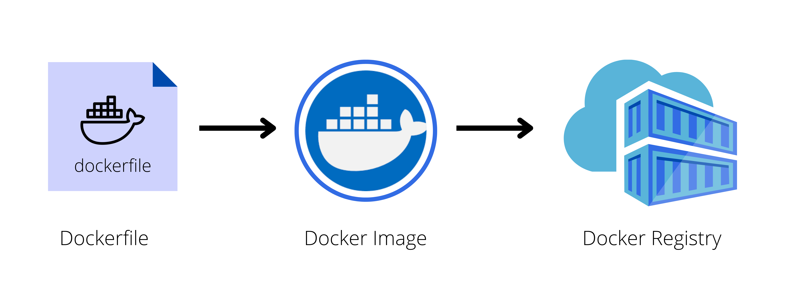

# Docker Objects

<p align=center>

</p>

There three docker objects that you need to know:

- [Dockerfile](#dockerfile)
- [Docker Image](#docker-image)
- [Docker Registry](#docker-registry)

In addition to these three, here's some three useful topics:

- [Creating the Dockerfile](#creating-the-dockerfile)
- [Overlay Filesystem](#overlay-filesystem)
- [Building the Docker Image](#building-the-docker-image)
- [Authenticating to the Registry](#authenticating-to-the-registry)


## Dockerfile

This is a set of step-by-step instructions on how to create the image:
- how to package the code and its dependencies
- each operation represents a layer and is cached
- when dockerfile is modified, onlychanged layers will be built

The full list of instructions can be found in the official [Docker website](https://docs.docker.com/engine/reference/builder/). Here are some of the widely used instructions:
- **FROM** - sets the base image
- **RUN** - executes a command
- **COPY** and **ADD** - copy files from host to container
- **CMD** - default command to execute when container starts
- **EXPOSE** - exposes a port

Below is an example of a **Dockerfile** that targets to package a Python hello-world application:
 
```bash
# set the base image. A Python base image is used
FROM python:3.8

# set a key-value label for the Docker image
LABEL maintainer="Eden Jose"

# All the files in the current directory is copied
# to the  `/app` directory in the container
COPY . /app

#  defines the working directory within the container
WORKDIR /app

# run commands within the container. 
# Here we install dependencies defined in the requirements.txt file. 
RUN pip install -r requirements.txt

# provide a command to run on container start. 
# For example, start the `app.py` application.
CMD [ "python", "app.py" ]
```
 
### Creating the Dockerfile 

Before we "bake" the image, we first need to understand how the application is built. We could start by listing down how we might deploy an application manually.

As an example, if we are to deploy a web application, this would be the steps we'll follow:

```bash
1.  Start with OS - CentOS
2.  Update repo
3.  Install dependencies
4.  Install python dependencies
5.  Copy source code to /opt folder
6.  Run the web server using the flask command
```

Once we have the steps laid down, we can begin containerizing our application:

```bash
1.  Create a DOCKERFILE
2.  Build your image and specify the file as input, as well as the tag name
3.  Push it to the dockerhub repository to make it publicly available 
```

To create a dockerfile, here's a basic flow we can follow:

<p align=center>

</p>


## Docker Image

After we've created the dockerfile, we can now create the docker image. A docker image is
- read-only template
- made up of **overlay filesystem**
- also creates a runnable instance of the application
- used to run the container

### Overlay Filesystem

A docker image has different layers, with the first layer as the base image that the image will use and the layers on top as packages being installed. 

The last layer is a writeable layer which applications will use. If a container is started without defining a specific storage option, any data written to the default storage by an application running in a container will be removed as soon as it is stopped.  

### Building the Docker Image

A Docker image can be built from an existing Dockerfile using the docker build command. Below is the syntax for this command:

```docker
$ docker build [OPTIONS] PATH
```

To find all valid options for the <code>build</code> command:

```docker
$ docker build --help
```

For example, to build the image of a Python "Hello-world " application from the Dockerfile in the current directory, the following command can be used:

```docker
$ docker build -t python-helloworld .
```

Additionally, you can build the same app that's located on a different directory, say a <code>lesson1/python-app</code> directory

```docker
$ docker build -t python-helloworld /another/directory/python-app
```

To list all available ../../imageS
```DOCKER
$ docker ../../images
```

You can read more about the docker basic commands in the succeeding sections.

## Docker Registry

Once you've package the application, tested it locally, and proved that it's meeting the expected behavior, You are now ready to store and distribute it.

To do this, you can push the image to a public Docker image registry, such as

- [DockerHub](https://hub.docker.com/)
- [Harbor](https://goharbor.io/)
- [Amazon Elastic Container Registry (ECR)](https://aws.amazon.com/ecr/)
- [Google Container Registry](https://cloud.google.com/container-registry)
- [Quay Container Registry](https://quay.io/)

You can also store the image to a private registries and make it available to authorized parties. To be access the registry, you would need to be authenticated by setting up an account.

### Authenticating to the Registry

You can login to Dockerhub in your terminal.
dockerhub. Note that you need to [set up an account.](https://hub.docker.com/signup).

```bash
$ docker login
```

Now that we've access our registry, we're now ready to push our images. However, it is best practice to tag all your images before sharing them.
