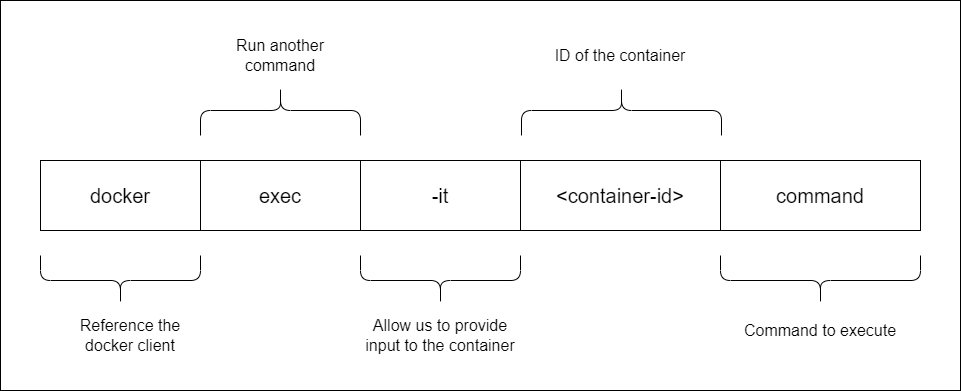

# Docker commands

<p align=center>

</p>

Creates the container, but will not start it yet.

```bash
$ docker create <image-id> 
```

This starts the container.

```bash
$ docker start <container-id> 
```

This will run an image from a container.

```bash
$ docker run <image-d>
```

In the example below, an NGINX container will be ran. Docker will look in the host for the image, and if not found, will check dockerhub na dpull image down.

```bash
$ sudo docker run nginx 
```

Note that this is only done first time. For subsequest executions, the same image pulled down will be re-used.
docker run nginx

To find all valid options for this command
```docker
$ docker run --help
```

Run the next command to list all running containers. Each container will get a random 'container name' assigned to it. This is found in the last column of the output.

```bash
$ docker ps
```

To list all running AND not running containers, run the command below. This also shows the state, 
- if not running - "Exited"
- if running - "Up"

```bash
$ docker ps -a
```

You can set your own contianer-name by using the "--name" flag.

```bash
$ sudo docker run --name Thanos_of_2019 docker/whalesay cowsay Im-Inevitable! 
```

You can also specify the version of image to run in case you have multiple versions of an image by specifying "image:version". This is called a **TAG**.

In this example, we'll pull down two versions of nginx.

```bash
$ sudo docker run nginx
$ sudo docker run nginx:1.14-alpine
```

To run a container from the 1.14-alpine image and set container-name to nginx-2

```bash
$ sudo docker run -d --name nginx-2 nginx:1.14-alpine  
```

To know all the available tags for an image, look for the image in dockerhub.com and you'll find all the supported tags there.

You can also run multiple isntances/containers from the same image

```bash
$ sudo docker run docker/whalesay cowsay Infinity-and-beyond!
$ sudo docker run docker/whalesay cowsay Hello-there!
$ sudo docker run docker/whalesay cowsay Cowabunga!
```

This will show three running containers when you list them.

```bash
$ sudo docker ps -a

CONTAINER ID   IMAGE             COMMAND                  CREATED          STATUS                      PORTS     NAMES
b4b832aecfb9   docker/whalesay   "cowsay Cowabunga!"      8 seconds ago    Exited (0) 7 seconds ago              happy_gates
a870817d8e27   docker/whalesay   "cowsay Hello-there!"    2 minutes ago    Exited (0) 2 minutes ago              festive_elion
16e5d555d741   docker/whalesay   "cowsay Infinity-and…"   41 minutes ago   Exited (0) 41 minutes ago             friendly_feistel
```


This pulls the image down to our host but doesn't run a container.

```bash
$ sudo docker pull <image-name>
$ sudo docker pull nginx
```

This lists all images present in our host.

```bash 
$ docker images
```

This stops a running container. You can simply specify the "silly-name" which is the container name or just the first few digits of the container-id. If the first 2 or 3 digits of the container-id is unique, docker will immediately know which container you want to stop.

```bash
$ docker stop <container-name>
$ docker stop <container-id>
```

This removes the container permanently. You can list all containers afterwards to check.
```bash
$ docker rm <container-name>
```

To forcefully remove a running container,

```bash
$ docker rm -f <container-name> 
```

To remove all running containers,

```bash
$ docker rm -f $(docker container ls -aq) 
```

You can remove all stopped containers AT ONCE by running the _ps_ command and passing it to the _rm_ command. You'll be prompted with a [Y/N] for confirmation. Note that it'll return an error if there is a running container.

```bash
$ sudo docker rm $(sudo docker ps -a -q)
```

To remove all stopped containers without being prompted for confirmation,

```bash
$ docker container prune -f
```

To delete the stopped containers, unused images, and the build cache.

```bash
$ docker system prune 
```

This removes an image permanently. NOTE that no container must be running off of that image. Delete all dependent containers to delete an image.

```bash 
$ docker rmi <image-name>
```

To remove all images with no associated containers,

```bash
$ docker image prune -a -f 
```

It's important to remember that containers are not meant to run operating systems. Container are only meant to run a specific task or process.

Once task is complete, the container exits. The container runs as long as the process inside it is alive. When you run ubuntu, you're just running a base-image of an OS. There is no application/process running in it by default.

```bash 
$ sudo docker run ubuntu
```

You can instruct a process to run by appending the command. In this case, we're telling ubuntu to sleep for 60 seconds. This will appear as a running process for a minute when we run docker _ps_. After that, container will exit.

```bash
$ sudo docker run ubuntu <command>
$ sudo docker run ubuntu cat /etc/hosts
```

<p align=center>

</p>


We can also execute a command on a running container.

```bash
$ sudo docker exec <container-id> <command>
$ sudo docker exec <container-name> <command>
```

If container is running, we can use _exec_ to execute a command.

```bash
$ sudo docker ps
$ sudo docker exec <container-id> cat /etc/hosts
$ sudo docker exec <container-name> cat /etc/hosts
```


<br>

[Back to first page](../../README.md#docker--containers)