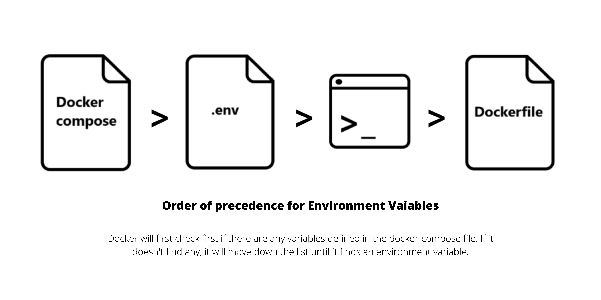

# Environment Variables
 
We can specify an environment variable that we can use in a given code. This is useful when we don't want to modify the code and instead use variables for any values that we need to change in the code.

There are different ways to define environment variables for a containers:

- Dockerfile
- Environment File
- Shell Environment Variables
- Compose File

To learn more about variables, you check these resources:

- [Substitute environment variables in Compose files](https://docs.docker.com/compose/environment-variables/)
- [Exploring Docker Compose Environment variable behaviour](https://www.profit4cloud.nl/blog/exploring-docker-compose-environment-variable-behaviour/#:~:text=Environment%20variables%20can%20be%20defined%20in%20the%20Dockerfile.,the%20resulting%20image%20and%20container.)