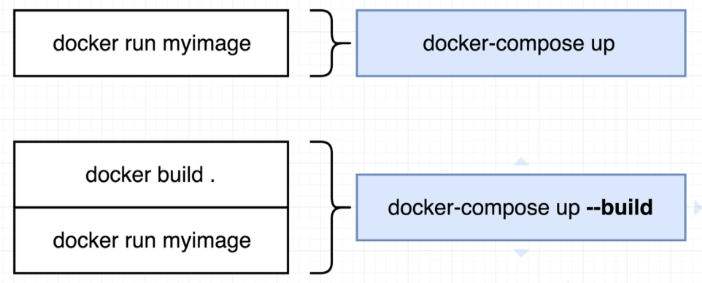

# Docker Compose commands

<p align=center>

</p>

The difference between the two is **docker-compose** commands are clearly described above. The "--build" tells docker to rebuild the images listed in the docker-compose file and then start up the container.

To run containers in the background using docker-compose,

```bash
$ docker-compose up -d 
```

To stop containers,

```bash
$ docker-compose down 
```

We could also check the running containers by using the command below. Note that you can only run this command in the same directory where you're docker-compose file is located. This command basically checks the docker-compose file, gets the list of containers, and then verifies the status.

```bash
$ docker-compose ps 
```

If we run it inside a directory that doesn't have the docker-compose file, it will return an error.

```bash
~$ docker-compose ps
ERROR:
        Can't find a suitable configuration file in this directory or any
        parent. Are you in the right directory?

        Supported filenames: docker-compose.yml, docker-compose.yaml, compose.yml, compose.yaml 
```

 


<br>

[Back to first page](../../README.md#docker--containers) 