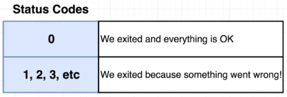
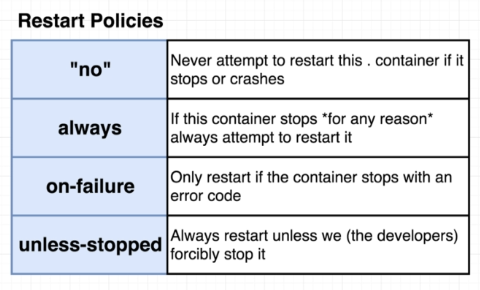

# Status Codes and Restart Policies

It is helpful to know status codes especially when you're troubleshooting errors.

<p align=center>

</p>

For container issues, we can specify restart policies inside our docker-compose file. The default restart policy is "no", which means container won't be restarted if it stops or crashes.

<p align=center>

</p>

**"No"**

Here's an example of a docker-compose file. Notice that we defined **"no"** enclosed in qoutes because without the quotes(no), YAML formatting will interpret it as a boolean false. 

```yml
version: '3'
services:

  node-app:
    image: node
    restart: "no"
```

**always vs. on-failure**

If we use **always**, the container will automatically attempt to restart if it crashes. On the other-hand, **on-failure** would only restart the container if it returns an error status code (non-zero status codes). We also don't need to enclosed them in quotes.

```yml
version: '3'
services:

  node-app:
    image: node
    restart: "no"

  web-server:
    image: redis
    restart: always

  worker:
    image: ubuntu
    restart: on-failure
```

Use **always** for containers that needs to be up 100% of the time, like web servers.

Use **on-failure** for containers that runs batch jobs or files processes.

Check out the labs for Docker Compose in this repository to see how restart policies are used.


<br>

[Back to first page](../../README.md#docker--containers)