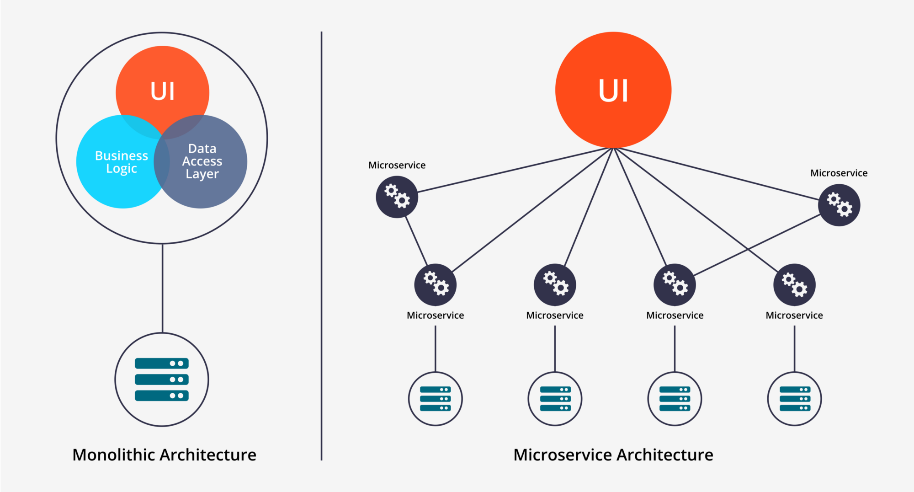

### Monoliths and Microservices

After the requirements are carefully reviewed, we can now start deciding which model we'll use: **monoliths** or **microservices**.

Typically, there will be three tiers in an application:

<!--  -->

- **UI (User Interface)** - handles HTTP requests and responses
- **Business logic** - contains code that provides service to the users
- **Data layer** - implements access and storage of data objects

In a monolithic architecture, application tiers can be described as:

- part of the same unit
- managed in a single repository
- sharing existing resources (e.g. CPU and memory)
- developed in one programming language
- released using a single binary

In a microservice architecture, application tiers can be described as

- tiers aremanaged independently
- managed in a separate repository
- own allocated resources (e.g. CPU and memory)
- well-defined APIs for connecting to other units
- implemented using the programming language of choice
- released using its own binary

