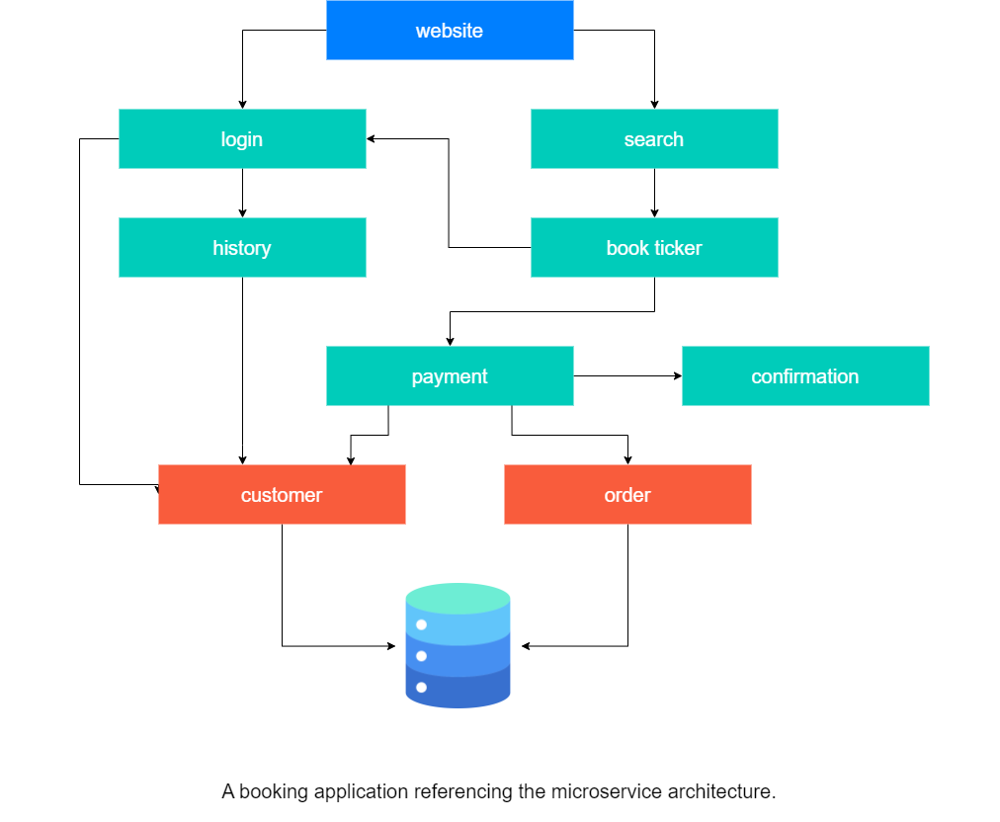

# Monoliths and Microservices

## Deciding the Model

After the requirements are carefully reviewed, we can now start deciding which model we'll use: **monoliths** or **microservices**.

Typically, there will be three tiers in an application:

<!--  -->

- **UI (User Interface)** - handles HTTP requests and responses
- **Business logic** - contains code that provides service to the users
- **Data layer** - implements access and storage of data objects

In a monolithic architecture, application tiers can be described as:

- part of the same unit
- managed in a single repository
- sharing existing resources (e.g. CPU and memory)
- developed in one programming language
- released using a single binary
 

In a microservice architecture, application tiers can be described as

- Tiers are managed independently
- Managed in a separate repository
- Own allocated resources (e.g. CPU and memory)
- Well-defined APIs for connecting to other units
- Implemented using the programming language of choice
- Released using its own binary
  
    

    
    

## The Main Idea of Microservices 

The main point of microservices is to break the software into smaller chunks, allowing developers to work on a piece of the code and release on their own cycle, which in turn speeds up development. 

This kind of architecture also enables the software to scale independently.

 

[Back to first page](../../README.md##cloud-native)
