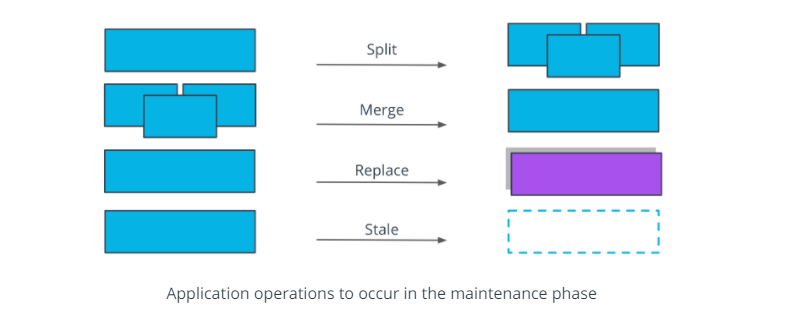

# Product is Released, What's Next?

After an engineering team has successfully released a product, with both monolith and microservices, the next phase in the application lifecycle is maintenance. 
- product responses to customer feedback and emerging technologies
- new features are added and new tools are integrated
- the application structure and functionalities may change
- architecture of an application is not static, but rather in constant movement

## Extensibility over Flexibility

During Day 2 operations (maintenance phase), it is more efficient to manage multiple services with a well-defined and simple functionality (as in the case of microservices), rather than add more abstraction layers to support new services (as we’ve seen with the monoliths). 

These are some of most common operations you'll encounter after a product goes live.

- **split** operation - applied if a service covers too many functionalities and it's complex to manage. Having smaller, manageable units is preferred in this context.

- **merge** operation - applied if units are too granular or perform closely interlinked operations, and it provides a development advantage to merge these together. For example, merging 2 separate services for log output and log format in a single service.

- **replace** operation - adopted when a more efficient implementation is identified for a service. For example, rewriting a Java service in Go, to optimize the overall execution time.

- **stale** operation - performed for services that are no longer providing any business value, and should be archived or deprecated. For example, services that were used to perform a one-off migration process.

These operations are inevitable and you will perform these as your application grows. At the end of the day, the application exists to provide value to customers and to be easily managed by the technical team. 
