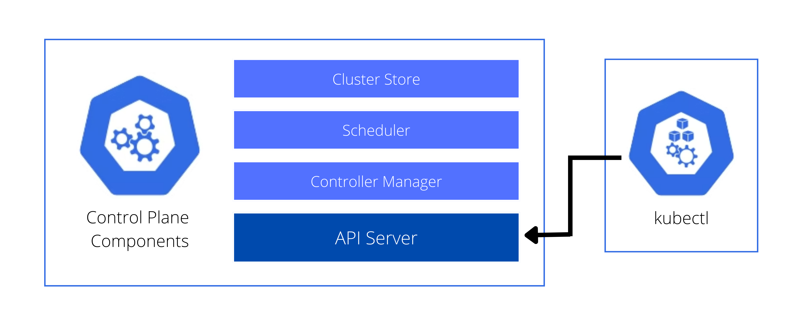
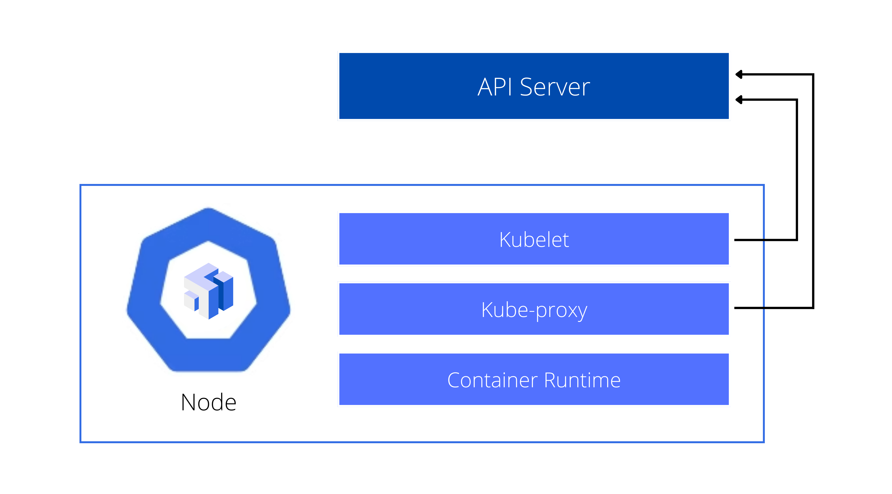

# Kubernetes Cluster 

- [What comprises a Kubernetes Cluster](#what-comprises-a-kubernetes-cluster)
- [Master Node - Control Plane](#master-node---control-plane)
    - [API Server](#api-server)
    - [etcd Cluster store](#etcd-cluster-store)
    - [Scheduler](#scheduler)
    - [Controller Manager](#controller-manager)
    - [Cloud Controller Manager - for EKS Setup only](#cloud-controller-manager---for-eks-setup-only)
- [Worker Node](#worker-node)
    - [Kubelet](#kubelet)
    - [Kube-proxy](#kube-proxy)
    - [Container Runtime](#container-runtime)
- [Scheduled/Add-Ons](#scheduledadd-ons)

## What comprises a Kubernetes Cluster

A **Cluster** is a collection of distributed physical or virtual servers or *nodes*, which is used to host and manage workloads.
 
It has two types:

- **Master node (control plane)**
    Makes global decisions about the cluster. Its components are:
    - **kube-apiserver** - exposes the Kubernetes API
    - **kube-scheduler** - decides which node will handle workload
    - **kube-control-manager** - ensures resources are up-to-date
    - **etcd** - backs-up and keeping manifests for the entire cluster

- **Worker nodes (data plane)**
    Used to host application workloads. Note that both component below are running on **all** nodes - both on master and work nodes.
    - **kubelet** - agent that runs on every node,  notifies the kube- apiserver that this node is part of the cluster
    - **kubeproxy** - network proxy that ensures the reachability and accessibility of workloads places on this specific node

## Master Node - Control Plane

The master implements the core control functions fo a cluster.
- primary access point for cluster administration
- coordinates cluster operations
- handles monitoring and scheduling
- only runs system Pods, which includes the API server, Cluster Store, Scheduler, and Control Manager
- workloads are always forwarded on the Pods on the nodes

The master is composed of the following:

### API Server

- essentially the commmunication hub
- core to all the operationa
- all configuration changes pass through the API server
- simple REST API interface
- verifies the operation and updates the etcd

### etcd (Cluster store)

- persists the state of the Kubernetes objects
- objects are persisted into a key-value store called **etcd**
- implements watches on the stored keys
- all other services are stateless and grab from API server

### Scheduler

- manages which Nodes to start Pods on
- watches the API server for unsceduled Pods,
- evaluates the resources required by a Pod,
- handles the resource constraints that we define,
- and then schedule the Pods on nodes
- 2-steps process

    - **Filtering** - find feasible nodes where resources could fit 
    - **Score** - Rank each node to choose the most suitable Pod placement

### Controller Manager

- handles lifecycle functions of the Controllers
- constantly running the controller loops
- watch the current state of the system
- update the API server based on the desired state
- types:

    - **Node controller** - noticing and responding to nodes 
    - **Replication Controller** - maintain the correct number of Pods 
    - **Endpoints Controller** - populates endpoint objects (join servces and Pods)
    - **Service Account and Token Controllers** - create default accounts and API access tokens for namespaces

### Cloud Controller Manager - for EKS Setup only

- handles communication with AWS
- autoscaling for bringing up more nodes 
- provision EBS to back container volumes 
- provision loadbalancers

In addition to these five, we'll also mention **kubectl**, which isn't a part of the control plane but is necessary to interact with the API Server.

## Worker Node  

The node is responsible for starting the pod and ensuring Pods are up and running.
- handles networking
- clusters comprised of multiple nodes

The node is composed of:

### Kubelet

- this is the node agent that talks to API server which provides the scheduling
- starts and stops up Pods based on the API server 
- if Pods are scheduled for a node, kubelet starts it up
- reports Nore and Pod state
- executes **liveness probes** which monitors the state of the application and Pods themselves

### Kube-proxy

- network proxy that runs on each nodes that provides rules for cluster IPs
- handles the Pod networking
- talks to API server, which provides the networking information
- if there are changes in networking, the kube-proxy handles the modifications
- use **network proxy iptables**
- handles services abstraction 
- routes traffic to Pods
- manages the loadbalancing

### Container Runtime

- actual runtime environment for the container image
- pulls the container image from the registry
- provides the environment for the image to run
- default runtime is Docker but there are many others

## Scheduled/Add-Ons

These are Pods that provide special services to the cluster.
- an example is the DNS Pods, which handles DNS operations
- IP of DNS Pod is in the network configuration
- DNS Pod is used for service discovery inside of the cluster
- other examples are ingres controllers and dashboard for web-based administration

 

[Back to first page](../../README.md#kubernetes)
