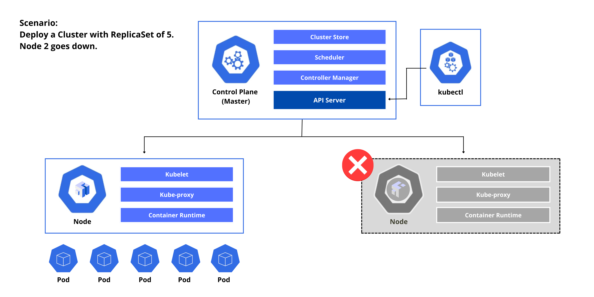

# Pod Operations

Let's say we deployed a cluster with a ReplicaSet of 5 using kubectl. The process would look like this:

1. Request is submitted by the kubectl to the API Server.
2. The API Server stores the information to the cluster store.
3. The Controller Manager spins up the 5 pods based on the ReplicaSet requirements and sends this request to the Scheduler.
4. The Scheduler checks the nodes and schedules the two nodes where the Pods will be spun up.
5. On the Node side, the kubelet asks the API Server for any updates. 
6. It will then see that on Node1, three Pods will be spun up. Another two Pods will be spun up on the second node.
7. The Controller Manager monitors the state of the Replicas.

Let's say Node 2 goes down. 

1. Node 2 will stop reporting to the Controller Manager, which then determines that the current state is now different with the desired state.
2. The Controller Manager send another request to the Scheduler.
3. The Scheduler checks the number of nodes on which to spin up the two pods, which in this case will be Node 1.
4. The kubelet in node1 seees a state change which will then spin up the two additional Pods. 
