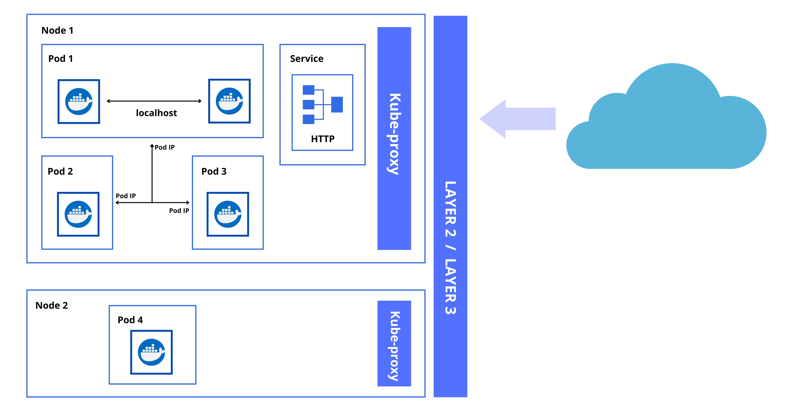

# Kubernetes Networking

- [Key points](#key-points)
- [Inside a Pod](#inside-a-pod)
- [Pod to Pod within a Node](#pod-to-pod-within-a-node)
- [Pod to Pod on Another Node](#pod-to-pod-on-another-node)
- [Overlay Network](#overlay-network)
- [External Services](#external-services)
- [Cluster Network Ports](#cluster-network-ports)

## Key points 

Here are some basic rules to know when it comes to Kubernetes networking.

1. All Pods can communicate with each other on all nodes.
2. All nodes can communicate with all Pods.
3. No Network Address Translation (NAT).

## Inside a Pod

Let's use the scenario below. We have multi-container Pod inside our node. These two containers inside the Pod will communicate with each other over the localhost using namespaces.

## Pod to Pod within a Node

We'll now add two more Pods to the mix. For the three Pods to talk to each other, they'll use the real IP addresses to communicate over the Layer-2 software bridge on the node.

## Pod to Pod on Another Node

So far we've only spun up Pods in a single node. Let's add a node 2 that contains a single Pod. For Pods in Node 1 to talk talk to the Pod in Node 2, they will also leverage the IP addresses of the Pods and talk over the Layer 2 or Layer connection, which would involve the underlying network facility.

## Overlay Network

Another common scenario is an **overlay network** where you (as a developer) don't have control on the underlying network infrastructure. Overlay networks allow the Pods to be "included in the same network". More of this will be discussed in the succeeding sections.

## External Services 

Lastly, we also have **External Services** where we have an application in our cluster that we want to expose to the public internet using an HTTP service.

## Cluster Network Ports 

On the Master node:

Components | Ports (TCP) | Used By
---------|----------|---------
API                 | 6443      | All
etcd                | 2379-2380 | API server and other instances of etcd
Scheduler           | 10251     | Itself, not exposed to outside world 
Controller Manager  | 10252     | Itself, not exposed to outside world 
Kubelet             | 10250     | Control Plane 

On the Worker nodes:

Components | Ports (TCP) | Used By
---------|----------|---------
Kubelet             | 10250         | Control Plane 
NodePort            | 30000-32767   | All 

