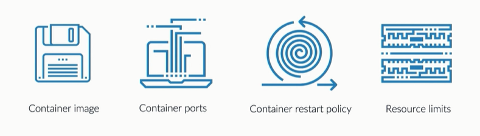

# Pods

A **Pod** is the basic building block of Kubernetes. It can be a single container or multiple containers that always run together. If you usually run single containers, you can think of a pod as a running container. This is the same concept whether you're running containers on-premise or on the cloud.

Kubernetes control plane software decides:

- when and where to run your pods
- how to manage traffic routing
- how to scales pods based on utilization or other metrics defined. 

In addition to this, Kubernetes also:

- automatically starts pods based on resource requirements
- automatically restarts pods if they or the instances they are running on fail
- gives an IP address and a single DNS name to each pod

To see the pods in the default namespace:

```bash
$ kubectl get pods  
```

To see the pods in all namespaces:

```bash
$ kubectl get pods -A  
```

To see the pods in a specific names, e.g. kube-system: 

```bash
$ kubectl get pods -n kube-system 
```

To get more information about the pod:

```bash
$ kubectl describe <pod-name> 
```

To see the logs of a particular Pod: 

```bash
$ kubectl logs <pod-name> 
```

To delete a particular Pod:

```bash
$ kubectl delete pod <pod-name> 
```

If the Pod was created using a manifest, we can also delete the Pod by referencing the manifest file.

```bash
$ kubectl delete -f <pod-manifest-file.yml> 
```

## IPs and Ports

Each pod is assigned an IP. This means that no matter how many containers as launched in the Pod, the Pod will only have one IP.

Just like Docker, we also need to specify which port ot publish to allow access to te running Pod. Note that while Kubernetes can make certain resource changes on the fly, it **cannot update ports on a running Pod.**

This means we need to first delete a Pod, modiy the port number in the manifest file, and then apply the file to recreate the Pod.

Lastly, Kubernetes uses **TCP** as the default protocol.

To learn more, check out [Pods in Kubernetes.](https://kubernetes.io/docs/concepts/workloads/pods/)


## What's in a Pod Declaration

<p align=center>

</p>

A Pod declaration contains all the properties of the Pod that you can define. There are a variety of attributes that you can specify but here are some common ones:

- container image to be used by the container 
- container ports that you want to be published 
- restart policy to determine what action should a container do when it fails 
- CPU and memory resources 

Below is a sample Pod manifest that launches an NGINX server.

```bash
apiVersion: v1
kind: Pod
metadata:
  name: app
  labels:
  - app: webserver
spec:
  containers:
  - name: app-nginx
    image: nginx:latest
    ports:
    - containerPort: 80
```

## Multi-container Pod

In a multi-container pod, each container is expected to run a process that stays alive as long as the POD's lifecycle. For example in the multi-container pod that has:

- a web application
- a logging agent

Both the containers are expected to stay alive at all times. The process running in the log agent container is expected to stay alive as long as the web application is running. If any of them fails, the POD restarts.

But at times we may want to run a process that runs to completion in a container. For example a process that pulls a code or binary from a repository that will be used by the main web application. This task will be run only one time when the pod is first created. 

This could also be a process that waits for an external service or database to be up before the actual application starts. That's where **initContainers** comes in.

To learn more about initContainers, check out [Probe and InitContainers](./020-Probes.md)