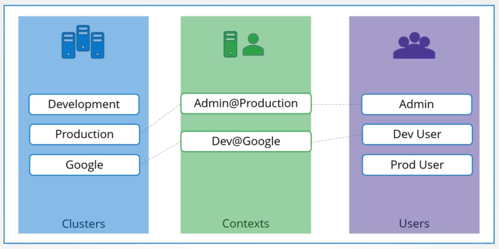

# Kubeconfig File

- [Kubeconfig](#kubeconfig)
- [Defining Context](#defining-context)
- [Defining Namespaces](#defining-namespaces)
- [Defining Certificate Authority](#defining-certificate-authority)
- [Resources](#resources)


## Kubeconfig 

A **kubeconfig** file is used to define how to connect to the Kubernetes cluster. It contains the following information:

- certificate information, for authentication 
- cluster location 

If you used **kubeadm** to setup Kubernetes, you'll see that it creates a collection of kubeconfig files which are stored in <code>/etc/kubernetes</code>.

Here are some files that kubeadm generates:

- **admin.conf** - configuration for the super admin account

- **kubelet.conf** - helps the kubelet locate the API server and present the correct client certificate

- **controller-manager.conf** - tells kubelet the API server location and the client certificate to use

- **scheduler.conf** - tells kubelet the API server location and the client certificate to use

This is helpful when you have multiple Kubernetes clusters. When connecting to the specific cluster to perform some operation, let's say to retrieve pods, we would have to specify the following:

```bash
kubectl get pods \
--server my-k8s-cluster:6443 \
--certificate-authority ca.crt \ 
--client-certificate admin.crt \
--client-key admin.key
```

Typing this time your perform a Kubernetes operation, not to mention hard to track especially if you have multiple clusters. As a solution, this is added in the $HOME/.kube/config. The kubectl tool will look for this file by default and check the servers and keys/certs defined in the file. The kubeconfig file has three sections:



The cluster section is the clusters that you have access to, while the users are the user accounts that has access to the respective cluster/s. Finally, the context specifies which user account is used to access which cluster.

Below is an example.

```yaml
apiVersion: v1
kind: Config
current-context: "developer@dev-frontend"

clusters:
- name: development
  cluster:
    certificate-authority: /etc/kubernetes/pki/ca.crt
    server: https://1.2.3.4
- name: test
  cluster:
    insecure-skip-tls-verify: true
    server: https://5.6.7.8

contexts:
- name: dev-frontend
  context:
    cluster: development
    namespace: frontend
    user: developer
- name: dev-storage
  context:
    cluster: development
    namespace: storage
    user: developer
- name: exp-test
  context:
    cluster: test
    namespace: default
    user: experimenter

users:
- name: developer
  user:
    client-certificate: fake-cert-file
    client-key: fake-key-file
- name: experimenter
  user:
    # Documentation note (this comment is NOT part of the command output).
    # Storing passwords in Kubernetes client config is risky.
    # A better alternative would be to use a credential plugin
    # and store the credentials separately.
    # See https://kubernetes.io/docs/reference/access-authn-authz/authentication/#client-go-credential-plugins
    password: some-password
    username: exp
```

## Defining Context 

While all the user-to-cluster relationships and certificates are defined in the kubeconfig file, we still need to tell kubectl which context we want to use. In the sample kubeconfig above, we can set the default context in the **current-context** field.

This means that each time you run kubectl to perform Kubernetes operations, it will always use this context which will then use the specific user to access the specific cluster.

To view the current kubeconfig file;

```bash
kubectl config view 
```

Similarly, we can also view it when we edit it.

```python
sudo vi %HOME/.kube/config 
```

To view a different config file, we can pass it as an argument.

```bash
kubectl config view --kubeconfig=my-file 
```

To access a different cluster, we can change the context. This is the same as changing the current context that's defined in the kubeconfig file. When you switch context to access a different cluster, the current context is overwritten with the new context.

```bash
kubectl config use-context <user>@<cluster-name>
```

## Defining Namespaces 

There could be instances wherein we have multiple namespaces being used in a cluster. The namespaces can also be added in the kubeconfig file, under the contexts section. When you switch to this aprticular context, it will automatically use the namespace defined in the kubeconfig.

```yaml 
contexts:
- name: dev-frontend
  context:
    cluster: development
    namespace: frontend
    user: developer
```

## Defining Certificate Authority

From the sample kubeconfig above, we can see how the CA certificate is defined.

```yaml
clusters:
- name: development
  cluster:
    certificate-authority: /etc/kubernetes/pki/ca.crt
    server: https://1.2.3.4  
```

The content of the CA certificate can also be used. The CA certificate will normally look like this:

```bash
----BEGIN CERTIFICATE----- 
AHJFHJKHDFJFHAJDHFLAHSDFJKFHSKJFHASDFHASDFHAJKSDFHDFHSASHFLAFHAHF
AFHKJAFHKDFHKJASDHFKHAKFHASDKFHKSDAHFAKJFHAKFHKAHDFFHKHFSKFHDKFSH
AHJFHJKHDFJFHAJDHFLAHSDFJKFHSKJFHASDFHASDFHAJKSDFHDFHSASHFLAFHAHF
AFHKJAFHKDFHKJASDHFKHAKFHASDKFHKSDAHFAKJFHAKFHKAHDFFHKHFSKFHDKFSH
AHJFHJKHDFJFHAJDHFLAHSDFJKFHSKJFHASDFHASDFHAJKSDFHDFHSASHFLAFHAHF
AFHKJAFHKDFHKJASDHFKHAKFHASDKFHKSDAHFAKJFHAKFHKAHDFFHKHFSKFHDKFSH
----END CERTIFICATE----- 
```

Before the contents can be added to the kubeconfig, they first need to be base64-encoded.

```bash
cat ca.crt | base64 
```

The base-encoded data can then be added to the kubeconfig file.

```yaml 
clusters:
- name: development
  cluster:
    certificate-authority-data: euruwerieuroiwuroueiouIORUIEOUWIORUOWEIROWIEROERUWOIRU
        UERORUIOUWERRIOUWEIORUWEIORUOWIERUOWIEUROIWEUROIWUERIOUWOERIUEIORUWOERUWOERIUWE
        UERORUIOUWERRIOUWEIORUWEIORUOWIERUOWIEUROIWEUROIWUERIOUWOERIUEIORUWOERUWOERIUWE
    server: https://1.2.3.4  
```

## Resources 

- [Organizing Cluster Access Using kubeconfig Files](https://kubernetes.io/docs/concepts/configuration/organize-cluster-access-kubeconfig/)

- [Kubernetes for the Absolute Beginners](https://kodekloud.com/courses/kubernetes-for-the-absolute-beginners-hands-on/)