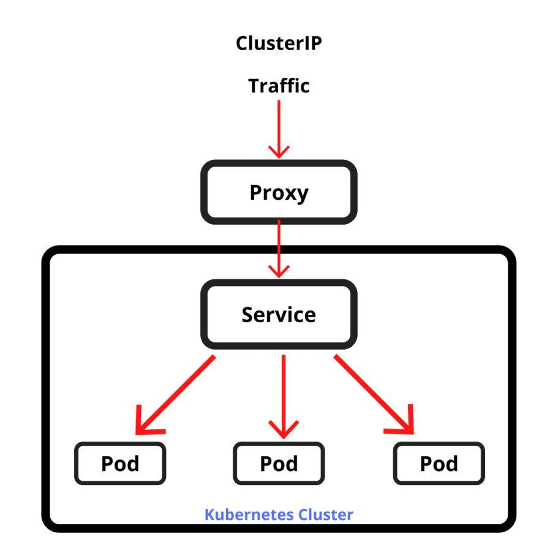
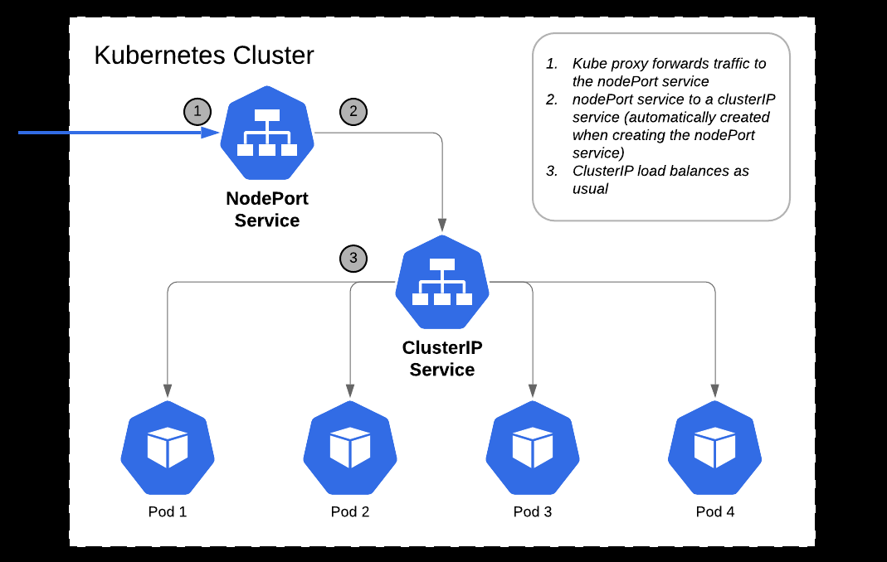
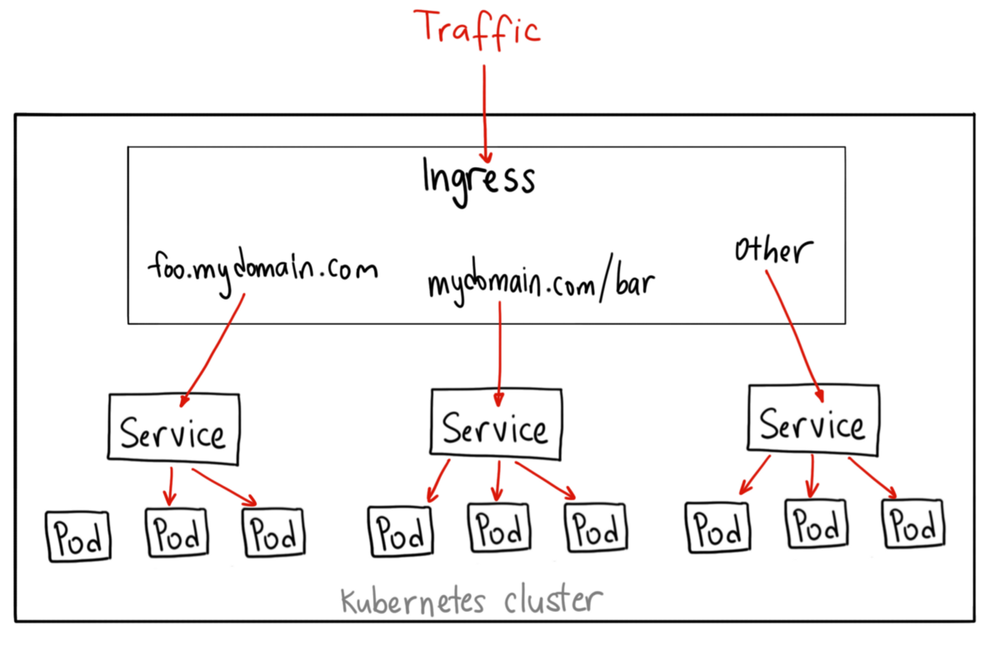

 
# Kubernetes Networking 

- [Services](#services)
- [Service Discovery](#service-discovery)
- [ClusterIP](#clusterip)
- [NodePort](#nodeport)
- [Loadbalancer](#loadbalancer)
- [External Name](#external-name)
- [Kubernetes Ingress](#kubernetes-ingress)

## Services 

A Service defines the networking rules for accessing Pods in a Kubernetes cluster. When a network request is made to the service, it checks the labels and then select the Pods tagged with those labels.

- declare a service to access a group of Pods based on *labels*
- clients can access the service through a fixed IP address
- the service distributed the incoming requests across the pods

To get the services in all the namespaces:

```bash
$ kubectl get svc -A  
```

In the example above, we see two services which are always deployed when we create EKS clusters:

- **kubernetes** - allows the users to communicate to the cluster nodes
- **kube-dns** - talks to the different Pods

## Service Discovery 

There are two service discovery mechanisms that Kuberenetes utilizes:

- **Environment Variables**
    The environment variables are automatically injected by Kuberenetes into containers. This variables follow a naming-convention based on the service name

- **DNS**
    Kubernetes automatically creates DNS records based on the service names and containers are automatically configured to query cluster DNS to discover those services.

To learn more, check out this [hands-on lab.](../../lab40-Kubernetes_Basics/README.md)

## ClusterIP

**ClusterIP** is the IP given to the Service. This is the most basic type of service and is only reachable from within the cluster. The kube-proxy cluster component that runs on each node is responsible for proxying request for the service to one of the services endpoints. 


<p align=center>

</p> 

<small><center> *Photo courtesy of [Kubernetes Service Types Explained](https://dev.to/pavanbelagatti/kubernetes-service-types-explained-207g)* </center></small>


## NodePort

The other types of services allow clients outside of the cluster to connect to the service. The first of those types of services is **nodePort**. 

The cluster IP is still given to the service, but the Node port causes a given port to be opened on every node in the cluster. Any requests to the node port of any node are routed to the cluster IP. 

<p align=center>

</p> 


## Loadbalancer 

Another type of service that enables external access is the **loadbalancer.** The load balancer type exposes the service externally through a cloud provider's load balancer.

A load balancer type creates a **cluster IP** and a **node port** for the service. Requests to the load balancer are sent to the node port and routed to the cluster IP. Features like connection draining and health checks are configured using annotations on the cloud provider's load balancer.


<p align=center>

</p> 

<small><center> *Photo courtesy of [Kubernetes NodePort vs LoadBalancer vs Ingress? When should I use what?](https://medium.com/google-cloud/kubernetes-nodeport-vs-loadbalancer-vs-ingress-when-should-i-use-what-922f010849e0)* </center></small>

## External Name 

**External name** is a different type of Service as it is enabled by DNS, not proxying. You configure an external name service with a DNS name and request for the service return a CNAME record with the external DNS name. This can be used for services running outside of Kubernetes, such as a database as a service (DBaaS) offering.

## Kubernetes Ingress

Kubernetes also provides **Ingress Controller** which serves as a layer 7 service abstraction. These controllers are run as normal pods in the cluster, making it different from most controllers that are automatically run as part of the kube-controller manager.

Once we have an ingress controller in place, we can leverage the ingress to define rules for inbound connections to services. This support SSL termination, load balaancing, and path-based routing.