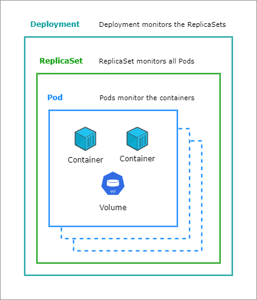

# Deployments 

Deployments is a higher-level resource that makes managing Pods easier. Manifests for deployments resembles Pod manifests since it uses the same fields.

- Declare a desired state for your Pods, and Deployments will do the work to bring your cluster to the desired state
- Application scales by creating more replicas
- When any changes are done on the resources, the deployment controller converges the actual state with the desired state
- Configurable rolling update behavior to control how many Pods in a Deployment are updated 

A Deployment controller constantly monitors the desired state of the Deployment and the state of the Kubernetes cluster and reconciles the cluster state with the desired state you provide the Deployment. 


The Deployment manifest includes:

- **replicas** that let you specify how many copies of the Pod you want the Deployment to create

- **selector**, which is a Pod label selector that allows the Deployment controller to track the status of all the Pods in the Deployment. This is one example of how Kubernetes uses selectors. The matchLabels mapping defines an equality condition similar to how you would write "app=microservices" using kubectl. 

- **template** is a template for the Pods that will be created. The template provides the desired behavior of each Pod and is essentially the same as an individual Pod manifest. Notice the label that the Deployment selector uses is applied to the Pod (app: microservices). This is required for the Deployment to track its Pods.

At a very high-level view:

<p align=center>

</p>

Below is an example of a Deployment manifest:

```bash
# data-tier.yml

apiVersion: apps/v1 # apps API group
kind: Deployment
metadata:
  name: data-tier
  namespace: deployment
  labels:
    app: microservices
    tier: data
spec:
  replicas: 1
  selector:
    matchLabels:
      tier: data
  template:
    metadata:
      labels:
        app: microservices
        tier: data
    spec: # Pod spec
      containers:
      - name: redis
        image: redis:latest
        imagePullPolicy: IfNotPresent
        ports:
          - containerPort: 6379  
```


To create the deployment:

```bash
kubectl apply -f data-tier.yml
```

To get details on the Deployment, use the **describe** command.

```bash
$ kubectl describe deployments data-tier  

Name:                   data-tier
Namespace:              deployment
CreationTimestamp:      Thu, 29 Dec 2022 16:18:28 +0000
Labels:                 app=microservices
                        tier=data
Annotations:            deployment.kubernetes.io/revision: 1
Selector:               tier=data
Replicas:               1 desired | 1 updated | 1 total | 1 available | 0 unavailable
StrategyType:           RollingUpdate
MinReadySeconds:        0
RollingUpdateStrategy:  25% max unavailable, 25% max surge
Pod Template:
  Labels:  app=microservices
           tier=data
  Containers:
   redis:
    Image:        redis:latest
    Port:         6379/TCP
    Host Port:    0/TCP
    Environment:  <none>
    Mounts:       <none>
  Volumes:        <none>
Conditions:
  Type           Status  Reason
  ----           ------  ------
  Available      True    MinimumReplicasAvailable
  Progressing    True    NewReplicaSetAvailable
OldReplicaSets:  <none>
NewReplicaSet:   data-tier-d45bbd7dc (1/1 replicas created)
Events:
  Type    Reason             Age   From                   Message
  ----    ------             ----  ----                   -------
  Normal  ScalingReplicaSet  11s   deployment-controller  Scaled up replica set data-tier-d45bbd7dc to 1
```

Here are some of the important highlights of the output:

- **StrategyType**
The strategy specified in our Deplyment is **RollingUpdate**, which means when you specify a new desired state for the Deployment's Pods, the update will be incrementally rolled out to all of the Pods.

- **RollingUpdateStrategy**
controls rolling updates by creating an upper bound and lower bound on the total number of Pods in the Deployment:
    - **max unavailable:** The maximum number of Pods that can be unavailable during the update.
    - **max surge**: The maximum number of Pods that can be scheduled above the desired number of Pods.

To learn more abour rollouts, check out [Rollouts and Rollbacks.](./019-Rollouts-and-Rollbacks.md)

To see deployments in action, check out this [lab](../../Lab43_Deployments/README.md).

To learn more about Deployments and StatefulSets using Persistent Volumes in AWS, check out [Amazon EKS - Persistent Volumes](pages/04-Kubernetes/056-EKS-Persistent-Volumes.md) page.

