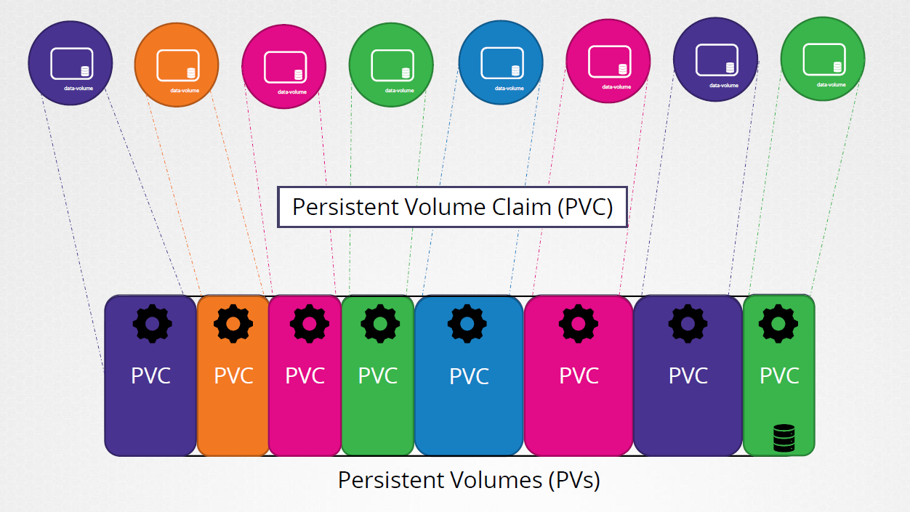
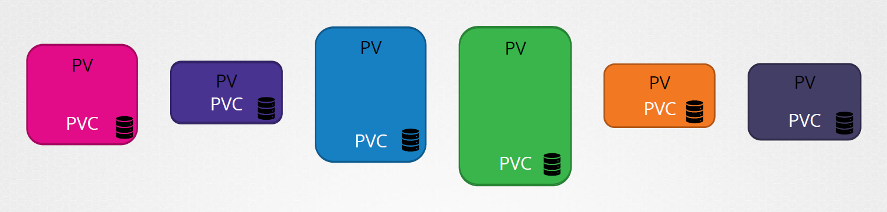

# Volumes and StorageClass


- [StorageClass](#storageclass)
- [Creating a StorageClass](#creating-a-storageclass)
- [Changing the default StorageClass](#changing-the-default-storageclass)
- [Volumes](#volumes)
- [Persistent Volumes and Persistent Volume Claims](#persistent-volumes-and-persistent-volume-claims)
- [Binding PVC and PV](#binding-pvc-and-pv)
- [Deleting the PV or the PVC](#deleting-the-pv-or-the-pvc)
- [Active Use](#active-use)
- [Phases of a Volume](#phases-of-a-volume)
- [Volume Access Modes](#volume-access-modes)
- [Lifecycle of a volume and claim:](#lifecycle-of-a-volume-and-claim)
- [Reclaiming](#reclaiming)
- [Creating Persistent Volume Claims](#creating-persistent-volume-claims)


## StorageClass

A **StorageClass** provides a way for administrators to describe the "classes" of storage they offer. Different classes might map to quality-of-service levels, or to backup policies, or to arbitrary policies determined by the cluster administrators. 

This concept is sometimes called "*profiles*" in other storage systems.

A cluster administrator can define as many StorageClass objects as needed, each specifying:

-  a volume plugin (aka provisioner) that provisions a volume,and
- the set of parameters to pass to that provisioner when provisioning. 

A cluster administrator can define and expose multiple flavors of storage (from the same or different storage systems) within a cluster, each with a custom set of parameters. This design also ensures that end users don't have to worry about the complexity and nuances of how storage is provisioned, but still have the ability to select from multiple storage options.

The name of a StorageClass object must be a [valid DNS subdomain name.](https://kubernetes.io/docs/concepts/overview/working-with-objects/names#dns-subdomain-names)

**Note**:

If you're using Kubernetes version 1.11, the storageclass isn't created by default when you launch an EKS cluster and you must create them yourself.

To check if you have a default storageclass,

```bash
kubectl get sc -A
```

It should return the default storageclass.

```bash
NAME            PROVISIONER             RECLAIMPOLICY   VOLUMEBINDINGMODE      ALLOWVOLUMEEXPANSION   AGE
gp2 (default)   kubernetes.io/aws-ebs   Delete          WaitForFirstConsumer   false                  162m
```

## Creating a StorageClass 

If it doesn't return anything, then we can create a storageclass.

```bash
vim gp2-sc.yml 
```
```bash
kind: StorageClass
apiVersion: storage.k8s.io/v1
metadata:
  name: gp2
  annotations:
    storageclass.kubernetes.io/is-default-class: "true"
provisioner: kubernetes.io/aws-ebs
parameters:
  type: gp2
  fsType: ext4  
reclaimPolicy: Retain
mountOptions:
  - debug
```

In the YAML file above, we're creating a **storageclass** resource and we're specifying EBS for the provisioner since we're using an EBS volume as the persistent volume.

The **reclaimPolicy** tells Kubernetes whether to retain or delete the EBS volume when the claim is deleted.

Now apply the manifest.

```bash
kubectl create -f gp2-sc.yml --namespace=<namespace> 
```

Verify that the storage class is now created and set as default.

```bash
kubectl get storageclass 
```

## Changing the default StorageClass

As we've seen, older versions of Kubernetes deploy your cluster without a default Storageclass. For newer versions, the default StorageClass is used to dynamically provision storage for PersistentVolumeClaims that do not require any specific storage class.

**Can we change the default Storageclass?**

One reason to change the default StorageClass is that it might be too expensive or it might not fit our workloads. As a solution, we can do any of the following:

- change the default StorageClass
- disable to compltely avoid dynamic provisioning

**Can we delete the StorageClass?**

We can delete it but it might be automatically be re-created by the running add-on manager in your cluster

**Can we have multiple default StorageClass?**

If we have two or more default StorageClass, we will not be able to create a *PersistentVolumeClaim* without a *storageClassName*.

**How can we change the default StorageClass?**

The steps are simple:

1. Create the new StorageClass. Follow the steps above.
2. Verify that you have two StorageClass. The default one will be marked *default*.

    ```bash
    kubectl get sc -A  
    ```

3. For the original StorageClass, change the specific annotation value to *false*.

    ```bash
    kubectl patch storageclass <old-storage-class> -p \
    '{"metadata": \
    {"annotations":\
    {"storageclass.kubernetes.io/is-default-class":"false"}}}' 
    ```
4. For the new StorageClass, change the specific annotation value to *true*.

    ```bash
    kubectl patch storageclass <new-storage-class> -p \
    '{"metadata": \
    {"annotations":\
    {"storageclass.kubernetes.io/is-default-class":"true"}}}' 
    ```

5. Verify that that new StorageClass is now marked as default.

    ```bash
    kubectl get sc -A  
    ```

## Volumes 

When a container crashes, the data stored on the container is destroyed. This issue becomes even worse when you have multiple containers running in a Pod. As a solution, we can use volumes.

As a recap, Docker containers use volumes to store files on disks to preserve them across restarts. Kubernetes has the same abstraction and we can configure a Pod to use multiple volumes simultaneously. 

Volumes are also useful for sharing data between containers in a Pod. The types of volumes we have are:

- **Ephemeral volume** - exists only during the lifetime of a Pod.

- **Persistent volumes** - exists even if Pod is destroyed

While volumes do solve the dilemma of losing files, there are some still a few points that we need to remember:

- volumes can be used by mounting a directory in one or more Pods
- a Pod can have one or more volumes
- volumes cannot be mounted within other volumes 
- volumes cannot contain a hardlink pointing to another volume
- volumes should be mounted at the specified paths within the image.
- volume mountpoint should be specified for each container in a Pod

The default volume type is **emptyDir**. This is an empty directory on the node that is initially created to back the storage used by the volume. Any data written on this directory is retained if the Pod is restarted. However, the data will be permanently deleted if the Pod is deleted.

To learn more about volumes, check out [Volumes in Kubernetes.](https://kubernetes.io/docs/concepts/storage/volumes/)

## Persistent Volumes and Persistent Volume Claims

A **PersistentVolume** allows administrators to use an API to manages how a storage is provided and consumed. We can have a variety of PersistentVolumes that differs in size and access modes without the need to tell our users how it is created. 

  

For us to understand persistent volumes, there are two API resources that we need to know:

- **PersistentVolume (PV)** 
  - volume plugin exists even after a Pod dies
  - can be provisioned by an administrator or,
  - can be dynamically provisioned using Storage Classes

- **PersistentVolumeClaim (PVC)**
  - a request for storage by a user
  - allows Pods to request specific resource and access modes
  - similar to a Pod:
    - Pods consume node resources
    - PVCs consume PV resources

## Binding PVC and PV

A PVC to PV binding is a one-to-one mapping, using a *ClaimRef* which is a bi-directional binding between the PersistentVolume and the PersistentVolumeClaim.

  

## Deleting the PV or the PVC

If a user deletes a PVC in active use by a Pod, the PVC is not removed immediately. PVC removal is postponed until the PVC is no longer actively used by any Pods.

If an admin deletes a PV that is bound to a PVC, the PV is not removed immediately. PV removal is postponed until the PV is no longer bound to a PVC.

When the PVC is deleted, the PV still exists and the volume is considered "*released*". But it is not yet available for another claim because the previous claimant's data remains on the volume.

## Active Use

Note that a PVC is in active use by a Pod as long as the Pod using it exists. 

## Phases of a Volume

A volume will be in one of the following phases:

- **Available** - volume not yet bound to a claim
- **Bound** - volume alread bounded to a claim
- **Released** - claim is delete, but still not reclaimed
- **Failed** - volume failed its automatic reclamation           

## Volume Access Modes 

Kubernetes uses volume access modes to match PersistentVolumeClaims and PersistentVolumes. There are different types of access modes:

- **ReadWriteOnce** - mounted as read-write by a single node
- **ReadWriteOnce** - mounted as read-write by a single Pod
- **ReadOnlyMany** - mounted as read-only by many nodes.
- **ReadWriteMany** - mounted as read-write by many nodes

In the CLI, the access modes are abbreviated to:

- RWO - ReadWriteOnce
- ROX - ReadOnlyMany
- RWX - ReadWriteMany
- RWOP - ReadWriteOncePod

Here are some keypoints to remember:

-  volumes can only be mounted using one access mode at a time
- access modes **do not** enforce write protection once the storage has been mounted
- additional mount options can specified for a PV

## Lifecycle of a volume and claim:

The interaction between PVs and PVCs follows this lifecycle:

- **Provisioning**
  - PVs can be created by administrators (statically), or the cluster can automatically create it (dynamically)

- **Binding**
  - a PVC with a specific amount of storage and certain access modes is requested and binded to the PV 

- **Using**
  - the cluster inspects the claim to find the bound volume and mounts that volume for a Pod, making it accesible to user for as long as they need 

- **Storage Object in Use Protection**
  - ensures that binded PVCs-PVs and PVs in use are not removed by the system

- **Reclaiming**
  - the reclaim policy for a PV tells the cluster what to do with the volume after it has been released of its claim

## Reclaiming 

When a user is done with their volume, they can delete the PVC objects from the API that allows reclamation of the resource. There are currently three options:

- **Retain** - allows for manual reclamation 
- **Delete** - removes the PVC and the storage asset
- **Recycled** - performs basic scrub on the volume

Note that the Recycle reclaim policy is deprecated. Instead, the recommended approach is to use dynamic provisioning.

To manually reclaim the volume:

1. Delete the PersistentVolume. 
2. Manually clean up data on the associated storage asset.
3. Manually delete the associated storage asset.

If you want to reuse the same storage asset, create a new PersistentVolume with the same storage asset definition.

## Creating Persistent Volume Claims

Each PVC contains a spec and status, which is the specification and status of the claim.

After we create the storageclass, we can enable **dynamic volume provisioning** by creating a **persistent volume claim** and including the StorageClass. To learn more, you may read [Dynamic Volume Provisioning on Kubernetes.](https://kubernetes.io/docs/concepts/storage/dynamic-provisioning/#using-dynamic-provisioning)

Let's now create our persistent volume claim (pvc):

```bash
vim pvc-claim.yml 
```
```bash
apiVersion: v1
kind: PersistentVolumeClaim
metadata:
  name: pvc-mysql
  labels:
    app: wordpress
spec:
  accessModes:
    - ReadWriteOnce
  resources:
    requests:
      storage: 20Gi 
  storageClassName: fast
---
apiVersion: v1
kind: PersistentVolumeClaim
metadata:
  name: pvc-wordpress
  labels:
    app: wordpress
spec:
  accessModes:
    - ReadWriteOnce
  resources:
    requests:
      storage: 20Gi 
  storageClassName: fast
```

In the YAML file above, we're creating two PVCs: one for MySQL and one for the Wordpress app.

Notice also that both PVCs are specified to have an **accessModes: ReadWriteOnce**, which means the PVC can be used by a Pod for read and write operations.

Apply the manifest.

```bash
kubectl apply -f  pvc-claim.yml --namespace=<namespace>
```

To verify:

```bash
kubectl get pvc -n --namespace=<namespace>
```

----------------------------------------------

To learn more, check out :

- [StorageClass on Kubernetes.](https://kubernetes.io/docs/concepts/storage/storage-classes/)

- [StorageClass on Amazon EKS.](https://docs.aws.amazon.com/eks/latest/userguide/storage-classes.html)