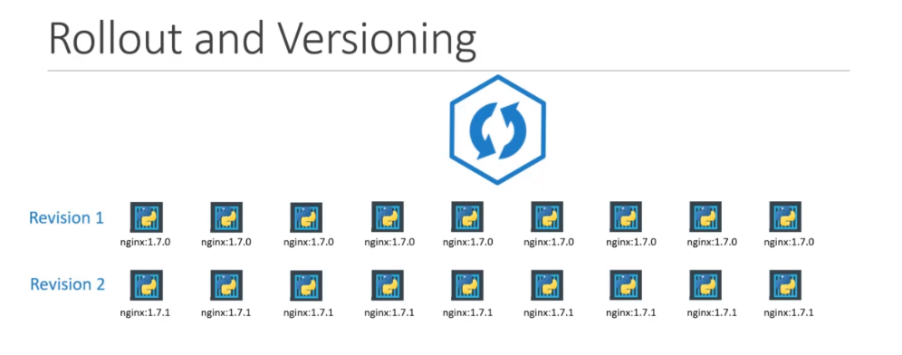
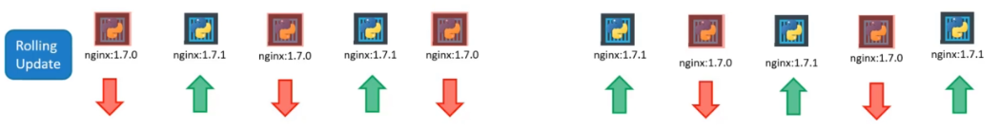
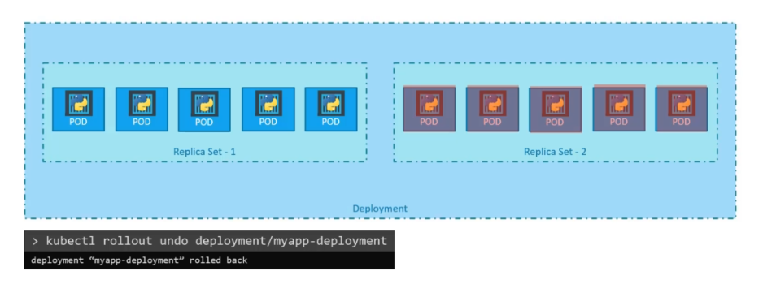

# Rollouts and Rollbacks

- [Rollouts](#rollouts)
- [Rollout Strategies](#rollout-strategies)
- [Rollbacks](#rollbacks)
- [Rollouts and Rollbacks in Action](#rollouts-and-rollbacks-in-action)


## Rollouts 

Kubernetes uses rollouts to updates the deployments, which includes replacing the replicas that matches the specs in the new deployment template. Other changes could also include environment variables, labels, and code changes. 

Any changes in the deployment tempalte will trigger a rollout.

  

## Rollout Strategies 

**Rolling Updates**
This is the default strategy used by Kubenetes.
- replicas are updated in groups, instead of all-at-once
- allows services to continue uninterrupted while updates are running
- old and new versions of the app could be running for some time
- scaling is not a rollout

  

**Recreate**
This deletes all the old pods before the new version of the application is rolled out.

  

## Rollbacks 

Rollbacks can be used to revert to a previous revision of the deployed application. To perform a rollback:

```bash
kubectl rollout undo deployment/myapp-deployment  
```

  


## Rollouts and Rollbacks in Action 

To see rolling updates in action, check out this [lab](../../Lab45_Rollouts_and_Rollbacks/README.md).