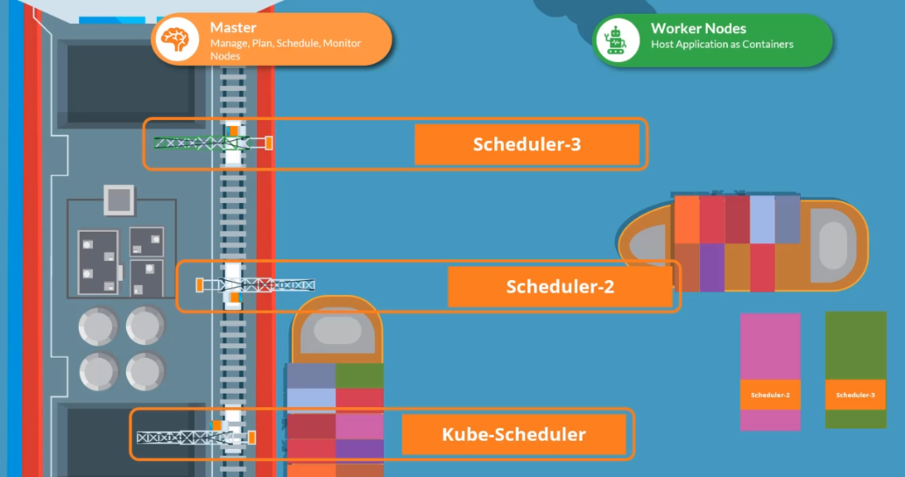

# Scheduling 


- [Schedulers](#schedulers)
- [Manual Scheduling](#manual-scheduling)
- [Scheduling Pods](#scheduling-pods)
- [Multiple Schedulers](#multiple-schedulers)
- [Deploy an Additional Scheduler](#deploy-an-additional-scheduler)
- [Use the Custom Scheduler](#use-the-custom-scheduler)


## Schedulers 

**What to schedule?**
Every pod has a field called *nodeName* that is not set by default when you create the manifest file. This is automatically set by Kubernetes.

```yaml
apiVersion: v1
kind: Pod
metadata:
  name: myapp
  labels:
    name: myapp
spec:
  containers:
  - name: myapp
    image: <Image>
    resources:
      limits:
        memory: "128Mi"
        cpu: "500m"
    ports:
      - containerPort: <Port>
  nodeName: node01              # No need to add this field.
```

**Which node to schedule?**
The scheduler then goes through all the pods and looks for Pods that doesn't have this property. 

**Schedule the pod**
Once Kubernetes identifies the candidate pods, it schedule the pod on the node by setting the *nodeName* property to the name of the node. This is called binding the object.

## Manual Scheduling 

If there is no scheduler, we can schedule the pod ourself by setting the *nodeName* property on the manifest file. Note that this field can only be set during creation time. This means we cannot change the nodeName of existing pods, which means we cannot schedule an existing pod to another node, unless we create a *Binding* object.

```bash
## binding.yml 
apiVersion: v1
kind: Binding
metadata:
  name: myapp
target:
  apiVersion: v1
  kind: Node
  name: node01      # this is the name of the node that you want the 
                    # pod to be scheduled on.                  
```

Note that we need to change the YAML to JSON to send the POST request.

```bash
{
  "apiVersion": "v1",
  "kind": "Binding",
  "metadata": {
    "name": "myapp"
  },
  "target": {
    "apiVersion": "v1",
    "kind": "Node",
    "name": "node01"
  }
}           
```

After creating the binding object, we then need to send a POST request to the pod binding API, which mimics what an actual scheduler does.

```bash
curl --request POST \
-H "Content-Type:application/json" \
-d @path/to/binding.json
http://$SERVER/api/v1/namespaces/default/pods/$PODNAME/binding 
```


## Scheduling Pods 

Beside specifying the *nodeName* property in the Pod manifest, the scheduling of Pods on nodes in a cluster can be controlled by using a few mechanisms.

- [DaemonSets](./010-DaemonSets.md) 
- [Taint and Tolerations](./022-Taints-and-tolerations.md)
- [Node Selectors](./023-NODESLSECTOR.MD)
- [Node Affinity](./023-NODESLSECTOR.MD)  
- [Pod Affinity](./024-Pod-affinity.md)

In addition to these, there are other concepts that we can use to influence the scheduling of Pods.

- [Container Resource Requirements](./025-Container-resource-requirements.md) 
- [Static Pods](./025-Container-resource-requirements.md) 
- [Custom Scheduling](https://kubernetes.io/docs/tasks/administer-cluster/configure-multiple-schedulers/)


## Multiple Schedulers

Kubernetes is highly extensible and you can write a custom scheduler and deploy it. We can also have a default scheduler and custom schedulers running at the same time. 

  

<small><center>Photo courtesy of [Kodekloud's Certified Kubernetes Application Developer (CKAD) course](https://kodekloud.com/courses/certified-kubernetes-application-developer-ckad/)</center></small>


## Deploy an Additional Scheduler 

To deploy an additional scheduler, we can deploy the kube-scheduler binary and define it in a second service file

```bash
wget https://storage.googleapis.com/kubernetes-release/release/v1.12.0/bin/linux/amd64/kube-scheduler 
```

```bash
# /etc/systemd/system/kubelet.service
# this is the default scheduler
.....

ExecStart=/usr/bin/kubelet \
    --config=/etc/kubernetes/config/kube-scheduler.yaml 
    --scheduler-name=default-scheduler
```

```bash
# /etc/systemd/system/custom-scheduler.service
# this is the custom scheduler
.....

ExecStart=/usr/bin/kubelet \
    --config=/etc/kubernetes/config/kube-scheduler.yaml 
    --scheduler-name=my-custom-scheduler
```

Next, create a Pod manifest for the Scheduler and reference the additional scheduler.

```yaml
# /etc/kubernetes/manifests/my-custom-scheduler.yaml 

apiVersion: v1
kind: Pod
metadata:
  name: my-custom-scheduler
  namespace: kube-system 
spec:
  containers:
  - name: my-custom-scheduler
    image: k8s.gcr.io/kube-scheduler-amd64:v1.11.3
    command:
      - kube-scheduler 
      - --address=127.0.0.1
      - --kubeconfig=/etc/kubernets/scheduler.conf
      - --leader-elect=true
      - --lock-object-name=my-custom-scheduler
      - --scheduler-name=my-custom-scheduler
```

Create the scheduler pod.

```bash
kubectl apply -f  /etc/kubernetes/manifests/my-custom-scheduler.yaml 
```

```bash
$ kubectl get pods -n kube-system | grep schedule 

NAME                          READY   STATUS    RESTARTS   AGE
kube-scheduler-master         1/1     Running   0          4h52m
my-custom-scheduler           1/1     Running   0          24s
```

## Use the Custom Scheduler 

Once the additional scheduler is created, we can instruct a Deployment or a Pod to use the custom scheduler by specifying the **schedulerName** in the Pod definitions file 

```yaml 
# sample-pod.yaml 
apiVersion: v1
kind: Pod
metadata:
  name: myapp
  labels:
    name: myapp
spec:
  containers:
  - name: myapp
    image: <Image>
    schedulerName: my-custom-scheduler 
```
```bash
kubectl apply -f pod-sample.yaml  
```

If the scheduler encountered an issue, the sample pod will get stuck in a **Pending** state. Otherwise, the Pod should show **Running**.

```bash
$ kubectl get pods 

NAME      READY   STATUS    RESTARTS   AGE
myapp     1/1     Pending   0          4h52m 
```


<br>

[Back to first page](../../README.md#kubernetes)
