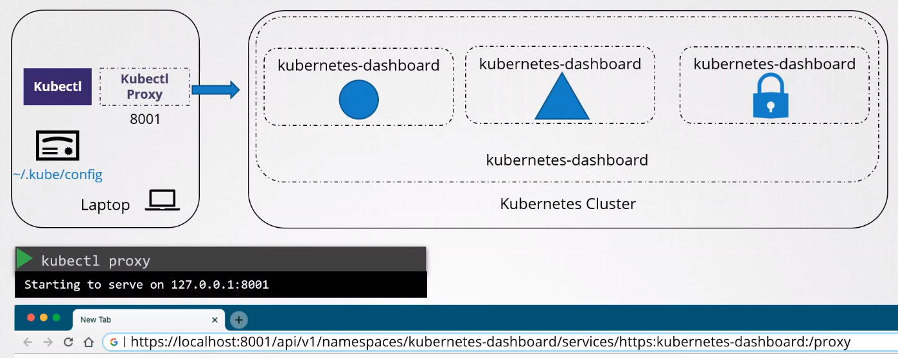
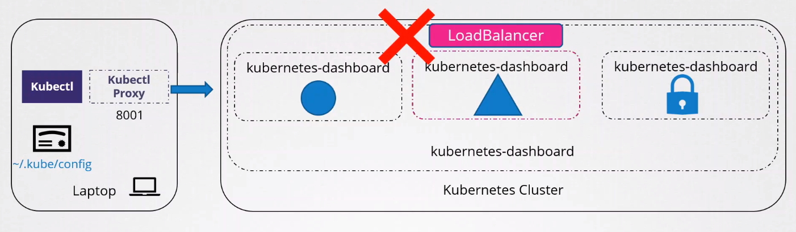
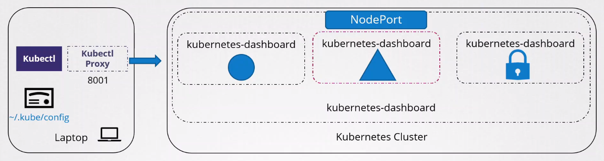
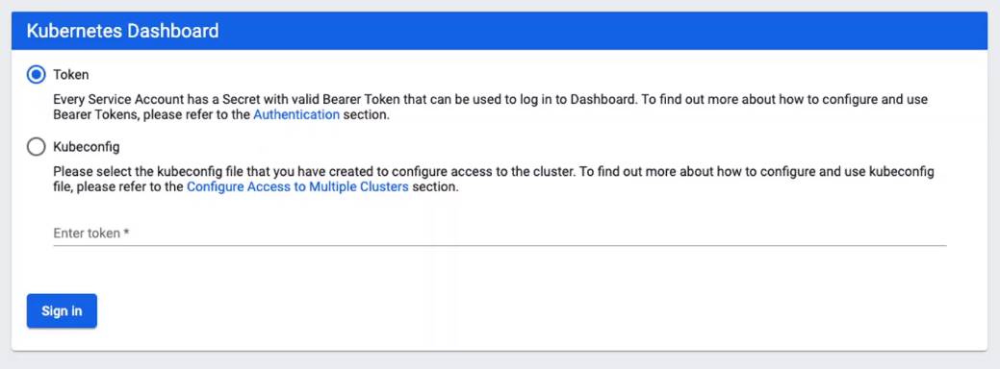

# Kubernetes Dashboard

- [Kubernetes Dashboard](#kubernetes-dashboard)
- [Access to the Kubernetes Dashboard](#access-to-the-kubernetes-dashboard)
    - [Setting Service Type to LoadBalancer](#setting-service-type-to-loadbalancer)
    - [Setting Service Type to NodePort](#setting-service-type-to-nodeport)
    - [Creating an Auth Proxy](#creating-an-auth-proxy)
- [Login](#login)
- [Useful Links](#useful-links)


## Kubernetes Dashboard 

A **Kubernetes Dashboard** is a general-purpose web UI for Kubernetes clusters which allows users to manage applications, troubleshoot issues, and manage the cluster itself. 

- displays information about workloads, Pods, Deployments, etc.
- displays resources in different namespaces
- shows details on Services, Nodes, and Storage
- shows usage metric (requires Heapster monitoring enabled)
- securely login using **HTTPs** or**Bearer token**
- authorization using **RBAC** for granular access rules

When we deploy the Kubernetes Dashboard, it will live in one of the Pods:

- Kubernetes dashboard with REST Endpoint, SSL, and authontication
- Metrics Add-on using **Heapster** to show usage metrics
= Metrics Add-on using **InfluxDB** to store metrics

To access the Kubernetes dashboard from our terminal,

```bash
$ kubectl proxy 
```

To see this in action, check out this [lab](../../projects/Lab_055_EKS_Kubernetes_Dashboard/README.md).

To learn more, check out the [official Kubernetes Dashboard Github](https://github.com/kubernetes/dashboard) page.


## Access to the Kubernetes Dashboard 

By default, the service that exposes the Kubernetes dashboard is set to ClusterIP. This means that the Kubernetes Dashboard is accessible only from within the cluster itself.

This is done on purpose. If the VM that hosts the Kubernetes cluster has a GUI and a browser, then we should be able to view the Kubernetes Dashboard.

To access it from our laptop, we can use kubectl proxy and port forwarding. The idea is to launch a proxy to access the Kubernetes service safely from our laptop. More details can be found in [Kubectl Proxy and Port Forwarding.](./028-Kubernetes-Security-Kubectl-Port-Forwarding.md) 




### Setting Service Type to LoadBalancer 

While using kubectl proxy allows us to access the Kubernetes Dashboard locally, it doesn't work well if we need to provide access to a group of developers. An option would be to change the Service that exposes Kubernetes Dashboard to **LoadBalancer**, but this is **NOT RECOMMENDED** as it literally exposes the dashboard outside of the cluster. 



### Setting Service Type to NodePort 

This exposes the Kubernetes Dashboard to a port in the nodes. This is a viable solution if you are sure that your cluster is secured.



### Creating an Auth Proxy 

We can also configure Auth Proxy that can perform authentication for requests, and if granted, can route traffic to the dashboard. 

More details can be found here: 
https://geek-cookbook.funkypenguin.co.nz/recipes/kubernetes/oauth2-proxy/

## Login 

When we access the Kubernetes Dashboard, we are asked to provide a token or kubeconfig file. 



To provide the token, we must first create a user and then provide it role-based  permissions. More details can be found in the [official Kubernetes Dashboard Github](https://github.com/kubernetes/dashboard) page.

## Useful Links

- https://redlock.io/blog/cryptojacking-tesla

- https://kubernetes.io/docs/tasks/access-application-cluster/web-ui-dashboard/

- https://github.com/kubernetes/dashboard

- https://www.youtube.com/watch?v=od8TnIvuADg 

- https://blog.heptio.com/on-securing-the-kubernetes-dashboard-16b09b1b7aca

- https://github.com/kubernetes/dashboard/blob/master/docs/user/access-control/creating-sample-user.md

<br>

[Back to first page](../../README.md#kubernetes)
