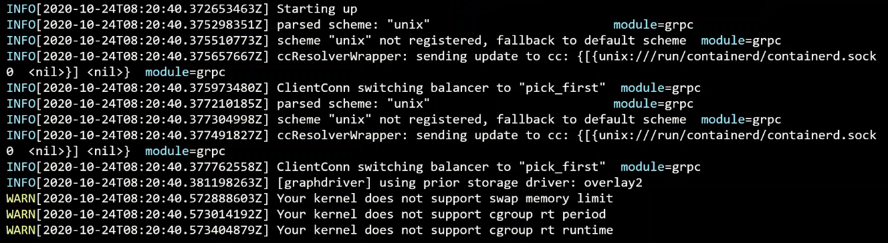
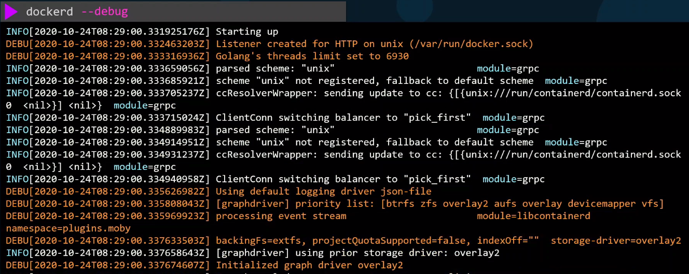
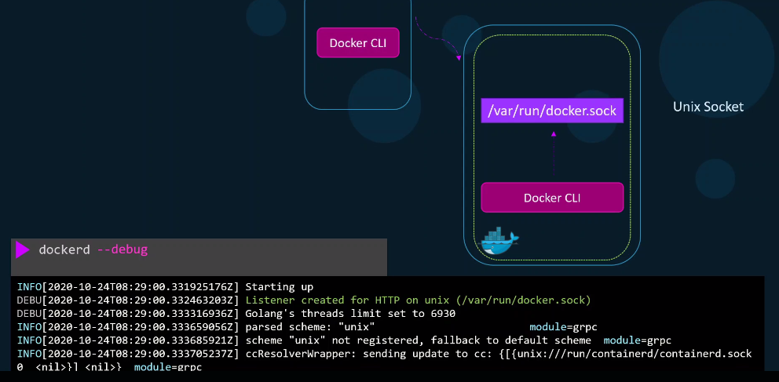
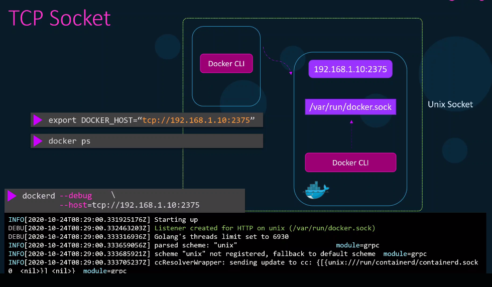
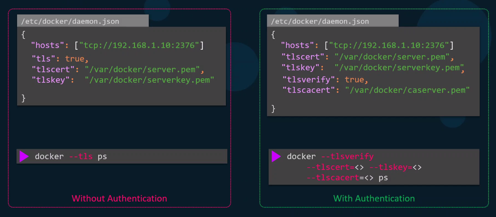

# Securing the Docker Daemon 

- [Docker Service Configurations](#docker-service-configurations)
- [Unix Socket](#unix-socket)
- [TCP Socket](#tcp-socket)
- [TLS Authentication](#tls-authentication)
- [tls versus tlsverify](#tls-versus-tlsverify)
- [Secure Docker Server](#secure-docker-server)
- [Encrypt Docker Daemon Data at Rest](#encrypt-docker-daemon-data-at-rest)


## Docker Service Configurations 

We can perform Docker operations using Systemctl:

```bash
systemctl start docker 
systemctl status docker 
systemctl stop docker 
```

Docker can also be started as a foreground process using the command below. This can be used when the dockerd is not starting in the normal way and you need to troubleshoot it. 

```bash
dockerd  
```



To print more details, we can add the <code>--debug</code> flag.




## Unix Socket 

When the Docker daemon starts, it listens on an internal Unix socket at <code>/var/run/docker.sock</code>. This allows access to the Daemon within the same host. The Docker CLI is configured to itneract with this socket. 




## TCP Socket 
 
If we have another host with Docker CLI and we need to connect to the Docker daemon, we can add a <code>--host</code> flag to allow the Docker daemon from the first host to be accessible from other hosts. 




Before the other host can communicate to the Docker daemon in the first host, it must first set the variable for IP and port.

```bash
export DOCKER_HOST="tcp://192.168.1.10:2375 
```

## TLS Authentication

We can encrypt the connection by passing the keys and certificates:

```bash
dockerd \
--debug \
--tls=true \
--tlscacert=/path/to/ca.pem \
--tlscert=/path/to/server-cert.pem \
--tlskey=/path/to/server-key.pem \
--host=tcp://192.168.1.10:2376
```

Note the ports:

- **2375** - Un-enrypted traffic
- **2376** - Enrypted traffic

The configurations can also be specified in a config file:

```bash
## /etc/docker/daemon.json
{
  "tlsverify": true,
  "tlscacert": "/path/to/ca.pem",
  "tlscert": "/path/to/server-cert.pem",
  "tlskey": "/path/to/server-key.pem",
  "hosts": ["tcp://0.0.0.0:2376"]
}
```

On the client hosts that need to access the Docker daemon in the central host, specify the variables:

```bash
export DOCKER_HOST="tcp://192.168.1.10:2376"
export DOCKER_TLS_VERIFY=true
```

Ensure that the keys and certificates are also in the client hosts.

## tls versus tlsverify

The <code>tls</code> flag only enables encryption. 
To enable authentication, we also need the <code>tlsverify</code> flag.



## Secure Docker Server 

To secure the Docker Daemon, we will need to secure the underlying host as well. 

- Disable Password-based authentication 
- Enable SSH key based authentication 
- Determine users who needs access to the server

## Encrypt Docker Daemon Data at Rest 

Secure Docker daemon data stored on disk:

- Use Docker's support for encrypted volumes (e.g., encrypted overlay2 storage driver).
- Encrypt the underlying file system using OS-level tools (e.g., dm-crypt on Linux).
- This approach is more about encrypting the underlying storage than Docker itself.


<br>

[Back to first page](../../README.md#kubernetes-security)
